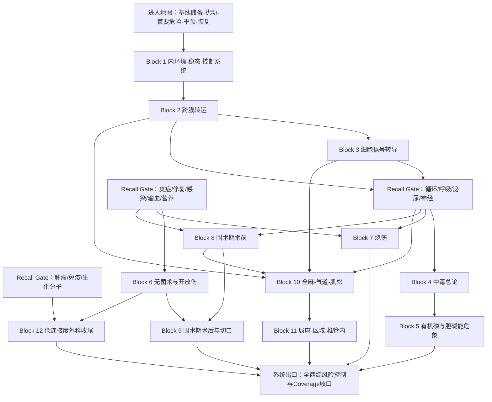

# 西综剩余总论与独立模块｜完整导学、认知依赖与学习顺序 v1
## 按《西综 System Guide 生成规则 v1》生成

> **文件层级**：System Guide  
> **用途**：完成全西综系统化学习中的最后一次范围收口，回答“哪些总论仍需正式学习、哪些内容已被前序系统吸收、剩余独立模块应怎样排序与去重”，并建立稳态基础、中毒、烧伤、围术期、麻醉、无菌术与低连接度外科考点的 Operational Block 路线。  
> **不是**：把所有零散考点塞进一个“杂物箱”；不是第二份外科总论讲义；不是药物、剂量、公式、时间和操作步骤大全；也不重新学习病理总论、输血、体液电解质、营养、外科感染与休克的完整主体。  
> **权威主干**：`生理学讲义_AI阅读版.md`、`01_生理学题纲_GPT_Project.md`、`内科学讲义_AI阅读版.md`、`03_内科学题纲_GPT_Project.md`、`27 外科跟课合集改.pdf`、`04_外科学题纲_GPT_Project.md`；并调用已经完成的病理总论、循环、呼吸、泌尿、消化—物质代谢—内分泌、血液—免疫—感染、神经—感觉—运动—骨科、生殖—乳腺 System Guide。  
> **当前资料状态变化**：早期四科范围审计时外科完整 Lecture 尚未到位；当前已经上传 `27 外科跟课合集改.pdf`，所以本 Guide 可对烧伤、围术期、麻醉和其它外科总论做 source-bound 审查。早期 `source_gap` 结论在这些范围上已被当前资料状态覆盖。  
> **生成日期**：2026-08-20  
> **状态**：v1｜全系统收口版；完成本 Guide 后进入 Global Re-optimization，而不是再新增一个同级大系统。

---

# 0｜先明确：这不是一个器官系统，而是一层“风险控制架构”

循环、呼吸、泌尿等系统都围绕相对统一的器官任务展开；本文件覆盖的内容却包括：

- 内环境与稳态；
- 跨膜转运与细胞信号；
- 急性中毒；
- 烧伤；
- 围术期；
- 麻醉；
- 无菌术与开放伤；
- 微创、移植接口和体表肿物等低连接度考点。

它们不能被伪装成同一种疾病，也不能排成一条虚假的病程。

本 Guide 使用的共同问题是：

> **当机体遭遇毒物、热损伤、手术、麻醉或开放性创伤等非器官特异扰动时，如何守住稳态、识别首要危险、选择安全干预，并监测机体恢复？**

## 0.1 五层统一 Mental Model

```text
第一层｜基线储备
内环境、膜转运、细胞信号、器官功能与代偿能力
        ↓
第二层｜扰动输入
毒物暴露 / 热损伤 / 手术创伤 / 麻醉药 / 污染与开放伤
        ↓
第三层｜首要危险
气道、通气、氧供、灌注、意识、体温、组织屏障、感染与器官储备
        ↓
第四层｜风险控制
去污 / 解毒 / 复苏 / 补液 / 麻醉 / 无菌 / 清创 / 引流 / 手术
        ↓
第五层｜恢复监测
生命体征、尿量、实验室、伤口、切口、引流、感染和器官并发症
```

这五层可用于所有 Block，但每条支路仍保留自身独立模型：

```text
稳态基础支路
内环境 → 跨膜转运 → 细胞信号

中毒支路
暴露 → 毒物吸收与分布 → 毒效应 → 去污/清除/解毒 → 支持治疗

烧伤支路
面积与深度 → 屏障破坏和毛细血管渗漏 → 休克复苏 → 创面/感染/修复

围术期支路
术前储备与风险 → 手术打击 → 术后恢复 → 切口和器官并发症

麻醉支路
麻醉目标 → 药物/阻滞层级 → 气道与循环监测 → 苏醒和并发症

无菌与开放伤支路
污染风险 → 无菌屏障 → 清创止血 → 是否一期闭合 → 愈合和感染
```

## 0.2 实际学习方法

```text
先在本 Guide 中确认范围归属
→ 当前内容若已在前序系统 Primary，只做 Recall / Apply
→ 真正剩余 Primary 才进入对应 Block Guide / Study
→ 按 Study 连续小板块完成一次完整初见
→ 用 KP 闭卷恢复主链
→ 用 Outline 逐题验漏
→ MI-D 进入 MarginNote 3
→ 原图、公式和空间关系必须回 Study
→ 完成后进行全四科 orphan / duplicate 审计
```

## 0.3 本系统的十二个 Operational Blocks

```text
基础收口
B1 内环境—稳态—控制系统
B2 跨膜转运
B3 细胞信号转导

急性暴露
B4 中毒总论
B5 有机磷与胆碱能危象

外科风险控制
B6 无菌术与开放伤初期处理
B7 烧伤
B8 围术期：术前评估与优化
B9 围术期：术后恢复、切口与并发症
B10 全身麻醉、气道、肌松与监测
B11 局部 / 区域 / 椎管内麻醉

最终低连接度收尾
B12 微创、移植与肿瘤接口、体表肿物
```

---

# 1｜Scope Audit

## 1.1 真正剩余的 Primary / Integration 范围

| 学科 / 范围 | Study 范围 | Outline 范围 | 当前处置 |
|---|---|---:|---|
| 生理：绪论 | Lecture 开篇绪论连续范围，约 PDF 2–11 | U001，共 **41题** | Primary / Formal Closure |
| 生理：跨膜转运 | Lecture《跨膜转运》连续范围 | U002，共 **55题** | Primary / Formal Closure |
| 生理：细胞信号转导 | Lecture《细胞信号转导》连续范围 | U003，共 **61题** | Primary / Formal Closure |
| 内科：中毒总论 | 书页 P286–287 | U107，共 **11题** | Primary |
| 内科：有机磷及串联 | 书页 P288–292 | U108，约 **10个主动回忆问题** | Primary |
| 外科：烧伤 | 书页 P200–202 | U051，共 **13题** | Primary |
| 外科：围术期 | 书页约 P210–215 | U054–U055，共 **24题** | Primary |
| 外科：麻醉 | 书页约 P216–221 | U056–U057，共 **29题** | Primary |
| 外科：其它总论 | 书页 P228–230 | U060–U061，共 **23题** | Split：部分 Primary，部分 Recall / Apply |

### 当前体量概念

```text
正式审计到本 Guide 的 Outline：约267题
其中：
- 生理基础收口：157题
- 中毒：约21题
- 烧伤：13题
- 围术期：24题
- 麻醉：29题
- 其它外科总论：23题
```

说明：

- 267题是范围审计数，不等于267个独立知识模型；
- U060–U061 内含急性肝衰竭、移植排斥、肿瘤预防和抗肿瘤药等已经有完整 Primary 的内容；
- 真正新增机制量低于题目数，但药物、阈值、时相、操作配对和禁忌的 MI-D 密度很高；
- 生理 U001–U003 在此前各系统已被反复调用，但没有一个最终文件承担全部 Primary 所有权，因此在本 Guide 中正式收口。若实际 Block 审查证明已经完整学过，可将执行动作降为 Recall / Integration，而不取消其 Coverage 归属。

## 1.2 已被前序系统吸收，不在这里重复 Primary 的范围

### 外科输血｜U046

完整主体已经在“血液—免疫—感染”完成：

- 成分血选择；
- 输血指征接口；
- 发热、过敏、溶血和循环超负荷；
- 大量输血；
- 自体输血；
- 洗涤、去白、辐照等；
- GVHD 接口。

本 Guide 只在围术期、失血和烧伤场景 Apply。

### 外科体液、电解质和酸碱｜U047–U048

完整主体已经在“泌尿系统”完成：

- 容量与张力；
- Na⁺、K⁺、Ca²⁺；
- 酸碱；
- 补液原则；
- 尿量和肾功能监测。

本 Guide 只在中毒、烧伤、麻醉和围术期调用。

### 外科营养｜U049–U050

完整主体已经在“消化—物质代谢—内分泌”完成：

- 营养评估；
- 应激代谢；
- 肠内 / 肠外营养；
- 再喂养综合征；
- 导管、感染、肝胆和代谢并发症。

本 Guide 只在术前营养优化和术后恢复中 Recall / Apply。

### 外科感染｜U052–U053

完整主体已经在“血液—免疫—感染”完成：

- 局部化脓性感染；
- 手部感染；
- 源控制；
- 脓毒症；
- 破伤风；
- 气性坏疽。

本 Guide 只处理切口感染、烧伤感染和开放伤污染的场景化应用。

### 外科休克｜U058–U059

完整主体已经在“循环系统”完成：

- 低容量、心源、分布、阻塞性休克；
- 代偿与失代偿；
- 监测；
- 容量、泵和阻力判断；
- 复苏目标。

本 Guide 只在烧伤、麻醉、围术期和中毒中调用。

### 病理总论｜U015–U019

已有独立完整 Guide，包含：

```text
适应与损伤
→ 局部循环障碍
→ 炎症
→ 修复
→ 肿瘤独立路径
```

本 Guide 不重新讲坏死、炎症、肉芽组织、切口愈合或肿瘤生物学，只在对应场景 Recall。

### 生化与分子技术

`26生化.pdf` 已在“消化—物质代谢—内分泌 v2”完成全量归属：

- 蛋白质 / 酶 / 维生素；
- 糖、脂、氨基酸、核苷酸；
- 胆红素与生物转化；
- 核酸结构；
- DNA复制、转录、翻译；
- 基因调控；
- DNA损伤；
- 癌基因 / 抑癌基因；
- 分子生物学技术。

因此“生化中剩余的独立分子技术”在当前资料状态下**不再构成新的 Primary Block**。本 Guide 仅在中毒清除、麻醉药作用和肿瘤 / 移植接口中调用。

## 1.3 U060–U061 的拆分归属

“其它外科总论”是典型编辑性合集，必须拆分：

| 子范围 | 当前动作 | Primary / 完整位置 |
|---|---|---|
| 无菌术、器械灭菌、手术区无菌 | Primary | Block 6 |
| 开放伤、止血带、清创和一期闭合 | Primary / Integration | Block 6 |
| 急性肝衰竭 | Recall | 消化—肝脏系统 |
| 移植排斥、GVHD | Recall | 血液—免疫—感染 |
| 腹腔镜并发症 | Micro Primary | Block 12 |
| 癌症三级预防、癌痛、抗肿瘤药分类 | Recall / Integration | 病理总论 + 生化 + 器官肿瘤 |
| 基底细胞癌、黑色素瘤、交界痣 | Micro Primary | Block 12 |
| 脂肪瘤、皮脂腺囊肿、皮样囊肿 | Micro Primary | Block 12 |

## 1.4 当前明确的 Source Gaps

现有资料不支持完整扩写：

- 完整临床毒理学和所有常见毒物的独立诊疗；
- 现代急诊 ABCDE、重症监护和机械通气全章；
- 完整麻醉学、困难气道算法、现代围术期风险评分；
- 全部镇痛镇静药理、剂量和拮抗；
- ERAS 完整路径；
- 现代烧伤中心分流、植皮和瘢痕康复；
- 移植外科、免疫抑制和器官特异移植管理；
- 完整微创外科；
- 完整皮肤肿瘤学和软组织肿瘤学；
- 完整药理学。

这些缺口必须保留，不能用一般知识静默补齐。

---

# 2｜System Mission & Mental Model

## 2.1 本系统真正完成什么任务

> **建立从“稳态基线”到“急性扰动与医疗干预”，再到“安全恢复”的通用风险控制模型，使器官系统知识能够在中毒、烧伤、手术和麻醉场景中被联合调用。**

## 2.2 七个部件模型

### 1. 稳态控制器｜Homeostatic Controller

- 被调变量；
- 感受器；
- 控制中心；
- 效应器；
- 负反馈；
- 正反馈；
- 前馈；
- 神经、体液和自身调节。

### 2. 膜与梯度接口｜Membrane Interface

- 浓度梯度；
- 电位梯度；
- 膜通透性；
- 通道；
- 载体；
- 泵；
- 原发 / 继发主动转运；
- 跨上皮运输。

### 3. 信号转换器｜Signal Transducer

```text
配体
→ 受体
→ G蛋白 / 酶 / 通道 / 核受体
→ 第二信使与蛋白激酶
→ 细胞效应
→ 终止与反馈
```

### 4. 暴露与损伤入口｜Exposure & Injury

- 剂量；
- 途径；
- 时间；
- 是否仍在吸收；
- 是否持续热损伤或污染；
- 组织屏障是否破坏。

### 5. 生命支持层｜Life Support

- 气道；
- 呼吸；
- 氧供；
- 循环灌注；
- 意识；
- 体温；
- 尿量；
- 电解质与酸碱。

### 6. 医疗干预层｜Intervention

- 去污；
- 解毒；
- 血液净化；
- 补液；
- 麻醉；
- 无菌；
- 清创；
- 手术；
- 创面覆盖。

### 7. 恢复与监测层｜Recovery

- 苏醒；
- 疼痛；
- 肺部；
- 循环；
- 尿潴留；
- 胃肠恢复；
- 出血；
- 感染；
- 切口；
- 引流；
- 器官功能。

## 2.3 三条核心运行回路

### 稳态回路

```text
变量偏离
→ 感受
→ 比较
→ 效应器纠偏
→ 接近目标区间
```

### 急性暴露回路

```text
暴露
→ 吸收 / 分布
→ 受体、酶、膜或器官损伤
→ 识别毒物综合征
→ 阻止继续吸收
→ 清除 / 解毒
→ 支持器官
```

### 围干预回路

```text
术前储备与风险
→ 麻醉与手术扰动
→ 生命支持和无菌控制
→ 术后恢复
→ 监测偏差
→ 早期处理并发症
```

---

# 3｜Input / Output Contract

## 3.1 Input｜进入本系统前需要什么

### Hard prerequisite

- 循环：灌注、氧供、休克和复苏；
- 呼吸：气道、通气、换气、低氧和呼衰；
- 泌尿：容量、Na⁺ / K⁺ / Ca²⁺、酸碱、尿量和血液净化接口；
- 消化—代谢—内分泌：营养、应激代谢、肝脏生物转化和激素；
- 血液—免疫—感染：输血、凝血、DIC、感染、源控制和脓毒症；
- 神经—运动：意识、疼痛、自主神经、NMJ、M / N受体和肌肉麻痹；
- 病理总论：损伤、炎症、修复与肿瘤；
- 生殖：妊娠和哺乳特殊状态接口。

### 分 Block prerequisite

- B2：B1；
- B3：B2 + 受体最低语言；
- B4：循环、呼吸、泌尿、B2–B3；
- B5：B4 + 神经递质 / M、N受体 / NMJ；
- B6：炎症、修复、感染和创伤最低语言；
- B7：休克、体液、电解质、感染、修复；
- B8–B9：全部器官系统的风险入口 + 营养 / 输血 / 感染；
- B10–B11：B2–B3 + 呼吸 + 循环 + 神经 / NMJ；
- B12：肿瘤、免疫、创伤和解剖最低接口。

### Soft prerequisite

- 基本药代动力学；
- 手术室和常见器械概念；
- 皮肤层次；
- 脊柱和神经根基本解剖；
- 常见麻醉体位；
- 创面和切口基本观察。

## 3.2 Output｜完成后输出什么

### 向 Global Re-optimization

- 全四科 Primary 归属清单；
- orphan scope 和 duplicate primary 清单；
- Overlay 首次出现位置；
- 真实全局 prerequisite 顺序；
- 各系统容量和滚动复习位置；
- 最终大系统地图。

### 向病例决策

- 先判是否存在气道、通气、灌注、意识或高危污染问题；
- 判断当前是继续暴露、需要去污，还是已经进入器官支持；
- 判断手术前是否可以安全进行；
- 判断麻醉造成的是呼吸、循环、神经或药物层故障；
- 判断烧伤、开放伤和切口是否需要立即复苏、清创、减压、引流或再缝合；
- 用监测变量识别术后偏离和并发症。

### 向长期复习

- 建立高密度阈值、药物、剂量、时相和操作步骤的 MI-D 卡片池；
- 让所有细节都挂在明确的风险控制主链上；
- 完成西综“机制—识别—决策—操作边界”的最后闭环。

---

# 4｜Core Variables & Failure Modes

## 4.1 最小变量语言

```text
Set point / operating range｜调定点与工作区间
Controlled variable｜被调变量
Sensor / integrator / effector｜感受器—中枢—效应器
Negative / positive feedback / feedforward｜负反馈、正反馈、前馈

Concentration / electrical / electrochemical gradient｜浓度、电位与电化学梯度
Permeability / conductance｜通透性与电导
Channel / carrier / pump｜通道、载体、泵
Saturation / competition｜饱和与竞争
Primary / secondary active transport｜原发 / 继发主动转运
Transcellular / paracellular｜跨细胞 / 细胞旁

Ligand / receptor / affinity｜配体、受体、亲和力
GPCR / enzyme-linked / ion-channel / nuclear receptor
Second messenger / kinase / phosphatase｜第二信使、激酶、磷酸酶
Signal amplification / termination｜放大与终止

Exposure route / dose / time｜暴露途径、剂量、时间
Ongoing absorption｜是否仍在吸收
Toxidrome｜毒物综合征
Decontamination / elimination / antidote｜去污、清除、解毒
M / N / CNS manifestations｜M样、N样、中枢表现

TBSA / depth / severity｜烧伤面积、深度、严重度
Capillary leak / fluid loss｜毛细血管渗漏与容量丢失
Urine output / perfusion｜尿量与灌注
Inhalation injury｜吸入性损伤

Reserve / urgency / operative stress｜器官储备、手术紧急度、手术打击
Airway / ventilation / oxygenation / circulation
Anesthetic depth / block level｜麻醉深度与阻滞平面
Neuromuscular blockade｜神经肌肉阻滞
Sterility / contamination / debridement｜无菌、污染、清创
Incision class / wound healing｜切口分类与愈合
Drain / bleeding / infection / dehiscence｜引流、出血、感染、裂开
```

## 4.2 十三类 Failure Modes

### 1. 稳态控制失败

- 变量偏离但无法感受；
- 控制中心整合错误；
- 效应器无反应；
- 反馈过强、过慢或失去限制；
- 前馈预测错误。

### 2. 膜运输失败

- 梯度消失；
- 通道开放 / 关闭异常；
- 载体饱和或竞争；
- 泵缺能；
- 跨上皮转运方向错误。

### 3. 信号转导失败

- 配体过多 / 过少；
- 受体激动 / 阻断；
- G蛋白、酶或第二信使异常；
- 信号不能终止；
- 核受体介导的基因表达失调。

### 4. 继续暴露或持续吸收

- 污染衣物未去除；
- 胃肠道毒物仍存在；
- 热源未脱离；
- 开放伤污染未清除。

### 5. 去污或清除方法错误

- 在禁忌情况下洗胃；
- 错用导泻；
- 把脂溶性毒物误当透析适应证；
- 用危险方式中和腐蚀性毒物；
- 忽略气道保护。

### 6. 毒物靶点持续失控

- 受体持续激动 / 阻断；
- 酶被抑制；
- 呼吸抑制；
- 肌麻痹；
- 心律失常；
- 中枢昏迷或惊厥。

### 7. 烧伤屏障与容量失败

- 面积估计错误；
- 深度低估；
- 毛细血管渗漏；
- 补液不足或过量；
- 吸入性损伤漏诊；
- 创面感染和全身感染。

### 8. 术前风险未优化

- 活动性感染；
- 营养不良；
- 贫血和凝血问题；
- 心肺肝肾储备不足；
- 糖代谢和电解质异常；
- 药物未调整；
- 手术紧急度判断错误。

### 9. 麻醉—气道—循环失败

- 误吸；
- 通气不足；
- 低氧；
- 低血压；
- 麻醉过浅 / 过深；
- 苏醒延迟；
- 药物不良反应。

### 10. 神经肌肉阻滞失败

- 只有肌松而没有麻醉；
- 去极化 / 非去极化机制混淆；
- 高钾；
- 呼吸肌麻痹；
- 拮抗方法错误。

### 11. 区域阻滞空间失败

- 阻滞平面过高；
- 全脊髓麻醉；
- 交感阻滞导致低血压；
- 神经 / 血管 / 胸膜损伤；
- 局麻药毒性；
- 腰麻后头痛和尿潴留。

### 12. 无菌与伤口控制失败

- 无菌区被污染后未纠正；
- 清创不足；
- 污染伤错误一期闭合；
- 止血不充分；
- 死腔和异物保留；
- 切口感染、血清肿或裂开。

### 13. 术后恢复失败

- 出血；
- 呼吸系统并发症；
- 血栓栓塞；
- 尿潴留；
- 胃肠动力恢复延迟；
- 引流异常；
- 感染；
- 营养和活动安排错误。

---

# 5｜Dependency Graph



## 5.1 为什么这样排

1. **绪论—跨膜转运—信号转导必须先完成正式收口。**  
   它们不是“基础太简单所以可以跳过”，而是此前所有器官系统共同调用却容易碎片化的底层语言。

2. **中毒放在神经、呼吸、循环和泌尿之后。**  
   先学受体、NMJ、气道、呼衰、休克和血液净化，才能把毒物表现变成可推导的器官故障，而不是气味和解毒药清单。

3. **无菌术放在烧伤与围术期之前。**  
   它提供污染、无菌、清创和伤口闭合的通用操作边界。

4. **烧伤调用休克、补液、体温、感染和修复。**  
   因此不应放在循环、泌尿、感染和病理总论之前。

5. **围术期先术前、后术后。**  
   手术风险是连续过程，不能只背术前禁食和术后天数两张表。

6. **麻醉放在围术期入口之后。**  
   先判断能否安全手术，再讨论怎样使患者在手术中失去痛觉、意识或运动并维持生命功能。

7. **“其它外科总论”最后只做微型收尾。**  
   其中多数范围已有 Primary，最终只补微创并发症、体表肿物和必要接口。

---

# 6｜Operational Block Route

# Block 1｜内环境、稳态与控制系统：机体究竟在“保什么”

**中心问题**

> 体液、内环境和稳态分别是什么层级；神经、体液、自身调节、反馈和前馈怎样共同使生理变量维持在可生存的工作区间？

**为什么现在学**

此前所有系统都在使用“稳态”“调节”“代偿”“反馈”，但如果没有正式完成总论收口，容易出现三类问题：

- 把稳态理解为静止不变；
- 把调节方式和控制方式混在一起；
- 看到代偿就默认一定有利，而忽略代偿的代价和失代偿。

**前置**

- Hard：无。
- Soft：基本细胞和器官概念。

**Study 主范围**

- `生理学讲义_AI阅读版.md` 开篇绪论，约 PDF 2–11；
- 以 Study 连续小标题为准，不按本 Guide 截取半页。

**Outline 主范围**

- 生理 U001《1.1 绪论》，共 **41题**。

**必要原图 / 表格**

- 体液分布；
- ICF / ECF；
- 血浆与组织液；
- 内环境；
- 负反馈控制环；
- 正反馈；
- 前馈；
- 神经 / 体液 / 神经—体液 / 自身调节；
- 调定点和工作区间；
- 典型反事实场景：站立、进食、体温、血糖和失血。

**动作配置**

- Learn / Formal Closure：
  - 体液与内环境；
  - 稳态；
  - 调节方式；
  - 控制方式；
  - 负反馈、正反馈与前馈；
  - 代偿与失代偿；
  - 生理功能的层级组织。
- Recall：循环调节、呼吸调节、肾容量、内分泌轴和体温调节。
- Apply：本 Guide 全部后续 Block。
- Defer：全部正常值和例子名单进入 MI-D。

**知识形态**

- Mechanism Spine：

```text
变量偏离
→ 感受器发现
→ 控制中心比较
→ 效应器响应
→ 变量回到可接受工作区间
```

- Parallel Axes：
  - 体液组成轴；
  - 调节方式轴；
  - 控制方式轴；
  - 时间尺度轴。
- Discrimination Tree：
  - ICF / ECF；
  - 血浆 / 组织液；
  - 神经 / 体液 / 自身；
  - 负反馈 / 正反馈 / 前馈；
  - 稳态 / 调定点 / 正常值。
- MI-G：
  - 内环境指细胞外液；
  - 稳态是动态平衡；
  - 负反馈是最主要控制方式；
  - 正反馈必须有终止事件；
  - 前馈可更快但可能预判错误。
- MI-D：
  - 各体液百分比、离子分布、例子配对和全部正常值。

**客观负荷画像**

- 首轮主线负荷：重
- Memory Island：高
- 视觉负担：中高
- 跨科整合：极高
- 主要负荷来源：概念抽象，却被所有系统反复调用

**出口问题**

1. 为什么稳态不是“所有变量固定不变”？
2. 内环境为何指 ECF，而不是体液总和或 ICF？
3. 神经调节和负反馈为什么不是同一分类轴？
4. 正反馈为何不一定等于病理过程？
5. 前馈“更准确”和“可能失误”为什么不矛盾？
6. 急性代偿为什么可能在长期变成损伤机制？

**进入下一 Block 的最低标准**

能用“变量—感受—整合—效应—反馈”解释一个完整稳态场景，并能区分调节方式和控制方式。

---

# Block 2｜跨膜转运：物质为什么能沿某个方向穿过细胞膜

**中心问题**

> 物质跨膜的方向由什么决定；通道、载体、泵、胞吞胞吐和跨上皮转运分别消耗什么、受什么限制，又怎样在各器官中复用？

**为什么现在学**

此前已经在神经、肌肉、肾小管、肠吸收和腺体分泌中见过大量转运体。如果先背每个器官的蛋白名，容易丢失共同逻辑：

```text
驱动力是什么
→ 需要哪类膜蛋白
→ 是否直接耗 ATP
→ 能否饱和、竞争和被抑制
→ 最终净流量向哪里
```

**前置**

- Hard：Block 1。
- Soft：细胞膜结构与 ATP。

**Study 主范围**

- `生理学讲义_AI阅读版.md` 开篇《跨膜转运》连续范围；
- 后续执行层按 Study 小标题完整阅读，不由本 Guide 重新切碎。

**Outline 主范围**

- 生理 U002《2.1 跨膜转运》，共 **55题**。

**必要原图 / 曲线**

- 脂质双层；
- 单纯扩散；
- 通道；
- 易化扩散；
- 载体饱和曲线；
- Na⁺-K⁺泵；
- 原发主动转运；
- 继发主动转运；
- 同向 / 反向转运；
- 胞吞 / 胞吐；
- 受体介导胞吞；
- 跨细胞 / 细胞旁转运；
- 上皮细胞基底侧与顶端极性；
- 电化学梯度。

**动作配置**

- Learn：
  - 浓度、电位和电化学梯度；
  - 单纯扩散；
  - 通道介导转运；
  - 易化扩散；
  - 原发 / 继发主动转运；
  - 载体特性；
  - 胞吞 / 胞吐；
  - 跨上皮转运。
- Recall：
  - 动作电位；
  - 肠道吸收；
  - 肾小管重吸收；
  - 腺体分泌；
  - 神经递质释放。
- Apply：B3、B5、B10–B11。
- Defer：全器官转运体名单、亚型和数量比例。

**知识形态**

- Mechanism Spine：

```text
先判驱动力
→ 再判膜是否可通透
→ 再判需通道、载体还是泵
→ 判断是否耗能、饱和和竞争
→ 得到净转运方向与速率
```

- Discrimination Tree：
  - 单纯扩散 / 通道 / 易化扩散；
  - 原发 / 继发主动；
  - 同向 / 反向；
  - 跨细胞 / 细胞旁；
  - 胞吞 / 胞吐。
- MI-G：
  - 易化扩散不直接耗 ATP，但可饱和；
  - 继发主动转运的能量来自既有离子梯度；
  - Na⁺-K⁺泵为多种转运建立底层梯度；
  - 净方向取决于电化学驱动力，不只看浓度。
- MI-D：
  - 具体转运体配对、器官分布、泵比例和动力学细节。

**客观负荷画像**

- 首轮主线负荷：很重
- Memory Island：很高
- 视觉负担：很高
- 跨科整合：极高
- 主要负荷来源：同一蛋白可在不同器官承担不同生理任务

**出口问题**

1. 通道和载体介导的易化扩散有何共同点与区别？
2. 继发主动转运为何“没有直接水解ATP”仍属于主动转运？
3. Na⁺-K⁺泵怎样同时支持动作电位、细胞体积和跨上皮吸收？
4. 为什么葡萄糖可在肠腔侧主动进入、又在基底侧易化扩散离开？
5. 载体为何会出现饱和、竞争和特异性？
6. 某离子浓度梯度向内，为什么净驱动力仍可能向外？

**进入下一 Block 的最低标准**

面对任一转运题，先能报出驱动力、膜蛋白、能量来源、饱和性和净方向。

---

# Block 3｜细胞信号转导：同一个外部信号怎样被放大成细胞效应

**中心问题**

> 配体不能直接执行全部功能时，受体怎样把信息传入细胞；离子通道型、GPCR、酶联受体和核受体怎样在时间、位置和效应方式上不同？

**前置**

- Hard：Block 2。
- Soft：蛋白质、酶、磷酸化和基因表达最低语言。

**Study 主范围**

- `生理学讲义_AI阅读版.md` 开篇《细胞信号转导》连续范围；
- 与《26生化.pdf》信号、酶和基因表达相关内容进行 Recall，不重复生化正文。

**Outline 主范围**

- 生理 U003《2.2 细胞信号转导》，共 **61题**。

**必要原图 / 通路**

- 受体—配体；
- 离子通道型受体；
- GPCR七次跨膜；
- Gs / Gi / Gq；
- AC—cAMP—PKA；
- PLC—IP₃ / DAG—Ca²⁺ / PKC；
- NO—cGMP；
- 受体酪氨酸激酶；
- JAK—STAT；
- 核受体；
- 信号放大；
- 受体脱敏与信号终止；
- 同一递质作用不同受体产生不同效应。

**动作配置**

- Learn：
  - 配体—受体特性；
  - 四大受体类型；
  - G蛋白；
  - 第二信使；
  - 蛋白激酶；
  - 信号放大与终止；
  - 快速膜效应与慢速基因效应。
- Recall：
  - 自主神经受体；
  - 内分泌激素；
  - NO；
  - 胰岛素；
  - 细胞因子；
  - 肿瘤靶向。
- Apply：
  - 有机磷；
  - 麻醉药和肌松药；
  - 所有受体—药物题。
- Defer：
  - 全部配体—受体—第二信使大表；
  - 每条激酶通路的低频分子细节。

**知识形态**

- Mechanism Spine：

```text
配体出现
→ 选择受体
→ 改变通道 / G蛋白 / 酶 / 转录
→ 第二信使与激酶放大
→ 蛋白功能或基因表达改变
→ 反馈、脱敏与终止
```

- Discrimination Tree：
  - 膜受体 / 胞质或核受体；
  - 离子通道型 / GPCR / 酶联；
  - Gs / Gi / Gq；
  - cAMP / IP₃-DAG / cGMP；
  - 快效应 / 慢效应。
- MI-G：
  - 先判受体类型，再判断第二信使；
  - GPCR本身通常无通道和酶活性；
  - 同一配体可因受体不同而产生相反效应；
  - 信号放大意味着少量配体可产生大效应；
  - 核受体主要改变基因转录，起效通常更慢。
- MI-D：
  - 全部受体配对、毒素作用位点、激酶亚型和通路特例。

**客观负荷画像**

- 首轮主线负荷：极重
- Memory Island：极高
- 视觉负担：极高
- 跨科整合：极高
- 主要负荷来源：受体、配体、第二信使与疾病 / 药物形成四层映射

**出口问题**

1. 为什么同样是ACh，N受体和M受体的时间与效应机制不同？
2. Gs、Gi和Gq应怎样从效应器和第二信使反推？
3. 胰岛素受体与糖皮质激素受体为什么不能放在同一受体类别？
4. NO为何可在邻近细胞中激活cGMP？
5. 信号放大和信号特异性如何同时成立？
6. 受体脱敏为何能解释持续刺激后效应下降？

**进入下一 Block 的最低标准**

能从“配体—受体类型—中间通路—效应—终止”闭卷恢复至少四类信号模型。

---

# Block 4｜中毒总论：先保命，再阻止继续吸收，最后才是“猜毒物”

**中心问题**

> 急性中毒患者如何先从生命危险和毒物综合征定位，再决定去污、促进清除、特异解毒和器官支持；为什么某些常用操作在特定场景反而有害？

**为什么现在学**

中毒题表面常呈现为：

- 呼吸快慢；
- 瞳孔大小；
- 气味；
- 皮肤颜色；
- 解毒药配对。

但真正的决策主线是：

```text
生命支持
→ 停止暴露
→ 阻止继续吸收
→ 判断毒物性质和器官效应
→ 清除 / 解毒
→ 持续监测
```

**前置**

- Hard：Block 2–3；循环、呼吸、泌尿和神经系统。
- Soft：肝脏生物转化与酸碱。

**Study 主范围**

- `内科学讲义_AI阅读版.md` 书页 P286–287；
- Lecture 中毒总论及“中毒的表现—中毒的解救”连续范围。

**Outline 主范围**

- 内科 U107，共 **11题**。

**必要原图 / 流程**

- 中毒初始处理流程；
- 呼吸、瞳孔、皮肤、气味与器官综合征；
- 胃肠去污；
- 洗胃禁忌；
- 腐蚀性毒物；
- 导泻禁忌；
- 血液灌流 / 透析 / 血浆置换；
- 毒物理化性质与清除方式；
- 常见解毒药双向表；
- 意识、呼吸、循环和酸碱监测。

**动作配置**

- Learn：
  - 初始生命支持；
  - 暴露途径；
  - 皮肤 / 眼 / 胃肠去污；
  - 洗胃与导泻边界；
  - 血液净化选择；
  - 毒物综合征；
  - 特异解毒和支持治疗的角色。
- Recall：
  - 气道保护；
  - 休克；
  - 呼衰；
  - 酸碱；
  - AKI；
  - 肝损伤；
  - 凝血。
- Apply：Block 5及陌生毒物题。
- Defer：
  - 全部气味—毒物、颜色—毒物和解毒药名单；
  - 完整临床毒理学。

**知识形态**

- Mechanism Spine：

```text
接触史 / 可疑表现
→ 先判ABC与意识
→ 脱离毒源
→ 去除未吸收毒物
→ 判断吸收后毒效应
→ 选择清除、解毒和器官支持
→ 动态监测反跳与迟发损伤
```

- Discrimination Tree：
  - 未吸收 / 已吸收；
  - 去污 / 清除 / 解毒 / 支持；
  - 血液灌流 / 透析 / 血浆置换；
  - 呼吸抑制 / 代谢性过度通气；
  - 缩瞳 / 散瞳；
  - 发绀 / 樱桃红 / 黄染。
- MI-G：
  - ABC优先；
  - 昏迷患者去污前先评估气道；
  - 强腐蚀、惊厥、食管静脉曲张等洗胃风险；
  - 强酸强碱不能简单相互中和；
  - 清除方式取决于毒物性质和器官状态。
- MI-D：
  - 所有气味、痂皮颜色、解毒药和血液净化配对。

**客观负荷画像**

- 首轮主线负荷：重
- Memory Island：极高
- 视觉负担：高
- 跨科整合：极高
- 主要负荷来源：总论主线不长，但配对和禁忌极密集

**出口问题**

1. “清除未吸收毒物”和“促进已吸收毒物排出”分别包括什么？
2. 为什么昏迷既提示中毒严重，又可能成为洗胃的相对危险条件？
3. 腐蚀性毒物为什么不能用强酸强碱中和？
4. 血液灌流、透析和血浆置换分别更适合什么性质的问题？
5. 为什么毒物识别不能只靠气味或瞳孔？
6. 特异解毒药为什么不能替代气道、呼吸和循环支持？

**进入下一 Block 的最低标准**

能先按“保命—停暴露—去污—清除—解毒—支持”排序，再用综合征缩小毒物范围。

---

# Block 5｜有机磷与胆碱能危象：ACh为什么会同时淹没腺体、平滑肌、神经节和NMJ

**中心问题**

> 胆碱酯酶被抑制后，ACh在M受体、N1受体、N2受体和中枢持续作用，为什么可同时出现缩瞳、分泌增多、支气管痉挛、肌颤、肌无力、心律失常和意识障碍；阿托品与复能剂分别解决哪一层？

**前置**

- Hard：Block 4；神经递质—受体；NMJ；呼吸系统。
- Soft：肝脏代谢和酶抑制。

**Study 主范围**

- `内科学讲义_AI阅读版.md` 书页 P288–292；
- 有机磷完整连续范围和题后串联。

**Outline 主范围**

- 内科 U108，约 **10个主动回忆问题**。

**必要原图 / 表格**

- AChE与有机磷结合；
- 磷酰化胆碱酯酶；
- M / N1 / N2 / CNS受体地图；
- M样表现；
- N样表现；
- 轻 / 中 / 重分度；
- 阿托品化 vs 阿托品中毒；
- 胆碱酯酶复能剂；
- 洗胃液禁忌的具体毒物；
- 中间型综合征；
- 迟发性多发神经病；
- 反跳。

**动作配置**

- Learn：
  - AChE抑制；
  - M、N和中枢表现；
  - 严重度；
  - 去污；
  - 阿托品；
  - 复能剂；
  - 阿托品化；
  - 反跳、IMS和迟发神经病。
- Recall：
  - M受体效应；
  - N1与N2；
  - 呼吸肌；
  - 肺水肿；
  - 自主神经节；
  - 肾上腺髓质。
- Apply：
  - 吗啡、镇静催眠药和纳洛酮等 Study 串联。
- Defer：
  - 全部药物剂量、胆碱酯酶数值和具体农药配对。

**知识形态**

- Mechanism Spine：

```text
有机磷抑制AChE
→ ACh持续积聚
→ M受体：腺体、平滑肌、心脏
→ N1：自主神经节 / 肾上腺髓质
→ N2：NMJ先兴奋后去极化阻滞
→ CNS：意识、惊厥、呼吸中枢
→ 呼吸衰竭成为主要危险
```

- Discrimination Tree：
  - M / N / CNS；
  - 轻 / 中 / 重；
  - 阿托品化 / 阿托品中毒 / 原中毒未控制；
  - 阿托品 / 复能剂；
  - 急性期 / 中间型 / 迟发神经病。
- MI-G：
  - 呼吸道分泌、支气管痉挛和呼吸肌麻痹可共同致死；
  - 阿托品主要对抗M样效应；
  - 复能剂针对被抑制的酶和N样问题接口；
  - 阿托品化不是追求阿托品中毒；
  - 中间型综合征可在急性症状改善后出现呼吸肌无力。
- MI-D：
  - 分度数值、各农药洗胃液、复能剂名称、剂量和时间。

**客观负荷画像**

- 首轮主线负荷：很重
- Memory Island：极高
- 视觉负担：很高
- 跨科整合：极高
- 主要负荷来源：同一递质同时作用四类受体 / 部位，表现可相反

**出口问题**

1. 为什么有机磷既可心率下降，又可血压升高和心律失常？
2. 肌纤维颤动为何属于N样而不是M样？
3. 肺部湿啰音怎样区分分泌增多和真正重度肺水肿语境？
4. 阿托品与胆碱酯酶复能剂为何不能互相替代？
5. 阿托品化和阿托品中毒应如何用分泌、皮肤、瞳孔、体温和意识区分？
6. 为什么症状改善后仍需警惕中间型综合征和反跳？

**进入下一 Block 的最低标准**

能从ACh积聚逐层推出M、N1、N2和中枢表现，并解释每项治疗针对哪一层。

---

# Block 6｜无菌术与开放伤初期处理：先阻断污染，再决定清创与闭合

**中心问题**

> 手术和创伤中怎样建立、维持和纠正无菌屏障；开放伤为何必须先处理生命危险、止血和污染，再判断清创范围与能否一期闭合？

**为什么现在学**

这部分不是器械灭菌名单，而是所有外科操作共同的“污染控制层”：

```text
无菌准备
→ 暴露过程中维持边界
→ 一旦破坏立即纠正
→ 开放伤去除坏死和异物
→ 在合适污染和时间条件下闭合
```

**前置**

- Hard：感染、炎症、修复和基本创伤。
- Soft：皮肤层次和常见器械。

**Study 主范围**

- `27 外科跟课合集改.pdf` 书页 P228–229 中：
  - 无菌术；
  - 创伤；
  - 止血带；
  - 清创和一期缝合；
- U060中的急性肝衰竭仅Recall，不并入本Block主链。

**Outline 主范围**

- 外科 U060 对应“无菌术—创伤”子范围；
- 原题身份保留，不把U060整页强行合为一个KP。

**必要原图 / 表格**

- 灭菌 / 消毒方法与器械；
- 手术区皮肤准备；
- 无菌区；
- 穿衣、戴手套和污染纠正；
- 开放 / 闭合伤；
- 现场止血；
- 止血带；
- 清创层次；
- 创缘、异物和坏死组织；
- 一期、延期和二期闭合；
- 污染等级与愈合。

**动作配置**

- Learn：
  - 灭菌与消毒；
  - 器械匹配；
  - 无菌边界；
  - 污染后的纠正；
  - 创伤初评；
  - 止血；
  - 清创；
  - 闭合时机。
- Recall：
  - 休克；
  - 破伤风；
  - 气性坏疽；
  - 修复；
  - 抗菌药边界。
- Apply：
  - 烧伤；
  - 围术期；
  - 切口；
  - 骨折和腹部创伤。
- Defer：
  - 全部灭菌时长、浓度、器械和病原配对；
  - 完整创伤外科。

**知识形态**

- Mechanism Spine：

```text
先处理危及生命问题
→ 停止继续污染与出血
→ 评估伤口深度、组织活性和异物
→ 清除坏死 / 污染组织
→ 冲洗、止血、引流
→ 判断一期闭合还是开放管理
→ 预防感染并监测愈合
```

- Discrimination Tree：
  - 灭菌 / 消毒；
  - 清洁 / 污染；
  - 开放 / 闭合；
  - 一期 / 延期 / 二期闭合；
  - 活组织 / 坏死组织。
- MI-G：
  - 无菌屏障破坏必须立即纠正；
  - 开放伤先救命和止血；
  - 明显污染、坏死或特殊感染风险时不能机械追求一期缝合；
  - 清创目的不是把创口“切得整齐”，而是降低污染负荷并保留有活力组织。
- MI-D：
  - 各灭菌方法、有效期、消毒范围、止血带时限和清创毫米数。

**客观负荷画像**

- 首轮主线负荷：重
- Memory Island：极高
- 视觉负担：很高
- 跨科整合：很高
- 主要负荷来源：原则相对统一，但操作细节高度配对化

**出口问题**

1. 灭菌和消毒的目标层级有何不同？
2. 手套破损或接触污染区后为什么必须立即纠正？
3. 开放伤初期为什么不能一上来只讨论缝合？
4. 哪些因素使一期闭合变得不安全？
5. 清创如何在“去除坏死组织”和“保留有活力组织”之间平衡？
6. 止血带为什么是暂时控制工具，而不是最终止血方式？

**进入下一 Block 的最低标准**

能按“救命—止血—去污—清创—闭合判断—感染与愈合监测”完成开放伤主链。

---

# Block 7｜烧伤：面积、深度和吸入性损伤共同决定早期危险

**中心问题**

> 烧伤为什么不能只用“面积大不大”判断；面积、深度、年龄、部位、吸入性损伤和复合伤怎样共同决定休克、创面、感染和后续修复风险？

**为什么现在学**

烧伤是多个已学系统的集中应用：

```text
皮肤屏障破坏
+ 毛细血管通透性升高
+ 蒸发丢失
+ 炎症和应激
→ 容量下降、低温、感染、代谢增加和器官损伤
```

它需要同时调用：

- 循环休克；
- 泌尿补液与尿量；
- 呼吸气道和吸入性损伤；
- 感染与源控制；
- 营养与应激代谢；
- 病理修复。

**前置**

- Hard：循环休克、泌尿体液、感染、修复、Block 6。
- Soft：皮肤层次和体温调节。

**Study 主范围**

- `27 外科跟课合集改.pdf` 书页 P200–202；
- 烧伤完整连续范围。

**Outline 主范围**

- 外科 U051，共 **13题**。

**必要原图 / 表格**

- 成人九分法；
- 儿童面积调整；
- 手掌法接口；
- 表皮、真皮和皮下层；
- Ⅰ度、浅Ⅱ、深Ⅱ、Ⅲ度横断面；
- 创面颜色、水疱、痛觉和愈合；
- 烧伤严重度；
- 休克期—感染期—修复期；
- 第一个 / 第二个24小时补液；
- 尿量监测；
- 创面包扎 / 暴露；
- 水疱处理；
- 吸入性损伤；
- 气道水肿时间轴；
- 应激性急性溃疡接口。

**动作配置**

- Learn：
  - 面积估算；
  - 深度；
  - 严重度；
  - 分期；
  - 现场处理与转送；
  - 补液角色；
  - 创面处理；
  - 感染风险；
  - 吸入性损伤。
- Recall：
  - 休克；
  - 补液；
  - 尿量；
  - 体温；
  - 营养；
  - 抗菌药；
  - 修复。
- Apply：
  - 面颈部烧伤；
  - 电烧伤接口；
  - 复合伤；
  - 老幼特殊人群。
- Defer：
  - 具体补液公式、比例、晶胶体种类；
  - 完整植皮、瘢痕和康复方案。

**知识形态**

- Mechanism Spine：

```text
热损伤
→ 皮肤屏障与微循环受损
→ 体液外移和蒸发
→ 低容量 / 低温 / 水电解质异常
→ 创面坏死与感染风险
→ 清创、覆盖、修复或植皮
```

- Parallel Danger Axis：
  - 吸入性损伤 → 气道水肿 / CO等吸入毒性接口；
  - 复合伤 → 即使面积不大也可升级严重度。
- Discrimination Tree：
  - 面积 / 深度；
  - 浅Ⅱ / 深Ⅱ / Ⅲ；
  - 轻 / 中 / 重 / 特重；
  - 休克期 / 感染期 / 修复期；
  - 包扎 / 暴露。
- MI-G：
  - 气道危险优先于计算补液；
  - 吸入性损伤和复合伤可提高严重度；
  - 面积估计用于复苏，深度决定创面愈合能力；
  - 尿量是复苏充分性的重要动态指标；
  - 深部环形焦痂和肢体灌注问题属于立即处理接口。
- MI-D：
  - 成人 / 儿童百分比；
  - 各度愈合时间；
  - 液体公式和24小时分配；
  - 消毒药、敷料和暴露部位配对。

**客观负荷画像**

- 首轮主线负荷：很重
- Memory Island：极高
- 视觉负担：极高
- 跨科整合：极高
- 主要负荷来源：面积、深度、时间、补液和创面是五个不同坐标

**出口问题**

1. 面积和深度分别决定哪一类临床问题？
2. 浅Ⅱ与深Ⅱ为什么在痛觉、水疱和愈合能力上不同？
3. 为什么吸入性损伤可使面积不大的烧伤仍属重症？
4. 早期复苏为何看尿量，而不能只看最初公式计算？
5. 补液不足和过量分别可能造成什么后果？
6. 为什么烧伤感染不能只靠长期预防性抗菌药解决？
7. 应激性急性溃疡为什么只是烧伤全身应激的一个接口，而不是烧伤主轴？

**进入下一 Block 的最低标准**

能先判气道，再用“面积—深度—严重度—阶段—灌注—创面”六轴完成初步处理定位。

---

# Block 8｜围术期术前：不是“术前禁食”，而是决定患者能否安全承受手术

**中心问题**

> 手术前如何根据手术紧急度、疾病危险、器官储备、感染、营养、贫血、凝血、药物和代谢状态，决定立即手术、先优化还是暂缓？

**为什么现在学**

围术期并不是一张准备事项清单。术前核心是：

```text
疾病本身不处理的风险
vs
当前手术与麻醉的风险
```

需要先回答：

- 能不能等；
- 等待能改善什么；
- 哪些问题必须先纠正；
- 哪些问题不能因为“指标未完美”而延误急救手术。

**前置**

- Hard：循环、呼吸、泌尿、肝脏、血液、感染、营养、内分泌。
- Soft：常见手术类型与麻醉入口。

**Study 主范围**

- `27 外科跟课合集改.pdf` 围术期章节前半；
- 书页约 P210–211，以 Study 连续小标题为准。

**Outline 主范围**

- 外科 U054–U055 中术前范围；
- 两个来源页共24题，执行时按原小标题分配，不把全部题目压成一个KP。

**必要原图 / 流程**

- 择期、限期和急诊手术；
- 术前风险评估图；
- 心、肺、肝、肾功能；
- 感染；
- 营养和贫血；
- 凝血和输血准备；
- 血糖和电解质；
- 药物停用 / 继续；
- 禁食与误吸；
- 胃肠准备；
- 皮肤准备；
- 术前签署、备血和抗菌药接口。

**动作配置**

- Learn：
  - 手术时机；
  - 一般准备；
  - 特殊疾病准备；
  - 营养 / 贫血 / 感染优化；
  - 药物和禁食；
  - 预防性抗菌药边界；
  - 手术前风险—收益判断。
- Recall：
  - 器官系统的稳定性标准；
  - 输血；
  - 体液；
  - 糖尿病；
  - 甲亢 / 肾上腺；
  - 凝血。
- Apply：
  - 急腹症；
  - 肿瘤限期手术；
  - 老年、多病共存；
  - 妊娠和哺乳接口。
- Defer：
  - 现代风险评分；
  - 全部停药天数；
  - 完整麻醉评估和ERAS。

**知识形态**

- Mechanism Spine：

```text
确认手术目的和紧急度
→ 找出会显著改变手术风险的可逆问题
→ 优化器官储备、容量、感染、营养和药物
→ 做好气道、输血和并发症预案
→ 达到可接受风险后进入手术
```

- Discrimination Tree：
  - 择期 / 限期 / 急诊；
  - 必须先纠正 / 可边手术边处理；
  - 预防性抗菌 / 治疗性抗菌；
  - 继续用药 / 暂停用药；
  - 器官功能异常 / 失代偿。
- MI-G：
  - 急诊救命手术不能因常规准备未完整而无限延误；
  - 活动性严重心肺感染 / 失代偿等可改变择期手术时机；
  - 营养不良、贫血、糖尿病、免疫抑制和感染影响愈合；
  - 禁食主要降低误吸风险，不是“让肠道完全空无一物”。
- MI-D：
  - 全部指标阈值、停药天数、禁食时长、皮肤准备和抗菌药时间。

**客观负荷画像**

- 首轮主线负荷：重
- Memory Island：极高
- 视觉负担：中
- 跨科整合：极高
- 主要负荷来源：每项准备都依赖手术紧急度和患者状态

**出口问题**

1. 择期、限期和急诊手术的时间逻辑有什么不同？
2. 哪些术前问题是“可逆且会显著改变风险”的优化目标？
3. 为什么急诊手术不能按择期标准逐项等到完美？
4. 禁食、抗菌药、备血和药物调整分别在预防哪一类风险？
5. 为什么营养不良、GC / 免疫抑制和糖尿病会共同提高切口并发症？
6. 术前评估为什么必须同时看患者储备和手术打击？

**进入下一 Block 的最低标准**

能用“紧急度—首要危险—可逆风险—器官储备—预案”解释是否立即手术或先优化。

---

# Block 9｜围术期术后：从苏醒到切口，持续发现“恢复偏离”

**中心问题**

> 手术后怎样判断患者正在正常恢复，还是出现出血、肺部并发症、血栓、尿潴留、胃肠动力障碍、感染、切口积液或裂开？

**前置**

- Hard：Block 8；循环、呼吸、泌尿、感染、修复。
- Soft：常见引流管和切口。

**Study 主范围**

- `27 外科跟课合集改.pdf` 围术期后半，约书页 P212–215。

**Outline 主范围**

- 外科 U054–U055 中术后管理和切口范围。

**必要原图 / 表格**

- 术后恢复时间轴；
- 体位；
- 吸氧和呼吸训练；
- 早期活动；
- 饮食与胃肠恢复；
- 导尿和尿量；
- 引流管；
- 发热时间轴；
- 出血；
- 肺不张 / 肺炎 / 肺栓塞；
- 尿潴留；
- 切口分类；
- 切口积血、血清肿、感染和裂开；
- 完全裂开紧急处理；
- 切口疝接口。

**动作配置**

- Learn：
  - 术后一般监测；
  - 体位、活动、饮食和管道；
  - 发热原因；
  - 呼吸、循环、泌尿和胃肠并发症；
  - 切口分类；
  - 切口并发症。
- Recall：
  - DVT / PE；
  - 感染；
  - 尿量；
  - 肠麻痹；
  - 修复。
- Apply：
  - 腹部、胸部、甲状腺、乳腺和泌尿手术。
- Defer：
  - 全部恢复天数、拔管时点和专科术后路径。

**知识形态**

- Mechanism Spine：

```text
手术结束
→ 恢复气道、呼吸、循环和意识
→ 动态监测出血与器官功能
→ 逐步恢复活动、进食和排泄
→ 管理切口与引流
→ 发现偏离
→ 定位并发症并及时处理
```

- Discrimination Tree：
  - 正常吸收热 / 感染性发热；
  - 肺不张 / 肺炎 / PE；
  - 术后少尿 / 尿潴留；
  - 术后出血 / 低容量 / 心功能问题；
  - 切口积血 / 血清肿 / 感染 / 裂开。
- MI-G：
  - 术后气道、呼吸、循环和出血优先；
  - 咳嗽、腹胀后淡红液体流出需警惕切口裂开；
  - 完全裂开伴脏器脱出时先无菌覆盖并紧急处理，不能自行回纳；
  - 早期活动用于减少肺部、血栓和功能并发症，但必须服从稳定性。
- MI-D：
  - 各脏器动力恢复天数；
  - 引流拔除时间；
  - 拆线时间；
  - 切口编号和全部处理配对。

**客观负荷画像**

- 首轮主线负荷：很重
- Memory Island：极高
- 视觉负担：高
- 跨科整合：极高
- 主要负荷来源：正常恢复与早期并发症共享许多非特异表现

**出口问题**

1. 术后监测为什么必须先从气道、呼吸、循环和出血开始？
2. 术后发热怎样结合时间、局部表现和器官线索解释？
3. 肺不张、肺炎和PE的风险来源与处理方向有何不同？
4. 尿少为什么必须区分低灌注、肾损伤和尿潴留？
5. 切口积血、血清肿和感染分别来自什么？
6. 完全性切口裂开为什么属于立即处理事件？
7. 早期活动和早期进食为何不能机械套用到所有患者？

**进入下一 Block 的最低标准**

能按“生命支持—出血—器官恢复—感染—切口 / 引流”完成术后偏差定位。

---

# Block 10｜全身麻醉、气道、肌松与监测：失去意识不等于失去痛觉，更不等于安全

**中心问题**

> 全身麻醉要同时控制意识、痛觉、反射和运动，但又必须维持气道、通气、循环和器官灌注；不同麻醉药和肌松药分别承担哪一层，为什么肌松本身没有麻醉作用？

**为什么现在学**

麻醉不是“打一针睡着”。它是一套可逆控制：

```text
催眠 / 遗忘
+ 镇痛
+ 反射抑制
+ 肌松
+ 气道和生命支持
```

缺任何一层都可能发生术中知晓、疼痛、误吸、通气失败、循环不稳定或术后苏醒异常。

**前置**

- Hard：Block 2–3、8；呼吸、循环、神经和NMJ。
- Soft：基本药代动力学和气道结构。

**Study 主范围**

- `27 外科跟课合集改.pdf` 麻醉章节前半，约书页 P216–218；
- 麻醉前准备、全麻、静脉 / 吸入麻醉和肌松药连续范围。

**Outline 主范围**

- 外科 U056及U057中的全麻 / 肌松相关题；
- 麻醉两单元共29题，执行层按自然小节分配。

**必要原图 / 表格**

- 麻醉前准备；
- 麻醉前用药；
- 全麻组成；
- 静脉 / 吸入麻醉；
- 麻醉深度；
- 气道管理；
- 误吸风险；
- 麻醉监测；
- 去极化 / 非去极化肌松；
- N2受体与终板；
- 神经肌肉阻滞与恢复；
- 苏醒和拔管条件；
- 常见全麻并发症。

**动作配置**

- Learn：
  - 麻醉目标；
  - 麻醉前准备；
  - 全麻组成；
  - 药物角色；
  - 气道 / 通气；
  - 循环监测；
  - 肌松机制；
  - 苏醒和并发症。
- Recall：
  - 意识与痛觉；
  - M / N受体；
  - NMJ；
  - 高钾；
  - 呼衰；
  - 休克。
- Apply：
  - 心脏病、哮喘、肠梗阻、妊娠等Study场景。
- Defer：
  - 完整困难气道算法；
  - 药物剂量、MAC和现代监测；
  - 完整术后镇痛。

**知识形态**

- Mechanism Spine：

```text
术前评估
→ 诱导
→ 气道与通气控制
→ 维持催眠、镇痛、肌松和循环
→ 手术结束后停药 / 拮抗
→ 恢复自主呼吸、保护性反射和意识
→ 安全拔管与监测
```

- Discrimination Tree：
  - 静脉 / 吸入；
  - 镇静催眠 / 镇痛 / 肌松；
  - 去极化 / 非去极化肌松；
  - 麻醉过浅 / 过深；
  - 苏醒延迟 / 呼吸残余抑制。
- MI-G：
  - 肌松药没有镇痛和催眠作用；
  - 气道、通气和循环稳定优先于“麻醉深度表面充足”；
  - 琥珀胆碱等去极化阻滞可与高钾和肌颤接口相关；
  - 非去极化阻滞与拮抗逻辑不同；
  - 休克和器官功能异常会改变麻醉选择与耐受。
- MI-D：
  - 全部药物、剂量、起效 / 时长、适应证和禁忌配对。

**客观负荷画像**

- 首轮主线负荷：很重
- Memory Island：极高
- 视觉负担：很高
- 跨科整合：极高
- 主要负荷来源：药物作用层与临床目标并非一一对应

**出口问题**

1. 催眠、镇痛、肌松和反射抑制为什么必须分开理解？
2. 肌松药为什么会造成“患者不能动”，却不能证明没有痛觉或意识？
3. 去极化与非去极化阻滞怎样从N2受体和终板电位推导？
4. 为什么麻醉安全的核心是气道、通气、循环和监测，而不是单纯选药？
5. 术后拔管前需要恢复哪些功能？
6. 肝肾功能、低容量和高钾怎样改变麻醉风险？

**进入下一 Block 的最低标准**

能把全麻拆成“意识—镇痛—肌松—气道—循环—苏醒”六个独立但协作的层级。

---

# Block 11｜局部、神经阻滞与椎管内麻醉：药物扩散到哪一层，就阻断哪一段信息

**中心问题**

> 局麻药怎样阻断神经传导；表面、浸润、神经阻滞、硬膜外和腰麻的空间位置有何不同；阻滞平面过高、误入蛛网膜下腔或局麻药全身毒性会造成什么？

**前置**

- Hard：Block 2–3、10；神经传导与解剖。
- Soft：脊柱、硬膜外腔、蛛网膜下腔和皮节。

**Study 主范围**

- `27 外科跟课合集改.pdf` 麻醉章节后半，约书页 P218–221；
- 局麻、神经阻滞和椎管内麻醉完整连续范围。

**Outline 主范围**

- 外科 U056–U057 对应局麻 / 区域 / 椎管内范围。

**必要原图 / 表格**

- 局麻药作用于电压门控Na⁺通道；
- 表面 / 浸润 / 区域阻滞；
- 颈丛、臂丛和肋间阻滞；
- 神经、血管和胸膜空间；
- 硬膜外腔与蛛网膜下腔；
- 腰麻 / 硬膜外；
- 皮节和阻滞平面；
- 交感—感觉—运动阻滞顺序；
- 麻药剂量、体位和穿刺间隙；
- 全脊髓麻醉；
- 腰麻后头痛；
- 低血压；
- 尿潴留；
- 局麻药毒性。

**动作配置**

- Learn：
  - 局麻机制；
  - 局麻类型；
  - 药物性质；
  - 神经阻滞空间；
  - 腰麻 / 硬膜外差别；
  - 阻滞顺序和平面；
  - 并发症。
- Recall：
  - 动作电位；
  - 纤维直径与髓鞘；
  - 交感神经；
  - 呼吸肌；
  - 容量和血压。
- Apply：
  - 术后镇痛；
  - 分娩镇痛；
  - 心肺疾病；
  - 休克禁忌接口。
- Defer：
  - 全部局麻药一次限量；
  - 全部皮节数字；
  - 完整超声引导和现代区域麻醉。

**知识形态**

- Mechanism Spine：

```text
局麻药到达神经膜
→ 阻断Na⁺通道
→ 动作电位不能传播
→ 痛觉、温觉、触觉和运动按纤维与浓度逐层受阻
```

- Spatial Spine：

```text
局部组织
/ 单根或神经丛
/ 硬膜外腔
/ 蛛网膜下腔
→ 决定作用范围、起效、可调节性和并发症
```

- Discrimination Tree：
  - 表面 / 浸润 / 神经阻滞；
  - 腰麻 / 硬膜外；
  - 交感 / 感觉 / 运动；
  - 高位阻滞 / 全脊髓麻醉；
  - 局部神经损伤 / 局麻药全身毒性。
- MI-G：
  - 交感阻滞早，可先出现血管扩张和低血压；
  - 休克患者椎管内麻醉风险高；
  - 全脊髓麻醉可迅速造成呼吸循环衰竭；
  - 神经阻滞需考虑膈神经、喉返神经、交感链和气胸风险；
  - 腰麻后头痛来自脑脊液漏和颅内压下降接口。
- MI-D：
  - 皮节平面、剂量限量、每种局麻药理化性质和具体神经阻滞配对。

**客观负荷画像**

- 首轮主线负荷：很重
- Memory Island：极高
- 视觉负担：极高
- 跨科整合：极高
- 主要负荷来源：药物、神经纤维和解剖空间三层同时决定结果

**出口问题**

1. 局麻药为什么能阻断痛觉，却不等于让患者失去意识？
2. 腰麻和硬膜外在药物所在空间、剂量、平面调节和并发症上有何不同？
3. 为什么交感阻滞可早于运动阻滞并导致低血压？
4. 全脊髓麻醉怎样从空间误入推导出呼吸循环崩溃？
5. 哪些神经阻滞可能损伤膈神经、喉返神经或胸膜？
6. 腰麻后头痛为什么平卧缓解，为什么不能简单用脱水思路处理？

**进入下一 Block 的最低标准**

能先定位药物所在空间，再预测阻滞范围、顺序、循环影响和主要并发症。

---

# Block 12｜低连接度外科总论收尾：只补真正剩余的微型模型

**中心问题**

> “其它外科总论”中哪些内容仍需要独立成立，哪些只能作为前序系统的Recall；微创并发症和体表肿物怎样以最小模型完成覆盖而不生成第二份肿瘤或移植讲义？

**为什么最后学**

U060–U061把多种独立内容编辑在一起。正确做法不是制造统一因果链，而是逐项归属：

```text
已有完整Primary
→ 只Recall

真正低连接度新内容
→ 建立Micro Guide / Discrimination Tree
```

**前置**

- Hard：肿瘤总论、免疫、感染、解剖和Block 6。
- Soft：腹腔镜基础和皮肤层次。

**Study 主范围**

- `27 外科跟课合集改.pdf` 书页 P229–230；
- “移植—微创—肿瘤—体表肿物”连续范围。

**Outline 主范围**

- 外科 U060–U061 中对应子题；
- 总计23题中的后半部分。

## 12.1 微创外科｜Micro Primary

**保留**

- 腹腔镜基本身份；
- 气腹 / 穿刺 / 体位带来的并发症方向；
- 与开放手术相比的最小优缺点接口。

**不扩写**

- 全部器械；
- 操作步骤；
- 机器人；
- 现代微创专科路径。

## 12.2 移植｜Recall

完整主体已经在血液—免疫—感染：

- HLA；
- 超急、急性和慢性排斥；
- GVHD；
- 攻击方向；
- 血管和间质损伤。

当前只回到外科题目识别移植类型和常考配对，不再完整学习免疫机制。

## 12.3 外科肿瘤支持层｜Recall / Integration

保留：

- 癌症三级预防的层级；
- 癌痛阶梯的角色；
- 抗肿瘤药按机制 / 类型的识别；
- 外科肿瘤病例中何时调用病理、分期和全身治疗。

不重复：

- 肿瘤总论；
- 生化抗代谢；
- 器官癌分期；
- 完整药理。

## 12.4 皮肤与体表肿物｜Micro Primary

建立独立鉴别坐标：

```text
年龄和部位
→ 皮肤层次 / 组织来源
→ 颜色、质地、活动度、表面开口
→ 生长速度、疼痛、溃疡和转移风险
```

需要区分：

- 基底细胞癌；
- 黑色素瘤；
- 交界痣；
- 脂肪瘤；
- 皮脂腺囊肿；
- 皮样囊肿。

**必要原图**

- 皮肤层次；
- 基底细胞癌；
- 黑色素瘤；
- 交界痣；
- 脂肪瘤；
- 皮脂腺囊肿表面黑点；
- 皮样囊肿典型部位；
- 腹腔镜并发症方向图；
- 移植排斥时间轴仅作Recall。

**知识形态**

- Parallel Micro Modules，不建立假主链。
- Discrimination Tree：
  - 色素性 / 非色素性；
  - 囊性 / 实性；
  - 皮肤附属器 / 脂肪 / 胚胎残余；
  - 局部低度恶性 / 高转移风险。
- MI-G：
  - 快速增大、溃疡、颜色 / 边界变化和深部固定属于恶性警报；
  - 黑色素瘤与普通痣不能只看“是否黑色”；
  - 皮脂腺囊肿和皮样囊肿的来源、部位和表面开口不同。
- MI-D：
  - 全部体表肿物形态配对、抗肿瘤药分类和移植细节。

**客观负荷画像**

- 首轮主线负荷：中
- Memory Island：很高
- 视觉负担：很高
- 跨科整合：高
- 主要负荷来源：不是难机制，而是多个低连接度配对共处一章

**出口问题**

1. 为什么U060–U061不能生成一条统一Mechanism Spine？
2. 移植排斥为何只Recall，不在此重建完整免疫学？
3. 癌症三级预防、癌痛和抗肿瘤药分别属于肿瘤管理的哪一层？
4. 基底细胞癌与黑色素瘤的局部侵袭和转移风险有何方向差异？
5. 皮脂腺囊肿和皮样囊肿怎样从表面开口、部位和来源区分？
6. 腹腔镜并发症为什么应从气腹、穿刺和体位推导，而不是背一张散表？

**进入系统出口的最低标准**

能将每个子题路由到正确Primary，并只对微创与体表肿物保留必要的新模型。

---

# 7｜Overlay & Cross-System Routing

| 内容 | 当前动作 | 在本 Guide 中的用途 | 完整 Primary |
|---|---|---|---|
| 生理绪论 | Primary / Formal Closure | 稳态和风险控制底座 | Block 1 |
| 跨膜转运 | Primary / Formal Closure | 毒物、麻醉药、NMJ和器官支持 | Block 2 |
| 细胞信号转导 | Primary / Formal Closure | 受体—药物—效应 | Block 3 |
| 细胞电活动 | Recall | 局麻、心律、神经肌肉 | 循环 / 神经 |
| 骨骼肌与NMJ | Recall / Apply | 肌松、有机磷和呼吸肌 | 神经—运动 |
| 病理适应、损伤、炎症、修复 | Recall | 烧伤、创伤、切口、感染 | 病理总论 |
| 肿瘤总论 | Recall | 三级预防、体表恶性肿物 | 病理总论 |
| 分子技术、DNA损伤与抗代谢物 | Recall | 肿瘤药和分子接口 | 消化—生化 v2 |
| 正常止血、血栓与DIC | Recall / Apply | 创伤、手术、烧伤和中毒 | 循环 / 血液 |
| 成分输血与输血反应 | Recall / Apply | 围术期、失血和烧伤 | 血液—免疫—感染 |
| 水、电解质和酸碱 | Recall / Apply | 复苏、麻醉、中毒和术后 | 泌尿 |
| 休克 | Recall / Apply | 烧伤、麻醉和术后恶化 | 循环 |
| 营养与应激代谢 | Recall / Apply | 术前优化、烧伤和术后恢复 | 消化—代谢—内分泌 |
| 肝脏生物转化 / 急性肝衰竭 | Recall | 毒物代谢、麻醉风险和U060接口 | 消化—肝脏 |
| 外科感染与脓毒症 | Recall / Apply | 烧伤、开放伤和切口感染 | 血液—免疫—感染 |
| 破伤风 / 气性坏疽 | Recall / Apply | 污染开放伤 | 血液—免疫—感染 |
| 移植排斥与GVHD | Recall | U060题目身份 | 血液—免疫—感染 |
| 气道、通气、换气与呼衰 | Recall / Apply | 中毒、吸入伤、麻醉 | 呼吸 |
| 意识、疼痛、自主神经 | Recall / Apply | 中毒、麻醉和苏醒 | 神经 |
| 妊娠 / 哺乳特殊状态 | Interface | 麻醉与用药背景 | 生殖—乳腺 |
| 微创外科与体表肿物 | Micro Primary | 最终低连接度收尾 | Block 12 |
| 完整药理学 | Source Gap / Deferred | 不静默扩写 | 待补资料 |
| 完整急诊 / 重症 / 麻醉专科 | Source Gap / Deferred | 不静默扩写 | 待补资料 |

---

# 8｜Knowledge Form & Memory Routing

## 8.1 Mechanism Spine｜第一轮必须真正掌握

### 稳态控制

```text
变量偏离
→ 感受器
→ 控制中心
→ 效应器
→ 纠偏
→ 反馈终止或进入新工作区间
```

### 膜转运

```text
电化学驱动力
→ 膜通透性
→ 通道 / 载体 / 泵
→ 能量、饱和与竞争
→ 净转运方向
```

### 信号转导

```text
配体
→ 受体类型
→ 通道 / G蛋白 / 酶 / 核受体
→ 第二信使和激酶
→ 细胞效应
→ 终止 / 脱敏
```

### 中毒

```text
暴露
→ ABC和意识
→ 停止暴露
→ 去除未吸收毒物
→ 识别毒物综合征
→ 清除 / 解毒
→ 器官支持与迟发监测
```

### 有机磷

```text
AChE抑制
→ ACh积聚
→ M + N1 + N2 + CNS
→ 分泌、痉挛、肌颤、麻痹和意识障碍
→ 阿托品 + 复能剂 + 气道呼吸支持
```

### 烧伤

```text
面积 / 深度 / 吸入伤
→ 屏障破坏与毛细血管渗漏
→ 低容量、低温和代谢应激
→ 复苏与尿量监测
→ 创面、感染和修复
```

### 围术期

```text
术前储备和手术紧急度
→ 风险优化
→ 麻醉与手术打击
→ 术后生命支持
→ 器官、引流和切口恢复
→ 早期识别并发症
```

### 麻醉

```text
催眠 / 镇痛 / 反射抑制 / 肌松
+ 气道 / 通气 / 循环支持
→ 完成手术
→ 苏醒、恢复保护性反射和自主呼吸
```

### 无菌与创伤

```text
控制污染与出血
→ 清创
→ 判断组织活性和感染风险
→ 决定闭合 / 引流
→ 愈合与并发症监测
```

第一轮要求：

> 能闭卷恢复上述八条主链，能把任何题先放回“基线—扰动—首要危险—干预—恢复”五层结构。第一轮不要求一次记牢全部药物、剂量、面积、时相、平面和操作配对。

## 8.2 Discrimination Trees｜模型建立后再比较

### 生理底座

- 体液 / 内环境 / 稳态；
- 神经 / 体液 / 自身调节；
- 负反馈 / 正反馈 / 前馈；
- 单纯扩散 / 易化扩散 / 主动转运；
- 通道 / 载体 / 泵；
- 原发 / 继发主动；
- 跨细胞 / 细胞旁；
- 离子通道型 / GPCR / 酶联 / 核受体；
- Gs / Gi / Gq；
- cAMP / IP₃-DAG / cGMP。

### 中毒

- 未吸收 / 已吸收；
- 去污 / 清除 / 解毒 / 支持；
- 洗胃适应 / 禁忌；
- 灌流 / 透析 / 置换；
- 呼吸加快 / 减慢；
- 缩瞳 / 散瞳；
- 发绀 / 樱桃红 / 黄染；
- M / N / CNS；
- 阿托品化 / 阿托品中毒；
- 急性期 / 中间型 / 迟发神经病。

### 烧伤与创伤

- 面积 / 深度；
- 浅Ⅱ / 深Ⅱ / Ⅲ；
- 轻 / 中 / 重 / 特重；
- 包扎 / 暴露；
- 开放 / 闭合伤；
- 一期 / 延期 / 二期闭合；
- 灭菌 / 消毒；
- 活组织 / 坏死组织。

### 围术期

- 择期 / 限期 / 急诊；
- 正常恢复 / 并发症；
- 吸收热 / 感染性发热；
- 肺不张 / 肺炎 / PE；
- 少尿 / 尿潴留；
- 切口积血 / 血清肿 / 感染 / 裂开；
- 清洁 / 可能污染 / 污染切口。

### 麻醉

- 催眠 / 镇痛 / 肌松；
- 静脉 / 吸入；
- 去极化 / 非去极化；
- 表面 / 浸润 / 神经阻滞；
- 腰麻 / 硬膜外；
- 交感 / 感觉 / 运动；
- 高位阻滞 / 全脊髓麻醉；
- 麻醉过浅 / 过深；
- 局麻药局部作用 / 全身毒性。

### 微型收尾

- 基底细胞癌 / 黑色素瘤；
- 交界痣 / 黑色素瘤；
- 脂肪瘤 / 囊肿；
- 皮脂腺囊肿 / 皮样囊肿；
- 开放 / 腹腔镜；
- 排斥 / GVHD。

## 8.3 MI-G｜第一轮不能后置

### 生理基础

- 内环境、稳态和负反馈的正确层级；
- 电化学驱动力；
- 原发 / 继发主动转运；
- 受体类型与信号方向；
- 同一配体因受体不同可产生不同效应。

### 中毒

- ABC与气道保护；
- 停止继续暴露；
- 洗胃和腐蚀性毒物的危险边界；
- 血液净化不是所有中毒通用；
- 有机磷呼吸危险；
- M / N / CNS定位；
- 阿托品化 vs 中毒；
- 中间型综合征。

### 烧伤

- 吸入性损伤与早期气道；
- 面积、深度和严重度的不同职责；
- 复苏与尿量监测；
- 低温和感染；
- 特殊部位、复合伤和循环受压接口。

### 围术期

- 急诊手术不能机械等待全部优化；
- 术前失代偿器官风险；
- 术后气道、出血和循环优先；
- PE、肺炎和尿潴留等器官并发症；
- 完全切口裂开；
- 感染和愈合风险。

### 麻醉

- 肌松不等于麻醉；
- 气道 / 通气 / 循环；
- 去极化肌松与高钾；
- 全脊髓麻醉；
- 交感阻滞和低血压；
- 局麻药毒性；
- 苏醒与拔管安全条件。

### 无菌和创伤

- 无菌屏障破坏立即纠正；
- 开放伤先救命止血；
- 污染、坏死和特殊感染风险改变闭合策略；
- 伤口和切口感染的源控制入口。

## 8.4 MI-D｜进入 MarginNote 3 的延迟记忆流

### 生理

- 全部体液比例和正常值；
- 全部器官转运体；
- 全部受体—配体—第二信使配对；
- 低频毒素和通路细节。

### 中毒

- 气味—毒物；
- 颜色—毒物；
- 痂皮—腐蚀剂；
- 解毒药；
- 灌流 / 透析 / 置换配对；
- 有机磷分度；
- 农药—洗胃液禁忌；
- 阿托品和复能剂剂量。

### 烧伤

- 成人 / 儿童面积比例；
- 各度创面形态和愈合天数；
- 补液公式、比例和时相；
- 敷料、消毒和暴露疗法配对；
- 严重度数字。

### 围术期

- 禁食时间；
- 药物停用天数；
- 指标阈值；
- 体位；
- 胃肠恢复时间；
- 各引流拔除时间；
- 拆线时间；
- 切口分类细节。

### 麻醉

- 麻醉药与适应证 / 禁忌；
- 肌松药配对；
- 局麻药性质和一次限量；
- 神经阻滞并发症；
- 皮节平面；
- 试验量、剂量和平面调节因素。

### 其它外科

- 灭菌方式、器械和有效期；
- 止血带时限；
- 清创毫米数和一期缝合时间；
- 三级预防和癌痛细节；
- 抗肿瘤药分类；
- 体表肿物形态配对。

统一处理：

```text
知道属于哪条主链
→ 看一次原图 / 原表
→ MarginNote 3框选
→ 制作双向卡片
→ 当前不因记不牢停止主线
→ 通过间隔复习和真题强化
```

---

# 9｜原图门禁

以下内容不能只靠文字或自动生成图代替 Study：

## 9.1 稳态、转运与信号

1. 体液分区；
2. ICF / ECF主要离子；
3. 负反馈控制环；
4. 正反馈终止；
5. 前馈；
6. 调定点和工作区间；
7. 脂质双层；
8. 通道和载体；
9. 载体饱和曲线；
10. Na⁺-K⁺泵；
11. 原发 / 继发主动转运；
12. 同向 / 反向转运；
13. 跨上皮转运；
14. 胞吞 / 胞吐；
15. 离子通道型受体；
16. GPCR；
17. Gs / Gi / Gq；
18. cAMP / PKA；
19. IP₃ / DAG / Ca²⁺ / PKC；
20. NO—cGMP；
21. RTK；
22. JAK—STAT；
23. 核受体；
24. 信号放大和脱敏。

## 9.2 中毒

25. 中毒初始处理流程；
26. 呼吸、瞳孔、皮肤和气味综合征表；
27. 洗胃禁忌；
28. 腐蚀性毒物；
29. 灌流 / 透析 / 置换选择图；
30. 常见解毒药双向表；
31. AChE—有机磷磷酰化图；
32. M / N1 / N2 / CNS受体地图；
33. 有机磷分度；
34. 阿托品化 / 阿托品中毒；
35. 中间型综合征和迟发神经病时间轴。

## 9.3 无菌、烧伤与围术期

36. 手术区无菌范围；
37. 器械灭菌 / 消毒；
38. 无菌衣和手套污染纠正；
39. 开放伤清创层次；
40. 一期 / 延期 / 二期闭合；
41. 成人九分法；
42. 儿童烧伤面积；
43. 皮肤层次和烧伤深度；
44. 烧伤严重度；
45. 烧伤三期；
46. 补液时间轴；
47. 尿量和复苏监测；
48. 包扎 / 暴露疗法；
49. 吸入性损伤；
50. 术前风险流程；
51. 手术紧急度；
52. 术后恢复时间轴；
53. 引流管；
54. 术后发热；
55. 切口分类；
56. 切口积血、血清肿、感染和裂开；
57. 完全裂开处理。

## 9.4 麻醉与微型收尾

58. 全麻组成；
59. 气道管理；
60. 麻醉监测；
61. 静脉 / 吸入麻醉；
62. 去极化 / 非去极化肌松；
63. NMJ阻滞；
64. 表面 / 浸润 / 神经阻滞；
65. 颈丛 / 臂丛 / 肋间解剖；
66. 硬膜外腔和蛛网膜下腔；
67. 腰麻 / 硬膜外；
68. 皮节平面；
69. 阻滞顺序；
70. 全脊髓麻醉；
71. 腰麻后头痛；
72. 皮肤层次；
73. 基底细胞癌；
74. 黑色素瘤与交界痣；
75. 脂肪瘤；
76. 皮脂腺囊肿和皮样囊肿；
77. 腹腔镜并发症方向图。

> Mermaid只用于表示学习依赖。所有医学结构、曲线、操作空间和病变形态必须回到 Study 原图。

---

# 10｜System Integration & Exit

## 10.1 不明原因急性恶化：先判生命层级

```text
意识异常 / 呼吸异常 / 低血压 / 少尿 / 发热
        ↓
气道是否受威胁
→ 通气、氧合是否失败
→ 循环灌注是否不足
→ 是否存在持续暴露、出血、感染、热损伤或药物作用
→ 定位器官与机制
→ 同时进行支持与病因处理
```

关键：

- 不以“先猜出病名”作为启动救治的前提；
- 同一低血压可能来自低容量、血管扩张、泵衰、阻塞或麻醉交感阻滞；
- 同一意识障碍可能来自毒物、低氧、低灌注、低血糖、电解质或中枢问题；
- 同一少尿可能来自低灌注、AKI、梗阻或尿潴留。

## 10.2 中毒反向定位

```text
暴露史
+ 呼吸
+ 瞳孔
+ 皮肤 / 分泌
+ 肌肉
+ 意识
+ 酸碱和器官损伤
        ↓
形成毒物综合征
        ↓
判断是否继续吸收
        ↓
选择去污、清除、解毒和支持
```

## 10.3 烧伤反向定位

```text
先看气道 / 吸入伤
→ 估面积
→ 判深度
→ 判严重度和复合伤
→ 复苏与尿量监测
→ 创面和感染
→ 修复 / 手术接口
```

## 10.4 围术期反向定位

```text
术前：
紧急度
→ 器官储备
→ 可逆风险
→ 优化和预案

术后：
ABC与出血
→ 器官恢复
→ 发热 / 感染
→ 管道和切口
→ 活动、营养与功能恢复
```

## 10.5 麻醉反向定位

```text
当前缺的是：
催眠？
镇痛？
肌松？
气道？
通气？
循环？
苏醒？
        ↓
定位药物、空间或器官层
        ↓
纠正可逆原因
```

## 10.6 最终八张纸

不看文件完成：

1. **内环境—稳态—负反馈 / 正反馈 / 前馈**
2. **梯度—通道—载体—泵—跨上皮**
3. **配体—受体—第二信使—效应—终止**
4. **中毒：ABC—去污—清除—解毒—支持**
5. **有机磷：M—N1—N2—CNS—治疗**
6. **烧伤：面积—深度—严重度—复苏—创面**
7. **围术期：术前风险—手术打击—术后恢复—切口**
8. **麻醉：催眠—镇痛—肌松—气道—循环—苏醒**

另用一张微型附页恢复：

- 无菌术与开放伤；
- 微创；
- 移植Recall；
- 体表肿物鉴别。

## 10.7 系统退出标准

- 能区分调节方式和控制方式；
- 能从驱动力推导膜转运；
- 能从受体类型推导信号通路；
- 能对中毒先进行生命支持和暴露控制，再谈毒物身份；
- 能解释有机磷的M / N / CNS表现和治疗分工；
- 能把烧伤面积、深度、气道、复苏和创面分层；
- 能完成术前“能否手术”与术后“恢复是否偏离”的判断；
- 能区分全麻目标、肌松、局麻和椎管内空间；
- 能识别无菌破坏、污染伤、切口裂开和全脊髓麻醉等立即处理状态；
- 能把每个重复范围路由回正确的前序System Guide；
- 能完成全四科最终 Coverage 审计，而不再制造新的平行讲义。

---

# 11｜Coverage Ledger

| 范围 | 当前处置 | Primary / 完整位置 |
|---|---|---|
| 生理U001 绪论 | Primary / Formal Closure | Block 1 |
| 生理U002 跨膜转运 | Primary / Formal Closure | Block 2 |
| 生理U003 信号转导 | Primary / Formal Closure | Block 3 |
| 生理U004 细胞电活动 | Recall | 循环 / 神经 |
| 生理U005 骨骼肌 | Recall | 神经—运动 |
| 病理U015–U019总论 | Recall | 病理总论 Guide |
| 内科U107 中毒总论 | Primary | Block 4 |
| 内科U108 有机磷 | Primary | Block 5 |
| 外科U046 输血 | Recall / Apply | 血液—免疫—感染 |
| 外科U047–U048 体液、电解质、酸碱 | Recall / Apply | 泌尿 |
| 外科U049–U050 营养 | Recall / Apply | 消化—代谢—内分泌 |
| 外科U051 烧伤 | Primary | Block 7 |
| 外科U052–U053 感染 | Recall / Apply | 血液—免疫—感染 |
| 外科U054–U055 围术期 | Primary | Block 8–9 |
| 外科U056–U057 麻醉 | Primary | Block 10–11 |
| 外科U058–U059 休克 | Recall / Apply | 循环 |
| U060 无菌术 / 创伤 | Primary / Integration | Block 6 |
| U060 急性肝衰竭 | Recall | 消化—肝脏 |
| U060 移植 | Recall | 血液—免疫—感染 |
| U060 微创 | Micro Primary | Block 12 |
| U060 癌症预防 / 癌痛 / 抗肿瘤药 | Recall / Integration | 病理总论 + 生化 + 器官癌 |
| U060–U061 体表肿物 | Micro Primary | Block 12 |
| 生化物质代谢 | Recall | 消化—生化 v2 M1–M10 |
| 生化中心法则 / 分子技术 | Recall | 消化—生化 v2 G1–G5 |
| 完整药理学 | Source Gap / Deferred | 待补资料 |
| 完整急诊 / 重症 / 麻醉专科 | Source Gap / Deferred | 待补资料 |

```text
orphan_scope：
- 当前审计中，生理U001–U003取得正式Primary归属
- 内科中毒U107–U108取得正式Primary归属
- 外科U046–U061均有明确Primary、Recall或Split归属
- 当前生化全量已归消化—生化v2
- 未发现需要新建第九个大系统的明确孤儿范围
- 仍需Global Re-optimization做跨文件最终机器式/人工复核

duplicate_primary：
- 输血不重复
- 体液电解质酸碱不重复
- 营养不重复
- 外科感染与脓毒症不重复
- 休克不重复
- 病理总论不重复
- 急性肝衰竭不重复
- 移植排斥与GVHD不重复
- 肿瘤总论与分子技术不重复
```

---

# 12｜客观负荷画像与 Flexible Window

## 12.1 系统总体负荷

- 首轮主线理解负荷：**重**
- Memory Island负担：**极高**
- 视觉负担：**很高**
- 决策与禁忌负担：**极高**
- 跨科整合负担：**极高**
- 独立疾病模型数量：**低**
- 操作 / 时相 / 药物配对数量：**很高**
- 正式审计Outline：约 **267题**
- 主体Study：约 **50个来源页量级**
- 后续全局复用价值：**极高**

核心难点不是病种多，而是六种知识形态同时出现：

```text
抽象生理控制
膜与受体机制
急救顺序
药物与毒物配对
空间 / 操作
阈值与时间
```

## 12.2 各区域相对负荷

| 区域 | 首轮主线 | MI-D | 视觉 | 整合 |
|---|---|---|---|---|
| B1–B3 生理基础收口 | 极重 | 极高 | 很高 | 极高 |
| B4–B5 中毒 | 很重 | 极高 | 高 | 极高 |
| B6 无菌 / 开放伤 | 重 | 极高 | 很高 | 很高 |
| B7 烧伤 | 很重 | 极高 | 极高 | 极高 |
| B8–B9 围术期 | 很重 | 极高 | 高 | 极高 |
| B10–B11 麻醉 | 极重 | 极高 | 极高 | 极高 |
| B12 微型收尾 | 中 | 很高 | 很高 | 高 |

## 12.3 暂定灵活窗口

### 若U001–U003已经在前序学习中稳定

只需正式收口和完成剩余临床模块时：

> **建议预留约3–5个主要学习日。**

### 若U001–U003需要接近完整重建

同时系统学习中毒、烧伤、围术期和麻醉时：

> **建议预留约5–8个主要学习日。**

这只是容量窗口，不是完成期限。

## 12.4 超出窗口约30%时优先检查

1. 是否重新完整学习了输血、体液、营养、感染和休克；
2. 是否把病理总论复制成第二份；
3. 是否把全部毒物和解毒药当场背熟；
4. 是否试图用外部知识扩写完整毒理学；
5. 是否在烧伤阶段一次记住全部面积和补液数字；
6. 是否把围术期做成停药 / 天数清单而没有主线；
7. 是否把麻醉药全部升级为第一轮门槛；
8. 是否没有回原图理解椎管、皮节和神经阻滞空间；
9. 是否把U060–U061强行统一成一条长链；
10. MI-D是否没有及时进入MarginNote 3；
11. 是否忽略了既有System Guide的Recall路由；
12. 是否因Study中的某个低频配对反复返工，而未继续推进主干。

---

# 13｜Open Questions / Unresolved Boundary

1. **U001–U003的实际执行等级**  
   本 Guide赋予正式Primary所有权；实际生成Block Guide前，应审查既有学习文件。若机制已经完整掌握，执行层可用短Recall + Outline验收，而非重做第二份正文。

2. **外科Lecture版本口径**  
   当前外科Lecture已经到位，能够支持source-bound学习；但部分药物、时间、公式和操作细节可能具有版本敏感性。现阶段保留Study口径，后续新版到位时做差异核对，不静默替换。

3. **中毒来源范围有限**  
   当前完整主干是中毒总论和有机磷，其他毒物多为表现 / 解毒药配对。不能据此宣称已经完成完整临床毒理学。

4. **麻醉不等于完整麻醉学**  
   当前覆盖考研Study中的全麻、肌松、局麻、神经阻滞和椎管内麻醉；困难气道、现代监测、超声引导和完整镇痛方案仍是Source Gap。

5. **烧伤公式与现代临床路径**  
   本版按Study建立考试模型；现代临床实践中的公式调整、烧伤中心标准和复苏终点需要独立最新版来源，不能反向改写Study。

6. **围术期与ERAS边界**  
   当前覆盖传统考研围术期准备、术后管理和切口。完整ERAS、专科手术路径与ICU管理不在当前范围。

7. **其它外科总论必须维持Split**  
   后续任何执行文件都不能重新把无菌、急肝衰、移植、微创、肿瘤和体表肿物合成一个巨大KP。

8. **癌痛和抗肿瘤药边界**  
   当前只保留外科题目身份和管理层级；完整药理仍缺来源。

9. **体表肿物的病理深度**  
   当前仅到考研外科识别和处理方向，不扩写皮肤病理或软组织肿瘤全谱。

10. **最终Coverage仍需全局核对**  
    本版在当前Source与既有System Guide之间未发现明显孤儿范围，但正式完成状态必须由Global Re-optimization进行跨文件逐项审计。

---

# 14｜对 Global Map 的修改建议

## 14.1 生理B1–B3在全局上应前置，而非真的留到最后

虽然它们在本文件完成Coverage收口，最佳认知位置仍是：

```text
生理绪论
→ 跨膜转运
→ 细胞信号转导
→ 细胞电活动 / 肌肉
→ 各器官系统
```

因此Global Map v2应把B1–B3移动到全局最前。当前保留在“剩余模块”只是因为此前尚无正式Primary归属。

## 14.2 剩余临床模块继续放在大系统之后

建议：

```text
主要器官系统完成
→ 中毒
→ 无菌术与开放伤
→ 烧伤
→ 围术期
→ 麻醉
→ 其它外科微型收尾
```

理由：

- 中毒依赖神经、呼吸、循环和泌尿；
- 烧伤依赖休克、补液、感染和修复；
- 围术期调用全部器官储备；
- 麻醉调用神经、NMJ、气道和循环；
- U060–U061需要已有肿瘤、免疫和创伤模型才能去重。

## 14.3 本文件完成后不再新增同级大系统

下一步应是：

```text
Global Re-optimization
→ 全四科Coverage Matrix
→ orphan / duplicate audit
→ Overlay首次出现位置
→ 最终大系统顺序
→ 真实容量规划
→ 滚动复习与真题整合
```

## 14.4 病理总论保留独立Overlay身份

病理总论不是“最后再学的一章”，而应：

- 在第一次器官疾病需要时逐步Primary；
- 后续系统只Recall；
- 最终用独立Guide恢复全局。

## 14.5 MI-D建立统一跨系统复习池

最终不应把药物、阈值、数字和形态卡分散为八套无关卡片。建议在Global Re-optimization中建立：

```text
药物—受体 / 解毒药
数字—阈值 / 分期 / 时间
原图—曲线 / 解剖 / 病理
操作—禁忌 / 顺序 / 并发症
```

四类跨系统卡片池，但仍保留其Primary来源标签。

---

# 15｜一页式最终路线

```text
全局真正的前置基础
Block 1  内环境—稳态—控制系统
        ↓
Block 2  跨膜转运
        ↓
Block 3  细胞信号转导
        ↓
移动到Global Map最前

完成循环、呼吸、泌尿、消化—代谢—内分泌、
血液—免疫—感染、神经—骨科、生殖—乳腺后
        ↓
Block 4  中毒总论
        ↓
Block 5  有机磷与胆碱能危象
        ↓
Block 6  无菌术与开放伤
        ↓
Block 7  烧伤
        ↓
Block 8  术前风险与优化
        ↓
Block 9  术后恢复、切口与并发症
        ↓
Block 10 全麻—气道—肌松—监测
        ↓
Block 11 局麻—神经阻滞—椎管内
        ↓
Block 12 微创 / 移植Recall / 肿瘤接口 / 体表肿物
        ↓
系统出口
基线储备
→ 扰动输入
→ 首要危险
→ 风险控制
→ 恢复监测
        ↓
Global Re-optimization
```

> **最终目标不是“把剩余零散考点背完”，而是完成西综最后一层能力：面对任何毒物、烧伤、手术、麻醉或开放伤场景，先识别生命危险和故障层级，再调用已经学过的器官系统进行支持和病因处理；同时保证每个知识范围只有一个Primary来源，所有纯记忆细节进入可追踪的延迟记忆流。**
