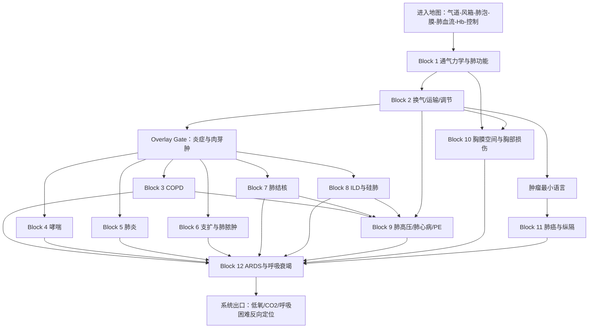

# 西综呼吸系统｜完整导学、认知依赖与学习顺序 v1
## 按《西综 System Guide 生成规则 v1》生成

> **文件层级**：System Guide  
> **用途**：回答“整个呼吸系统应该怎样学”，确定系统模型、认知依赖、Operational Blocks、跨系统路由、记忆流与系统出口。  
> **不是**：第二份呼吸讲义、KP 正文、完整疾病比较表、药物 / 阈值 / TNM 汇总。  
> **权威主干**：本 Project 中的生理学、病理学、内科学、外科学 Study Lecture 与对应 Outline。  
> **生成日期**：2026-08-20  
> **状态**：Study-bound System Guide；允许后续 Block 深审和实际学习反馈修订边界。

---

# 0｜本文件如何使用

呼吸系统不是按：

```text
生理呼吸
→ 病理呼吸
→ 内科呼吸
→ 外科胸部疾病
```

分别重读四遍。

本轮采用：

```text
先建立“空气如何到达血液”的正常链
→ 再按 Failure Mode 分支学习疾病
→ 最后汇合到低氧、CO₂潴留、ARDS与呼吸衰竭
```

实际推进：

```text
在本 System Guide 中定位当前 Block
→ 打开对应 Block Guide / 学习阅读版
→ 按 Study 连续小板块完整学习
→ 用 KP 闭卷恢复
→ 用 Outline 验漏
→ MI-D 在 MarginNote 3 框选成卡片
→ 不让孤立纯记忆阻塞机制主线
```

## 0.1 本文件相对旧学习顺序的主要升级

1. 用统一呼吸链替代教材目录：

```text
气道
→ 胸廓 / 呼吸肌 / 胸膜“风箱”
→ 肺泡通气
→ 肺泡稳定
→ 弥散
→ 肺血流与 VA/Q
→ Hb 运输
→ 中枢调节
```

2. 将内科 13 个章节重新放入同一 Failure Mode 坐标，不机械照搬内科目录。

3. 正式接收循环系统后置过来的主体：

- 肺动脉高压；
- 慢性肺心病；
- 急性肺血栓栓塞症。

4. 将肺高压 / 肺心病 / PE 在呼吸系统设为 **Primary**；循环系统只保留右心后负荷与阻塞性循环失败接口。

5. 将胸腔积液、气胸、脓胸、血胸与胸部损伤放回同一“胸膜空间 / 胸廓力学”模型。

6. 将病理炎症总论设为本系统的一个**前置 Overlay Gate**：
   - 若已完整重学，则 Recall；
   - 若尚未完整重学，则在进入感染性肺病前完成 Primary。

7. 肺癌只学习器官特异模型；完整肿瘤生物学是否在此首次展开，暂不锁死，留给全局重优化。

---

# 1｜Scope Audit

## 1.1 生理学主体

- 通气功能的评价；
- 肺通气；
- 呼吸肌与胸廓运动；
- 胸膜腔负压；
- 肺顺应性、弹性阻力与表面张力；
- 气道阻力与呼吸功；
- 肺换气；
- 气体运输；
- VA/Q；
- 呼吸调节；
- CO 中毒的气体运输接口。

## 1.2 病理学主体

- 慢性支气管炎；
- 肺气肿；
- 慢性肺源性心脏病；
- 支气管扩张；
- 硅肺；
- 大叶性、小叶性、病毒性等肺炎；
- 呼吸系统肿瘤；
- 结核；
- 与本系统直接相关的炎症、肉芽肿、修复和纤维化。

## 1.3 内科学主体

- COPD；
- 肺动脉高压与慢性肺心病；
- 急性肺血栓栓塞症；
- 间质性肺疾病；
- 支气管扩张症；
- 急性肺脓肿；
- 肺炎；
- 肺结核；
- 支气管哮喘；
- ARDS；
- 呼吸衰竭；
- 肺癌；
- 胸膜疾病。

## 1.4 外科学主体

- 肋骨骨折与连枷胸；
- 创伤性窒息；
- 胸部损伤中的开放性 / 张力性气胸、血胸、脓胸等处理接口；
- 急诊开胸探查；
- 纵隔肿瘤的空间定位。

> 当前外科 Lecture 的“其它颈胸部疾病”明确提示：部分肺癌、气胸、血胸、脓胸内容已经整合在内科学中。  
> 因此本 Guide 以**内科胸膜 / 肺癌 Study 为主干**，外科补充胸部创伤、急诊处理与纵隔定位，不制造两套重复正文。

## 1.5 必要跨系统桥梁

### 从循环系统 Recall

- 肺循环阻力；
- 肺动脉压；
- 右室后负荷；
- 右室扩张 / 肥厚；
- 左室充盈下降；
- DVT—栓塞路径；
- 心源性肺水肿；
- 阻塞性休克。

### 从血液系统 Interface

- Hb；
- SaO₂；
- 动脉血氧含量；
- 贫血导致的携氧能力下降；
- DIC 与肺微循环。

### 从泌尿 / 酸碱 Interface

- PaCO₂ 与呼吸性酸碱失衡；
- HCO₃⁻ 代偿方向；
- 氧疗 / 通气后酸碱变化。

完整混合型酸碱判断、代偿公式和肾性调节后置泌尿系统。

### 从神经系统 Interface

- 延髓 / 脑桥呼吸中枢；
- 中枢与外周化学感受器；
- 神经肌肉疾病导致的通气泵衰竭。

### 从病理总论 Overlay

- 急性 / 慢性炎症；
- 化脓性炎；
- 纤维素性炎；
- 间质性炎；
- 肉芽肿；
- 机化与纤维化；
- 肿瘤的侵袭、转移、分期语言。

---

# 2｜明确后置的独立模型

## 2.1 后置到泌尿系统

- 完整水、电解质和酸碱；
- 肾对慢性呼吸性酸碱失衡的完整代偿机制；
- 透析指征；
- 混合性酸碱失衡的系统算法。

呼吸系统只保留：

```text
肺泡通气
→ PaCO₂
→ pH 方向
→ 肾脏后续代偿接口
```

## 2.2 后置到血液系统

- 贫血完整诊断树；
- 红细胞疾病；
- DIC 完整疾病模型。

呼吸系统只保留：

> PaO₂ / SaO₂ 正常不等于 CaO₂ 和组织氧供一定正常。

## 2.3 后置到神经系统

- 中枢病变定位；
- 脊髓、周围神经和神经肌肉接头疾病；
- 呼吸肌瘫痪的完整神经疾病模型。

呼吸衰竭中仅学习其作为“通气泵失败”的病因接口。

## 2.4 后置到完整肿瘤 Overlay

肺癌必须学会：

- 器官特异组织类型；
- 中央 / 周围 / 弥漫位置；
- 临床线索；
- TNM 与可切除性；
- 综合治疗。

但完整的：

- 癌基因 / 抑癌基因；
- DNA 修复；
- 细胞周期；
- 肿瘤代谢；
- 全身实体瘤共同治疗逻辑；

暂定后置到后续肿瘤密集系统或独立肿瘤 Overlay。

## 2.5 后置到循环系统既学模型

呼吸系统不重新完整学习：

- 正常心动周期；
- 心力衰竭完整治疗；
- 四类休克；
- 周围静脉血栓完整处理。

在肺心病、PE、ARDS和胸膜急症中直接 Recall / Apply。

---

# 3｜主要 Study 与 Outline 绑定

| 学科 | Study Lecture 主范围 | Outline 主范围 | 本系统处置 |
|---|---|---|---|
| 生理 | PDF / AI 阅读版 P169–206：通气评价、肺通气、肺换气和气体运输、CO 中毒、呼吸调节 | 生理单元 014–017 | Primary |
| 病理呼吸 | PDF P54–80：慢支、肺气肿、肺心病、支扩、硅肺、肺炎、呼吸系统肿瘤 | 病理单元 001–002 | Primary |
| 病理结核 | PDF P110–117 左右：结核 | 病理单元 013 | Primary |
| 病理炎症 | PDF P161–173：炎症与肉芽肿 | 病理单元 018 | Provisional Primary / Recall |
| 病理肿瘤 | PDF P174–195：肿瘤总论 | 病理单元 019 | Interface / Deferred，等待全局裁决 |
| 内科 | P1–77：COPD 至胸膜疾病 | 内科呼吸单元 001–030 | Primary |
| 外科 | 《27 外科跟课合集改.pdf》P22–23：其它颈胸部疾病 | 外科单元 006 | Primary 补充 |
| 循环 Guide | 肺循环、右心、PE 和休克接口 | — | Recall / Apply |

> 后续 Block Guide 必须重新核对 Study 连续小标题，不能只凭上述页码摘取半截机制。

---

# 4｜System Mission & Mental Model

## 4.1 呼吸系统真正维持什么

呼吸系统不是单纯让肺“吸进氧气”。

它要完成：

> **把外界 O₂ 连续送入肺泡、跨过呼吸膜进入血液，并把组织产生的 CO₂ 反向排出，同时维持 PaO₂、PaCO₂ 和酸碱稳定。**

完整链：

```text
外界空气
→ 传导气道
→ 胸廓 / 呼吸肌产生压力差
→ 肺泡通气
→ 肺泡保持开放
→ 气体跨呼吸膜弥散
→ 肺血流到达相应肺泡
→ O₂ 与 Hb 结合
→ 左心泵向全身
→ 组织利用 O₂
→ CO₂ 反向回肺并排出
```

任何一环失败，最终都可能表现为：

- 呼吸困难；
- 低氧血症；
- CO₂ 潴留；
- 呼吸功增加；
- 肺动脉高压；
- 呼吸衰竭。

## 4.2 七个部件模型

### 1. 气道

决定空气能否顺利进入和排出。

### 2. 风箱

呼吸肌、胸廓和胸膜腔把肌肉收缩变成肺内压变化。

### 3. 肺泡

顺应性、弹性回缩和表面活性物质决定肺泡是否易扩张、能否在呼气末保持开放。

### 4. 呼吸膜

面积、厚度和气体分压差决定弥散。

### 5. 肺循环与 VA/Q

有空气的肺泡必须有血流，有血流的肺泡必须有通气。

### 6. 血液运输

Hb 和血氧饱和度决定血液真正携带多少 O₂。

### 7. 控制器

中枢、化学感受器和机械感受器调节呼吸频率和深度。

---

# 5｜Input / Output Contract

## 5.1 Input｜进入呼吸系统前必须掌握什么

### Hard prerequisite

- 循环系统中的流量、阻力和肺循环接口；
- 血液由右心进入肺、再回左心的方向；
- 压力差推动气体或液体移动；
- 基本内环境与反馈概念。

### 分 Block Hard prerequisite

- Block 3–8：Block 1–2 的通气、换气和肺功能语言；
- Block 6–7：炎症 / 肉芽肿 Overlay；
- Block 9：循环系统中的右心后负荷和血栓—栓塞；
- Block 10：胸膜腔负压；
- Block 11：最小肿瘤语言；
- Block 12：前面主要 Failure Modes。

### Soft prerequisite

- 细胞信号转导；
- 血液氧运输；
- 酸碱；
- 免疫；
- 修复和纤维化。

## 5.2 Output｜学完以后向后续系统输出什么

### 向泌尿系统输出

- PaCO₂ 与肺泡通气的关系；
- 呼吸性酸中毒 / 碱中毒入口；
- 慢性呼吸病为什么需要肾性代偿；
- 低氧、CO₂ 潴留与水钠调节的临床接口。

### 向循环系统输出

- 肺循环阻力；
- 缺氧性肺血管收缩；
- 肺高压与右心后负荷；
- PE 与阻塞性休克；
- 心源性与非心源性肺水肿的鉴别轴。

### 向血液系统输出

- PaO₂、SaO₂、Hb、CaO₂ 不是同一个变量；
- 低氧血症与组织缺氧的边界；
- CO 中毒和贫血的携氧障碍接口。

### 向神经系统输出

- 呼吸中枢；
- 化学感受器；
- 中枢 / 神经肌肉病导致通气泵失败。

### 向感染、免疫和肿瘤系统输出

- 肺泡、气道、间质、胸膜四个空间坐标；
- 炎症类型与病变部位的映射；
- 肺部肿瘤的位置—组织类型双坐标。

---

# 6｜Core Variables & Failure Modes

## 6.1 最小变量语言

```text
VT｜潮气量
f｜呼吸频率
VE｜每分通气量
VA｜肺泡通气量
VD｜无效腔
Compliance｜顺应性
Elastic recoil｜弹性回缩
Airway resistance｜气道阻力
FVC｜用力肺活量
FEV1 / FEV1/FVC｜气流速度与阻塞
RV / TLC / RV/TLC｜残气与过度充气
DLCO｜弥散能力
VA/Q｜通气与血流匹配
PaO₂ / SaO₂｜氧合
PaCO₂｜肺泡通气
Hb / CaO₂｜携氧能力
PVR / PAP｜肺循环阻力与压力
Work of breathing｜呼吸功
pH / HCO₃⁻｜酸碱接口
```

组织公式：

```text
每分通气量 = VT × f

肺泡通气量
=（VT - VD）× f

VA/Q
= 肺泡通气量 / 肺血流量
```

核心理解：

> PaCO₂ 更直接反映肺泡通气；  
> PaO₂ 受 VA/Q、弥散、分流和吸入氧等多因素影响；  
> 组织氧供还必须结合 Hb 和循环血流。

## 6.2 八类 Failure Modes

### 1. 气道阻塞

空气尤其难以呼出。

代表：

- COPD；
- 哮喘；
- 支气管扩张中的分泌物和结构异常。

### 2. 肺 / 胸廓不能充分扩张

肺容积下降，吸气受限。

代表：

- ILD；
- 胸膜积液；
- 气胸；
- 胸壁与呼吸肌问题。

### 3. 肺泡充满液体、细胞或塌陷

有血流但肺泡通气差，形成分流样低氧。

代表：

- 肺炎；
- 肺水肿；
- ARDS；
- 肺不张。

### 4. 呼吸膜变厚或面积减少

气体跨膜困难。

代表：

- 肺纤维化；
- 肺水肿；
- 肺气肿的面积减少。

### 5. VA/Q 不匹配

空气和血流没有在同一肺泡相遇。

- VA/Q 高：死腔样通气；
- VA/Q 低：肺内分流样改变。

### 6. 肺血管阻力或通路异常

代表：

- 肺动脉高压；
- 慢性肺心病；
- PE。

### 7. 通气泵或控制失败

代表：

- 呼吸肌疲劳；
- 胸部严重损伤；
- 中枢抑制；
- 神经肌肉疾病。

### 8. 结构被持续破坏或占据

代表：

- 支气管扩张；
- 肺脓肿；
- 结核空洞；
- 肺癌；
- 硅肺纤维化。

---

# 7｜Dependency Graph



## 7.1 这条路线为什么这样排

1. 先学通气，再学换气：
   - 不先知道空气是否到达肺泡，就无法判断低氧来自通气还是换气。

2. 先掌握肺功能语言，再学 COPD、哮喘和 ILD：
   - FEV1/FVC、TLC、RV/TLC、DLCO 是后续分类工具，不是疾病结论本身。

3. COPD 与哮喘分别建立模型后再比较：
   - 前者强调持续气流受限；
   - 后者强调可逆性、变异性和气道高反应。

4. 肺炎先于肺脓肿：
   - 先建立肺实质感染和病原—部位—渗出坐标，再理解脓肿的化脓、液化和引流。

5. TB 单独成 Block：
   - 它同时涉及肉芽肿、空洞、播散、传染性、检查和长期化疗，不能被压进普通肺炎。

6. ILD / 硅肺在肺力学和弥散之后：
   - 先理解限制性通气和弥散障碍，再学习纤维化疾病。

7. 肺循环疾病放在阻塞 / 限制病之后：
   - COPD、ILD、结核等可作为慢性肺高压与肺心病的上游；
   - PE 则提供急性肺血管阻塞模型。

8. ARDS 与呼吸衰竭最后汇合：
   - 它们不是独立孤岛，而是多个上游 Failure Mode 的共同严重终点。

---

# 8｜Operational Block Route

# Block 1｜正常通气力学与肺功能：空气怎样进入并排出肺泡

**中心问题**

> 呼吸肌怎样通过胸廓和胸膜腔产生压力差；气道阻力、弹性阻力和肺容积怎样决定通气？

**为什么现在学**

COPD、哮喘、ILD、气胸和胸腔积液都在改变同一套通气力学。若先背疾病，肺功能指标会变成孤立字母。

**前置**

- Hard：压力差、基本胸廓和肺解剖。
- Soft：骨骼肌收缩。

**Study 主范围**

- 生理 P169–185；
- Outline 单元 014–015。

**必要原图**

- 肺容量 / 肺容积；
- 呼吸周期压力变化；
- 胸膜腔负压；
- 顺应性曲线；
- 表面张力与表面活性物质；
- 气道阻力；
- 流量—容积曲线；
- 阻塞性 vs 限制性肺功能。

**动作配置**

- Learn：VT、VC、FVC、RV、FRC、TLC；VE / VA / VD；原动力 / 直接动力；顺应性；弹性回缩；表面张力；气道阻力；动态 / 静态顺应性；阻塞 / 限制。
- Recall：压力差、肌肉收缩。
- Apply：COPD、哮喘、ILD、胸膜疾病的预览。
- Defer：完整疾病诊断和治疗。

**知识形态**

- Mechanism Spine：呼吸肌 → 胸廓 → 胸膜压 → 肺扩张 / 回缩 → 肺内压 → 气流。
- Discrimination Tree：阻塞 vs 限制；动态 vs 静态顺应性；气道阻力 vs 弹性阻力。
- MI-G：FEV1/FVC、FVC、TLC、RV/TLC 分别回答什么问题。
- MI-D：正常数值、低频容量组合和全部阈值。

**客观负荷画像**

- 首轮主线负荷：很重
- Memory Island：中
- 视觉负担：很高
- 跨科整合：高
- 主要负荷：同一指标的定义、方向和疾病含义容易混淆

**出口问题**

1. 为什么肺通气的原动力和直接动力不是一回事？
2. 肺气肿为何静态顺应性可升高，但呼气反而困难？
3. 阻塞性与限制性疾病分别主要看“流速”还是“容积”？
4. 为什么小气道病变可先改变动态顺应性？
5. 气胸如何破坏胸膜腔负压并影响回心血量？

**进入下一 Block 的最低标准**

能看到任一肺功能指标时，先解释它在测什么，而不是先背某个病名。

---

# Block 2｜肺换气、气体运输与呼吸调节：空气到了肺泡以后怎么办

**中心问题**

> O₂ 和 CO₂ 如何跨过呼吸膜、与肺血流匹配、进入血液并被呼吸中枢调控？

**前置**

- Hard：Block 1；
- Soft：Hb 和循环血流。

**Study 主范围**

- 生理 P186–206；
- Outline 单元 016–017；
- 循环系统的氧供与肺循环接口：Recall。

**必要原图**

- 呼吸膜；
- 弥散方向；
- VA/Q；
- 死腔与分流；
- O₂ / CO₂ 解离曲线；
- 氧解离曲线移动；
- 中枢 / 外周化学感受器；
- 呼吸调节。

**动作配置**

- Learn：弥散；面积 / 厚度；VA/Q；肺泡无效腔；肺内分流；O₂ / CO₂ 运输；Hb；CO 中毒；呼吸中枢和化学感受。
- Recall：CO、肺血流。
- Apply：PE、哮喘、肺炎、ILD、ARDS、呼衰。
- Defer：完整贫血；完整酸碱；临床中毒治疗。

**知识形态**

- Mechanism Spine：肺泡气体 → 呼吸膜 → 肺毛细血管 → Hb → 循环。
- Discrimination Tree：通气障碍 / 弥散障碍 / VA-Q 失调 / 分流 / 携氧障碍。
- MI-G：PaCO₂ 与肺泡通气；VA/Q 高低的方向；PaO₂ / SaO₂ / Hb / CaO₂ 边界。
- MI-D：氧解离曲线全部影响因素、特殊气体和细节数值。

**客观负荷画像**

- 首轮主线负荷：很重
- Memory Island：中高
- 视觉负担：很高
- 跨科整合：很高

**出口问题**

1. VA/Q 高与低分别对应什么空气—血流失配？
2. 为什么弥散障碍通常先表现为缺氧，而不先表现为 CO₂ 潴留？
3. PaO₂ 正常为什么仍可能组织缺氧？
4. PaCO₂ 升高首先提示哪一环失败？
5. CO 中毒为何 PaO₂ 可不低，但组织仍严重缺氧？
6. 中枢与外周化学感受器分别主要读取什么？

---

## Overlay Gate A｜炎症与肉芽肿

在进入 Block 3–8 前，检查病理炎症总论是否已完整重学。

### 若未完成

在此完成病理炎症与肉芽肿 Primary：

- 血管反应；
- 白细胞募集；
- 急 / 慢性炎症；
- 化脓性、纤维素性、间质性等炎症类型；
- 炎症介质角色；
- 肉芽肿；
- 消退、机化与纤维化接口。

### 若已完成

只做 Recall：

```text
损伤 / 病原
→ 血管反应
→ 白细胞
→ 杀伤
→ 终止
→ 消退 / 修复 / 纤维化
```

**边界**

- 不在各肺病里重复完整炎症总论；
- 每个疾病只保留其特异病变部位、主要细胞和结局。

---

# Block 3｜COPD：持续气流受限怎样从气道延伸到肺泡和全身

**中心问题**

> 慢性气道炎症、黏液阻塞和肺弹性结构破坏，如何形成持续气流受限、过度充气、低氧与 CO₂ 潴留？

**前置**

- Hard：Block 1–2；
- Hard / Recall：炎症 Overlay。

**Study 主范围**

- 病理 P54–62：慢支与肺气肿；
- 内科 P1–11：COPD；
- Outline：病理单元 001 的慢支 / 肺气肿部分；内科单元 001–003。

**动作配置**

- Learn：慢支病理；肺气肿类型与弹性破坏；持续气流受限；动态过度充气；PFT；气体交换；稳定期 / 急性加重；治疗目标。
- Recall：气道阻力、弹性回缩、VA/Q。
- Apply：气胸、肺心病、Ⅱ型呼衰。
- Defer：肺心病完整模型到 Block 9；全部 GOLD / 药物细节进入 MI-D。

**口径边界**

- 病理学可将慢支、肺气肿放在 COPD 疾病组语言中；
- 内科学诊断 COPD 强调支气管扩张剂后仍存在持续气流受限；
- 不把两套口径强行写成完全相同定义。

**知识形态**

- Mechanism Spine：炎症 / 黏液 / 小气道狭窄 + 弹性破坏 → 呼气受限 → 残气↑ → 通气 / 换气失败。
- Discrimination Tree：慢支 / 肺气肿 / 临床 COPD；COPD / 哮喘。
- MI-G：持续气流受限的证据；FEV1/FVC 与 FEV1%pred 的不同角色。
- MI-D：GOLD 分组、全部吸入药、氧疗阈值和急性加重细则。

**客观负荷画像**

- 首轮主线负荷：很重
- Memory Island：高
- 视觉负担：高
- 跨科整合：很高

**出口问题**

1. 肺弹性阻力下降为什么不等于“呼吸更轻松”？
2. COPD 为何可同时出现 VA/Q 升高和降低？
3. 动态顺应性先下降、静态顺应性后升高如何理解？
4. 为什么 COPD 可为Ⅱ型呼衰，也可能出现Ⅰ型血气？
5. COPD 如何逐步走向肺高压和右心衰？

---

# Block 4｜支气管哮喘：可逆性气流受限如何识别和处理

**中心问题**

> 气道炎症、高反应性和可逆性支气管痉挛，怎样形成反复发作，又怎样与 COPD 区分？

**前置**

- Hard：Block 1–2；
- Recall：炎症、信号转导；
- Soft：Block 3。

**Study 主范围**

- 内科 P47–53；
- Outline 单元 017–020；
- 生理信号转导：必要接口。

**动作配置**

- Learn：气道炎症、可逆痉挛、触发因素、发作识别、可逆性证据、分级、控制 / 缓解治疗、急性重症处理。
- Recall：阻塞性通气、气道阻力、VA/Q。
- Apply：过敏、嗜酸性粒细胞、β₂受体、糖皮质激素。
- Defer：全部药物阶梯、剂量和特殊分型。

**知识形态**

- Mechanism Spine：炎症 + 高反应 → 支气管痉挛 / 黏液 / 水肿 → 可变气流受限。
- Discrimination Tree：哮喘 / COPD；急性发作严重度；控制药 / 缓解药。
- MI-G：证明“可逆性”的关键证据；危重征象。
- MI-D：阶梯药物、剂量和全部临界值。

**客观负荷画像**

- 首轮主线负荷：重
- Memory Island：高
- 视觉负担：中
- 跨科整合：高

**出口问题**

1. 哮喘为什么属于阻塞性，但可在发作间期肺功能接近正常？
2. 支气管舒张试验与激发试验分别解决什么问题？
3. 为什么危重哮喘时哮鸣音反而可能减弱？
4. 控制治疗与快速缓解治疗分别在改变哪一层？
5. COPD 与哮喘最有鉴别价值的不是哪些共同表现，而是什么？

---

# Block 5｜肺炎：病原体进入后，病变占据肺泡、细支气管还是间质

**中心问题**

> 如何用病变部位、炎症类型、病原体、影像和严重度统一理解肺炎？

**前置**

- Hard：Block 1–2；
- Hard：炎症 Overlay。

**Study 主范围**

- 病理 P72–76；
- 内科 P33–39；
- Outline：病理单元 002 的肺炎部分；内科单元 011–013。

**必要原图**

- 大叶、小叶、间质性肺炎；
- 肺泡渗出；
- 病毒包涵体；
- DAD / 透明膜；
- 典型影像分布。

**动作配置**

- Learn：CAP / HAP 识别；大叶 / 小叶 / 间质空间；主要病原与病理；严重度；检查；经验治疗；并发症。
- Recall：炎症类型、气体交换、VA/Q。
- Apply：肺脓肿、脓胸、ARDS、呼衰。
- Defer：全部病原—药物矩阵当场背熟，转 MI-D。

**口径边界**

病理学中关于某类肺炎“通常是否累及胸膜”的表述，只作为病理 Study 做题口径，不机械推广为临床绝对规则。

**知识形态**

- Mechanism Spine：病原 → 病变位置 → 渗出 / 实变 → VA/Q 下降 / 分流 → 症状与影像。
- Discrimination Tree：肺泡性 / 支气管周围 / 间质性；CAP / HAP；典型 / 非典型。
- MI-G：重症判断和会改变初始治疗的关键线索。
- MI-D：病原体名单、首选药、特殊影像、包涵体和疗程。

**客观负荷画像**

- 首轮主线负荷：重
- Memory Island：很高
- 视觉负担：很高
- 跨科整合：高

**出口问题**

1. 为什么肺泡实变会产生支气管呼吸音和语音震颤增强？
2. 大叶、小叶和间质性肺炎最先用什么空间坐标区分？
3. 肺炎低氧主要来自哪种换气失败？
4. 纤维素清除失败为何可形成肺肉质变？
5. 哪些线索提示普通肺炎已进入重症、脓肿、脓胸或 ARDS？

---

# Block 6｜支气管扩张与肺脓肿：反复感染如何形成结构破坏和脓腔

**中心问题**

> 为什么一类疾病表现为永久扩张的含痰气道，另一类表现为肺实质内的化脓性空腔；二者如何清除感染源？

**前置**

- Hard：Block 5；
- Recall：化脓性炎、气道结构。

**Study 主范围**

- 病理 P68–69：支扩；
- 内科 P27–32：支扩与肺脓肿；
- Outline：病理单元 001 支扩部分；内科单元 009–010。

**动作配置**

- Learn：
  - 支扩：管壁支撑结构破坏 + 外牵拉 + 管腔压力；
  - 肺脓肿：吸入 / 血源 / 继发感染 → 化脓液化 → 空洞；
  - 痰、咯血、HRCT、体位引流、抗菌与引流边界。
- Recall：阻塞、化脓性炎、肺炎。
- Apply：肺心病、脓胸、咯血急症。
- Defer：全部抗菌药物组合、咯血介入细则。

**知识形态**

- Mechanism Spine：感染 → 结构破坏 / 液化 → 分泌物与引流问题。
- Discrimination Tree：支扩 / 肺气肿；支扩 / 肺脓肿；脓腔 / 结核空洞 / 癌性空洞。
- MI-G：大量咯血与窒息风险；是否需要引流。
- MI-D：好发部位、病原、药物和疗程。

**客观负荷画像**

- 首轮主线负荷：中重
- Memory Island：高
- 视觉负担：高
- 跨科整合：高

**出口问题**

1. “支气管扩张”为什么不代表气道阻力一定下降？
2. 支扩的三股力量分别是什么？
3. 肺脓肿为何既要抗菌，又强调体位 / 引流？
4. 支扩咯血为什么可很多，而 COPD 通常不是典型咯血病？
5. 脓腔、结核空洞和肿瘤空洞应从哪些共同轴比较？

> **执行层边界**：本 System Guide 将两者合为“持续化脓与引流”Block；后续 Block Guide 很可能拆成两个连续学习单元。

---

# Block 7｜肺结核：肉芽肿、坏死、空洞和播散如何连成完整病程

**中心问题**

> 结核分枝杆菌进入后，宿主免疫如何同时造成控制、干酪样坏死、空洞、传染和播散？

**前置**

- Hard：炎症与肉芽肿；
- Hard：Block 1–2；
- Soft：Block 5。

**Study 主范围**

- 病理 P110–117 左右；
- 内科 P40–46；
- Outline：病理单元 013；内科单元 014–016。

**必要原图**

- 原发综合征；
- 继发性肺结核好发部位；
- 干酪样坏死；
- 空洞；
- 淋巴 / 血行播散；
- 影像和病型。

**动作配置**

- Learn：原发 / 继发；活动性 / 非活动性；传染性；播散；检查；标准化疗原则；耐药接口。
- Recall：肉芽肿、坏死、肺叶空间。
- Apply：结核性胸膜炎、咯血、肺心病。
- Defer：其他器官结核的完整专科模型，后续感染系统再 Recall / 扩展。

**知识形态**

- Mechanism Spine：感染 → 细胞免疫 / 肉芽肿 → 干酪坏死 → 纤维化或空洞 / 播散。
- Discrimination Tree：原发 / 继发；活动 / 陈旧；结核 / 肺炎 / 肺癌 / 脓肿。
- MI-G：活动性、传染性与检查证据；化疗基本原则。
- MI-D：药物不良反应、详细病型、影像和方案细节。

**客观负荷画像**

- 首轮主线负荷：重
- Memory Island：很高
- 视觉负担：很高
- 跨科整合：高

**出口问题**

1. 原发与继发结核为何好发部位和播散方式不同？
2. 干酪样坏死、空洞和传染性之间是什么关系？
3. 痰检查、影像和免疫学检查分别证明哪一层？
4. 结核为何可形成胸水、咯血、肺毁损和肺心病？
5. 抗结核治疗为什么强调联合、适量、规律和全程？

---

# Block 8｜间质性肺疾病与硅肺：肺泡能通气，但膜和支架逐渐变硬

**中心问题**

> 肺间质增厚、纤维化和肺结构重塑，怎样造成限制性通气、弥散下降和进行性低氧？

**前置**

- Hard：Block 1–2；
- Recall：炎症、修复、纤维化。

**Study 主范围**

- 病理 P70–71：硅肺；
- 内科 P22–26：ILD；
- Outline：病理单元 002 硅肺部分；内科单元 007–008。

**必要原图**

- 硅结节；
- 肺纤维化；
- 蜂窝肺；
- HRCT；
- BALF；
- 限制性肺功能。

**动作配置**

- Learn：限制性与弥散障碍；IPF；结节病；其他 ILD；硅肺颗粒—巨噬细胞—纤维化循环。
- Recall：顺应性、DLCO、肉芽肿、修复。
- Apply：低氧、肺高压、肺心病、呼衰。
- Defer：全部罕见 ILD 的孤立列表和详细药物。

**知识形态**

- Mechanism Spine：间质损伤 / 纤维化 → 顺应性↓ + 膜厚↑ → 限制 + 弥散障碍。
- Discrimination Tree：IPF / 结节病 / 硅肺 / 其他 ILD；间质病 / 肺泡充填。
- MI-G：限制性肺功能与 DLCO；会改变治疗的诊断证据。
- MI-D：BALF 细胞、药物、分期、粒径和影像细节。

**客观负荷画像**

- 首轮主线负荷：重
- Memory Island：很高
- 视觉负担：很高
- 跨科整合：高

**出口问题**

1. ILD 为什么以吸气困难和肺容积下降为主？
2. 顺应性下降与弥散下降分别来自什么结构变化？
3. 硅肺为什么脱离粉尘后仍可进展？
4. IPF、结节病和硅肺应从哪些共同轴比较？
5. ILD 如何进一步走向肺高压和右心衰？

---

# Block 9｜肺动脉高压、慢性肺心病与急性肺栓塞

**中心问题**

> 肺血管阻力慢慢升高和突然升高，为什么分别形成右室肥厚与急性右室扩张 / 休克？

**前置**

- Hard：Block 2；
- Hard：循环系统中的 P/Q/R/V、右室后负荷；
- Hard：血栓—栓塞；
- Soft：Block 3、7、8。

**Study 主范围**

- 病理 P63–67：肺心病；
- 内科 P12–21：肺动脉高压与急性肺血栓栓塞；
- Outline：病理单元 001 肺心病；内科单元 004–006；
- 循环 Guide：Recall。

**必要原图**

- 肺血管重构；
- 右室肥厚 / 扩张；
- 室间隔移位；
- PE 血流方向；
- V/Q 显像；
- 右心负荷 ECG / 超声。

**动作配置**

- Learn：
  - 慢性低氧 / 肺血管床减少 → PVR↑ → 肺高压 → 肺心病；
  - DVT → PE → 急性 PVR↑ → 右室衰竭；
  - 检查、危险分层、抗凝 / 溶栓基本路径。
- Recall：DVT、右心后负荷、阻塞性休克。
- Apply：COPD、ILD、结核、低氧。
- Defer：所有肺高压靶向药细节和抗凝疗程表进入 MI-D。

**知识形态**

- Mechanism Spine：PVR↑ → PAP↑ → 右室后负荷↑ → 右心改变 → 左室充盈 / 体静脉。
- Discrimination Tree：慢性肺心病 / 急性 PE；低危 / 中危 / 高危 PE；肺高压 / 左心病。
- MI-G：血流动力学稳定性；是否溶栓；确诊层级。
- MI-D：全部靶向药、疗程、影像标准和 ECG 数值。

**客观负荷画像**

- 首轮主线负荷：很重
- Memory Island：高
- 视觉负担：高
- 跨科整合：很高

**出口问题**

1. 局部低氧性肺血管收缩为什么短期有利、全肺长期却有害？
2. 慢性肺高压为何先右室肥厚，急性 PE 为何来不及肥厚？
3. PE 为什么既造成低氧，又可能造成低血压和休克？
4. D-dimer、CTPA、肺动脉造影各解决什么问题？
5. PE 的抗凝与溶栓分别针对什么风险层级？

---

# Block 10｜胸膜空间与胸部损伤：肺本身未必坏，呼吸仍可立即崩溃

**中心问题**

> 胸膜腔内出现液体、气体、血液或脓液，或胸壁失去稳定性时，为什么肺扩张和静脉回流会同时受损？

**前置**

- Hard：Block 1；
- Hard：循环系统回心；
- Soft：Block 5、7、11。

**Study 主范围**

- 内科 P67–77：胸膜疾病；
- 外科 P22–23：肋骨骨折、连枷胸、创伤性窒息、急诊开胸；
- Outline：内科 026–030；外科 006。

**必要原图**

- 胸膜腔；
- 积液体征；
- 闭合 / 开放 / 张力性气胸；
- 血胸与脓胸；
- 连枷胸与反常呼吸；
- 纵隔移位；
- 胸腔闭式引流。

**动作配置**

- Learn：
  - 漏出液 / 渗出液；
  - 结核性、恶性、脓性胸水；
  - 闭合 / 开放 / 张力性气胸；
  - 血胸 / 脓胸；
  - 肋骨骨折 / 连枷胸；
  - 创伤性窒息；
  - 急诊开胸指征。
- Recall：胸膜负压、回心血量、休克。
- Apply：肺癌、结核、COPD、创伤。
- Defer：完整外科操作细节和全部引流数值。

**知识形态**

- Mechanism Spine：胸膜空间异常 → 肺受压 / 负压破坏 → 通气↓；高压时回心↓。
- Discrimination Tree：积液 / 气胸；闭合 / 开放 / 张力；血胸 / 脓胸；连枷胸 / 开放性气胸。
- MI-G：张力性气胸立即减压；大血胸 / 持续出血和开胸边界。
- MI-D：胸水阈值、引流位置、精确数值和外科口诀。

**客观负荷画像**

- 首轮主线负荷：重
- Memory Island：很高
- 视觉负担：很高
- 跨科整合：很高

**出口问题**

1. 为什么张力性气胸既是呼吸急症，也是阻塞性循环急症？
2. 开放性气胸的纵隔摆动与连枷胸的反常呼吸分别来自什么？
3. 漏出液与渗出液的第一层机制是什么？
4. 为什么脓胸通常不能只靠抗生素？
5. 哪些胸部损伤需要立即减压、引流或开胸？

> **执行层边界**：本 Block 很可能拆成“胸水 / 脓胸”“气胸 / 血胸”“胸壁损伤 / 纵隔”三个连续单元。

---

## Overlay Gate B｜肺癌前的最小肿瘤语言

在进入 Block 11 前，至少能够回答：

- 良性与恶性的基本边界；
- 分化 / 异型；
- 浸润与转移；
- 淋巴与血道转移；
- 分期为什么决定治疗；
- 癌前病变与化生的关系接口。

**当前不强制**

完整学习全部肿瘤总论和分子生化。是否在呼吸系统首次 Primary，留给全局重优化。

---

# Block 11｜肺癌与纵隔定位：先定位置，再定细胞来源，再定分期

**中心问题**

> 肺内肿块应先判断中央 / 周围 / 弥漫位置，还是先判断组织学类型；这些信息怎样决定表现、转移和治疗？

**前置**

- Hard：最小肿瘤语言；
- Hard：呼吸树空间；
- Soft：Block 10。

**Study 主范围**

- 病理 P77–80；
- 内科 P61–66；
- 外科 P23 纵隔肿瘤；
- Outline：病理单元 002 肿瘤部分；内科 024–025；外科 006 纵隔部分。

**必要原图**

- 中央 / 周围 / 弥漫型；
- 鳞癌、腺癌、小细胞癌等镜下；
- 肺门与纵隔；
- TNM；
- 典型影像；
- Pancoast / 上腔静脉 / 纵隔压迫接口。

**动作配置**

- Learn：位置—组织类型双坐标；症状；转移；副肿瘤；检查；TNM；可切除性和综合治疗；纵隔肿瘤定位。
- Recall：化生、肿瘤侵袭、胸水、支气管阻塞。
- Apply：肺不张、阻塞性肺炎、胸腔积液、神经压迫。
- Defer：全肿瘤分子生物学和全部靶向药表。

**知识形态**

- Mechanism Spine：位置 / 细胞来源 → 局部表现 → 转移 / 分期 → 治疗。
- Discrimination Tree：中央 / 周围 / 弥漫；NSCLC / SCLC；肺癌 / 结核 / 脓肿 / 转移癌 / 纵隔肿瘤。
- MI-G：小细胞与非小细胞治疗大边界；TNM 对可切除性的意义。
- MI-D：组织形态、标志物、突变—药物配对、全部 TNM 细节。

**客观负荷画像**

- 首轮主线负荷：重
- Memory Island：很高
- 视觉负担：很高
- 跨科整合：高

**出口问题**

1. 肺癌为什么要先做位置和组织类型两次定位？
2. 中央型与周围型为什么症状和发现方式不同？
3. 小细胞肺癌为何与大多数 NSCLC 使用不同治疗思路？
4. 肺癌怎样导致肺不张、阻塞性肺炎、胸水和神经压迫？
5. 纵隔肿块应先按哪个空间坐标定位？

---

# Block 12｜ARDS 与呼吸衰竭：前面所有 Failure Modes 的共同严重终点

**中心问题**

> 当氧合或肺泡通气无法维持时，如何区分Ⅰ型与Ⅱ型呼衰；ARDS 为什么形成顽固性低氧和非心源性肺水肿？

**前置**

- Hard：Block 1–2；
- Hard：主要疾病 Blocks；
- Recall：循环系统休克、肺水肿和右心负荷。

**Study 主范围**

- 内科 P54–60；
- 病理 DAD / 透明膜：Recall Block 5；
- Outline：内科 021–023；
- 酸碱：Interface。

**必要原图**

- 肺泡—毛细血管屏障；
- DAD 与透明膜；
- 心源性 / 非心源性肺水肿；
- 氧合分层；
- PEEP；
- Ⅰ / Ⅱ型血气；
- 机械通气决策。

**动作配置**

- Learn：
  - ARDS 屏障损伤；
  - 非心源性肺水肿；
  - 分流和顽固性低氧；
  - 肺保护通气和 PEEP；
  - 呼衰分型、病因、氧疗、通气支持；
  - 呼吸肌疲劳与 CO₂ 潴留。
- Recall：VA/Q、弥散、肺泡通气、循环肺水肿。
- Apply：COPD、哮喘、肺炎、PE、胸膜急症、神经肌肉病。
- Defer：完整混合酸碱计算和全部呼吸机参数。

**知识形态**

- Mechanism Spine：
  - ARDS：屏障损伤 → 渗漏 → 肺泡充液 / 塌陷 → 分流 → 低氧；
  - RF：上游机制 → PaO₂ / PaCO₂ 失控 → 器官损害。
- Discrimination Tree：Ⅰ / Ⅱ型；ARDS / 心源性肺水肿；氧合失败 / 通气失败；NIV / 有创通气。
- MI-G：血气分型、危重征象、立即通气支持门槛。
- MI-D：氧合分级、呼吸机设置、补碱阈值和全部参数。

**客观负荷画像**

- 首轮主线负荷：很重
- Memory Island：很高
- 视觉负担：高
- 跨科整合：很高

**出口问题**

1. Ⅰ型与Ⅱ型呼衰的核心差别是“病名”还是哪一项功能失败？
2. 为什么单纯弥散障碍通常不先造成 CO₂ 潴留？
3. ARDS 为什么吸高浓度氧仍可能难以纠正低氧？
4. PEEP 为什么能改善氧合，又为什么不能无限增加？
5. COPD、肺炎、PE、胸膜急症分别通过什么路径走到呼衰？
6. ARDS 与左心衰肺水肿怎样从起点和血流动力学区分？

> **执行层边界**：后续 Block Guide 很可能拆为“ARDS”和“呼吸衰竭 / 血气 / 通气支持”两个单元。

---

# 9｜Overlay & Cross-System Routing

| 内容 | 动作 | 在呼吸中的用途 | 完整主体 |
|---|---|---|---|
| 循环 P/Q/R/V | Recall | 肺血流、右心后负荷、休克 | 循环 |
| 肺循环与右心 | Recall / Apply | PH、肺心病、PE | 循环基础；呼吸疾病主体 |
| 血栓—栓塞 | Recall | PE | 循环 Block 4 |
| 炎症与肉芽肿 | Learn 或 Recall | COPD、肺炎、TB、ILD | 病理总论；本系统首次高强度应用 |
| 修复 / 纤维化 | Recall / Apply | 肺肉质变、ILD、硅肺 | 病理修复 |
| Hb 与携氧 | Interface | PaO₂ / SaO₂ / CaO₂ | 血液 |
| 酸碱 | Interface / Defer | 呼吸性酸碱、呼衰 | 泌尿 |
| 神经控制 | Interface / Defer | 呼吸调节、通气泵失败 | 神经 |
| 肿瘤总论 | Interface / Deferred | 肺癌器官模型 | 后续肿瘤 Overlay |
| 休克 | Recall / Apply | PE、张力性气胸、ARDS | 循环 / 外科 |
| 胸部损伤 | Learn | 胸膜和通气泵急症 | 呼吸 / 外科交界 |
| 肺结核 | Learn | 肺部主体 | 后续感染系统只 Recall |

---

# 10｜Knowledge Form & Memory Routing

## 10.1 Mechanism Spine｜第一轮必须真正掌握

```text
空气能否移动
→ 肺泡能否开放
→ 气体能否跨膜
→ 空气能否遇到血流
→ 血液能否携氧
→ 中枢能否维持通气
→ 上游疾病如何走到呼吸衰竭
```

第一轮要求：

> 能解释、能画图、能闭卷重建、能从血气和肺功能反推故障位置。

## 10.2 Discrimination Trees｜模型建立后再比较

- 阻塞 vs 限制；
- 通气障碍 vs 换气障碍；
- VA/Q 高 vs 低；
- 死腔样通气 vs 肺内分流；
- COPD vs 哮喘；
- 支扩 vs 肺气肿；
- 肺炎 vs 肺脓肿 vs TB；
- IPF vs 结节病 vs 硅肺；
- 慢性肺心病 vs 急性 PE；
- 漏出液 vs 渗出液；
- 闭合 / 开放 / 张力性气胸；
- 肺癌 vs 结核 / 脓肿 / 转移癌；
- ARDS vs 心源性肺水肿；
- Ⅰ型 vs Ⅱ型呼衰。

## 10.3 MI-G｜第一轮不能后置

典型包括：

- 肺功能指标的功能意义；
- VA/Q 高低方向；
- PaCO₂ 与肺泡通气；
- COPD 持续气流受限证据；
- 哮喘可逆性证据；
- 重症肺炎 / 哮喘 / PE / 气胸 / 呼衰的危重门槛；
- 张力性气胸立即减压；
- PE 是否需要溶栓；
- Ⅰ / Ⅱ型呼衰基本边界。

## 10.4 MI-D｜进入 MarginNote 3 的延迟记忆流

- 肺容量正常数值；
- 全部病原—药物配对；
- TB 方案、不良反应和细分病型；
- ILD 的 BALF、影像、药物；
- 肺高压靶向药；
- PE 疗程和全部评分；
- 胸水阈值、ADA 等特殊；
- 胸腔引流数字和开胸指征细节；
- 肺癌组织学、标志物、突变药物和 TNM；
- ARDS 氧合分级、呼吸机参数；
- 大量特殊体征与好发部位。

处理：

```text
知道它属于哪个模型
→ 阅读一次
→ MarginNote 框选
→ 进入卡片
→ 后续间隔重复
→ 当前不因记不牢停住主线
```

---

# 11｜原图门禁

以下内容必须回 Study 原图或高质量表格：

1. 支气管树、传导区和肺腺泡；
2. 肺容积与容量；
3. 胸膜压、肺内压和气流；
4. 顺应性曲线；
5. 表面张力 / 表面活性物质；
6. 流量—容积曲线；
7. 阻塞 / 限制肺功能；
8. 呼吸膜与弥散；
9. VA/Q、死腔、分流；
10. 氧解离曲线；
11. 化学感受器与呼吸中枢；
12. 肺气肿空间类型；
13. 支扩“三力模型”；
14. 大叶 / 小叶 / 间质性肺炎；
15. DAD、透明膜和病毒包涵体；
16. 原发 / 继发结核与空洞；
17. 硅结节、蜂窝肺和 HRCT；
18. 肺血管重构、右心形态、PE；
19. 胸水、三类气胸、血胸、连枷胸；
20. 肺癌位置、组织学和 TNM；
21. ARDS / 呼衰血气与通气支持图。

---

# 12｜System Integration & Exit

## 12.1 正向推导

面对任一疾病：

```text
病变主要在哪个空间？
气道 / 肺泡 / 间质 / 肺血管 / 胸膜 / 呼吸泵 / 肿块
        ↓
先造成哪种功能失败？
阻塞 / 限制 / 弥散 / VA-Q / 分流 / 死腔 / 通气泵
        ↓
PaO₂、PaCO₂、肺功能和体征如何变化？
        ↓
是否形成肺高压、右心负荷或呼吸衰竭？
        ↓
治疗应该开气道、清感染、引流、抗凝、减压、改善氧合还是机械通气？
```

## 12.2 反向定位

面对病例，依次问：

1. 主要是咳痰、喘、咯血、胸痛，还是低氧 / 意识改变？
2. 呼吸困难偏吸气、呼气，还是无明显相位？
3. 是气道、肺泡、间质、血管还是胸膜问题？
4. 肺功能提示阻塞还是限制？
5. 血气提示氧合失败还是通气失败？
6. 体征是实变、积液、气胸还是过度充气？
7. 患者血流动力学稳定吗？
8. 下一步需要检查、抗感染、抗凝 / 溶栓、引流 / 减压、还是通气支持？

## 12.3 最终六张纸

不看文件完成：

1. **气道—胸廓—胸膜—肺泡的通气力学图**
2. **肺功能：阻塞 / 限制 / DLCO / RV-TLC 总图**
3. **弥散—VA/Q—分流—死腔—Hb—血气图**
4. **COPD / 哮喘 / ILD / 肺炎四类功能模型**
5. **肺高压—肺心病—PE + 胸膜空间急症**
6. **感染 / TB / 肺癌走向 ARDS 与呼吸衰竭的网络**

## 12.4 代表性反向病例入口

- 长期吸烟、咳痰喘、活动后气短；
- 年轻人反复夜间喘息，发作间期正常；
- 大量脓痰伴反复咯血；
- 高热、实变体征和铁锈色痰；
- 低热盗汗、上肺空洞；
- 进行性气短、Velcro 啰音、杵状指；
- 单侧下肢肿痛后突发胸痛和呼吸困难；
- 突发胸痛继之呼吸困难、鼓音和呼吸音消失；
- 胸水为渗出液 / 血性 / 脓性；
- 肺门肿块伴声音嘶哑或上腔静脉综合征；
- 严重感染后顽固低氧、双肺弥漫影；
- PaO₂ 低而 PaCO₂ 正常，或 PaCO₂ 明显升高伴意识改变。

---

# 13｜Coverage Ledger

| 范围 | 处置 | Primary / 完整位置 |
|---|---|---|
| 通气评价、肺通气 | Primary | Block 1 |
| 换气、气体运输、呼吸调节 | Primary | Block 2 |
| 炎症总论 | Provisional Primary / Recall | Overlay Gate A |
| 慢支 / 肺气肿 / COPD | Primary | Block 3 |
| 哮喘 | Primary | Block 4 |
| 肺炎 | Primary | Block 5 |
| 支扩 / 肺脓肿 | Primary | Block 6 |
| 肺结核 | Primary | Block 7 |
| ILD / 硅肺 | Primary | Block 8 |
| 肺高压 / 肺心病 / PE | Primary | Block 9 |
| 胸膜疾病 / 胸部损伤 | Primary | Block 10 |
| 肺癌 / 纵隔定位 | Primary | Block 11 |
| 肿瘤总论 | Interface / Deferred | 后续全局裁决 |
| ARDS / 呼吸衰竭 | Primary | Block 12 |
| 完整酸碱 | Interface / Deferred | 泌尿 |
| 贫血与血液病 | Interface / Deferred | 血液 |
| 右心后负荷、休克 | Recall / Apply | 循环 |
| 完整神经肌肉疾病 | Interface / Deferred | 神经 |
| 其他器官结核 / 传染病比较 | Recall / Deferred | 感染系统 |

```text
orphan_scope：当前未发现
duplicate_primary：肺高压 / 肺心病 / PE 已从循环完整主体中移出
```

最终仍需在 Global Map 阶段核对：

- 炎症总论的唯一 Primary；
- 肿瘤总论的唯一 Primary；
- 酸碱的唯一 Primary；
- 外科胸部急症与内科胸膜疾病是否存在重复小节。

---

# 14｜客观负荷画像与 Flexible Window

## 14.1 系统总体负荷

- 首轮主线理解负荷：**很重**
- Memory Island 负担：**很高**
- 视觉负担：**很高**
- 跨科整合负担：**很高**
- 独立疾病模型数量：**多**
- 后续复用价值：**极高**

呼吸的难点不只在知识量，而在于同一个症状可能来自：

```text
气道
肺泡
间质
肺血管
胸膜
呼吸泵
血液携氧
循环灌注
```

必须建立空间和功能双坐标。

## 14.2 各 Block 相对负荷

| Block | 首轮主线 | MI-D | 视觉 | 整合 |
|---|---|---|---|---|
| 1 通气力学 / 肺功能 | 很重 | 中 | 很高 | 高 |
| 2 换气 / 运输 / 调节 | 很重 | 中高 | 很高 | 很高 |
| 3 COPD | 很重 | 高 | 高 | 很高 |
| 4 哮喘 | 重 | 高 | 中 | 高 |
| 5 肺炎 | 重 | 很高 | 很高 | 高 |
| 6 支扩 / 肺脓肿 | 中重 | 高 | 高 | 高 |
| 7 肺结核 | 重 | 很高 | 很高 | 高 |
| 8 ILD / 硅肺 | 重 | 很高 | 很高 | 高 |
| 9 肺血管 | 很重 | 高 | 高 | 很高 |
| 10 胸膜 / 胸部损伤 | 重 | 很高 | 很高 | 很高 |
| 11 肺癌 / 纵隔 | 重 | 很高 | 很高 | 高 |
| 12 ARDS / 呼衰 | 很重 | 很高 | 高 | 很高 |

## 14.3 暂定灵活窗口

### 若炎症总论此前已完整重学

> **呼吸系统第一轮结构化重建：建议预留约 3–5 个主要学习日。**

### 若炎症总论需要在本系统首次完整重学

> **建议预留约 4–7 个主要学习日。**

这只是阶段排程窗口，不是完成期限。

实际可根据：

- COPD、肺炎、TB、哮喘等旧掌握差异；
- 是否已有成熟病理 KP；
- MI-D 是否及时转入 MarginNote；
- 是否提前陷入病原—药物、TNM和呼吸机参数细节；

动态压缩或扩张。

若实际耗时超出窗口约 30% 以上，优先检查：

1. 是否将 MI-D 当场背熟；
2. 是否在每个疾病重复学习完整炎症总论；
3. 是否把循环、酸碱、血液独立模型提前搬入；
4. 是否在 System Guide 阶段制作巨型比较表；
5. B6、B10、B12 是否应在 Block Guide 层拆分。

---

# 15｜Open Questions / Unresolved Boundary

1. **炎症总论的 Primary 位置**  
   若在循环后尚未完整重学，建议在呼吸疾病分支前完成；若之后决定病理总论统一前置，则本处改为 Recall。

2. **肿瘤总论的 Primary 位置**  
   肺癌是第一个大型器官肿瘤，但消化系统肿瘤更密集。当前只要求最小肿瘤语言，完整 O9 等 Global Map 决定。

3. **Block 6 体量**  
   支扩与肺脓肿共享“感染—结构破坏—分泌物 / 引流”，但仍是两个独立疾病模型，Block Guide 很可能拆开。

4. **Block 10 体量**  
   胸水、气胸 / 血胸、胸壁损伤和纵隔急症跨度大，执行层必须避免一个超大阅读版。

5. **Block 12 体量**  
   ARDS 与呼吸衰竭有共同出口，但诊断和治疗模型独立，执行层大概率拆为两个 Block Guide。

6. **肺癌外科来源**  
   当前外科 Lecture 将肺癌主要内容概括为“部分已在内科总结”，没有单独完整肺癌章节。现阶段以内科 Study 为临床主体，外科只补纵隔与胸部急症。

7. **酸碱边界**  
   呼吸衰竭中必须掌握呼吸性变化和治疗后方向；完整代偿公式和混合型后置泌尿。

8. **病理与内科口径差异**  
   COPD 身份、肺炎胸膜累及、疾病分类等差异必须保留各自 Study 语境，不能静默统一。

---

# 16｜对 Global Map 的修改建议

1. **心—肺—肾第一主线内部建议采用：**

```text
循环
→ 呼吸
→ 泌尿
→ 心肺肾整合
```

理由：

- 呼吸需要循环的肺血流和右心后负荷语言；
- 呼吸先建立 PaCO₂ 与呼吸性酸碱；
- 泌尿随后完成肾性代偿、水盐与完整酸碱。

2. **肺高压、肺心病和 PE 的唯一完整 Primary 放在呼吸系统**：
   - 循环只 Recall 右心和休克接口。

3. **肺结核的完整肺部模型放在呼吸系统**：
   - 后续感染系统只做病原 / 传播 / 器官外比较。

4. **胸膜疾病和胸部损伤归呼吸—外科交界**：
   - 不留到“剩余外科总论”。

5. **炎症 Overlay 建议最迟在呼吸疾病分支前完成**：
   - 后续消化、免疫、感染和外科感染均直接 Recall。

6. **完整肿瘤 Overlay 暂不在此锁死**：
   - 肺癌先用最小肿瘤接口；
   - 等消化和血液系统 Guide 完成后再决定最佳 Primary。

---

# 17｜一页式最终路线

```text
进入地图
气道—风箱—肺泡—呼吸膜—肺血流—Hb—控制
        ↓
Block 1
通气力学 + 肺功能
        ↓
Block 2
弥散 + VA/Q + 气体运输 + 呼吸调节
        ↓
Overlay Gate A
炎症 / 肉芽肿：首次完整学习或 Recall
        ↓
┌─────────────────────────────────────────────────────┐
│                                                     │
↓                   ↓                  ↓               ↓
Block 3           Block 4            Block 5          Block 8
COPD              哮喘               肺炎             ILD / 硅肺
│                   │                  │               │
│                   │                  ↓               │
│                   │                Block 6           │
│                   │                支扩 / 肺脓肿     │
│                   │                  │               │
│                   │                  ↓               │
│                   │                Block 7           │
│                   │                肺结核            │
└───────────────────┴──────────────────┴───────────────┘
                            ↓
                        Block 9
              肺高压 / 肺心病 / 急性 PE
                            ↓
         ┌──────────────────┼──────────────────┐
         ↓                  ↓                  ↓
     Block 10          Overlay B          Block 12
  胸膜 / 胸部损伤      肿瘤最小语言       ARDS / 呼衰
                            ↓                  ↑
                        Block 11               │
                     肺癌 / 纵隔 ──────────────┘
                            ↓
系统出口
呼吸困难 / 低氧 / CO₂潴留 / 胸痛 / 咯血 / 胸水的反向定位
```

> **最终目标不是背下十二个章节，而是面对任一呼吸病例时，能先定位“气道、风箱、肺泡、膜、血流、Hb、控制器”中的故障位置，再选择对应疾病模型；纯记忆细节则持续通过 MarginNote 3 和间隔复习补齐。**
