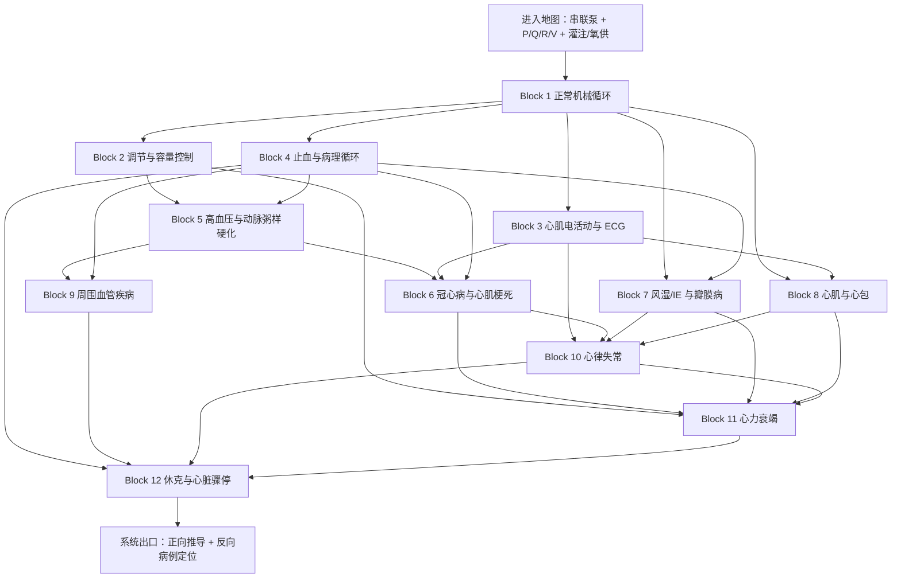

# 西综循环系统｜完整导学、认知依赖与学习顺序 v2
## 按《西综 System Guide 生成规则 v1》重生成 / 升级

> **文件层级**：System Guide  
> **用途**：回答“整个循环系统应该怎样学”，为后续逐个生成 Block Guide / 学习阅读版提供上位路线。  
> **不是**：第二份循环讲义、题纲答案大全、完整疾病比较表、药物与阈值汇总。  
> **权威主干**：本 Project 中的生理学、病理学、内科学、外科学 Study Lecture 与对应 Outline。  
> **生成日期**：2026-08-20  
> **状态**：Study-bound System Guide；允许在后续 Block 深审和实际学习反馈后修订边界。

---

# 0｜本文件如何使用

本文件只承担五件事：

```text
恢复循环系统真正的运行模型
→ 确定认知依赖
→ 划分 Operational Blocks
→ 决定跨系统内容 Learn / Recall / Apply / Defer
→ 定义系统出口与大致工作体量
```

实际学习仍按以下链条推进：

```text
先看当前 Block 在本 System Guide 中的位置
→ 打开对应 Block Guide / 学习阅读版
→ 按 Study 连续小板块完整学习
→ 用 KP 闭卷恢复
→ 用 Outline 检查高置信度考点
→ 把 MI-D 框入 MarginNote 3，后续间隔记忆
```

## 0.1 与旧版相比，本次升级了什么

1. 保留旧版最有价值的统一模型：  
   **泵—阀—管路—容量池—节律—调节—交换 / 氧运输。**

2. 将原来的 Stage 0–14 改造成：
   - 一张系统进入地图；
   - 12 个 Operational Blocks；
   - 一个系统出口整合层。

3. 正式增加：
   - Input / Output Contract；
   - Failure Modes；
   - DAG 依赖图；
   - Primary / Recall / Interface / Deferred 范围账本；
   - Learn / Recall / Apply / Defer 动作标签；
   - Mechanism Spine / Discrimination Tree / Memory Islands；
   - 客观负荷画像与 Flexible Window；
   - Open Questions。

4. 不再在 System Guide 中展开：
   - KP 正文；
   - 完整机制答案；
   - 巨型疾病比较表；
   - 全部药物、剂量、阈值、手术指征和心电图标准。

5. 更新外科学来源状态：  
   现在已有完整外科 Lecture，可将**周围血管疾病和休克**正式纳入 source-bound 路线，而不再只依赖题纲。

## 0.2 当前实施状态

```text
Block 1｜正常机械循环：已完成
Block 2｜循环调节与容量控制：进行中
```

这一状态只用于当前执行，不改变本文件作为长期路线图的结构。

---

# 1｜Scope Audit

## 1.1 本系统的主体范围

### 生理学主体

- 血液特性中的循环与氧运输接口；
- 生理性止血；
- 心脏泵血；
- 动脉血压与静脉回心；
- 微循环与冠脉循环；
- 心肌电活动和特性；
- 心血管调节。

### 病理学主体

- 感染性心内膜炎；
- 风湿病；
- 高血压；
- 动脉粥样硬化与心肌梗死病理；
- 心肌疾病；
- 局部血液循环障碍；
- 与心梗、血栓和重构直接相关的修复。

### 内科学主体

- 心肌病与心肌炎；
- 心包疾病；
- 感染性心内膜炎；
- 高血压；
- 心瓣膜病；
- 冠心病；
- 心力衰竭；
- 心律失常；
- 心脏骤停。

### 外科学主体

- 周围血管疾病；
- 休克。

## 1.2 必要桥梁

这些内容进入循环系统，但不在这里完整接管其原系统：

- 跨膜转运、细胞电活动和信号转导；
- 肾灌注、RAAS、ADH、ANP / BNP 与水钠容量调节；
- Hb、SaO₂、CaO₂ 与氧供；
- 肺循环阻力、右心后负荷；
- 炎症、坏死、修复与纤维化；
- 输血、体液、电解质和酸碱在休克中的接口。

## 1.3 明确后置的独立模型

### 后置到呼吸系统

- 肺动脉高压完整分类、检查与靶向治疗；
- 急性肺血栓栓塞症完整诊断、危险分层、抗凝 / 溶栓路径；
- COPD → 肺高压 → 肺心病的完整呼吸疾病模型。

循环系统只保留：

> 肺血管阻力 / 右室后负荷  
> → 右室扩张或肥厚  
> → 左室充盈下降或体静脉淤血

### 后置到泌尿及外科体液模块

- 完整肾小球和肾小管生理；
- 水、钠、钾和酸碱失衡的完整分类、计算和纠正；
- 利尿剂全表。

循环系统只学习：

> 肾脏如何读取灌注和有效循环血量  
> → 怎样调节 Na⁺、水和容量  
> → 为什么心衰与休克会形成心—肾恶性循环

### 后置到消化—肝胆胰

- 门静脉高压完整病理、并发症和外科治疗。

循环系统只把它作为：

> 特殊静脉阻力升高  
> → 上游压力堆积  
> → 侧支循环与淤血

### 后置到血液系统

- 贫血完整诊断树；
- 凝血因子疾病；
- 出血性疾病与血液肿瘤。

循环系统只完成正常止血、血栓、栓塞、梗死和抗栓治疗靶点。

---

# 2｜主要 Study 与 Outline 绑定

| 学科 | Study Lecture 主范围 | Outline 主范围 | 本系统处置 |
|---|---|---|---|
| 生理 | 血液特性 P88–98；生理性止血 P99–110；心脏泵血 P111–122；血压与静脉回心 P123–129；微循环与冠脉 P130–137；心肌电活动 P138–152；心血管调节 P153–168 | 单元 007–013；细胞桥梁 002–004；肾容量桥梁 024–026 | 主体 + 必要接口 |
| 病理 | IE P34；风湿 P35–38；高血压 P39–41；AS / MI P42–48；心肌疾病 P49–53；修复 P125–131；局部循环障碍 P151–160；炎症接口 P161–171 | 单元 003–004、015、017–018；肺心病接口单元 001 | 主体 + Recall / Interface |
| 内科 | 心肌疾病 P294–298；心包 P299–304；IE P305–308；高血压 P309–315；瓣膜 P316–329；冠心病 P330–354；心衰 P355–366；心律失常 P367–397；骤停 P398–399 | 循环单元 109–138 | 主体 |
| 呼吸桥梁 | 肺动脉高压 P12–16；急性肺血栓栓塞 P17–21 | 呼吸单元 004–006 | Interface；完整主体后置呼吸 |
| 外科 | 《27 外科跟课合集改.pdf》周围血管疾病 P100–103；休克 P223–227 | 单元 025、058–059 | 主体 |
| 外科桥梁 | 门静脉高压 P68–73；输血 P189–190；体液失衡 P191–195 | 单元 018、046–048 | Interface / Deferred |

> 页码按当前 Study Lecture / PDF 标注。后续 Block Guide 必须重新核对具体小标题边界，不得仅凭此表抽取半截机制。

---

# 3｜System Mission & Mental Model

## 3.1 循环系统真正维持什么

循环系统的最终任务不是单纯“维持血压”，而是：

> **把足够的含氧血液送到需要的组织，并把血液持续回收到泵入口；在需求、体位、容量和阻力变化时，仍尽可能维持关键器官灌注。**

可以写成：

```text
组织氧供
≈ 心输出量 × 动脉血氧含量 × 器官血流分配
```

所以：

- 血压正常，不代表局部血流一定正常；
- CO 正常，不代表 Hb 或氧合一定正常；
- 总血容量增加，不代表有效循环血量一定充足；
- EF 正常，不代表舒张充盈和心衰表型一定正常。

## 3.2 一张系统图

把循环系统看成七个相互耦合的部件：

1. **泵**：心肌产生压力差。
2. **阀**：保证血液单向通过。
3. **管路**：动脉分配、小动脉定阻力、毛细血管交换、静脉回收。
4. **容量池**：静脉系统与总体液决定回心和前负荷。
5. **节律与时序**：起搏、传导、房室配合决定泵何时工作。
6. **调节器**：神经、体液和局部机制调 HR、收缩性、阻力、静脉容量与水钠。
7. **运输与交换**：血液携氧，微循环和肺循环完成交换。

完整串联系统：

```text
体静脉
→ 右房
→ 右室
→ 肺动脉
→ 肺毛细血管
→ 肺静脉
→ 左房
→ 左室
→ 主动脉
→ 小动脉
→ 毛细血管
→ 静脉
→ 再回右房
```

**核心边界：**

> 左右心是串联泵。长期平均状态下，两侧输出必须相等。  
> 任何一处出现“进多出少”，都先形成上游压力 / 容量堆积；下游则出现充盈不足或低灌注。

---

# 4｜Input / Output Contract

## 4.1 Input｜进入循环系统前需要什么

### Hard prerequisite

- 四个心腔、四个瓣膜及大血管方向；
- 压力差推动流量；
- 阻力增加会减少流量或迫使上游提高压力；
- 基本体液和内环境概念。

### 分 Block 才需要的 Hard prerequisite

- 进入 Block 3 前：跨膜转运、膜电位和动作电位；
- 进入 Block 4 前：血小板、凝血和纤溶的基本角色；
- 进入 Block 6 前：冠脉生理 + 止血 / 血栓；
- 进入 Block 7 前：心动周期和压力—容量负荷；
- 进入 Block 10 前：正常 ECG 与心肌电生理。

### Soft prerequisite

- 肾脏容量调节；
- 呼吸换气与 Hb 携氧；
- 炎症、修复和纤维化；
- 细胞信号转导。

这些可以在相应 Block 中通过完整小桥梁补齐，但不得借桥梁提前展开完整独立系统。

## 4.2 Output｜学完后向后续系统输出什么

### 向呼吸系统输出

- 肺循环阻力；
- 右室后负荷；
- 左心衰—肺静脉高压—肺水肿；
- 肺血管阻塞如何降低左室充盈。

### 向泌尿系统输出

- MAP、CO、有效循环血量；
- 肾灌注与 RAAS；
- 静脉淤血对肾功能的影响；
- 心肾综合征入口。

### 向血液系统输出

- 氧供 = 流量 × 携氧能力；
- 血小板—凝血—纤溶；
- 血栓—栓塞—梗死。

### 向内分泌输出

- 儿茶酚胺、RAAS、ADH、钠尿肽的循环效应；
- 高血压的继发性病因入口。

### 向外科输出

- 灌注是否稳定；
- 动脉下游缺血与静脉上游淤血；
- 休克中泵、容量、阻力和阻塞的判别。

---

# 5｜Core Variables & Failure Modes

## 5.1 最小变量语言

```text
P｜压力
Q｜流量
R｜阻力
V｜容量与分布
HR｜心率
SV｜搏出量
CO｜心输出量
EF｜射血分数
Preload｜前负荷
Afterload｜后负荷
Contractility｜收缩性
Compliance｜顺应性
Venous return｜静脉回心
Perfusion｜组织灌注
Oxygen supply / demand｜氧供需
```

三个组织公式：

```text
CO = HR × SV
MAP ≈ CO × TPR
Q ≈ ΔP / R
```

它们的作用不是做计算题，而是告诉你：

- 泵和管路都能改变血压；
- 同一血压下局部阻力不同，器官流量不同；
- 心率过快并不保证 CO 增加，因为 SV 可能下降。

## 5.2 七类 Failure Modes

### 1. 泵弱

> 收缩性下降或有效前向射血不足

代表：MI 后、DCM、HFrEF。

### 2. 泵硬

> 顺应性下降，心室难以充盈

代表：HCM、RCM、HFpEF、心包限制。

### 3. 出口受阻

> 射血需克服更高压力

代表：高血压、AS、肺高压、动态流出道梗阻。

### 4. 阀门漏 / 瓣口狭窄

> 单向流动被破坏，形成返流或上游阻塞

代表：MS、MR、AS、AR。

### 5. 管路狭窄或堵塞

> 下游低灌注，上游压力升高

代表：AS、冠脉血栓、周围动脉阻塞、栓塞。

### 6. 节律与时序失控

> 频率、起源、传导或房室配合异常

代表：AF、SVT、VT、AVB。

### 7. 容量或分布异常

> 总血量、血管容量、回心和有效循环血量失配

代表：失血、分布性休克、水钠潴留、心包压塞。

## 5.3 七条贯穿判断轴

1. 上游淤积还是下游低灌注？
2. 压力负荷还是容量负荷？
3. 氧供下降还是氧耗增加？
4. 收缩障碍还是舒张障碍？
5. 急性还是慢性？
6. 代偿还是失代偿？
7. 血流动力学稳定还是不稳定？

---

# 6｜Dependency Graph



## 6.1 这条路线为什么这样排

- **冠脉生理在 Block 1 学，冠心病在 Block 6 学**：先建立正常供血，再学习供需失衡和斑块事件。
- **调节放在疾病前**：高血压、心衰、休克的很多“异常”其实是正常调节被持续激活。
- **正常电活动在 Block 3，完整心律失常后置到 Block 10**：先学语言，后学疾病判断。
- **止血和局部循环在 Block 4**：冠脉事件、外周栓塞和休克都要调用。
- **心衰后置**：它是 HTN、CHD、瓣膜、心肌病和心律失常的共同终点。
- **休克与骤停最后**：它们要求同时辨别泵、容量、阻力、阻塞和节律。

---

# 7｜Operational Block Route

# Block 1｜正常机械循环：一次心跳如何形成有效前向流量

**中心问题**

> 回到心脏的血，如何经过充盈、瓣膜开闭、收缩和射血，最终转化为器官灌注？

**为什么现在学**

后续所有瓣膜病、心衰、休克和杂音推导，都依赖压力关系、容积变化和血流方向。

**前置**

- Hard：基础心腔、瓣膜和大血管方向。
- Soft：体液与内环境。

**Study 主范围**

- 生理 P111–137；
- Outline 单元 009–011。

**必要原图**

- 心动周期 / Wiggers 图；
- PV 环；
- 心室功能曲线；
- 动脉压曲线；
- 微循环示意图；
- 冠脉循环图。

**动作配置**

- Learn：心动周期、瓣膜、心音、P/V、SV/CO/EF、前后负荷、收缩性、顺应性、MAP/TPR、静脉回心、微循环、冠脉。
- Recall：体液、内环境、压力差。
- Apply：左心上游肺淤血、右心上游体静脉淤血的预览。
- Defer：四瓣膜完整疾病、心衰诊疗。

**知识形态**

- Mechanism Spine：压力变化 → 瓣膜开闭 → 容积变化 → SV / CO。
- Discrimination Tree：泵 / 阻力 / 容量 / 交换问题。
- MI-G：瓣膜开闭的压力门槛逻辑；前负荷 / 后负荷 / 收缩性 / 顺应性边界。
- MI-D：具体正常值、部分曲线细节和低频特殊。

**客观负荷画像**

- 首轮主线负荷：很重
- Memory Island：中
- 视觉负担：高
- 跨科整合：中
- 主要负荷：变量多、图形多、后续复用率极高

**出口问题**

1. 只用压力关系说明四瓣膜何时开闭。
2. 后负荷突然升高时，等容收缩、ESV、SV 如何改变？
3. 为什么 HR 过快会同时损害充盈和冠脉供血？
4. 为什么 CVP 升高不能直接等同于“总血量太多”？
5. 用四类机制解释水肿。

**进入下一 Block 的最低标准**

能在不背疾病的情况下，从 P/Q/R/V 和压力关系推导基本方向。

---

# Block 2｜循环调节与容量控制：为什么短期救命，长期却可能伤心

**中心问题**

> 机体如何发现循环变量偏离，并按秒—分钟—小时—天的时间尺度恢复关键器官灌注？

**前置**

- Hard：Block 1。
- Soft：稳态、反馈、肾脏基本方向。

**Study 主范围**

- 生理 P153–168；
- 肾容量桥梁：重点回看 P280–284 及与当前机制直接连续的页段；
- Outline 单元 013；肾桥梁绑定 024–026 的相关问题；
- 当前已有《Block 2｜循环调节系统》学习阅读版可作为执行参考。

**动作配置**

- Learn：压力 / 化学 / 容量感受；自主神经；儿茶酚胺；RAAS；ADH；ANP / BNP；局部代谢调节。
- Recall：CO、MAP、TPR、静脉容量、前负荷。
- Apply：突然站立、失血、运动、容量负荷、慢性心衰。
- Defer：完整肾小管生理；完整心衰药物体系。

**知识形态**

- Mechanism Spine：感受偏差 → 神经抢救 → 体液接力 → 肾脏长期容量 → 刹车系统。
- Discrimination Tree：压力感受器 / 化学感受器 / 容量感受器；交感 vs 迷走；RAAS vs ADH vs ANP。
- MI-G：各调节轴直接改变的变量。
- MI-D：大量受体、介质和低频特殊，进入 MarginNote 卡片流。

**客观负荷画像**

- 首轮主线负荷：很重
- Memory Island：中高
- 视觉负担：中
- 跨科整合：高
- 主要负荷：时间尺度和被调变量容易混淆

**出口问题**

1. 突然失血后，从回心下降一直推到肾脏保水。
2. 为什么已水肿的心衰患者仍激活 RAAS 和 ADH？
3. 交感兴奋如何分别改变 HR、收缩性、小动脉和静脉？
4. 为什么同一代偿在急性期有利、长期却加重重构？

**进入下一 Block 的最低标准**

能按时间尺度重建完整调节电影，并明确每个机制在调什么变量。

---

# Block 3｜心肌电活动与 ECG 语言：泵为什么按正确时间收缩

**中心问题**

> 离子流如何变成心肌动作电位、传导顺序和体表 ECG？

**前置**

- Hard：跨膜转运、静息电位、动作电位；
- Hard：Block 1 的机械事件；
- Soft：Block 2 的自主神经和受体。

**Study 主范围**

- 生理细胞电活动 P24–40；
- 心肌电活动 P138–152；
- Outline 单元 004、012；必要调用 002–003。

**必要原图**

- 快反应与慢反应动作电位；
- 传导系统；
- 正常 ECG；
- 不应期与兴奋性变化。

**动作配置**

- Learn：快慢反应细胞、起搏、传导、自律性、兴奋性、不应期、P–QRS–T。
- Recall：离子梯度、自主神经。
- Apply：K⁺、Ca²⁺、缺血和药物如何改变电活动。
- Defer：完整心律失常疾病和治疗。

**知识形态**

- Mechanism Spine：离子流 → AP → 传导 → ECG → 机械配合。
- Discrimination Tree：快 / 慢反应；电活动 / 机械活动。
- MI-G：各波段所代表的电事件；0期和4期的关键差异。
- MI-D：药物—通道配对、具体时限与低频特殊。

**客观负荷画像**

- 首轮主线负荷：重
- Memory Island：中高
- 视觉负担：高
- 跨科整合：高

**出口问题**

1. 快反应和慢反应细胞 0 期主要离子有何不同？
2. 窦房结自律性改变要看 4 期哪些参数？
3. P、PR、QRS、ST、T 分别映射什么？
4. 为什么高钾可先增加兴奋性，严重时又形成去极化阻滞？
5. 有规则电活动却无脉搏，哪一层关系被破坏？

---

# Block 4｜血液、止血与病理循环：从止血成功到血栓致病

**中心问题**

> 为什么同一套止血机制既能封住破口，也能在完整血管内形成血栓、栓塞和梗死？

**前置**

- Hard：Block 1 的血流和管路；
- Soft：血液特性、炎症和修复。

**Study 主范围**

- 生理血液特性 P88–98 中循环接口；
- 生理性止血 P99–110；
- 病理修复 P125–131；
- 局部血液循环障碍 P151–160；
- Outline：生理 007–008；病理 015、017。

**必要原图**

- 血小板黏附 / 聚集；
- 凝血与纤溶；
- 血栓形态；
- 栓塞路径；
- 白色 / 红色梗死；
- 肉芽组织—瘢痕修复。

**动作配置**

- Learn：止血、Virchow、血栓、栓塞、梗死、机化、再通与修复。
- Recall：流速、涡流、淤滞、内皮完整性。
- Apply：MI、DVT、PE、周围动脉事件、DIC。
- Defer：出血性疾病、凝血因子缺陷、完整输血学。

**知识形态**

- Mechanism Spine：止血 → 血栓 → 栓塞 → 梗死 → 修复。
- Discrimination Tree：血栓 / 栓子 / 栓塞 / 梗死；白色 / 红色梗死。
- MI-G：Virchow 三要素；抗板 / 抗凝 / 溶栓作用层级。
- MI-D：血栓类型、特殊栓塞、详细形态与列表。

**客观负荷画像**

- 首轮主线负荷：重
- Memory Island：高
- 视觉负担：高
- 跨科整合：高

**出口问题**

1. 生理性止血与病理性血栓的分界在哪里？
2. 下肢 DVT 为什么主要去肺？
3. 栓塞后是否发生梗死取决于什么？
4. 抗板、抗凝和溶栓各改变哪一步？
5. 血栓机化与再通怎样调用修复模型？

---

# Block 5｜慢性血管病：高血压与动脉粥样硬化

**中心问题**

> 长期压力负荷与慢性内皮损伤，如何分别重塑心脏和血管，并为急性事件建立底物？

**前置**

- Hard：Block 1、2、4。

**Study 主范围**

- 病理高血压 P39–41；
- 病理 AS P42–45，MI 部分转入 Block 6；
- 内科高血压 P309–315；
- Outline：病理 003–004；内科 115–117。

**动作配置**

- Learn：高血压的泵—阻力—容量轴；压力负荷与心室重构；内皮损伤—脂纹—纤维斑块—粥样斑块。
- Recall：MAP、TPR、后负荷、血栓。
- Apply：心、脑、肾和周围血管靶器官损伤。
- Defer：完整继发性高血压；ACS 完整模型。

**知识形态**

- Mechanism Spine：长期高压 / 内皮损伤 → 重构 → 靶器官或斑块事件。
- Discrimination Tree：缓进 / 急进；稳定 / 易损斑块。
- MI-G：高血压诊断和分层中会改变决策的门槛事实。
- MI-D：药物名单、精确风险表、病理特殊形态。

**客观负荷画像**

- 首轮主线负荷：重
- Memory Island：高
- 视觉负担：高
- 跨科整合：高

**出口问题**

1. MAP 长期升高可从 CO、TPR、容量哪些环节产生？
2. 高血压为什么先肥厚、后期可扩张？
3. 从内皮损伤串出 AS 斑块演变。
4. 稳定斑块与易损斑块为什么产生不同临床结局？

---

# Block 6｜冠心病与心肌梗死：把供需、斑块、血栓和证据合成一条线

**中心问题**

> 心肌为什么缺血；固定狭窄与斑块破裂为什么分别形成稳定缺血和 ACS？

**前置**

- Hard：Block 1 冠脉生理；
- Hard：Block 3 ECG；
- Hard：Block 4 血栓与修复；
- Hard：Block 5 AS。

**Study 主范围**

- 生理冠脉 P130–137：Recall；
- 病理 MI P46–48；
- 内科冠心病 P330–354；
- Outline：内科 122–126，病理相关题纲。

**必要原图**

- 冠脉舒张期灌注；
- 稳定 / 易损斑块；
- ECG 缺血与损伤图；
- MI 演变与修复。

**动作配置**

- Learn：供需失衡；稳定型缺血；斑块事件；UA / NSTEMI / STEMI 的证据层；治疗靶点。
- Recall：AS、止血、ECG、修复。
- Apply：抗板、抗凝、再灌注、降耗氧分别作用于哪里。
- Defer：剂量、精确时间窗、完整危险评分和介入细则。

**知识形态**

- Mechanism Spine：供需 → 固定狭窄 / 斑块破裂 → 缺血 / 坏死 → 证据 → 处理目标。
- Discrimination Tree：稳定型 / ACS；UA / NSTEMI / STEMI；缺血性胸痛与非冠脉胸痛。
- MI-G：ECG + 标志物 + 症状如何改变诊断层级。
- MI-D：精确药物组合、时间窗、分层表。

**客观负荷画像**

- 首轮主线负荷：很重
- Memory Island：高
- 视觉负担：高
- 跨科整合：很高

**出口问题**

1. 心肌氧供和氧耗由什么决定？
2. 固定狭窄为何在活动时暴露？
3. 从斑块破裂一直推到 ACS。
4. ECG 与肌钙蛋白分别证明哪一层？
5. MI 后为什么依次出现炎症、肉芽组织和瘢痕？

---

# Block 7｜风湿、感染性心内膜炎与瓣膜病

**中心问题**

> 瓣口狭窄或返流发生在哪个时相，会给哪个心腔造成压力或容量负荷，并沿哪一方向产生淤血？

**前置**

- Hard：Block 1 心动周期；
- Hard：Block 4 血栓、炎症和修复接口；
- Soft：风湿和感染性赘生物。

**Study 主范围**

- 病理 IE P34；风湿 P35–38；
- 内科 IE P305–308；
- 内科瓣膜 P316–329；
- Outline：病理 003；内科 113–114、118–121。

**必要原图**

- 四瓣膜血流方向；
- 瓣口形态；
- 心腔重构；
- 超声 / 杂音时相示意。

**动作配置**

- Learn：风湿与 IE 基础；MS、MR、AS、AR 各自的血流动力学。
- Recall：压力 / 容量负荷；上游 / 下游；血栓。
- Apply：房颤、肺高压、心衰、栓塞。
- Defer：全部听诊细节、严重度阈值、手术指征和术式。

**知识形态**

- Mechanism Spine：瓣膜位置 + 病变类型 + 时相 → 异常血流 → 负荷 → 心腔 → 症状。
- Discrimination Tree：四瓣膜统一轴；风湿赘生物 vs 感染性赘生物。
- MI-G：杂音时相与异常血流方向。
- MI-D：全部体征、超声阈值、手术指征。

**客观负荷画像**

- 首轮主线负荷：重
- Memory Island：很高
- 视觉负担：高
- 跨科整合：高

**出口问题**

1. 只用瓣膜位置和异常时相推出杂音期。
2. MS 为什么先扩大左房，AS 为什么先使左室向心性肥厚？
3. MR / AR 为什么属于容量负荷？
4. 急性和慢性返流为什么心腔形态不同？
5. 风湿与 IE 的赘生物在脱落和破坏性上有什么边界？

---

# Block 8｜心肌与心包：泵本体坏了，还是外壳限制了泵

**中心问题**

> 呼吸困难和心衰来自收缩性下降、顺应性下降、动态流出道梗阻，还是心包压迫？

**前置**

- Hard：Block 1；
- Hard：Block 3；
- Soft：Block 5 重构。

**Study 主范围**

- 病理心肌疾病 P49–53；
- 内科心肌疾病 P294–298；
- 内科心包 P299–304；
- Outline：病理 004；内科 109–112。

**必要原图**

- DCM / HCM / RCM 形态；
- 心包积液、压塞和缩窄；
- 超声、压力与充盈示意。

**动作配置**

- Learn：三类心肌病、心肌炎、心包积液 / 压塞 / 缩窄。
- Recall：收缩性、顺应性、前负荷、心室间相互作用。
- Apply：心律失常、血栓、心衰和休克。
- Defer：详细病因列表、基因、全部治疗与特殊检查。

**知识形态**

- Mechanism Spine：病变位置 → 收缩 / 充盈 / 流出 → 压力与容量后果。
- Discrimination Tree：DCM / HCM / RCM；RCM / 缩窄；压塞 / 其他休克。
- MI-G：动态梗阻的前后负荷方向；压塞的回心和 CO 关系。
- MI-D：病因、遗传、低频体征和完整处方。

**客观负荷画像**

- 首轮主线负荷：重
- Memory Island：中高
- 视觉负担：高
- 跨科整合：高

**出口问题**

1. DCM、HCM、RCM 分别主要坏哪个变量？
2. HCM 杂音为什么随前负荷变化？
3. RCM 与缩窄性心包炎共同的血流动力学是什么？
4. 压塞为什么 CVP 高而 CO 低？
5. 心肌炎为什么可同时出现胸痛、节律异常和心衰？

---

# Block 9｜周围血管疾病：动脉看下游缺血，静脉看上游淤血

**中心问题**

> 肢体症状来自动脉供血不足、深静脉阻塞、浅静脉瓣膜失效，还是局部血管炎性闭塞？

**前置**

- Hard：Block 4、5。

**Study 主范围**

- 外科 Lecture P100–103；
- 外科 Outline 单元 025。

**必要原图 / 检查门禁**

- 动脉供血路径；
- 深、浅、交通静脉；
- Trendelenburg、Perthes、Pratt 等检查逻辑；
- 急性肢体缺血定位。

**动作配置**

- Learn：急性动脉栓塞 / 血栓、动脉硬化性闭塞、TAO、下肢静脉曲张、DVT。
- Recall：AS、Virchow、栓塞路径。
- Apply：5P、肢体威胁、浅深静脉处理边界。
- Defer：精确术式、导管操作和完整抗栓方案。

**知识形态**

- Mechanism Spine：动脉下游缺血；静脉上游淤血。
- Discrimination Tree：栓塞 / 血栓；TAO / AS；DVT / 浅静脉曲张。
- MI-G：肢体威胁征象；深静脉是否通畅对浅静脉处理的门槛意义。
- MI-D：分期、术式和药物细节。

**客观负荷画像**

- 首轮主线负荷：中重
- Memory Island：高
- 视觉负担：中高
- 跨科整合：高

**出口问题**

1. 动脉病和静脉病的症状方向为何不同？
2. 急性动脉栓塞与慢性闭塞的时间和侧支有何差异？
3. 为什么处理浅静脉前必须先判断深静脉是否通畅？
4. TAO 与动脉粥样硬化性闭塞的病人画像和病变层次有何区别？

---

# Block 10｜心律失常：先判稳定性，再判节律名称

**中心问题**

> 面对快慢不一、规则或不规则的节律，如何先判断它是否正在破坏有效 CO，再定位起源与传导？

**前置**

- Hard：Block 3；
- Soft：Block 6–8 提供器质性底物。

**Study 主范围**

- 内科心律失常 P367–397；
- 生理电活动：Recall；
- Outline：内科 131–137。

**必要原图**

- 各类 ECG；
- 传导阻滞；
- 宽 / 窄 QRS 心动过速；
- 复律、除颤、起搏决策图。

**动作配置**

- Learn：异常冲动形成与传导；速率、起源、QRS、规则性、稳定性坐标。
- Recall：ECG、电—机械耦联。
- Apply：缺血、心房扩大、纤维化、电解质异常。
- Defer：全部能量、剂量和每一种节律的完整细则。

**知识形态**

- Mechanism Spine：电异常 → 充盈 / 射血 / 同步性 → 灌注。
- Discrimination Tree：快 / 慢；窄 / 宽；规则 / 不规则；稳定 / 不稳定。
- MI-G：不稳定征象；同步复律 / 除颤 / 起搏的基本边界。
- MI-D：大量 ECG 标准、药物和剂量。

**客观负荷画像**

- 首轮主线负荷：很重
- Memory Island：很高
- 视觉负担：很高
- 跨科整合：高

**出口问题**

1. 为什么面对心动过速先判稳定性？
2. 宽 QRS 快速心律首先说明什么风险？
3. 房颤为何同时影响充盈、心率和栓塞？
4. 哪类情况考虑同步复律、非同步除颤或起搏？
5. 症状性心动过缓的危险最终落在哪个循环变量？

---

# Block 11｜心力衰竭：前面所有疾病的共同终点

**中心问题**

> 泵血或充盈异常为何同时造成前向低灌注、后向淤血、神经体液激活和长期重构？

**前置**

- Hard：Block 1、2；
- Hard：Block 6–8、10；
- Interface：肺循环与肾容量。

**Study 主范围**

- 内科心衰 P355–366；
- Outline：127–130；
- 前述 Block 作为 Recall。

**动作配置**

- Learn：HFrEF / HFpEF；左 / 右心衰；急性 / 慢性；代偿—重构；治疗目标。
- Recall：前后负荷、收缩性、顺应性、RAAS、冠心病、瓣膜、心肌、节律。
- Apply：心肾、心肺闭环。
- Defer：完整处方、剂量、特殊人群和指南级细节。

**知识形态**

- Mechanism Spine：病因 → 泵 / 充盈失败 → 低灌注 + 淤血 → 代偿 → 重构。
- Discrimination Tree：HFrEF / HFpEF；左 / 右；急 / 慢。
- MI-G：会改变分型与治疗路径的关键阈值。
- MI-D：完整药物组合、分层和监测细节。

**客观负荷画像**

- 首轮主线负荷：很重
- Memory Island：高
- 视觉负担：中高
- 跨科整合：很高

**出口问题**

1. 心衰为什么同时有前向和后向表现？
2. HFrEF 与 HFpEF 的核心变量差异是什么？
3. 交感、RAAS、ADH 短期分别救了什么，长期又伤了什么？
4. 为什么已水肿仍可有效循环血量不足？
5. 利尿、扩血管、正性肌力和抗重构分别针对哪个环节？
6. 任一常见循环疾病如何走到心衰？

---

# Block 12｜休克与心脏骤停：循环如何整体崩溃

**中心问题**

> 当组织灌注失败时，首先坏的是容量、泵、血管分布、回流通路还是节律；怎样用监测变量决定下一步？

**前置**

- Hard：Block 2、4、10、11；
- Soft：Block 9；
- Interface：PE、张力性气胸、出血、感染、体液失衡。

**Study 主范围**

- 外科休克 P223–227；
- 内科心脏骤停 P398–399；
- Outline：外科 058–059；内科 138。

**必要原图 / 决策门禁**

- 休克阶段与微循环；
- CVP / BP / 尿量判断；
- 补液试验；
- 冷 / 暖休克；
- 可电击 / 不可电击节律；
- 可逆原因。

**动作配置**

- Learn：低容量、心源性、分布性、阻塞性休克；监测与复苏目标；骤停基本决策。
- Recall：CO、TPR、回心、微循环、DIC、节律。
- Apply：心包压塞、急性 PE、张力性气胸、感染、失血。
- Defer：完整高级生命支持剂量、能量和外科液体公式。

**知识形态**

- Mechanism Spine：有效灌注不足 → 代偿 → 微循环失代偿 → 细胞损伤 / DIC / 多器官失败。
- Discrimination Tree：四类休克；可电击 / 不可电击。
- MI-G：不稳定和立即处理门槛；CVP / BP / 尿量组合的基本意义。
- MI-D：精确分度、补液公式、药物和能量。

**客观负荷画像**

- 首轮主线负荷：很重
- Memory Island：很高
- 视觉负担：高
- 跨科整合：很高

**出口问题**

1. 为什么血压暂时正常仍可处于休克？
2. 四类休克分别首先坏容量、泵、阻力还是通路？
3. 低血压伴颈静脉怒张时优先考虑什么？
4. 心源性与低容量休克的 CVP / 前负荷方向有什么差异？
5. 为什么休克晚期会出现酸中毒、毛细血管渗漏和 DIC？
6. 哪些骤停节律可电击，哪些不可电击？

---

# 8｜Overlay & Cross-System Routing

| 内容 | 动作 | 在循环中的用途 | 完整主体 |
|---|---|---|---|
| 稳态、反馈、神经—体液 | Learn / Recall | Block 2 调节总框架 | 生理绪论 + 循环调节 |
| 跨膜、离子、第二信使 | Recall / Learn | Block 3 电活动、Block 2 受体效应 | 细胞基本功能 |
| 损伤、坏死、修复 | Recall / Apply | MI、心肌炎、重构、血栓机化 | 病理总论 |
| 止血、血栓、栓塞、梗死 | Learn | Block 4，后续反复调用 | 循环 / 血液交界 |
| 炎症 | Apply | IE、MI 清除与修复、心肌炎 | 病理炎症完整章 |
| Hb 与氧运输 | Interface | 区分“流量不足”与“携氧不足” | 呼吸 / 血液 |
| RAAS、ADH、ANP | Learn | Block 2；Block 11、12 Recall | 循环调节 + 泌尿 |
| 水电解质、酸碱 | Interface | 心衰、心律失常、休克 | 泌尿 / 外科总论 |
| 肺高压、肺心病 | Apply / Defer | 右室后负荷接口 | 呼吸系统 |
| 急性 PE | Apply / Defer | 阻塞性休克、右室负荷接口 | 呼吸系统 |
| 门静脉高压 | Apply / Defer | 特殊静脉阻力和侧支 | 消化—肝胆胰 |
| 输血、完整补液 | Interface / Defer | 休克支持治疗 | 外科总论 |
| 肿瘤 | Defer | 非循环主体 | 肿瘤 Overlay / 器官系统 |

---

# 9｜Knowledge Form & Memory Routing

## 9.1 Mechanism Spine｜第一轮必须真正掌握

循环的机制主干不是 12 个孤立章节，而是：

```text
P/Q/R/V
→ 心动周期与泵血
→ 静脉回心、阻力和微循环
→ 调节与容量
→ 电—机械配合
→ 血栓和结构重构
→ 器质性疾病
→ 心衰
→ 休克 / 骤停
```

这一部分必须：

> 读懂 → 能解释 → 能闭卷重建 → 能放入病例。

## 9.2 Discrimination Trees｜模型建立后再比较

循环主要鉴别树：

- 泵弱 vs 泵硬；
- 压力负荷 vs 容量负荷；
- 稳定缺血 vs ACS；
- 四瓣膜病；
- DCM / HCM / RCM；
- RCM / 缩窄性心包炎；
- 心包压塞 / 其他低血压；
- 动脉缺血 / 静脉淤血；
- 快 / 慢、窄 / 宽、规则 / 不规则、稳定 / 不稳定；
- HFrEF / HFpEF；
- 四类休克。

System Guide 只确定它们出现的位置；完整比较表后置 Block Guide 或系统出口。

## 9.3 MI-G｜第一轮不能后置的门槛记忆

典型包括：

- 瓣膜何时开闭；
- ECG 基本波段和危险稳定性；
- 会改变诊断层级的关键证据；
- 会改变立即处理路径的血流动力学门槛；
- 四类休克和可电击 / 不可电击的基本边界；
- 会阻断下一 Block 推理的少数阈值。

## 9.4 MI-D｜进入 MarginNote 3 的延迟记忆流

典型包括：

- 药物名单、剂量和精确时间窗；
- 心律失常大量 ECG 标准；
- 瓣膜病全部体征、严重度阈值和手术指征；
- 高血压分层、药物组合；
- 冠心病完整评分和介入细则；
- 周围血管分期与术式；
- 休克精确分度、补液公式；
- 低频病理形态和特殊。

第一轮处理：

```text
知道它属于哪个模型
→ 阅读一次
→ 在 MarginNote 3 框选
→ 自动生成复习卡片
→ 不因当场记不牢阻塞主线
→ 后续间隔重复
```

---

# 10｜原图门禁

以下内容不能只靠文字阅读：

1. 心动周期 / Wiggers 图；
2. PV 环；
3. 心室功能曲线；
4. 动脉压力曲线与脉压；
5. 微循环和 Starling 力；
6. 冠脉舒张期供血图；
7. 快、慢反应动作电位；
8. 正常与异常 ECG；
9. 血栓、栓塞、梗死和修复图；
10. AS 斑块结构与继发改变；
11. MI 病理演变；
12. 四瓣膜血流动力学和超声；
13. DCM / HCM / RCM；
14. 心包积液、压塞、缩窄；
15. 深浅静脉与周围血管检查图；
16. 心律失常 ECG；
17. 休克微循环、CVP / BP / 尿量决策图。

System Guide 只标记门禁。实际学习必须打开 Study 原图；后续 Block Guide 再决定是否嵌入高密度图或重绘清洁表格。

---

# 11｜System Integration & Exit

## 11.1 正向推导

面对任一疾病：

```text
首先损坏哪个部件？
→ P/Q/R/V 怎样变？
→ 上游与下游分别怎样？
→ 机体如何代偿？
→ 何时转为重构和失代偿？
→ 症状、体征、检查怎样出现？
→ 治疗要改哪个变量或打断哪条恶性循环？
```

## 11.2 反向定位

面对病例：

```text
1. 泵、阀、管路、容量、节律、交换，哪个最可能先坏？
2. 是低灌注、淤血，还是二者都有？
3. 是收缩、舒张、压力、容量、供需还是时序问题？
4. 患者稳定吗？
5. 哪一项证据能确认机制层级？
6. 下一步是开通血管、减负荷、补容量、控节律、增强泵、抗栓还是抗重构？
```

## 11.3 最终六张纸

不看文件完成：

1. **心动周期 + PV 环**
2. **P/Q/R/V + 神经体液—肾容量调节**
3. **动作电位 + ECG + 电—机械关系**
4. **止血—血栓—栓塞—梗死 + AS—ACS**
5. **四瓣膜 + 心肌 / 心包 + 各病因走向心衰**
6. **周围血管 + 四类休克 + 骤停稳定性决策**

六张纸应能互相引用，而不是六个孤立列表。

## 11.4 代表性反向病例入口

- 呼吸困难 + 双肺湿啰音 + 端坐呼吸；
- 低血压 + 颈静脉怒张 + 肺部相对清；
- 活动性胸痛 vs 持续胸痛伴标志物；
- 新杂音 + 心梗后低血压；
- 房颤 + 左房扩大 + 栓塞风险；
- 单侧下肢肿痛后突发呼吸困难；
- 肢体 5P；
- 血压暂时正常但尿量、意识和乳酸恶化；
- 规则电活动但无脉搏。

---

# 12｜Coverage Ledger

| 范围 | 处置 | Primary / 完整位置 |
|---|---|---|
| 正常机械循环 | Primary | Block 1 |
| 调节、RAAS、ADH、钠尿肽 | Primary | Block 2 |
| 完整肾脏水盐系统 | Interface / Deferred | 泌尿 System Guide |
| 心肌电活动、正常 ECG | Primary | Block 3 |
| 完整心律失常 | Primary | Block 10 |
| 血液特性 | Interface | Block 4；完整血液系统后置 |
| 生理性止血 | Primary | Block 4 |
| 局部循环障碍、血栓、栓塞、梗死 | Primary | Block 4 |
| 修复 | Recall / Apply | Block 4、6、8；完整总论不重复 |
| 炎症 | Interface / Recall | Block 6–8；完整炎症章后置病理总论 |
| 高血压 | Primary | Block 5 |
| 动脉粥样硬化 | Primary | Block 5 |
| 冠心病、MI | Primary | Block 6 |
| 风湿、IE、瓣膜病 | Primary | Block 7 |
| 心肌病、心肌炎、心包 | Primary | Block 8 |
| 周围血管疾病 | Primary | Block 9 |
| 心衰 | Primary | Block 11 |
| 休克 | Primary | Block 12 |
| 心脏骤停 | Primary | Block 12 |
| 肺动脉高压、肺心病 | Interface / Deferred | 呼吸 System Guide |
| 急性 PE | Interface / Deferred | 呼吸 System Guide |
| 门静脉高压 | Apply / Deferred | 消化—肝胆胰 |
| 输血、体液、电解质、酸碱 | Interface / Deferred | 外科总论 + 泌尿 |
| 贫血与血液病 | Interface / Deferred | 血液 System Guide |

```text
orphan_scope：当前未发现
duplicate_primary：当前路线中已主动避免
```

最终全系统 Global Map 生成时，还需与呼吸、泌尿、血液和消化 System Guide 再做一次跨系统去重。

---

# 13｜客观负荷画像与 Flexible Window

## 13.1 系统总体负荷

- 首轮主线理解负荷：**很重**
- Memory Island 负担：**高**
- 视觉负担：**很高**
- 跨科整合负担：**很高**
- 独立疾病模型数量：**多**
- 后续复用价值：**极高**

## 13.2 各 Block 相对负荷

| Block | 首轮主线 | MI-D | 视觉 | 整合 |
|---|---|---|---|---|
| 1 正常机械循环 | 很重 | 中 | 高 | 高 |
| 2 调节与容量 | 很重 | 中高 | 中 | 高 |
| 3 电活动与 ECG | 重 | 中高 | 高 | 高 |
| 4 止血与病理循环 | 重 | 高 | 高 | 高 |
| 5 高血压与 AS | 重 | 高 | 高 | 高 |
| 6 冠心病与 MI | 很重 | 高 | 高 | 很高 |
| 7 瓣膜 / 风湿 / IE | 重 | 很高 | 高 | 高 |
| 8 心肌与心包 | 重 | 中高 | 高 | 高 |
| 9 周围血管 | 中重 | 高 | 中高 | 高 |
| 10 心律失常 | 很重 | 很高 | 很高 | 高 |
| 11 心力衰竭 | 很重 | 高 | 中高 | 很高 |
| 12 休克与骤停 | 很重 | 很高 | 高 | 很高 |

## 13.3 暂定规划窗口

在西综为主要学习任务、且所有章节默认完整重学的前提下：

> **完整循环系统第一轮结构化重建：建议预留约 4–7 个主要学习日。**

这个区间只用于排程，不是截止线。实际时间主要取决于：

- 你对不同 Block 的旧掌握程度；
- 是否已存在成熟 Block 阅读版；
- Outline 首次验收的 △ / × 比例；
- MI-D 是否及时转入 MarginNote，而不是当场死磕；
- 是否在当前阶段提前展开完整治疗细节。

当前 Block 1 已完成、Block 2 进行中，因此后续剩余路线可在这个总窗口基础上动态扣除，不需要重新平均分配。

若循环实际耗时超出规划窗口约 30% 以上，优先检查：

1. 是否把 MI-D 当成必须即时背熟；
2. 是否提前展开呼吸 / 泌尿独立模型；
3. 是否在 System Guide 阶段反复制作比较表；
4. 是否把已经稳定的机制重复精读；
5. 是否某个 Block 边界过大，需要在 Block Guide 阶段拆分。

---

# 14｜Open Questions / Unresolved Boundary

1. **肺高压、肺心病和 PE 的最终边界**  
   当前将完整临床主体放入呼吸系统，循环只保留右心后负荷接口。生成呼吸 System Guide 后需再次核对。

2. **Block 4 的体量**  
   血液特性、止血、局部循环障碍和修复连接紧密，但后续 Block Guide 可能需要拆成两个连续学习单元；不能因此把同一血栓链切断。

3. **Block 7 的体量**  
   风湿、IE 和四瓣膜病共享入口，但 Memory Islands 很密集。System 层保留一个 Block，执行层可拆多个连续小块。

4. **Block 10 的体量**  
   心律失常是高视觉、高记忆章节，后续大概率需要多个 Block Guide；System 层仍以同一判断坐标统一。

5. **外科体液 / 输血接口**  
   休克 Block 只接入与灌注判断直接相关部分；完整体液、电解质、输血仍需在外科总论和泌尿系统重新确认 Primary 位置。

6. **生化接口**  
   未来生化资料录入后，只补心肌能量、离子泵、受体信号和缺血损伤接口，不在循环系统另建完整生化章节。

7. **当前 Block 1 / Block 2 身份**  
   当前已有学习成果应保留。后续升级优先修订边界和遗漏，不轻易推翻已形成的连续学习路径。

---

# 15｜对 Global Map 的修改建议

本次循环深审后，建议全西综总地图采用以下调整：

1. **保留“心—肺—肾”作为第一大主线**，因为循环输出是呼吸、泌尿、休克和全身灌注判断的共同基础。

2. **循环 Primary 范围新增完整外科周围血管与休克**，因为现在已有外科 Lecture，可进行 source-bound 学习。

3. **肺高压、肺心病和 PE 不再在循环与呼吸重复作为完整 Primary**：
   - 循环：右心后负荷和阻塞性灌注接口；
   - 呼吸：完整疾病模型。

4. **门静脉高压只在循环中 Apply**，完整主体放入消化—肝胆胰。

5. **肾容量调节在循环 Block 2 首次完成必要机制闭环**；完整尿生成、水电解质和酸碱仍归泌尿。

6. **正常止血、血栓—栓塞—梗死在循环首次完整学习**；血液系统以后 Recall，不重复完整初见。

---

# 16｜一页式最终路线

```text
进入地图
串联泵 + P/Q/R/V + 灌注 / 氧供
        ↓
Block 1
正常机械循环：心动周期—血压—静脉回心—微循环—冠脉
        ↓
Block 2
调节与容量：反射—自主神经—RAAS—ADH—钠尿肽—局部调节
        ↓
Block 3
心肌电活动与 ECG 语言
        ↓
Block 4
止血—血栓—栓塞—梗死—修复
        ↓
Block 5
高血压压力负荷 + 动脉粥样硬化
        ↓
      ┌───────────────┬────────────────┬────────────────┐
      ↓               ↓                ↓                ↓
Block 6          Block 7          Block 8          Block 9
冠心病 / MI      风湿 / IE / 瓣膜   心肌 / 心包       周围血管
      └───────────────┴────────────────┘                │
                      ↓                                 │
                  Block 10                              │
                  心律失常                              │
                      ↓                                 │
                  Block 11 ←─────────────────────────────┘
                  心力衰竭
                      ↓
                  Block 12
                  休克 / 骤停
                      ↓
系统出口
正向机制 + 反向病例 + 心—肺—肾—血液—外科接口
```

> **最终目标不是能复述十二个目录，而是面对一个循环病例时，能先定位损坏部件和变量，再调用相应疾病模型；纯记忆细节则持续通过 MarginNote 3 和间隔复习补齐。**
