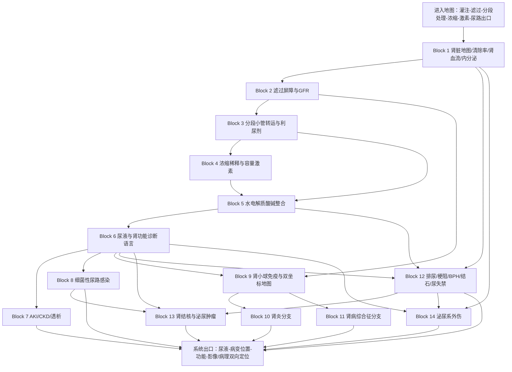

# 西综泌尿系统｜完整导学、认知依赖与学习顺序 v1
## 按《西综 System Guide 生成规则 v1》生成

> **文件层级**：System Guide  
> **用途**：回答“整个泌尿系统应该怎样学”，确定统一模型、认知依赖、Operational Blocks、跨系统路由、Memory Routing 与系统出口。  
> **不是**：第二份泌尿讲义、KP 正文、完整肾小球病理表、药物 / 阈值 / 术式汇总。  
> **权威主干**：本 Project 中的生理学、内科学、外科学 Study Lecture 与对应 Outline。  
> **生成日期**：2026-08-20  
> **状态**：Study-bound System Guide；允许后续 Block 深审和实际学习反馈修订边界。

---

# 0｜本文件如何使用

泌尿系统不能按：

```text
生理泌尿
→ 内科泌尿
→ 外科泌尿
→ 外科体液失衡
```

分别重读成四套知识。

本轮要建立的是一条统一主线：

```text
血液进入肾脏
→ 肾小球大量滤过
→ 肾小管分段选择性回收与分泌
→ 髓质系统建立浓缩能力
→ 集合管按 ADH / 醛固酮等调节终尿
→ 尿液作为诊断窗口暴露病变位置
→ 疾病可发生在灌注、滤过屏障、小管间质或尿路出口
```

实际推进：

```text
先在本 System Guide 中定位当前 Block
→ 打开对应 Block Guide / 学习阅读版
→ 按 Study 连续小板块完整学习
→ 用 KP 闭卷恢复
→ 用 Outline 验漏
→ MI-D 在 MarginNote 3 框选成卡片
→ 不让孤立数字、病理形态和术式阻塞机制主线
```

## 0.1 本文件最重要的三条边界

### 第一，肾脏不是单纯“排废物”

它采用：

> **大量滤过 → 绝大部分回收 → 少量精细调节 → 形成终尿**

所以必须先理解：

- 什么进了原尿；
- 各段小管拿回什么；
- 什么被额外分泌；
- 哪个激素在最后决定水、钠、钾和酸碱。

### 第二，医学肾脏病与泌尿外科不是一条线硬串到底

它们共享：

- 解剖位置；
- 尿液表现；
- 梗阻与肾功能；
- 血尿、感染、结石等入口。

但主体不同：

```text
肾内科
主要看灌注、滤过、小管、免疫和全身稳态

泌尿外科
主要看结石、梗阻、肿瘤、结核、外伤和尿路重建
```

System Guide 统一导航，但后续 Block Guide 保持各自疾病模型完整。

### 第三，当前资料没有独立的“肾脏病理学讲义章节”

当前上传的病理学 Lecture / Outline 没有单列泌尿系统病理章节。

原发性肾小球疾病的：

- 免疫机制；
- 光镜 LM；
- 免疫荧光 IF；
- 电镜 EM；
- 临床综合征；

已经整合在**内科学泌尿系统 P157–166**及其后病例串联中。

因此本系统暂将内科学对应范围视为：

> **肾小球疾病的临床 + 病理联合真相层**

后续不得凭一般病理知识另造一套与 Study 冲突的肾病理分类。

---

# 1｜Scope Audit

## 1.1 生理学主体

- 肾脏结构和肾单位；
- 皮质肾单位与近髓肾单位；
- 肾血流与自身调节；
- 肾清除率；
- 肾小球滤过屏障；
- GFR 与有效滤过压；
- 入球 / 出球小动脉与系膜细胞；
- 近端小管、髓袢、远曲小管和集合管的分段转运；
- 葡萄糖、Na⁺、Cl⁻、HCO₃⁻、K⁺、H⁺、NH₃ / NH₄⁺、尿素和水的处理；
- 球管平衡、管球反馈；
- RAAS、醛固酮、ADH / VP、ANP；
- 尿液浓缩与稀释；
- 尿素再循环和逆流倍增 / 交换；
- 利尿剂作用部位；
- 排尿反射；
- 肾脏内分泌功能：肾素、EPO、1α-羟化酶等。

## 1.2 内科学主体

- 泌尿系统总论；
- 蛋白尿；
- 血尿；
- 管型尿；
- 分肾功能检查；
- 尿路感染；
- 急性膀胱炎；
- 急性 / 慢性肾盂肾炎；
- 无症状性细菌尿；
- 尿道综合征；
- AKI；
- CKD；
- 透析；
- 原发性肾小球疾病；
- 急性肾炎；
- 急进性肾炎；
- 肾病综合征；
- 微小病变性肾病；
- 膜性肾病；
- 系膜增生性肾炎；
- 系膜毛细血管性肾炎；
- FSGS；
- IgA 肾病；
- 慢性肾炎及病例串联。

## 1.3 外科学主体

### 体液、电解质和酸碱

- 等渗、低渗、高渗性脱水；
- 水中毒；
- 高钾、低钾；
- 钙失衡接口；
- 外科补液；
- 肾脏在酸碱平衡中的角色。

### 泌尿外科

- 肾结核；
- 肾癌；
- 上尿路癌；
- 膀胱癌；
- 前列腺癌；
- 良性前列腺增生；
- 泌尿系结石；
- 尿道、膀胱、肾外伤；
- 尿失禁；
- 分肾功能和尿路影像；
- 尿三杯与出血位置。

## 1.4 必要跨系统桥梁

### 从循环系统 Recall

- MAP、CO 和肾灌注；
- 有效循环血量；
- 肾静脉淤血；
- RAAS；
- 心衰与心肾综合征；
- 休克与肾前性 AKI；
- ACEI / ARB 对出球小动脉和 GFR 的接口。

### 从呼吸系统 Recall

- PaCO₂；
- 呼吸性酸中毒 / 碱中毒入口；
- 肺对酸碱的快速代偿；
- 慢性呼吸病的肾性代偿。

### 从血液系统 Interface

- EPO 与肾性贫血；
- Hb 与组织氧供；
- 肾病综合征的血栓；
- 溶血与血红蛋白尿；
- 多发性骨髓瘤溢出性蛋白尿；
- 凝血异常与透析。

### 从内分泌和骨代谢 Interface

- PTH；
- VitD / 钙三醇；
- 醛固酮；
- 糖尿病；
- 原醛 / Liddle；
- CKD-MBD。

### 从免疫系统 Interface

- 免疫复合物；
- 抗 GBM；
- ANCA；
- SLE；
- 过敏性紫癜；
- 血管炎。

完整免疫病模型后置血液—免疫系统；肾脏只学习其器官表现和肾小球损伤模式。

---

# 2｜明确后置的独立模型

## 2.1 后置到内分泌系统

- PTH、钙三醇和钙磷调节的完整激素轴；
- 原发性醛固酮增多症完整筛查、确诊和定位；
- 糖尿病完整诊疗；
- DKA / HHS 完整治疗路径。

泌尿系统只保留：

```text
肾脏如何激活 VitD
→ CKD 为什么低钙、PTH 升高和发生肾性骨病

醛固酮如何影响 Na⁺ / K⁺ / H⁺
→ 原醛与 Liddle 的直接机制接口
```

## 2.2 后置到血液系统

- 贫血完整诊断树；
- 多发性骨髓瘤完整模型；
- 溶血性疾病；
- 出血性疾病。

泌尿系统只学习：

- 肾性贫血；
- 溢出性蛋白尿；
- 肾病综合征血栓；
- CKD 出血倾向接口。

## 2.3 后置到免疫系统

- SLE；
- ANCA 相关血管炎；
- 过敏性紫癜；
- 抗磷脂综合征。

泌尿系统只完成：

> 这些疾病通过何种免疫模式损伤肾小球，以及相应 LM / IF / EM 和临床综合征。

## 2.4 后置到肿瘤 Overlay

泌尿系统必须完成器官特异性肿瘤：

- 肾细胞癌；
- 上尿路尿路上皮癌；
- 膀胱癌；
- 前列腺癌。

但完整的：

- 癌基因；
- 抑癌基因；
- DNA 修复；
- 肿瘤代谢；
- 全身实体瘤共同治疗逻辑；

后置独立肿瘤 Overlay。

## 2.5 后置到完整外科总论

- 输血；
- 完整休克；
- 全身补液公式；
- 围术期管理。

本系统只接入：

- 体液分类；
- K⁺ / Ca²⁺；
- 酸碱；
- 补液与尿量；
- AKI / CKD 特异处理。

---

# 3｜主要 Study 与 Outline 绑定

| 学科 | Study Lecture 主范围 | Outline 主范围 | 本系统处置 |
|---|---|---|---|
| 生理泌尿概述 | AI 阅读版 / 原 PDF P257–266：肾单位、肾功能、清除率、肾血流、排尿反射 | 生理单元 024 | Primary |
| 生理肾小球滤过 | P267–274 | 生理单元 025 | Primary |
| 生理小管与浓缩 | P275–292 | 生理单元 026 | Primary |
| 生理利尿剂 | P293–296 | 生理单元 026 对应串联 | Primary |
| 内科总论 | P143–144 | 内科单元 060 | Primary |
| 内科尿路感染 | P145–150 | 内科单元 061–062 | Primary |
| 内科肾衰竭 | P151–156 | 内科单元 063–064 | Primary |
| 内科肾小球疾病 | P157–166；病例串联 P167–173 | 内科单元 065–070 | Primary；兼任肾病理真相层 |
| 外科泌外感染 / 肿瘤 | 外科 Lecture 书页 P104–107 | 外科单元 026 | Primary |
| 外科梗阻 / 结石 / 外伤 | 外科 Lecture 书页 P108–113 | 外科单元 027–028 | Primary |
| 外科体液失衡 | 外科 Lecture 书页 P191–195 | 外科单元 047–048 | Primary / Integration |
| 循环 System Guide | RAAS、有效循环血量、心衰、休克 | — | Recall / Apply |
| 呼吸 System Guide | PaCO₂、呼吸性酸碱与呼衰 | — | Recall / Apply |

> 后续 Block Guide 必须重新核对 Study 连续小标题。  
> System Guide 的页码用于导航，不得据此摘取半截机制。

---

# 4｜System Mission & Mental Model

## 4.1 泌尿系统真正维持什么

肾脏的最终任务不是“把尿做出来”，而是：

> **在排出代谢废物和异物的同时，精确维持细胞外液容量、渗透压、电解质、酸碱及内分泌稳态。**

一条完整电影：

```text
血液以高流量进入肾脏
→ 肾小球先大量滤出小分子
→ 肾小管分段把机体需要的物质拿回来
→ 将部分物质额外分泌进小管液
→ 髓质建立高渗环境
→ 集合管按 ADH 等决定最终保水量
→ 终尿经肾盏、肾盂、输尿管、膀胱和尿道排出
```

## 4.2 六个部件模型

### 1. 灌注器

肾血流和入、出球小动脉决定血液是否到达滤过器。

### 2. 滤过器

肾小球滤过屏障决定：

- 滤多少；
- 哪些能滤；
- 蛋白和血细胞是否漏出。

### 3. 分段处理器

近端小管、髓袢、远曲小管和集合管各处理不同物质。

### 4. 浓缩器

髓袢、尿素、髓质高渗、直小血管和 ADH 共同决定水能否被保留。

### 5. 传感与内分泌控制器

- 球旁器读取灌注和 NaCl；
- 肾素调容量与血压；
- EPO 调红细胞；
- 1α-羟化酶连接钙磷和骨代谢。

### 6. 尿路出口

肾盏—肾盂—输尿管—膀胱—尿道负责：

- 运送；
- 储存；
- 排空。

结石、肿瘤、增生、狭窄和外伤都可使出口失效。

## 4.3 尿液是一份“系统日志”

尿液不只是一种产物。

它记录了：

- 滤过屏障是否漏；
- 小管是否会回收；
- 是否有炎症 / 感染；
- 是否存在出血；
- 浓缩能力是否下降；
- 上下尿路是否梗阻或受损。

所以泌尿系统学习必须形成：

> **病变位置 ↔ 尿液证据 ↔ 肾功能 ↔ 影像 / 病理**

四向映射。

---

# 5｜Input / Output Contract

## 5.1 Input｜进入本系统前必须掌握什么

### Hard prerequisite

- 循环中的 P / Q / R / V；
- MAP 与肾灌注；
- 血容量与有效循环血量；
- 跨膜转运与钠钾泵；
- 呼吸系统的 PaCO₂ 与呼吸性酸碱入口。

### 分 Block Hard prerequisite

- Block 2：Block 1 的肾血流和肾单位；
- Block 3：跨膜转运；
- Block 4：Block 3 的小管分段；
- Block 5：Block 3–4 + 呼吸酸碱；
- Block 7：Block 1–6；
- Block 9–11：最小免疫、滤过屏障和尿检语言；
- Block 12–14：尿路解剖、排尿反射和尿液定位。

### Soft prerequisite

- 炎症；
- 免疫复合物；
- 血栓；
- 肿瘤最小语言；
- PTH / VitD；
- 糖尿病。

## 5.2 Output｜学完后向后续系统输出什么

### 向循环系统输出

- 容量调节；
- RAAS、ADH、ANP；
- 肾灌注；
- 心肾综合征；
- 高钾与心律失常；
- AKI / CKD 对血压和心衰治疗的限制。

### 向呼吸系统输出

- 肾对呼吸性酸碱失衡的代偿；
- HCO₃⁻、H⁺、NH₄⁺；
- 慢性 CO₂ 潴留为何出现肾性代偿；
- 呼吸衰竭纠正过快后的酸碱接口。

### 向血液系统输出

- EPO 与肾性贫血；
- 溢出性蛋白尿；
- 肾病综合征血栓；
- 尿毒症出血倾向。

### 向内分泌与骨科输出

- 1α-羟化酶；
- 钙三醇；
- CKD-MBD；
- 醛固酮—ENaC—K⁺ / H⁺；
- 糖尿病肾病和渗透性利尿接口。

### 向外科与急危重输出

- 尿量作为灌注监测；
- 低容量 / 肾前性 AKI；
- 梗阻解除优先级；
- 高钾和酸中毒的急救；
- 透析指征。

---

# 6｜Core Variables & Failure Modes

## 6.1 最小变量语言

```text
RBF｜肾血流量
RPF｜肾血浆流量
GFR｜肾小球滤过率
FF｜滤过分数
Kf｜滤过系数
Effective filtration pressure｜有效滤过压
Clearance｜清除率
Filtered load｜滤过负荷
Tm｜最大转运率
Renal threshold｜肾阈
Urine flow｜尿量
Urine osmolality｜尿渗透压
Free water clearance｜无溶质水清除率
Na⁺ balance｜钠平衡与 ECF
Water balance｜水平衡与渗透压
K⁺ balance｜钾平衡
HCO₃⁻ / H⁺ / NH₄⁺｜酸碱
Proteinuria｜蛋白尿
Hematuria｜血尿
Casts｜管型
Cr / BUN / eGFR｜肾功能
```

三个组织公式：

```text
清除率 C = U × V / P

滤过分数 FF = GFR / RPF

排泄量
= 滤过量 - 重吸收量 + 分泌量
```

它们不是只为计算题服务，而是在问：

- 这个物质是否被滤过？
- 小管有没有拿回来？
- 有没有额外分泌？
- 肾功能下降发生在哪一层？

## 6.2 九类 Failure Modes

### 1. 肾灌注不足

血到不了肾。

代表：

- 失血；
- 休克；
- 心衰；
- 双肾动脉狭窄。

主要走向：

> 肾前性 AKI → 持续后可转肾实质损伤。

### 2. GFR 决定因素异常

入球、出球、系膜、囊内压或滤过面积发生变化。

代表：

- 出球张力变化；
- 尿路梗阻使囊内压升高；
- 系膜收缩使 Kf 下降。

### 3. 滤过屏障破坏

蛋白或血细胞漏入尿液。

代表：

- 肾病综合征；
- 肾炎综合征；
- 各类肾小球病。

### 4. 小管转运失败

重吸收或分泌异常。

表现：

- 糖尿；
- 电解质异常；
- 酸碱异常；
- 小管性蛋白尿；
- 药物 / 毒物蓄积或丢失。

### 5. 浓缩与稀释失败

不能按水状态改变终尿。

代表：

- ADH / V2 / AQP2 异常；
- 髓质高渗梯度破坏；
- 慢性肾盂肾炎；
- CKD。

### 6. 免疫性肾小球损伤

免疫复合物、抗 GBM 或 ANCA 触发炎症。

表现可跨：

- 急性肾炎；
- 急进性肾炎；
- 肾病综合征；
- IgA 肾病；
- 慢性肾炎。

### 7. 小管—间质感染或炎症

代表：

- 膀胱炎；
- 肾盂肾炎；
- 慢性肾盂肾炎；
- 肾结核。

### 8. 尿流通路受阻

代表：

- 结石；
- BPH；
- 肿瘤；
- 狭窄；
- 神经源性膀胱。

后果：

> 上游压力升高 → 肾积水 → GFR 下降 → 肾后性 AKI。

### 9. 结构破坏、肿块或外伤

代表：

- 肾癌；
- 尿路上皮癌；
- 膀胱癌；
- 前列腺癌；
- 肾、膀胱和尿道外伤。

---

# 7｜Dependency Graph



## 7.1 这条路线为什么这样排

1. 先懂正常滤过与分段处理，再学尿检：
   - 蛋白尿、血尿、尿糖和管型必须能回到相应结构。

2. 先学小管转运，再学水电解质与酸碱：
   - 否则高钾、低钾、酸中毒和利尿剂只能背方向。

3. 先学浓缩系统，再学慢性肾盂肾炎和 CKD：
   - 夜尿、低比重尿和渗透压下降才能真正理解。

4. 尿液诊断语言是疾病分支的共同入口：
   - AKI、UTI、肾小球病和泌尿外科都需要。

5. 肾小球疾病先建双坐标，再分肾炎与肾病综合征：
   - 临床综合征不等于病理类型；
   - 同一病理类型可跨多个临床表型。

6. 排尿、BPH、结石和梗阻在同一“出口与上游压力”模型：
   - 先懂尿流，才懂肾后性 AKI。

7. 肿瘤和外伤后置：
   - 需要先会血尿定位、分肾功能和尿路解剖。

---

# 8｜Operational Block Route

# Block 1｜肾脏总地图、清除率、肾血流与内分泌

**中心问题**

> 血液如何进入肾单位；清除率怎样把“滤过、重吸收和分泌”变成可测量的肾功能；肾脏还承担哪些内分泌任务？

**为什么现在学**

这是后续 GFR、AKI、CKD、分肾功能和药物排泄的共同语言。

**前置**

- Hard：循环 P / Q / R / V。
- Soft：跨膜转运。

**Study 主范围**

- 生理 P257–266；
- Outline 单元 024；
- 排尿反射部分可在 Block 12 再做 Apply。

**必要原图**

- 肾皮质 / 髓质；
- 肾单位；
- 皮质 / 近髓肾单位；
- 入球—肾小球—出球—管周 / 直小血管；
- 球旁器；
- 清除率示意；
- 排尿反射。

**动作配置**

- Learn：尿生成三过程；肾单位；肾血流；清除率；RPF / RBF / GFR / FF；肾素、EPO、1α-羟化酶；自身调节。
- Recall：MAP、血容量、RAAS。
- Apply：肾性贫血、CKD-MBD、分肾功能、肾前性 AKI。
- Defer：完整排尿障碍到 Block 12；完整内分泌疾病后置。

**知识形态**

- Mechanism Spine：血流 → 滤过 → 小管处理 → 终尿；清除率定位处理方式。
- Discrimination Tree：滤过 / 清除；RBF / RPF；皮质 / 近髓肾单位。
- MI-G：菊粉、肌酐、PAH 分别代表什么；清除率与 GFR 的关系。
- MI-D：全部数值、计算题变式和低频内分泌特殊。

**客观负荷画像**

- 首轮主线负荷：重
- Memory Island：中高
- 视觉负担：高
- 跨科整合：高

**出口问题**

1. 滤过、重吸收、分泌和排泄有何方向区别？
2. 为什么菊粉清除率可代表 GFR，而 PAH 可近似代表有效肾血浆流量？
3. 皮质和近髓肾单位分别更适合滤过还是浓缩？
4. 肾衰为什么同时引起贫血和低钙 / 骨病？
5. 肾灌注下降时，自身调节、交感和 RAAS 如何接力？

**进入下一 Block 的最低标准**

能用肾单位和清除率解释“一个物质最终为何出现在尿中”。

---

# Block 2｜肾小球滤过屏障与 GFR：滤多少、漏什么、为什么变

**中心问题**

> 哪些结构决定大分子和带电蛋白能否滤过；哪些压力、血管和面积因素决定 GFR？

**前置**

- Hard：Block 1。

**Study 主范围**

- 生理 P267–274；
- Outline 单元 025。

**必要原图**

- 三层滤过屏障；
- 足细胞 / 裂孔；
- 有效滤过压；
- 滤过平衡点；
- 入 / 出球小动脉改变；
- Kf 与系膜细胞；
- 尿路梗阻提高囊内压。

**动作配置**

- Learn：机械 / 电荷屏障；GFR；有效滤过压；Kf；入、出球张力；滤过分数。
- Recall：肾血流、白蛋白、RAAS。
- Apply：蛋白尿、血尿、ACEI / ARB、NSAID、肾动脉狭窄、梗阻。
- Defer：完整肾小球疾病到 Block 9–11。

**知识形态**

- Mechanism Spine：滤过屏障 + 有效滤过压 + Kf → GFR 与滤过内容。
- Discrimination Tree：滤过量下降 vs 屏障漏出；机械屏障 vs 电荷屏障。
- MI-G：入 / 出球变化对 RBF、GFR 和 FF 的方向。
- MI-D：正常压力值、滤过平衡点数值和低频特殊。

**客观负荷画像**

- 首轮主线负荷：很重
- Memory Island：中
- 视觉负担：很高
- 跨科整合：高

**出口问题**

1. 大量蛋白尿是“滤过更多原尿”还是“屏障选择性丢失”？
2. 白蛋白为何同时受机械与电荷屏障限制？
3. 入球收缩、出球适度收缩和出球舒张分别怎样改变 GFR？
4. 尿路梗阻为何可使 GFR 下降？
5. 双肾动脉狭窄为什么依赖 AngⅡ 维持滤过？

---

# Block 3｜分段小管转运与利尿剂：每一段到底拿回什么

**中心问题**

> 近端小管、髓袢、远曲小管和集合管如何分工；利尿剂与小管病变怎样改变水、钠、钾和酸碱？

**前置**

- Hard：跨膜转运；
- Hard：Block 2。

**Study 主范围**

- 生理 P275–280 中小管转运主体；
- 生理 P293–296 利尿剂；
- Outline 单元 026。

**必要原图**

- 小管分段；
- 顶端 / 基底侧膜；
- SGLT；
- Na⁺-H⁺ / Na⁺-NH₄⁺；
- NKCC2；
- NCC；
- ENaC；
- ROMK；
- 主细胞 / 闰细胞；
- 利尿剂作用部位。

**动作配置**

- Learn：
  - 近端小管等渗重吸收；
  - 葡萄糖 / 氨基酸；
  - HCO₃⁻、H⁺、NH₃ / NH₄⁺；
  - 髓袢各段；
  - 远曲小管；
  - 集合管主 / 闰细胞；
  - K⁺ 与 H⁺；
  - 利尿剂。
- Recall：清除率、跨膜转运。
- Apply：尿糖、渗透性利尿、低钾 / 高钾、RTA、心衰和水肿。
- Defer：完整电解质疾病到 Block 5。

**知识形态**

- Mechanism Spine：滤过液沿小管行进 → 各段选择性处理 → 终尿成分。
- Discrimination Tree：近端 / 髓袢 / 远曲 / 集合管；排钾 / 保钾利尿剂。
- MI-G：各转运体位置；主细胞和闰细胞的 K⁺ / H⁺ 方向。
- MI-D：各段百分比、全部药物名称和不良反应。

**客观负荷画像**

- 首轮主线负荷：很重
- Memory Island：很高
- 视觉负担：很高
- 跨科整合：很高

**出口问题**

1. 近端小管为什么称为多数物质重吸收的主要部位？
2. 葡萄糖尿可由“滤过太多”和“重吸收太差”哪两条路径产生？
3. 髓袢升支粗段为何既能利尿，又容易影响 K⁺ / Ca²⁺？
4. 集合管重吸收 Na⁺ 为什么会促进 K⁺ 分泌？
5. 高钾与酸中毒、低钾与碱中毒为什么常并行？
6. 利尿剂的作用和不良反应怎样从作用部位推出来？

> **执行层边界**：后续 Block Guide 很可能拆成“近端小管”“髓袢与远曲”“集合管 / 利尿剂”三个连续单元；拆分时不得让同一转运体多次初见。

---

# Block 4｜尿液浓缩、稀释与容量激素

**中心问题**

> 肾髓质如何建立并维持高渗梯度；ADH、RAAS、醛固酮和 ANP 怎样决定终尿量与体液容量？

**前置**

- Hard：Block 3；
- Recall：循环调节。

**Study 主范围**

- 生理 P280–292；
- Outline 单元 026；
- 循环 Block 2：Recall。

**必要原图**

- 髓袢逆流倍增；
- 直小血管逆流交换；
- 尿素再循环；
- AQP1 / AQP2；
- ADH-V2-cAMP-PKA；
- RAAS；
- 醛固酮—ENaC；
- ANP；
- 小管液渗透压变化。

**动作配置**

- Learn：髓质高渗；NaCl / 尿素；U 型直小血管；ADH；AQP2；尿浓缩 / 稀释；RAAS；醛固酮；ANP。
- Recall：小管分段、血容量、渗透压。
- Apply：尿崩、SIADH、心衰、肝硬化、失血、水利尿和渗透性利尿。
- Defer：完整内分泌疾病和低钠治疗细则。

**知识形态**

- Mechanism Spine：建立梯度 → 维持梯度 → 提供通透性 → 调终尿。
- Discrimination Tree：水利尿 / 渗透性利尿；ADH / 醛固酮；尿崩 / SIADH。
- MI-G：ADH 主要调水和渗透压；醛固酮主要经 Na⁺ 影响容量与 K⁺。
- MI-D：UT / AQP 全部亚型、激素特殊和药物表。

**客观负荷画像**

- 首轮主线负荷：很重
- Memory Island：高
- 视觉负担：很高
- 跨科整合：很高

**出口问题**

1. 肾髓质高渗由什么建立、由什么维持？
2. ADH 增多为何只有在髓质高渗仍存在时才能有效浓缩尿？
3. 进入集合管的小管液为什么通常是低渗的？
4. ADH 与醛固酮都可减少尿量，但直接被调变量有何不同？
5. 水利尿与渗透性利尿分别为何尿量增加？
6. 慢性肾病为何常先出现夜尿和低比重尿？

---

# Block 5｜水、钠、钾、钙与酸碱整合

**中心问题**

> 肾脏如何把“容量、渗透压、电解质和酸碱”整合为一套临床判断；异常时应该先判断总量、分布，还是跨细胞移动？

**前置**

- Hard：Block 3–4；
- Hard：呼吸系统 PaCO₂；
- Recall：循环容量和休克。

**Study 主范围**

- 外科 Lecture 书页 P191–195；
- 外科 Outline 047–048；
- 生理小管与酸排泄：Recall；
- AKI / CKD 电解质段：后续 Apply。

**动作配置**

- Learn：
  - 等渗 / 低渗 / 高渗性脱水；
  - 水中毒；
  - 高钾 / 低钾；
  - Ca²⁺ 临床接口；
  - 缓冲、肺、肾和细胞共同维持酸碱；
  - 肾排酸保碱；
  - K⁺ / H⁺ 相互作用；
  - 补液与补钾基本门槛。
- Recall：ADH、醛固酮、HCO₃⁻、H⁺、NH₄⁺、PaCO₂。
- Apply：呕吐、腹泻、DKA / HHS、肾衰、利尿剂、库存血。
- Defer：DKA / HHS 和内分泌疾病完整方案。

**知识形态**

- Mechanism Spine：
  - 水：看渗透压；
  - Na⁺：看 ECF 与容量；
  - K⁺：看摄入、排出和跨细胞分布；
  - 酸碱：看原发变量与肺 / 肾代偿。
- Discrimination Tree：三类脱水；水中毒；高 / 低钾；四类原发酸碱入口。
- MI-G：危及心脏的高钾；见尿补钾；严重酸中毒 / 容量不稳的处理门槛。
- MI-D：全部正常值、补液公式、补钾速度、钙阈值和代偿数字。

**客观负荷画像**

- 首轮主线负荷：很重
- Memory Island：很高
- 视觉负担：中
- 跨科整合：很高

**出口问题**

1. 血钠异常首先代表体钠异常，还是水相对变化？
2. 三类脱水怎样从“丢水与丢钠比例”推出细胞内外液变化？
3. 高钾急救为什么要分抗 K、转 K、排 K 和稀 K？
4. 肾脏如何重吸收 HCO₃⁻、分泌 H⁺ 和 NH₄⁺？
5. 为什么代谢性酸中毒常伴高钾，而低钾又可导致反常性酸性尿？
6. 呼吸与肾脏的代偿为何时间尺度不同？

**来源边界**

当前资料能支持：

- 肾脏酸排泄机制；
- 呼吸 / 肾对酸碱的分工；
- 常见临床方向和特殊。

但“完整四型酸碱代偿公式 + 混合型算法”没有集中在一份当前 Study 中。后续 Block Guide 必须跨生理、呼吸、外科和内科做 source audit；若资料不足，应显式标记来源缺口，不得用模型常识静默补全。

---

# Block 6｜尿液与肾功能诊断语言：先定位，再命名疾病

**中心问题**

> 蛋白、红细胞、白细胞、管型、尿量和影像各自说明病变在哪里？

**前置**

- Hard：Block 1–5。

**Study 主范围**

- 内科 P143–144；
- 外科 P106 尿三杯和分肾功能接口；
- Outline：内科 060；外科 026 对应检查。

**必要原图 / 表格**

- 蛋白尿分类；
- 变形红细胞；
- 管型；
- 尿三杯；
- 肾功能 / 分肾功能检查；
- 尿量和渗透压；
- B 超、CTU、IVU / IVP、肾图。

**动作配置**

- Learn：
  - 肾小球性、小管性、溢出性、分泌性 / 组织性蛋白尿；
  - 肾小球源性 vs 非肾小球源性血尿；
  - 管型；
  - 脓尿；
  - 少尿 / 无尿 / 多尿 / 夜尿；
  - 分肾功能；
  - 上下尿路定位。
- Recall：滤过屏障、小管重吸收、浓缩。
- Apply：UTI、肾小球病、结石、肿瘤、外伤、AKI。
- Defer：具体疾病的金标准到各自 Block。

**知识形态**

- Mechanism Spine：尿液成分 → 对应结构 → 候选疾病。
- Discrimination Tree：肾小球 / 小管 / 间质 / 下尿路；全程 / 初始 / 终末血尿。
- MI-G：变形 RBC、RBC / WBC / 蜡样 / 上皮 / 脂肪管型的定位意义。
- MI-D：所有定量阈值、检查适应证和影像细节。

**客观负荷画像**

- 首轮主线负荷：重
- Memory Island：很高
- 视觉负担：高
- 跨科整合：很高

**出口问题**

1. 大量蛋白尿、低分子蛋白尿和本周蛋白尿分别提示哪一层？
2. 血尿怎样判断肾小球源性？
3. 管型为什么能比“有无血尿 / 脓尿”更准确定位肾实质？
4. 全程、初始和终末血尿分别更支持什么位置？
5. 哪些检查能看双肾总体功能，哪些能看分肾功能？

---

# Block 7｜AKI、CKD 与透析：功能失败的时间轴

**中心问题**

> 肾功能突然下降和长期下降如何区分；肾前、肾性、肾后分别首先坏在哪一层；什么时候必须透析？

**前置**

- Hard：Block 1–6；
- Interface：Block 12 的梗阻模型。

**Study 主范围**

- 内科 P151–156；
- Outline 单元 063–064。

**必要原图 / 表格**

- 肾前 / 肾性 / 肾后；
- 肾前性与 ATN 指标；
- AKI 分期；
- 少尿 / 多尿阶段；
- CKD 分期；
- 急慢性肾损伤鉴别；
- CKD 并发症；
- 透析指征。

**动作配置**

- Learn：
  - AKI 三大机制；
  - 肾前 vs ATN；
  - 少尿 / 多尿阶段；
  - 水电酸碱；
  - CKD 分期；
  - 尿毒症；
  - 贫血；
  - CKD-MBD；
  - 高血压 / 蛋白尿；
  - 透析。
- Recall：GFR、尿检、浓缩、电解质。
- Apply：休克、药物、感染、肾小球病、梗阻。
- Defer：完整血液、骨代谢和营养方案。

**知识形态**

- Mechanism Spine：灌注 / 实质 / 出口失败 → GFR↓ → 体液、毒素和内分泌后果。
- Discrimination Tree：肾前 / 肾性 / 肾后；AKI / CKD；少尿 / 多尿。
- MI-G：危及生命的高钾、酸中毒、肺水肿和透析门槛。
- MI-D：分期数值、全部毒素、药物、营养和透析并发症。

**客观负荷画像**

- 首轮主线负荷：很重
- Memory Island：很高
- 视觉负担：中高
- 跨科整合：很高

**出口问题**

1. 肾前性 AKI 为什么保钠保水，而 ATN 做不到？
2. 肾后性 AKI 为什么必须先解除梗阻？
3. AKI 少尿期和多尿期的危险为什么不同？
4. CKD 为什么同时出现贫血、低钙 / 高磷、酸中毒和高钾？
5. 哪些情况不应继续等待保守治疗而必须透析？
6. 如何从肾脏大小、病史和并发症判断急慢性？

---

# Block 8｜细菌性尿路感染：感染在膀胱还是已到肾实质

**中心问题**

> 上行感染如何从尿道 / 膀胱到达肾盂肾间质；怎样区分膀胱炎、肾盂肾炎、复杂性尿感和无症状细菌尿？

**前置**

- Hard：Block 6；
- Soft：炎症和抗菌药基本原则。

**Study 主范围**

- 内科 P145–150；
- Outline 单元 061–062。

**动作配置**

- Learn：
  - 感染途径；
  - 病原；
  - 复杂性尿感；
  - 无症状细菌尿；
  - 膀胱炎；
  - 急性 / 慢性肾盂肾炎；
  - 培养；
  - 复发 / 再感染；
  - 治疗原则。
- Recall：脓尿、WBC 管型、浓缩功能。
- Apply：结石、梗阻、妊娠、导尿、脓毒症。
- Defer：肾结核到 Block 13。

**知识形态**

- Mechanism Spine：上行感染 → 下尿路 → 肾盂 / 间质 → 瘢痕 / 浓缩功能下降。
- Discrimination Tree：膀胱炎 / 肾盂肾炎；急性 / 慢性；复发 / 再感染；尿感 / 尿道综合征。
- MI-G：真性细菌尿、培养、复杂感染和尿源性脓毒症风险。
- MI-D：病原—药物、疗程和特殊人群表。

**客观负荷画像**

- 首轮主线负荷：重
- Memory Island：很高
- 视觉负担：中
- 跨科整合：高

**出口问题**

1. WBC 管型为什么支持肾实质受累，而不只是膀胱炎？
2. 急性膀胱炎与急性肾盂肾炎怎样用全身症状和肾区体征区分？
3. 慢性肾盂肾炎为什么先损害浓缩功能？
4. 为什么结石、梗阻和导尿使尿感复杂化？
5. 无症状细菌尿为什么不是所有人都治疗？

---

# Block 9｜肾小球免疫机制与“双坐标”地图

**中心问题**

> 肾小球病为什么不能只按“肾炎 / 肾病”背；如何同时使用临床综合征和 LM / IF / EM 病理类型？

**前置**

- Hard：Block 2、6；
- Soft：最小免疫机制。

**Study 主范围**

- 内科 P157–160 前半；
- Outline 单元 065–066 的概述和临床分型。

**必要原图**

- GBM、上皮下、内皮下、系膜；
- 原位 / 循环免疫复合物；
- LM / IF / EM；
- 肾炎 / 肾病综合征；
- 新月体。

**动作配置**

- Learn：
  - 原发 / 继发；
  - 细胞免疫 / 体液免疫；
  - 原位 / 循环免疫复合物；
  - 抗 GBM；
  - ANCA；
  - 沉积位置；
  - 五类临床综合征；
  - LM / IF / EM 语言。
- Recall：滤过屏障、蛋白尿、血尿。
- Apply：后续所有肾小球疾病。
- Defer：具体疾病治疗到 Block 10–11。

**知识形态**

- Mechanism Spine：免疫模式 + 沉积位置 → 细胞 / 基膜损伤 → 尿液与肾功能。
- Discrimination Tree：临床综合征 vs 病理类型；LM / IF / EM。
- MI-G：肾炎与肾病综合征的必备特征；线状 / 颗粒 / 无荧光大边界。
- MI-D：所有沉积组合和特殊名称。

**客观负荷画像**

- 首轮主线负荷：很重
- Memory Island：很高
- 视觉负担：很高
- 跨科整合：很高

**出口问题**

1. 为什么“肾病综合征”不是一种单一病理类型？
2. 同一病理类型为什么可能跨不同临床表型？
3. 原位与循环免疫复合物的本质差别是什么？
4. 沉积在上皮下、内皮下和系膜为何表现不同？
5. LM、IF、EM 分别回答什么？

---

# Block 10｜肾炎分支：急性、急进性、IgA 与慢性肾炎

**中心问题**

> 当炎症和基底膜损伤以血尿、少尿、高血压和肾功能恶化为主时，怎样区分急性、自限、快速进展和慢性过程？

**前置**

- Hard：Block 9。

**Study 主范围**

- 内科 P160–162：急性 / 急进性肾炎；
- P165–167：IgA / 慢性肾炎；
- P167–173 病例串联；
- Outline 单元 066–070 对应范围。

**必要原图**

- 毛细血管内增生；
- 驼峰；
- 新月体；
- 线状 / 颗粒 / 无荧光；
- IgA 系膜沉积；
- 颗粒性固缩肾。

**动作配置**

- Learn：急性肾炎；RPGN I / II / III；IgA；慢性肾炎；治疗目标。
- Recall：临床综合征、免疫模式。
- Apply：Goodpasture、SLE、紫癜、ANCA 血管炎。
- Defer：完整系统性免疫病后置。

**知识形态**

- Mechanism Spine：炎症 / GBM 破坏 → 血尿、GFR↓、水钠潴留 → 高血压 / 肾衰。
- Discrimination Tree：急性 / 急进 / IgA / 慢性；1–3 周 vs 1–3 天；RPGN 三型。
- MI-G：快速肾功能恶化、新月体和强化治疗边界。
- MI-D：全部 IF / EM 细节、抗体、补体和治疗方案。

**客观负荷画像**

- 首轮主线负荷：很重
- Memory Island：很高
- 视觉负担：很高
- 跨科整合：很高

**出口问题**

1. 急性肾炎综合征的必备表现是什么？
2. 急性肾炎与 IgA 肾病为什么用前驱感染时间区分？
3. RPGN 三型如何用抗体、荧光和电子致密物区分？
4. 为什么新月体提示快速进展，而不是单纯疾病名称？
5. 慢性肾炎治疗为何重在延缓恶化，而非“消灭所有尿异常”？

---

# Block 11｜肾病综合征分支：大量蛋白漏出后的全身后果

**中心问题**

> 滤过屏障大量漏蛋白后，为什么出现低白蛋白、水肿、高脂血症、血栓和感染；不同病理类型怎样双向识别？

**前置**

- Hard：Block 9；
- Recall：Block 4 容量、Block 6 蛋白尿。

**Study 主范围**

- 内科 P159 肾病综合征；
- P163–165 各病理类型；
- P167–173 病例串联；
- Outline 单元 065–070 对应范围。

**必要原图**

- 足突融合；
- 膜性病变和钉突；
- 系膜增生；
- 双轨征；
- FSGS；
- LM / IF / EM 总表。

**动作配置**

- Learn：
  - 肾病综合征四联；
  - 水肿；
  - 高脂血症；
  - 血栓；
  - 感染；
  - AKI；
  - MCD；
  - 膜性；
  - 系膜增生；
  - MPGN；
  - FSGS；
  - 激素 / 免疫抑制大边界。
- Recall：滤过屏障、RAAS、肾静脉血栓。
- Apply：肿瘤、乙肝、SLE、紫癜等继发病因接口。
- Defer：系统性疾病完整模型和全部处方。

**知识形态**

- Mechanism Spine：蛋白漏出 → 低白蛋白 / 有效容量变化 → 水肿、脂代谢、血栓和感染。
- Discrimination Tree：MCD / MN / MsPGN / MPGN / FSGS；原发 / 继发。
- MI-G：大量蛋白尿 + 低蛋白血症；血栓风险；是否需肾活检与免疫治疗。
- MI-D：年龄、好发、荧光、电子致密物、激素方案和抗凝阈值。

**客观负荷画像**

- 首轮主线负荷：很重
- Memory Island：很高
- 视觉负担：很高
- 跨科整合：很高

**出口问题**

1. 肾病综合征与急性肾炎水肿的主机制为何不同？
2. 为什么膜性肾病特别容易发生肾静脉血栓？
3. MCD 光镜近正常，为什么仍有大量蛋白尿？
4. 临床肾病综合征如何反推可能的 LM / IF / EM？
5. 病理类型如何决定激素敏感性的大方向？
6. 为什么“有血尿”不一定排除肾病综合征？

---

# Block 12｜排尿、BPH、结石、梗阻与尿失禁

**中心问题**

> 尿液从肾到尿道的通路在哪一层受阻；上游压力、膀胱功能和括约肌控制怎样决定症状与肾功能？

**前置**

- Hard：Block 1 排尿反射；
- Hard：Block 6；
- Recall：Block 7 肾后性 AKI。

**Study 主范围**

- 生理 P263–264 排尿反射；
- 外科 P108–109 结石 / BPH；
- P112 尿失禁；
- Outline 单元 027–028 对应部分。

**必要原图**

- 尿路解剖；
- 前列腺移行带 / 外周带；
- 结石位置；
- 肾积水；
- 排尿反射；
- 膀胱逼尿肌 / 内外括约肌；
- 尿失禁分类。

**动作配置**

- Learn：
  - 排尿反射；
  - BPH；
  - 急性 / 慢性尿潴留；
  - 结石；
  - 梗阻；
  - 肾积水；
  - 尿失禁。
- Recall：GFR、囊内压、感染、肾后性 AKI。
- Apply：膀胱结石、尿路感染、前列腺癌、神经源性膀胱。
- Defer：具体碎石术式和全部尺寸阈值进入 MI-D。

**知识形态**

- Mechanism Spine：出口阻力↑ / 逼尿肌异常 → 残余尿 / 上游压力 → 感染、结石、肾衰。
- Discrimination Tree：BPH / 前列腺癌；肾 / 输尿管 / 膀胱结石；四类尿失禁。
- MI-G：完全梗阻、感染合并梗阻、肾功能受损时的优先减压。
- MI-D：结石成分、影像、尺寸—术式矩阵和前列腺手术细节。

**客观负荷画像**

- 首轮主线负荷：重
- Memory Island：很高
- 视觉负担：很高
- 跨科整合：高

**出口问题**

1. BPH 为什么先尿频，后出现充溢性尿失禁？
2. 梗阻如何通过囊内压使 GFR 下降？
3. 输尿管结石为何呈阵发性绞痛？
4. 结石、感染和梗阻为什么互相促进？
5. 持续性、充溢性、急迫性和压力性尿失禁分别是哪一层控制失败？
6. 双侧梗阻或孤立肾梗阻为何先处理引流而非先处理结石本身？

---

# Block 13｜肾结核与泌尿系统肿瘤：持续血尿到底来自慢性破坏还是肿块

**中心问题**

> 慢性膀胱刺激症、无痛全程血尿、肾区肿块和排尿异常，怎样按器官位置区分结核与肿瘤？

**前置**

- Hard：Block 6、8、12；
- Soft：最小肿瘤语言。

**Study 主范围**

- 外科 P104–107；
- Outline 单元 026。

**必要原图**

- 肾结核虫蚀样空洞、肾盏肾盂变形、肾自截；
- 肾癌 / 上尿路癌 / 膀胱癌 / 前列腺癌位置；
- 血尿和血块形态；
- CTU / IVU / 膀胱镜；
- 前列腺带区；
- 肿瘤分期与切除范围。

**动作配置**

- Learn：
  - 肾结核；
  - 肾癌；
  - 上尿路癌；
  - 膀胱癌；
  - 前列腺癌；
  - 检查层级；
  - 器官特异治疗大边界。
- Recall：TB、血尿定位、分肾功能、梗阻。
- Apply：癌栓、骨转移、膀胱刺激征、肾积水。
- Defer：完整分子肿瘤学、全部 TNM 和药物。

**知识形态**

- Mechanism Spine：
  - 结核：血源播散 → 慢性破坏 / 瘢痕 / 狭窄；
  - 肿瘤：器官来源 → 出血 / 梗阻 / 转移 → 分期治疗。
- Discrimination Tree：肾结核 / 慢性肾盂肾炎；肾癌 / 上尿路癌 / 膀胱癌 / 前列腺癌。
- MI-G：无痛全程肉眼血尿；器官定位；金标准和可切除性大边界。
- MI-D：全部病理类型、TNM、术式、标志物和药物。

**客观负荷画像**

- 首轮主线负荷：重
- Memory Island：很高
- 视觉负担：很高
- 跨科整合：高

**出口问题**

1. 肾结核为什么“病变在肾，表现却常在膀胱”？
2. 肾结核与慢性肾盂肾炎怎样从病史、症状演变和抗菌反应区分？
3. 无痛全程肉眼血尿为什么首先警惕泌尿系统肿瘤？
4. 肾癌、上尿路癌、膀胱癌和前列腺癌怎样按组织来源和位置区分？
5. 直肠指检、CTU、膀胱镜和活检分别解决什么问题？

> **执行层边界**：后续 Block Guide 应将“肾结核”和“泌尿肿瘤”拆为两个连续学习单元；System 层只共用血尿 / 影像 / 器官定位入口。

---

# Block 14｜泌尿系外伤：出血、尿外渗与休克怎样定位

**中心问题**

> 肾、膀胱、前尿道和后尿道受伤后，血和尿向哪里走；什么情况先抗休克、造影、引流或探查？

**前置**

- Hard：Block 1、6、12；
- Recall：循环休克。

**Study 主范围**

- 外科 P110–113；
- Outline 单元 027–028 外伤部分。

**必要原图**

- 前 / 后尿道；
- 尿生殖膈；
- 骨盆骨折；
- 腹膜内 / 外膀胱破裂；
- 肾挫伤 / 裂伤 / 肾蒂伤；
- 尿外渗范围；
- 逆行尿道造影。

**动作配置**

- Learn：
  - 尿道外伤；
  - 膀胱破裂；
  - 肾外伤；
  - 血尿与损伤严重度；
  - 检查与紧急处理。
- Recall：血尿、解剖、休克。
- Apply：骨盆骨折、会阴骑跨伤、腹膜刺激征。
- Defer：全部手术重建细则。

**知识形态**

- Mechanism Spine：损伤位置 → 出血 / 尿外渗空间 → 症状 → 检查 → 紧急处理。
- Discrimination Tree：前 / 后尿道；腹膜内 / 外膀胱；肾挫伤 / 裂伤 / 肾蒂伤。
- MI-G：尿道滴血后不能盲目导尿；大出血 / 休克的优先处理。
- MI-D：全部外渗范围、切口和术式细节。

**客观负荷画像**

- 首轮主线负荷：中重
- Memory Island：高
- 视觉负担：很高
- 跨科整合：高

**出口问题**

1. 会阴骑跨伤和骨盆骨折分别更易损伤哪段尿道？
2. 为什么尿道损伤首先考虑逆行尿道造影？
3. 腹膜内与腹膜外膀胱破裂的尿外渗和腹膜征有何不同？
4. 肾外伤血尿程度为何不一定与损伤严重度平行？
5. 肾蒂损伤为什么可迅速休克却不一定出现大量血尿？

---

# 9｜Overlay & Cross-System Routing

| 内容 | 动作 | 在泌尿中的用途 | 完整主体 |
|---|---|---|---|
| P / Q / R / V 与有效循环血量 | Recall | 肾灌注、肾前 AKI、RAAS | 循环 |
| RAAS / ADH / ANP | Recall + 深化 | Block 4、CKD / 心肾 | 循环首次；泌尿完成肾端 |
| PaCO₂ / 呼吸性酸碱 | Recall / Apply | Block 5 | 呼吸 |
| 水、Na⁺、K⁺、酸碱 | Learn | Block 5 | 泌尿系统 Primary |
| 跨膜转运 | Recall | Block 3 | 细胞基本功能 |
| 炎症 | Apply | UTI、肾盂肾炎、结核 | 病理炎症 |
| 免疫复合物 / 抗 GBM / ANCA | Learn / Interface | Block 9–11 | 肾小球病；系统免疫后续 |
| 血栓 | Recall / Apply | 肾病综合征肾静脉血栓 | 循环 / 血液 |
| EPO 与贫血 | Learn / Interface | CKD | 泌尿首次；血液 Recall |
| VitD / PTH | Learn / Interface | CKD-MBD | 泌尿肾端；内分泌完整 |
| 糖尿病 | Apply / Defer | 尿糖、超滤过、肾病 | 内分泌 |
| 肿瘤总论 | Interface / Deferred | 泌尿肿瘤 | 后续肿瘤 Overlay |
| 休克 | Recall / Apply | 肾前 AKI、外伤 | 循环 / 外科 |
| 补液 | Learn / Interface | Block 5、AKI | 外科总论与泌尿交界 |

---

# 10｜Knowledge Form & Memory Routing

## 10.1 Mechanism Spine｜第一轮必须真正掌握

```text
肾灌注
→ 肾小球滤过
→ 分段小管处理
→ 髓质浓缩系统
→ 激素调终尿
→ 尿液暴露病变位置
→ 功能衰竭 / 感染 / 免疫 / 梗阻 / 肿瘤 / 外伤
```

第一轮要求：

> 能解释、能画肾单位、能闭卷重建、能从尿液和肾功能反推病变。

## 10.2 Discrimination Trees｜模型建立后再比较

- 肾前 / 肾性 / 肾后；
- AKI / CKD；
- 肾小球性 / 小管性 / 溢出性蛋白尿；
- 肾小球源性 / 非肾小球源性血尿；
- 膀胱炎 / 肾盂肾炎 / 肾结核；
- 肾炎综合征 / 肾病综合征；
- 急性 / 急进 / IgA / 慢性肾炎；
- MCD / MN / MsPGN / MPGN / FSGS；
- BPH / 前列腺癌；
- 肾 / 输尿管 / 膀胱结石；
- 四类尿失禁；
- 肾癌 / 上尿路癌 / 膀胱癌 / 前列腺癌；
- 前 / 后尿道外伤；
- 腹膜内 / 外膀胱破裂。

## 10.3 MI-G｜第一轮不能后置

典型包括：

- 入 / 出球变化与 GFR；
- 各小管段主要转运体；
- ADH / 醛固酮直接被调变量；
- 危险高钾；
- 见尿补钾；
- 少尿 / 无尿；
- 透析基本门槛；
- 肾炎 / 肾病综合征必备特征；
- RPGN 快速进展；
- 感染合并梗阻；
- 无痛全程肉眼血尿；
- 尿道损伤后检查优先级。

## 10.4 MI-D｜进入 MarginNote 3 的延迟记忆流

- 清除率全部数值和计算变式；
- 小管各段重吸收百分比；
- 全部利尿剂及不良反应；
- AQP / UT 亚型；
- 水电解质全部阈值和补液公式；
- AKI / CKD 分期；
- 透析数值；
- 尿感病原—药物—疗程；
- 肾小球病全部 LM / IF / EM 细节；
- 激素和免疫抑制方案；
- 结石成分、尺寸—术式；
- 肿瘤 TNM、标志物、术式；
- 外伤外渗范围和切口。

处理：

```text
知道它属于哪个模型
→ 阅读一次
→ MarginNote 框选
→ 进入卡片
→ 后续间隔重复
→ 当前不因记不牢阻塞主线
```

---

# 11｜原图门禁

以下内容必须回 Study 原图或高密度表格：

1. 肾单位和球旁器；
2. 皮质 / 近髓肾单位；
3. 肾血流与清除率；
4. 三层滤过屏障；
5. 有效滤过压；
6. 入 / 出球小动脉；
7. 小管各段转运体；
8. 主细胞 / 闰细胞；
9. 利尿剂作用部位；
10. RAAS / ADH / ANP；
11. 髓袢逆流倍增；
12. 直小血管逆流交换；
13. 尿素再循环；
14. 小管液渗透压变化；
15. 蛋白尿、血尿和管型；
16. AKI / CKD 诊断表；
17. 肾炎 / 肾病综合征；
18. 肾小球沉积位置；
19. LM / IF / EM；
20. 新月体、驼峰、钉突、双轨、足突融合、FSGS；
21. 尿路解剖和结石位置；
22. 前列腺带区；
23. 肾结核、肾自截；
24. 泌尿肿瘤器官定位；
25. 前 / 后尿道；
26. 腹膜内 / 外膀胱破裂；
27. 肾外伤分型。

---

# 12｜System Integration & Exit

## 12.1 正向推导

面对任一疾病：

```text
先定位：
灌注 / 滤过屏障 / 小管 / 间质 / 浓缩系统 / 尿路出口
        ↓
哪个变量先变？
GFR / 蛋白 / 血尿 / 尿量 / 渗透压 / Na⁺ / K⁺ / H⁺
        ↓
尿液、血液和影像出现什么证据？
        ↓
是急性、慢性、免疫、感染、梗阻、肿瘤还是外伤？
        ↓
治疗要恢复灌注、抑制免疫、清除感染、纠正稳态、解除梗阻、切除肿瘤还是修复损伤？
```

## 12.2 反向定位

面对病例，依次问：

1. 尿量是少、多，还是夜尿增多？
2. 蛋白尿、血尿、脓尿还是管型最突出？
3. 血尿是否肾小球源性？
4. Cr / eGFR 是突然还是长期异常？
5. 是否有水肿、高血压、电解质和酸碱异常？
6. 是否有尿路刺激征、绞痛、排尿困难或无痛血尿？
7. 是否存在感染、免疫、梗阻、肿块或外伤线索？
8. 下一步需要补液、停药、活检、培养、解除梗阻、透析、内镜还是手术？

## 12.3 最终七张纸

不看文件完成：

1. **肾单位—肾血流—清除率—GFR**
2. **滤过屏障 + 入 / 出球 + 有效滤过压**
3. **小管分段转运 + 利尿剂**
4. **RAAS / ADH / ANP + 浓缩 / 稀释**
5. **水钠钾酸碱总图**
6. **蛋白尿—血尿—管型—AKI / CKD—肾小球病双坐标**
7. **感染—梗阻—结石—BPH—肿瘤—外伤尿路地图**

## 12.4 代表性反向病例入口

- 大失血后少尿，尿钠低、尿渗高；
- 使用肾毒性药物后少尿和颗粒管型；
- 老年男性进行性排尿困难后 Cr 升高；
- 感染后 1–3 周出现血尿、水肿、高血压；
- 上呼吸道感染后 1–3 天肉眼血尿；
- 大量蛋白尿、低白蛋白和肾静脉血栓；
- 发热、腰痛、WBC 管型；
- 夜尿增多、低比重尿、双肾不对称；
- 血钾升高伴 ECG 改变；
- 慢性肾病伴贫血、低钙、高磷和骨痛；
- 肾绞痛伴血尿；
- 无痛全程肉眼血尿；
- 骨盆骨折后尿道滴血；
- 腹部外伤后休克但血尿不明显。

---

# 13｜Coverage Ledger

| 范围 | 处置 | Primary / 完整位置 |
|---|---|---|
| 肾单位、清除率、肾血流、内分泌 | Primary | Block 1 |
| 排尿反射 | Primary + Apply | Block 1 / 12 |
| 肾小球滤过 | Primary | Block 2 |
| 分段小管转运 | Primary | Block 3 |
| 利尿剂 | Primary | Block 3 |
| RAAS / ADH / ANP | Recall + 肾端 Primary | Block 4 |
| 浓缩 / 稀释 | Primary | Block 4 |
| 水电解质和酸碱 | Primary | Block 5 |
| 蛋白尿 / 血尿 / 管型 | Primary | Block 6 |
| AKI / CKD / 透析 | Primary | Block 7 |
| 细菌性尿路感染 | Primary | Block 8 |
| 肾小球免疫 / 双坐标 | Primary | Block 9 |
| 急性 / 急进 / IgA / 慢性肾炎 | Primary | Block 10 |
| 肾病综合征和病理类型 | Primary | Block 11 |
| BPH / 结石 / 梗阻 / 尿失禁 | Primary | Block 12 |
| 肾结核 / 泌尿肿瘤 | Primary | Block 13 |
| 泌尿外伤 | Primary | Block 14 |
| 完整免疫系统疾病 | Interface / Deferred | 血液—免疫 |
| 完整贫血 / 骨髓瘤 | Interface / Deferred | 血液 |
| 完整内分泌 / PTH / 糖尿病 | Interface / Deferred | 内分泌 |
| 完整肿瘤生物学 | Interface / Deferred | 肿瘤 Overlay |
| 完整休克 / 输血 | Recall / Deferred | 循环 / 外科总论 |

```text
orphan_scope：当前未发现
duplicate_primary：
- RAAS 已标明循环首次、泌尿完成肾端
- 呼吸性酸碱已标明呼吸首次、泌尿完成肾性整合
- 肺 / 肾 / 系统免疫边界已显式标注
```

最终 Global Map 仍需核对：

- 酸碱统一算法的 Primary；
- 肿瘤总论 Primary；
- 免疫病与继发肾损害；
- 外科体液失衡是否还有未被本系统吸收的范围。

---

# 14｜客观负荷画像与 Flexible Window

## 14.1 系统总体负荷

- 首轮主线理解负荷：**很重**
- Memory Island 负担：**很高**
- 视觉负担：**很高**
- 跨科整合负担：**很高**
- 独立疾病模型数量：**多**
- 后续复用价值：**极高**

泌尿系统的主要难点是同时存在三套思维：

```text
生理：
滤过—转运—调节

肾内科：
尿液—肾功能—免疫病理

泌尿外科：
解剖位置—梗阻 / 肿块 / 外伤—处理
```

System Guide 需要统一入口，但不能把三套疾病模型搅成一条假主线。

## 14.2 各 Block 相对负荷

| Block | 首轮主线 | MI-D | 视觉 | 整合 |
|---|---|---|---|---|
| 1 地图 / 清除率 / 肾血流 | 重 | 中高 | 高 | 高 |
| 2 滤过与 GFR | 很重 | 中 | 很高 | 高 |
| 3 小管与利尿剂 | 很重 | 很高 | 很高 | 很高 |
| 4 浓缩 / 激素 | 很重 | 高 | 很高 | 很高 |
| 5 水电酸碱 | 很重 | 很高 | 中 | 很高 |
| 6 尿液诊断语言 | 重 | 很高 | 高 | 很高 |
| 7 AKI / CKD / 透析 | 很重 | 很高 | 中高 | 很高 |
| 8 尿路感染 | 重 | 很高 | 中 | 高 |
| 9 肾小球双坐标 | 很重 | 很高 | 很高 | 很高 |
| 10 肾炎分支 | 很重 | 很高 | 很高 | 很高 |
| 11 肾病综合征分支 | 很重 | 很高 | 很高 | 很高 |
| 12 梗阻 / 结石 / BPH | 重 | 很高 | 很高 | 高 |
| 13 结核 / 肿瘤 | 重 | 很高 | 很高 | 高 |
| 14 外伤 | 中重 | 高 | 很高 | 高 |

## 14.3 暂定灵活窗口

### 若循环和呼吸中的容量、RAAS、PaCO₂ 已稳定，且肾小球病理仍有较好旧基础

> **泌尿系统第一轮结构化重建：建议预留约 4–7 个主要学习日。**

### 若小管转运、酸碱和 LM / IF / EM 需要近乎完整重建

> **建议预留约 6–9 个主要学习日。**

这是阶段排程窗口，不是完成期限。

实际可根据：

- 你对小管与酸碱的旧掌握；
- 肾小球病理图是否熟悉；
- 是否把大量 MI-D 及时转入 MarginNote；
- 外科结石 / 肿瘤 / 外伤是否需要重新完整记忆；

动态压缩或扩张。

若实际耗时超出窗口约 30% 以上，优先检查：

1. 是否在 Block 3 当场背全部转运百分比和利尿剂；
2. 是否在 Block 5 当场背所有补液数字；
3. 是否在 Block 9–11 制作巨型病理总表；
4. 是否把继发性免疫病和内分泌病完整提前；
5. Block 3、10、11、12、13 是否应在执行层继续拆分；
6. 是否把 MI-D 当成进入下一 Block 的门槛。

---

# 15｜Open Questions / Unresolved Boundary

1. **完整酸碱算法的来源整合**  
   当前资料分散在生理、呼吸、外科体液、AKI / CKD、DKA 等章节。后续 Block 5 必须做跨文件 source audit。若没有完整代偿公式来源，应标记缺口而不是静默补写。

2. **肾小球病理的真相层**  
   当前以内科学 P157–166 兼任病理真相层。若后续补充独立肾病理 Lecture，应重新核对 LM / IF / EM 和疾病命名，但不直接覆盖当前 Study 口径。

3. **Block 3 体量**  
   分段小管转运 + 利尿剂非常大。System 层保留同一逻辑块，Block Guide 大概率拆为多个连续学习单元。

4. **Block 5 的钙失衡边界**  
   外科体液章节包含临床高低钙；激素机制归内分泌。当前在泌尿完成临床接口和 CKD 联系，最终 Primary 位置待内分泌 Guide 后核对。

5. **Block 10 / 11 体量**  
   肾小球疾病 Memory Islands 极密。执行层应保持“先双坐标，再分支”，不能直接把所有疾病塞进一份超长表格。

6. **肾结核归属**  
   当前完整主体放泌尿系统。后续感染 System Guide 只 Recall 结核共同机制和器官外比较。

7. **前列腺癌归属**  
   当前按尿路出口 / 泌外归属；生殖系统未来只 Recall 雄激素依赖和男性生殖接口。

8. **排尿反射的位置**  
   生理原讲义在泌尿概述中首次出现；系统路线在 Block 1 完成初见，Block 12 再 Apply，避免两次完整初见。

9. **AKI 与完整梗阻模型顺序**  
   AKI 先通过 Interface 学会“肾后性”；完整结石 / BPH / 梗阻后置 Block 12，以保持肾内科主线连续。

---

# 16｜对 Global Map 的修改建议

1. **确认心—肺—肾顺序：**

```text
循环
→ 呼吸
→ 泌尿
```

理由：

- 循环提供肾灌注与容量；
- 呼吸提供 PaCO₂；
- 泌尿最后完成水、电解质和酸碱整合。

2. **O7“容量—水电解质—酸碱”的完整 Primary 建议放在泌尿系统：**
   - 循环先学容量调节；
   - 呼吸先学 PaCO₂；
   - 泌尿完成肾性调节、临床紊乱和综合算法。

3. **EPO 和 CKD-MBD 作为泌尿输出：**
   - 血液系统后续 Recall 肾性贫血；
   - 内分泌 / 骨科后续 Recall 肾性骨病。

4. **肾小球免疫病不等待完整免疫系统后再学：**
   - 当前先学最小免疫接口和肾脏特异 LM / IF / EM；
   - 后续免疫系统再补全 SLE、血管炎等全身模型。

5. **肾结核主体放泌尿，不在感染系统重复完整学习。**

6. **前列腺主体放泌尿外科：**
   - 生殖系统只保留激素和男性生殖接口。

7. **外科体液失衡不再留到“剩余外科总论”：**
   - 水、Na⁺、K⁺、Ca²⁺ 和酸碱核心并入泌尿；
   - 外科总论以后只 Recall 补液和围术期应用。

---

# 17｜一页式最终路线

```text
进入地图
灌注—滤过—分段处理—浓缩—激素—尿路出口
        ↓
Block 1
肾单位 / 清除率 / 肾血流 / 内分泌
        ↓
Block 2
滤过屏障 + GFR
        ↓
Block 3
小管分段转运 + 利尿剂
        ↓
Block 4
RAAS / ADH / ANP + 浓缩 / 稀释
        ↓
Block 5
水 / Na / K / Ca / 酸碱整合
        ↓
Block 6
蛋白尿 / 血尿 / 管型 / 肾功能 / 分肾功能
        ↓
┌───────────────────────────────────────────────────────┐
│                  │                    │                │
↓                  ↓                    ↓                ↓
Block 7          Block 8             Block 9          Block 12
AKI / CKD        尿路感染            肾小球双坐标      排尿 / 梗阻 / 结石 / BPH
                                      ↓                │
                              ┌───────┴───────┐        │
                              ↓               ↓        │
                          Block 10        Block 11      │
                          肾炎分支         肾病综合征    │
                              └───────┬───────┘        │
                                      │                │
                                      └────────┬───────┘
                                               ↓
                                           Block 13
                                      肾结核 / 泌尿肿瘤
                                               ↓
                                           Block 14
                                           泌尿外伤
                                               ↓
系统出口
尿液—病变位置—肾功能—影像 / 病理—处理优先级
```

> **最终目标不是背下十四个目录，而是面对任一泌尿病例时，能先定位“灌注、滤过屏障、小管、浓缩系统或尿路出口”中的故障位置，再调用对应疾病模型；纯记忆细节则持续通过 MarginNote 3 和间隔复习补齐。**
