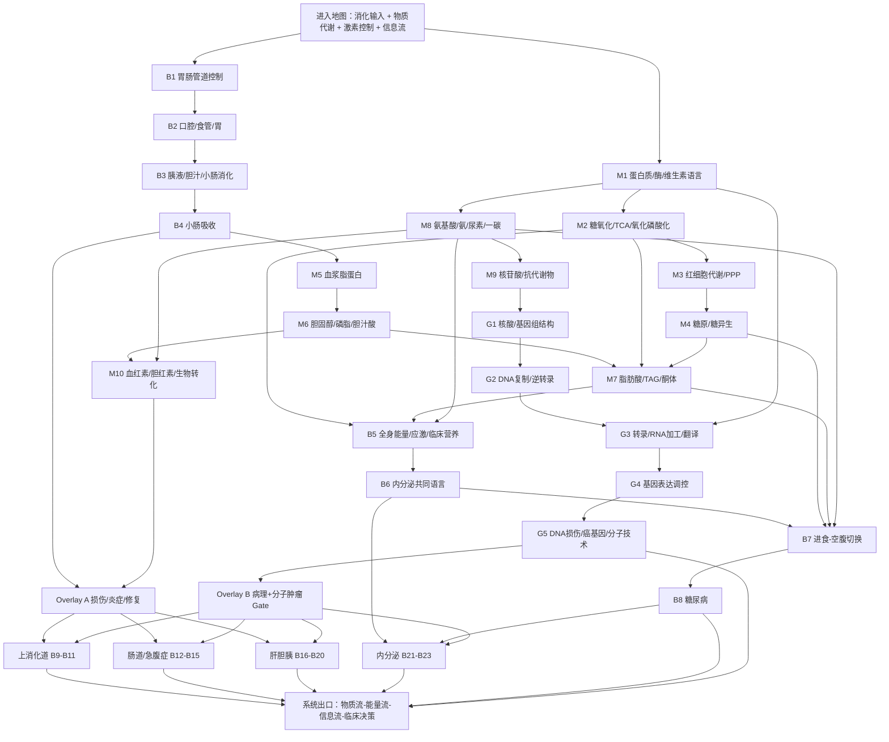

# 西综消化—物质代谢—内分泌｜完整导学、认知依赖与学习顺序 v2
## 生物化学完整整合版｜按《西综 System Guide 生成规则 v1》生成

> **文件层级**：System Guide  
> **用途**：回答“消化—物质代谢—内分泌这一整套系统应该怎样学”，确定统一模型、认知依赖、Operational Blocks、生化与分子生物学插入点、Overlay 路由、Memory Routing、范围归属和系统出口。  
> **不是**：第二份讲义、KP 正文、代谢通路逐酶抄写、完整疾病比较表、药物 / 阈值 / TNM / 术式汇总。  
> **权威主干**：本 Project 中的生理学、病理学、内科学、外科学 Study Lecture 与对应 Outline，以及《26生化.pdf》。  
> **生化来源状态**：《26生化.pdf》为上一版讲义，用户判断与当前版本差异不大；本版将其作为当前可执行的 **Provisional Study Baseline**。若后续上传最新版，只做章节变化、新增真题和口径差异的 Delta Audit，不默认推翻当前结构。  
> **覆盖边界**：当前未上传独立生化 Outline；《26生化.pdf》本身包含核心精讲、思维导图、专题串联和历年真题解析，因此 System Guide 先按章节范围绑定，Block 层再建立正式 KP / Outline 覆盖。  
> **生成日期**：2026-08-20  
> **状态**：v2｜生化完整纳入；允许后续最新版生化、Block 深审与实际学习反馈后修订。

---

# 0｜本文件如何使用

本文件不把“消化、内分泌、生化”当成三门课机械拼接，而是同时追踪六条流：

```text
物质输入流
食物 → 消化 → 吸收 → 门静脉 / 淋巴 → 肝脏与组织

碳与能量流
葡萄糖 / 脂肪酸 / 氨基酸
→ 乙酰 CoA / TCA / 呼吸链
→ ATP、热与储存物

氮与一碳流
氨基酸 → 氨转运 / 尿素
→ 一碳单位 / SAM
→ 核苷酸与生物活性物质

信息流
DNA → RNA → 蛋白质 / 酶
→ 代谢与细胞表型
→ DNA 损伤、基因调控异常与肿瘤

控制流
胃肠神经与激素
→ 胰岛素 / 胰高血糖素
→ 甲状腺 / 肾上腺 / PTH / GH
→ 进食、空腹、生长与应激切换

疾病流
管腔 / 黏膜 / 腹膜 / 肝胆胰 / 代谢 / 激素 / 基因失效
→ 症状、检查、诊断、外科决策与系统并发症
```

实际学习：

```text
在本 Guide 中定位当前 Block
→ 打开对应 Block Guide / 学习阅读版
→ 按 Study 连续小板块完整学习
→ 用 KP 闭卷恢复
→ 用 Outline / 生化内嵌真题验漏
→ MI-D 在 MarginNote 3 框选成卡片
→ 不让孤立酶名、辅酶、数字、TNM 和术式阻塞机制主线
```

## 0.1 本系统必须采用 DAG，而不是一条超长直线

共同基础完成后，系统分成六条可并行支路：

```text
共同输入与吸收
├─ 生化物质代谢核心
├─ 全身能量 / 营养 / 胰岛控制
├─ 上消化道
├─ 肠道 / 急腹症
├─ 肝胆胰
└─ 内分泌轴

核苷酸代谢
└─ 分子生物学平行支路
   → DNA / RNA / 蛋白质
   → 基因调控 / DNA 修复
   → 癌基因 / 抑癌基因 / 分子技术
   → 器官肿瘤 Gate
```

它们在以下出口重新汇合：

- 营养与能量不足；
- 高 / 低血糖和酮症；
- 高氨、黄疸和肝衰；
- 出血、腹水和休克；
- 电解质与酸碱；
- 肿瘤、抗代谢物和分子诊断；
- 多器官并发症。

不能为了“全都有关联”而强迫甲状腺、肠梗阻、氧化磷酸化、DNA 复制和胃癌排成一条假病程。

## 0.2 生化原目录与学习顺序的关系

《26生化.pdf》原目录分为：

```text
第一部分｜物质代谢
糖 → 脂 → 蛋白质 / 氨基酸 → 核苷酸
→ 胆色素 → 生物转化 → 维生素 → 酶

第二部分｜基因相关
原癌 / 抑癌与技术
→ 核酸 → DNA 合成 → 转录 → 翻译
→ 基因调控 → 真核基因 → DNA 损伤
```

本 Guide 保留全部范围，但按认知依赖重排：

```text
蛋白质 / 酶 / 辅因子语言
→ 碳氧化与 ATP
→ 糖分支
→ 脂质
→ 氨基酸 / 氮
→ 核苷酸
→ 肝脏化学处理

核酸结构
→ DNA 复制
→ 转录 / 翻译
→ 基因表达调控
→ DNA 损伤 / 癌基因 / 分子技术
```

这是学习顺序重排，不是静默改写讲义内容。

---

# 1｜Scope Audit

## 1.1 当前 source-bound 客观范围

以下只用于客观规划，不用于预测个人学习速度。

| 学科 | 当前绑定范围 | 考试覆盖 | Study 约页数 |
|---|---|---|---:|
| 生理 | 消化 018–022；能量代谢 023；内分泌 035–040 | Outline **264** 题 | 约 **84** 页 |
| 病理 | 消化 005–008；内分泌 009；肿瘤总论 019 | Outline **205** 题 | 约 **61** 页 |
| 内科 | 消化 031–059；内分泌 091–100 | Outline **411** 题 | 约 **104** 页 |
| 外科 | 甲状腺 / 食管 001–003；腹部与肠道 007–016；肝胆胰 017–024；营养 049–050 | Outline **350** 题 | 约 **93** 页 |
| 生化 | 《26生化.pdf》第一部分讲义内页 P1–84；第二部分 P85–154，并含导图、串联和真题解析 | 暂无独立 Outline；讲义内嵌历年真题 | **183 PDF 页** |
| **当前合计** | 未去重 | 约 **1,230 道独立 Outline + 生化内嵌真题** | 约 **525 个来源页** |

说明：

- 不同讲义版式和信息密度不同，页数不可直接换算时长。
- 生化 PDF 的“讲义内页”与 PDF 物理页码不完全一致，后续 Block Guide 以章节标题 + 讲义内页双重定位。
- 生化暂以旧版为执行基线；当前版本到位后只做差异审查。

## 1.2 生理学主体

### 消化与吸收

- 消化道平滑肌；
- 慢波、动作电位与收缩；
- 肠神经系统；
- 交感、副交感；
- 胃肠激素；
- 吞咽与食管；
- LES；
- 胃运动和胃排空；
- 胃液、胃酸、胃蛋白酶、内因子；
- 胰液；
- 胆汁与胆盐；
- 小肠液；
- 糖、脂肪、蛋白质、维生素、铁、钙、水和电解质吸收；
- 门静脉与淋巴运输接口。

### 能量代谢与体温

- 能量来源和去路；
- 食物热价；
- 呼吸商；
- 能量代谢测定；
- 基础代谢；
- 影响因素；
- 产热、散热与体温调节。

### 内分泌

- 内分泌总论；
- 激素分类、受体和作用机制；
- 反馈与节律；
- 钙调节激素；
- 生长激素；
- 胰岛素与胰高血糖素；
- 甲状腺激素；
- 糖皮质激素。

## 1.3 病理学主体

### 消化

- 慢性胃炎；
- 消化性溃疡；
- 急性阑尾炎；
- 急性胰腺炎和胰腺癌的病理接口；
- 病毒性肝炎；
- 肝硬化；
- 原发性肝癌；
- 食管、胃、肠道等消化系统肿瘤；
- 消化系统恶性肿瘤共同形态与转移接口。

### 内分泌

- 甲状腺癌；
- 结节性甲状腺肿；
- Graves 病；
- 桥本和亚急性甲状腺炎；
- 甲状腺腺瘤；
- 1 型 / 2 型糖尿病病理；
- 胰岛细胞瘤。

### 肿瘤总论

- 良恶性；
- 分化与异型；
- 生长；
- 浸润；
- 转移；
- 分级与分期；
- 癌前病变；
- 宿主效应。

## 1.4 内科学主体

### 消化

- GERD；
- 胃炎；
- 消化性溃疡与消化道出血；
- 肠结核和结核性腹膜炎；
- 炎症性肠病；
- IBS；
- 肝性脑病；
- HCC；
- 肝硬化；
- 急性胰腺炎。

### 内分泌

- Graves 病；
- 甲状腺功能减退症；
- 原发性醛固酮增多症；
- 嗜铬细胞瘤；
- 库欣综合征；
- 内分泌系统总论；
- 糖尿病；
- DKA、HHS、低血糖和慢性并发症；
- 降糖药物总览。

## 1.5 外科学主体

### 颈部与食管

- 甲亢外科治疗；
- 甲状腺结节和甲状腺癌；
- 甲状腺炎与甲状腺肿；
- 甲状腺手术及并发症；
- 甲状旁腺功能亢进；
- 食管癌；
- 贲门失弛缓症。

### 腹部和肠道

- 胃癌、胃淋巴瘤、GIST；
- 腹膜炎和腹腔脓肿；
- 腹部损伤；
- 肠梗阻；
- 急性阑尾炎；
- 大肠癌；
- 痔、肛裂、肛周脓肿、肛瘘；
- 腹外疝。

### 肝胆胰

- 细菌性肝脓肿；
- 门静脉高压；
- 胰腺肿瘤和功能性胰岛肿瘤；
- 胆石病；
- 胆囊炎；
- 胆管炎；
- 胆囊息肉；
- 胆囊癌；
- 胆管癌；
- 梗阻性黄疸；
- 胆道手术与 T 管接口。

### 外科营养

- 营养评价；
- 能量需求；
- 肠内营养；
- 肠外营养；
- 应激代谢；
- 并发症。

## 1.6 生物化学主体

### Part I｜物质代谢｜讲义内页 P1–84

- 糖无氧氧化与有氧氧化；
- 丙酮酸脱氢、TCA、底物水平磷酸化；
- 高能化合物；
- 氧化磷酸化、呼吸链、穿梭与解偶联；
- 成熟红细胞糖酵解、2,3-DPG 与 PPP；
- 磷酸戊糖途径、糖原、糖异生；
- 血浆脂蛋白；
- 磷脂、胆固醇和胆汁酸；
- 三酰甘油、脂肪酸合成 / 动员 / β 氧化和酮体；
- 蛋白质结构、变性、分离与降解；
- 氨基酸分类、特殊产物、一碳单位和 SAM；
- 转氨、脱氨、氨运输和尿素循环；
- 嘌呤 / 嘧啶代谢、补救合成、尿酸；
- 核苷酸抗代谢物；
- 血红素 / 胆色素；
- 生物转化；
- 维生素与辅因子；
- 酶、动力学、抑制、调节、同工酶和医学应用。

### Part II｜基因相关｜讲义内页 P85–154

- 原癌基因与抑癌基因；
- 基因重组；
- 分子生物学技术；
- 核酸结构和理化性质；
- DNA 复制、逆转录和端粒；
- 转录、RNA 加工和调控；
- 翻译与翻译后修饰；
- 原核 / 真核基因表达调控；
- 真核基因组和断裂基因；
- DNA 损伤、突变与修复。

## 1.7 当前仍存在的来源边界

1. **无独立生化 Outline**：当前先用讲义内嵌真题做覆盖，后续 Block 层再生成正式 KP / Outline。
2. **旧版与当前版 Delta 未核对**：当前结构可执行，但新版出现新增考点或口径变化时需标注。
3. **部分临床内分泌仍缺独立章节**：GH 过多 / 不足、完整垂体疾病和部分钙磷内科模型仍非完整 source-bound。
4. **抗肿瘤药理边界**：生化支持核苷酸抗代谢物和分子靶点原理，不等于完整肿瘤药理学。

---

# 2｜System Mission & Mental Model

## 2.1 这套系统真正维持什么

这套系统的共同任务是：

> **把外界营养转化为可吸收底物，把底物转化为 ATP、结构材料和储存物，再由激素和基因表达按进食、空腹、生长与应激状态进行分配。**

完整电影：

```text
食物进入
→ 消化与吸收
→ 门静脉 / 淋巴运输
→ 肝脏首过与底物分流
→ 糖 / 脂 / 氨基酸进入各自通路
→ 乙酰 CoA、TCA、呼吸链产生 ATP
→ 过剩底物储存，空腹时动员
→ 氨转为尿素，胆红素与异物被处理
→ 核苷酸形成 DNA / RNA
→ 基因表达形成蛋白质和酶
→ 激素与反馈改变整个网络的流量
```

## 2.2 十一个部件模型

### 1. 运输管道

口腔—食管—胃—小肠—结直肠，负责推进、储存、混合、分段控制和排空。

### 2. 屏障与黏膜

负责隔离腔内刺激、分泌黏液和 HCO₃⁻、选择性吸收和局部免疫。

### 3. 消化腺

胃、胰腺、肝胆和小肠提供酸、酶、HCO₃⁻、胆汁、胆盐和黏液。

### 4. 吸收接口

将单糖、氨基酸、小肽、脂质、维生素、铁、钙、水和电解质送入门静脉或淋巴。

### 5. ATP 发动机

```text
糖酵解 / β 氧化 / 氨基酸碳骨架
→ 乙酰 CoA / TCA
→ NADH / FADH₂
→ 呼吸链 / ATP
```

### 6. 储存—动员系统

- 糖原；
- 三酰甘油；
- 胆固醇和脂蛋白；
- 蛋白质与氨基酸库；
- 酮体作为肝向肝外输出能量的形式。

### 7. 氮与一碳处理器

将氨基酸氮转运、解毒成尿素，并提供一碳单位、SAM、神经递质和核苷酸原料。

### 8. 肝脏化学枢纽

承担门静脉首过、白蛋白 / 凝血因子合成、胆汁形成、胆红素处理、生物转化、底物互换和氨解毒。

### 9. 内分泌控制器

下丘脑—垂体—靶腺以及代谢物反馈，决定激素量、节律和靶器官反应。

### 10. 遗传信息系统

```text
DNA 保存信息
→ RNA 传递 / 调控
→ 蛋白质与酶执行
```

损伤、修复失败、原癌基因激活或抑癌基因失活可把代谢与生长控制推向肿瘤。

### 11. 腹腔与外科空间

腹膜、系膜、腹壁、肝门、胆道和胰周空间决定感染、出血、梗阻、疝、脓肿和手术路径。

---

# 3｜Input / Output Contract

## 3.1 Input｜进入本系统前必须掌握什么

### Hard prerequisite

- 跨膜转运；
- 细胞器与线粒体基本结构；
- 受体、第二信使和蛋白激酶；
- 平滑肌与骨骼肌收缩；
- 神经、体液和反馈调节；
- 循环中的门静脉、有效循环血量和氧供；
- 泌尿中的水、电解质与酸碱；
- 病理适应、损伤、炎症和修复的最小语言。

### 分 Block Hard prerequisite

- M2 前：M1 的酶 / 辅因子语言；
- M7 前：M2–M6 的乙酰 CoA、NADH / NADPH 和储存—动员；
- M8 前：M1 蛋白质 / 氨基酸；
- M9 前：M3 PPP、一碳单位和 M8 氨基酸；
- B7 / B8 前：M2–M9；
- G1–G5 前：M1、M9；
- 器官肿瘤前：病理肿瘤总论 + G1–G5 的分子肿瘤 Gate；
- 肝性脑病前：M8 氨代谢；
- 黄疸 / 胆道病前：M6 胆汁酸 + M10 胆红素。

### Soft prerequisite

- 免疫；
- 血液与凝血；
- 药理；
- 统计和分子实验技术。

## 3.2 Output｜学完以后向后续系统输出什么

### 向血液系统输出

- 成熟红细胞糖酵解、2,3-DPG、PPP / GSH 和 G6PD；
- 蛋白质结构、白蛋白和血浆蛋白；
- 铁、B12、叶酸吸收；
- 一碳单位与巨幼贫接口；
- 血红素 / 胆红素；
- 核苷酸抗代谢物；
- EPO 之外的肝肾代谢接口。

### 向循环系统输出

- ATP 与心肌能量；
- 脂蛋白、LDL / HDL 和 AS；
- 甲状腺激素、解偶联和基础代谢；
- 糖尿病与大血管病；
- 门脉高压、腹水和失血。

### 向泌尿系统输出

- 糖异生与长期饥饿肾脏接口；
- 谷氨酰胺 / NH₄⁺ 与酸碱；
- DKA / HHS、渗透性利尿和 K⁺；
- 糖尿病肾病；
- 嘌呤 / 尿酸；
- 原醛 / 库欣；
- 肝肾综合征。

### 向神经系统输出

- 葡萄糖与酮体的脑供能；
- GABA、5-HT、儿茶酚胺等氨基酸衍生物；
- 高氨与肝性脑病；
- 低血糖；
- B12 / 一碳单位接口；
- 基因表达与遗传病基础。

### 向免疫与感染系统输出

- ADA 与嘌呤代谢；
- 谷氨酰胺与淋巴 / 肠上皮；
- 蛋白质、抗体与补体的结构语言；
- PCR、杂交、重组 DNA 等技术；
- 肝炎 / 结核等器官接口。

### 向骨科输出

- PTH / 钙三醇；
- 胆固醇—VitD；
- 甲旁亢；
- 糖皮质激素性骨质疏松；
- 甲亢骨代谢；
- 营养与吸收不良。

### 向肿瘤系统输出

- 瓦伯格效应；
- 核苷酸合成与抗代谢物；
- DNA 复制、转录、翻译和表达调控；
- DNA 损伤 / 修复；
- 原癌基因 / 抑癌基因；
- 分子生物学检测与重组技术；
- 器官特异的癌前病变、分期和外科边界。

---

# 4｜Core Variables & Failure Modes

## 4.1 最小变量语言

```text
Motility / Sphincter / Transit｜运动、括约肌与通过时间
Acid / HCO₃⁻ / Enzymes / Bile salts｜消化液
Absorptive surface / Portal flow｜吸收与门静脉
ATP / ADP｜能量状态
NADH / FADH₂｜氧化供能还原当量
NADPH｜合成与抗氧化还原力
Acetyl CoA｜糖、脂、氨基酸共同枢纽
G-6-P｜糖酵解、PPP、糖原共同分叉点
Glycogen / TAG｜储存
FFA / Ketone bodies｜空腹动员与替代燃料
CM / VLDL / LDL / HDL｜脂质运输
Amino N / NH₃ / Urea｜氮负荷与解毒
One-carbon / SAM｜核苷酸和甲基化
Purine / Pyrimidine / PRPP｜核苷酸供给
Bilirubin / Bile acids｜血红素与胆汁处理
CYP / Conjugation｜生物转化
Glucose / Insulin / Glucagon｜血糖分配
T3 / T4 / Cortisol / Aldosterone / Catecholamine｜代谢与应激
DNA / RNA / Protein｜信息流
Oncogene / Tumor suppressor / DNA repair｜生长控制
```

## 4.2 十三类 Failure Modes

### 1. 管道运动或出口失效

GERD、失弛缓、胃排空障碍、IBS、肠梗阻、疝和幽门梗阻。

### 2. 黏膜屏障破坏

胃炎、PUD、GI 出血、IBD。

### 3. 消化液不足、失控或流出受阻

胰腺外分泌不足、急性胰腺炎、胆道梗阻、胆盐不足和脂肪吸收障碍。

### 4. 吸收界面失效

小肠疾病、IBD / 肠结核、短肠和铁 / B12 / 叶酸 / 钙 / 脂溶维生素缺乏。

### 5. ATP 与氧化还原失败

缺氧、线粒体 / 呼吸链异常、解偶联、关键辅因子缺乏和红细胞无氧代谢异常。

### 6. 储存—动员与底物分流失败

糖原、脂肪动员、脂肪酸氧化、酮体和糖异生失配；典型见糖尿病与饥饿异常。

### 7. 脂质运输、膜与胆固醇通路异常

高脂血症、AS、脂肪肝、胆石、类固醇 / VitD / 胆汁酸接口。

### 8. 氮代谢和尿素循环失败

高氨、肝性脑病、尿素循环异常、氨基酸代谢病。

### 9. 核苷酸供给或分解异常

痛风、补救合成缺陷、肿瘤增殖依赖和抗代谢药靶点。

### 10. 肝细胞化学处理失败

病毒性肝炎、肝硬化、低白蛋白、凝血障碍、胆红素和生物转化异常。

### 11. 腹腔污染、出血或通路阻塞

腹膜炎、腹部损伤、胆管炎、结石、肝脓肿。

### 12. 激素过多、过少或轴定位异常

糖尿病、Graves、甲减、原醛、嗜铬、库欣、甲旁亢。

### 13. 遗传信息与克隆控制失败

复制 / 转录 / 翻译 / 调控 / 修复异常，原癌基因激活、抑癌基因失活和器官肿瘤。

---

# 5｜Dependency Graph



## 5.1 这条路线为什么这样排

1. **先消化吸收，再讨论底物去向**：先知道糖、脂和氨基酸怎样进入体内。
2. **先建立蛋白质—酶—辅因子语言，再进入通路**：关键酶、Km、抑制和维生素辅酶不再是无意义词表。
3. **先 ATP 发动机，再储存和动员**：糖原、脂肪酸与酮体都必须回到 ATP / 乙酰 CoA / 氧化还原状态。
4. **红细胞代谢与 PPP 一次学完整**：糖酵解、2,3-DPG、NADPH / GSH 和 G6PD 不拆成多次初见。
5. **脂蛋白早于脂质疾病**：先学外源 / 内源运输，再学胆固醇、AS、脂肪肝和胆石。
6. **氨基酸早于肝性脑病**：高氨和尿素循环不能只在临床章节背结论。
7. **核苷酸早于分子生物学和肿瘤抗代谢物**：先有原料和合成，才能理解 DNA、增殖和药物靶点。
8. **内分泌调节后于单条代谢通路**：B7 不重复讲酶，而是把通路切换为餐后 / 空腹 / 应激状态。
9. **分子生物学是平行支路**：不阻塞非肿瘤消化病，但必须在第一批器官肿瘤前完成。
10. **肿瘤 Gate 分两层**：病理负责形态和浸润转移；生化负责基因表达、DNA 修复和生长控制。
11. **器官疾病继续按真实空间和 Failure Mode 分支**，不让生化无限吞并临床主线。

---

# 6｜Operational Block Route

# Block 1｜胃肠管道控制：一根管子怎样主动推进、混合和分段

**中心问题**

> 消化道平滑肌、慢波、肠神经系统、自主神经和胃肠激素怎样共同控制运动与分泌？

**Study 主范围**

- 生理 P207–212；
- Outline 018；
- 细胞信号转导和肌肉收缩：Recall。

**必要原图**

- 消化道壁；
- 慢波 / 动作电位；
- ENS；
- 交感 / 副交感；
- 胃肠激素；
- 反射弧；
- 括约肌。

**动作配置**

- Learn：平滑肌电活动；慢波；机械 / 化学感受；ENS；长 / 短反射；交感 / 迷走；胃肠激素共同角色。
- Recall：跨膜、电活动、第二信使。
- Apply：GERD、IBS、梗阻、倾倒、胃排空。
- Defer：具体疾病完整模型。

**知识形态**

- Mechanism Spine：刺激 → 局部 / 长反射 → 平滑肌 / 腺体 / 括约肌。
- Discrimination Tree：慢波 / 动作电位；神经 / 体液；平滑肌 / 括约肌效应。
- MI-G：胃肠运动不等于每个慢波都产生收缩；括约肌与管壁反应可不同。
- MI-D：全部递质、受体和激素名单。

**客观负荷画像**

- 首轮主线：很重
- MI-D：高
- 视觉：高
- 整合：高

**出口问题**

1. 慢波、动作电位和收缩三者是什么关系？
2. ENS、迷走和交感分别能独立完成什么？
3. 为什么同一递质可使管壁和括约肌产生不同方向？
4. 胃肠激素怎样成为神经调节的“慢接力”？

---

# Block 2｜口腔、食管与胃：推进、抗反流、储存、排空和胃酸

**中心问题**

> 食物如何被吞咽、跨过 LES、进入胃；胃如何在保护自身的同时分泌酸和酶并控制排空？

**Study 主范围**

- 生理 P213–229；
- Outline 019–020。

**必要原图**

- 吞咽；
- LES；
- 胃壁细胞；
- 胃液分泌；
- 头 / 胃 / 肠期；
- 胃运动和排空；
- 黏膜屏障。

**动作配置**

- Learn：唾液；吞咽；LES；胃运动；胃液细胞来源；胃酸、胃蛋白酶、内因子；胃泌素、组胺、ACh；抑制轴；胃排空。
- Recall：管道控制。
- Apply：GERD、胃炎、PUD、恶性贫血、幽门梗阻。
- Defer：疾病诊断与治疗。

**知识形态**

- Mechanism Spine：进入胃 → 分泌 / 混合 → 排空；攻击因素与防御屏障平衡。
- Discrimination Tree：头 / 胃 / 肠期；壁 / 主 / G / ECL / D 细胞。
- MI-G：胃酸和内因子的细胞来源；LES 是抗反流核心接口。
- MI-D：全部刺激 / 抑制因子和分泌比例。

**客观负荷画像**

- 首轮主线：很重
- MI-D：很高
- 视觉：高
- 整合：很高

**出口问题**

1. LES 功能下降为什么导致反流而不是胃排空障碍？
2. 胃酸最大分泌能力与壁细胞数量有什么关系？
3. 胃酸怎样同时帮助消化又损伤黏膜？
4. 内因子缺乏为什么连接胃病与巨幼细胞性贫血？
5. 头期、胃期、肠期各怎样启动和终止？

---

# Block 3｜胰液、胆汁与小肠消化：把大分子拆成可吸收单元

**中心问题**

> 胰酶、HCO₃⁻、胆盐和小肠酶怎样协同；为何酶原激活位置和胆胰共同通道极其重要？

**Study 主范围**

- 生理 P230–239；
- Outline 021。

**必要原图**

- 胰腺腺泡 / 导管；
- 促胰液素 / CCK；
- 胰酶原激活；
- 胆汁形成；
- 胆盐肠肝循环；
- Oddi 括约肌；
- 脂肪乳化与微胶粒。

**动作配置**

- Learn：胰酶、HCO₃⁻；胰酶原；肠激酶；胆汁、胆盐、胆色素；胆囊；肠肝循环；糖 / 脂 / 蛋白消化。
- Recall：胃酸、胃排空、激素。
- Apply：胰腺炎、胆石、胆道梗阻、脂肪泻、Vit K 缺乏。
- Defer：胆胰疾病完整模型。

**知识形态**

- Mechanism Spine：酸性食糜入十二指肠 → 中和 + 酶解 + 乳化。
- Discrimination Tree：腺泡 / 导管；促胰液素 / CCK；胆汁 / 胰液。
- MI-G：胰酶必须在正确位置激活；胆盐对脂肪吸收的必要性。
- MI-D：全部酶、底物和激素名单。

**客观负荷画像**

- 首轮主线：很重
- MI-D：很高
- 视觉：很高
- 整合：很高

**出口问题**

1. 为什么促胰液素偏 HCO₃⁻，CCK 偏胰酶和胆囊收缩？
2. 胰酶原为何必须延迟激活？
3. 胆盐不直接消化脂肪，为什么仍不可缺？
4. 胆道和胰管共同出口如何解释胆源性胰腺炎？
5. 慢性胰腺外分泌不足为何导致脂肪泻和 Vit K 缺乏？

---

# Block 4｜小肠吸收与营养运输：进入门静脉还是先走淋巴

**中心问题**

> 单糖、氨基酸、小肽、脂质、铁、钙、维生素和水分别如何跨上皮并进入循环？

**Study 主范围**

- 生理 P240–244；
- Outline 022；
- 跨膜转运：Recall。

**必要原图**

- 绒毛和微绒毛；
- 顶端 / 基底膜；
- SGLT / GLUT；
- 小肽转运；
- 铁和钙；
- 乳糜微粒；
- 门静脉 / 淋巴；
- B12—内因子—回肠。

**动作配置**

- Learn：主要吸收部位；各种营养素转运；脂溶 / 水溶性维生素；铁、钙；B12；水与电解质。
- Recall：跨膜转运、胰液和胆汁。
- Apply：贫血、骨病、脂肪泻、短肠 / IBD / 肠结核。
- Defer：完整血液疾病和钙磷疾病。

**知识形态**

- Mechanism Spine：腔内消化 → 顶端进入 → 细胞内加工 → 基底侧输出 → 门静脉 / 淋巴。
- Discrimination Tree：糖 / 蛋白 / 脂肪；水溶 / 脂溶；铁 / 钙 / B12。
- MI-G：长链脂质先经淋巴；B12 依赖内因子和回肠。
- MI-D：全部吸收部位、转运体和促进 / 抑制因素。

**客观负荷画像**

- 首轮主线：重
- MI-D：很高
- 视觉：高
- 整合：很高

**出口问题**

1. 葡萄糖、果糖和小肽为什么使用不同转运方式？
2. 脂肪为何不像单糖一样直接进入门静脉？
3. 胃、胰和回肠中任一环节异常如何导致 B12 缺乏？
4. 胆盐不足、胰酶不足和小肠黏膜损伤如何区分？
5. 铁与钙吸收怎样连接血液与骨代谢？

---

## 生化核心路线｜M1–M10

> **编号说明**：M 系列为本系统新增的生化 Primary Blocks。它们插在正常消化吸收之后、全身能量与内分泌整合之前；后续血液、神经、肿瘤等系统只 Recall，不重复完整初见。

# M1｜蛋白质、酶与维生素：代谢网络为什么能被精确控制

**中心问题**

> 蛋白质结构怎样决定功能；酶怎样降低活化能、识别底物并被调节；维生素如何转化为辅酶参与反应？

**Study 主范围**

- 《26生化.pdf》讲义内页 P43–48：蛋白质；
- P74–75：维生素；
- P76–84：酶与医学应用。

**必要原图**

- 蛋白质一级至四级结构；
- α 螺旋、β 折叠、模体和结构域；
- 变性 / 凝固 / 沉淀；
- Km / Vmax 曲线；
- 竞争、非竞争、反竞争抑制；
- 酶原、变构和化学修饰；
- 维生素—辅酶总表。

**动作配置**

- Learn：蛋白质结构与变性；分离 / 降解；活性中心；酶促动力学；抑制；调节；同工酶；维生素辅因子；医学酶学。
- Recall：氨基酸、受体和信号转导最小基础。
- Apply：后续所有关键酶、辅酶缺乏、胰腺炎酶原激活和临床酶指标。
- Defer：全部低频分离技术、抑制剂和维生素特殊表现进入 MI-D。

**知识形态**

- Mechanism Spine：一级结构 → 空间构象 → 活性中心 → 催化 / 调节 → 代谢流量。
- Discrimination Tree：变性 / 沉淀 / 凝固；竞争 / 非竞争 / 反竞争；酶原 / 变构 / 化学修饰。
- MI-G：Km 含义；关键酶为何值得调节；常见维生素辅酶关系。
- MI-D：全部结构口诀、分离法、抑制剂和同工酶列表。

**客观负荷画像**

- 首轮主线：很重
- MI-D：极高
- 视觉：很高
- 整合：极高

**出口问题**

1. 为什么变性通常破坏空间结构而不破坏一级结构？
2. Km、Vmax 分别在回答什么？
3. 三类可逆抑制对 Km / Vmax 的方向是什么？
4. 关键酶为什么常位于单向反应？
5. 维生素缺乏如何通过辅酶缺失阻断整条代谢链？

> **执行层边界**：M1 后续可拆为“蛋白质结构”“酶动力学与调节”“维生素 / 医学酶学”三个连续学习单元。

---

# M2｜碳氧化与 ATP：葡萄糖怎样一路变成 CO₂、H₂O 和能量

**中心问题**

> 葡萄糖怎样经糖酵解、丙酮酸脱氢、TCA 和呼吸链产生 ATP；无氧、有氧和解偶联状态有何不同？

**Study 主范围**

- 生化讲义内页 P1–18：糖无氧 / 有氧氧化、TCA、氧化磷酸化、高能化合物和能量计算。

**必要原图**

- 糖酵解；
- 丙酮酸脱氢酶复合体；
- TCA；
- 两种穿梭；
- 呼吸链复合体；
- 化学渗透；
- ATP 合酶；
- 抑制 / 解偶联；
- 30 / 32 ATP 计算。

**动作配置**

- Learn：糖酵解、乳酸、有氧氧化、关键酶、PDH、TCA、底物水平磷酸化、NADH / FADH₂、呼吸链、P/O、解偶联和 ATP 计算。
- Recall：M1 酶和辅因子；呼吸氧供。
- Apply：缺氧、运动、心肌 / 肝能量、甲亢产热、氰化物 / CO、瓦伯格效应。
- Defer：全部抑制剂药名和每一步中间物当场背熟。

**知识形态**

- Mechanism Spine：葡萄糖 → 丙酮酸 → 乙酰 CoA → TCA → 还原当量 → 质子梯度 → ATP。
- Discrimination Tree：无氧 / 有氧；底物水平 / 氧化磷酸化；抑制 / 解偶联。
- MI-G：三大不可逆糖酵解酶；PDH / TCA 关键酶；复合体 II 无质子泵；NADH 2.5、FADH₂ 1.5 的来源逻辑。
- MI-D：所有中间产物、抑制剂、ATP 细算变式。

**客观负荷画像**

- 首轮主线：极重
- MI-D：极高
- 视觉：极高
- 整合：极高

**出口问题**

1. 有氧和无氧糖代谢真正分叉在何处？
2. 乙酰 CoA 为什么是三大营养物质共同枢纽？
3. 呼吸链如何把电子传递转成质子势能和 ATP？
4. 抑制剂与解偶联剂对氧耗和 ATP 有何不同？
5. 甲状腺激素为什么能提高基础代谢和产热？

> **执行层边界**：建议拆为 M2a 糖酵解 / TCA、M2b 呼吸链、M2c ATP 计算与临床接口。

---

# M3｜成熟红细胞与磷酸戊糖途径：没有线粒体怎样供能和抗氧化

**中心问题**

> 成熟红细胞如何依靠糖酵解供能、2,3-DPG 调氧亲和力，并用 PPP / NADPH / GSH 抵抗氧化损伤？

**Study 主范围**

- 生化讲义内页 P7–10：红细胞代谢专题；
- P19–22 中 PPP 主体及糖代谢小结。

**动作配置**

- Learn：RBC 无氧供能；2,3-DPG 旁路；PPP；G6PD；NADPH / GSH；5-磷酸核糖。
- Recall：M2 糖酵解；Hb 氧解离曲线。
- Apply：G6PD 缺乏、蚕豆病、溶血、缺氧适应、核苷酸原料。
- Defer：所有氧化剂和遗传变异表。

**知识形态**

- Mechanism Spine：G-6-P → 糖酵解供 ATP / 2,3-DPG；或 → PPP 供 NADPH 和核糖。
- Discrimination Tree：NADH / NADPH；ATP / 2,3-DPG；供能 / 抗氧化。
- MI-G：成熟 RBC 不能 β 氧化和 TCA；G6PD 缺陷为何使膜易损。
- MI-D：所有旁路酶和溶血诱因。

**客观负荷画像**

- 首轮主线：重
- MI-D：高
- 视觉：高
- 整合：极高

**出口问题**

1. RBC 为什么只能依靠无氧糖酵解获得 ATP？
2. 2,3-DPG 如何改变 Hb 放氧？
3. PPP 的两个核心产物分别服务什么？
4. G6PD 缺陷为什么主要伤害红细胞？
5. NADH 与 NADPH 的角色怎样区分？

---

# M4｜糖原与糖异生：进食后存糖，空腹时怎样维持血糖

**中心问题**

> 肝和肌如何储存 / 分解糖原；乳酸、甘油和氨基酸如何绕过糖酵解不可逆步骤生成葡萄糖？

**Study 主范围**

- 生化讲义内页 P19–24：糖原、糖异生、Cori 循环和糖代谢小结；
- PPP 部分 Recall M3。

**动作配置**

- Learn：糖原合成 / 分解；肝肌差异；糖异生四个绕行酶；原料；Cori 循环；激素调节。
- Recall：M2 糖酵解 / TCA；M7 甘油 / 脂肪酸；M8 生糖氨基酸。
- Apply：空腹、运动、乳酸酸中毒、双胍类接口、低血糖。
- Defer：所有糖原病和低频酶缺陷。

**知识形态**

- Mechanism Spine：G-6-P 分流 → 糖酵解 / 糖原 / PPP / 游离葡萄糖。
- Discrimination Tree：肝糖原 / 肌糖原；糖酵解 / 糖异生；乳酸 / 甘油 / 氨基酸。
- MI-G：肌缺 G-6-P 酶；糖异生不是简单逆转糖酵解。
- MI-D：全部关键酶调节细节和耗能计算。

**客观负荷画像**

- 首轮主线：很重
- MI-D：极高
- 视觉：极高
- 整合：极高

**出口问题**

1. 肝糖原与肌糖原的最终用途为什么不同？
2. 糖异生为何必须使用不同酶绕过三步不可逆反应？
3. 甘油、乳酸和氨基酸分别从哪里进入？
4. 脂肪酸为何通常不能净生成葡萄糖？
5. 胰高血糖素如何同时抑制糖酵解、促进糖异生？

---

# M5｜血浆脂蛋白：疏水脂质怎样在血液中运输

**中心问题**

> 外源和内源三酰甘油 / 胆固醇分别由哪类脂蛋白运输；载脂蛋白、LPL、LCAT 和受体怎样决定去向？

**Study 主范围**

- 生化讲义内页 P25–28。

**动作配置**

- Learn：CM、VLDL、IDL、LDL、HDL；apo；LPL；LCAT / ACAT；LDL 受体和逆向转运。
- Recall：B4 长链脂肪经淋巴；循环 AS。
- Apply：高脂血症、脂肪肝、AS、降脂药靶点。
- Defer：全部家族性高脂血症分型。

**知识形态**

- Mechanism Spine：来源 → 载荷 → apo / 酶 → 组织去向 → 残粒清除。
- Discrimination Tree：外源 / 内源；TG 运输 / 胆固醇运输 / 逆向转运。
- MI-G：CM-外源 TG、VLDL-内源 TG、LDL-胆固醇到组织、HDL-逆向转运。
- MI-D：全部 apo、含量排序和电泳名称。

**客观负荷画像**

- 首轮主线：重
- MI-D：极高
- 视觉：很高
- 整合：极高

**出口问题**

1. CM 和 VLDL 为什么都需要 LPL，却来源不同？
2. LDL 与 HDL 的核心方向是什么？
3. apoB48、apoB100、apoCⅡ、apoE、apoAⅠ各在做什么？
4. VLDL 输出失败为何造成脂肪肝？
5. 氧化 LDL 如何连接 AS？

---

# M6｜胆固醇、磷脂与胆汁酸：膜、激素和胆汁共享什么前体

**中心问题**

> 乙酰 CoA 如何生成胆固醇和磷脂；胆固醇如何转为胆汁酸、VitD 和类固醇激素？

**Study 主范围**

- 生化讲义内页 P29–33。

**动作配置**

- Learn：胆固醇合成 / 分解；HMG-CoA 还原酶；7α 羟化酶；LCAT / ACAT；胆汁酸；VitD；类固醇；甘油磷脂和磷脂酶。
- Recall：M2 乙酰 CoA / NADPH；M5 脂蛋白；B3 胆汁。
- Apply：胆石、他汀、甲亢血脂、肾上腺 / 性激素、甲旁和细胞信号。
- Defer：全部磷脂种类和调节因子表。

**知识形态**

- Mechanism Spine：乙酰 CoA → 胆固醇 → 胆汁酸 / VitD / 类固醇；磷脂 → 膜 / 第二信使。
- Discrimination Tree：LCAT / ACAT；胆固醇合成 / 胆汁酸生成；甘油二酯 / CDP-甘油二酯途径。
- MI-G：HMG-CoA 还原酶与 7α 羟化酶；胆固醇不能转为胆色素。
- MI-D：所有胆汁酸、磷脂和磷脂酶列表。

**客观负荷画像**

- 首轮主线：很重
- MI-D：极高
- 视觉：极高
- 整合：极高

**出口问题**

1. 乙酰 CoA 怎样从线粒体到胞浆参与合成？
2. 他汀和胆汁酸反馈各作用于哪一层？
3. 胆固醇为什么既是膜成分又是多种激素前体？
4. 胆汁酸减少为何促进胆固醇结石？
5. 磷脂代谢如何连接 DAG / IP₃ 信号？

---

# M7｜三酰甘油、脂肪酸与酮体：储能和空腹燃料怎样切换

**中心问题**

> 过剩底物怎样合成脂肪；空腹时脂肪如何动员、β 氧化和生成酮体；合成与分解如何避免同时高速进行？

**Study 主范围**

- 生化讲义内页 P34–42。

**动作配置**

- Learn：TAG 合成；脂肪酸合成；乙酰 CoA 羧化酶；脂肪动员 / HSL；肉碱转运；β 氧化；奇数碳；酮体；必需脂肪酸。
- Recall：M2 TCA / OXPHOS；M4 糖异生；M6 胆固醇。
- Apply：饥饿、DKA、脂肪肝、脑替代燃料、白三烯 / PG / TXA₂。
- Defer：全部能量计算、酶名和脂肪酸分类当场背熟。

**知识形态**

- Mechanism Spine：合成 / 储存 ↔ 动员 → β 氧化 → 乙酰 CoA → TCA / 酮体。
- Discrimination Tree：合成 / 分解；脂肪酸 / 甘油；肝产酮 / 肝外用酮。
- MI-G：肉碱脂酰转移酶 I；丙二酰 CoA 抑制 β 氧化；肝生成但不利用酮体。
- MI-D：全部酶、碳数计算和必需脂肪酸衍生物。

**客观负荷画像**

- 首轮主线：极重
- MI-D：极高
- 视觉：极高
- 整合：极高

**出口问题**

1. 葡萄糖过剩如何变成脂肪？
2. 合成和 β 氧化为何位于不同区室？
3. 丙二酰 CoA 如何协调“合成开、分解关”？
4. 肝为何产酮却不能用酮？
5. DKA 为什么源于胰岛素缺乏后的脂肪动员和酮体过多？

---

# M8｜氨基酸、氨与尿素：碳骨架能利用，氮必须安全处理

**中心问题**

> 蛋白质分解后的氨基酸如何转氨 / 脱氨；NH₃ 怎样运输并在肝转为尿素；一碳单位和 SAM 如何连接核苷酸与甲基化？

**Study 主范围**

- 生化讲义内页 P49–59：氨基酸与氨基酸代谢。

**必要原图**

- 氨基酸分类；
- 转氨 / 联合脱氨；
- 丙氨酸—葡萄糖循环；
- 谷氨酰胺运输；
- 尿素循环；
- 一碳单位 / SAM；
- 苯丙氨酸—酪氨酸代谢。

**动作配置**

- Learn：必需 / 生糖 / 生酮；脱羧产物；转氨；脱氨；氨运输；尿素循环；一碳单位；SAM；特殊氨基酸代谢。
- Recall：M1 蛋白质；M2 TCA；M4 糖异生。
- Apply：肝性脑病、B12 / 叶酸、PKU、白化、尿黑酸、神经递质、甲状腺和儿茶酚胺。
- Defer：全部氨基酸口诀和遗传病细节进入 MI-D。

**知识形态**

- Mechanism Spine：氨基酸 → 氨基转移 / 去除 → 碳骨架利用 + NH₃ 解毒。
- Discrimination Tree：转氨 / 脱氨 / 脱羧；丙氨酸 / 谷氨酰胺运输；生糖 / 生酮。
- MI-G：尿素循环区室和关键酶；B12 / 叶酸与一碳单位。
- MI-D：全部氨基酸分类、特殊产物和遗传缺陷。

**客观负荷画像**

- 首轮主线：极重
- MI-D：极高
- 视觉：极高
- 整合：极高

**出口问题**

1. 转氨为什么不等于脱氨？
2. NH₃ 为什么主要以丙氨酸和谷氨酰胺运输？
3. 尿素循环如何跨线粒体和胞浆？
4. 肝衰为何高氨，肾脏又如何参与氨和酸碱？
5. 一碳单位和 SAM 分别提供什么？
6. 酪氨酸怎样连接儿茶酚胺、黑色素和甲状腺激素？

> **执行层边界**：建议拆为 M8a 氨基酸性质 / 特殊产物、M8b 氮代谢 / 尿素、M8c 一碳单位 / 特殊通路。

---

# M9｜核苷酸代谢与抗代谢物：细胞增殖需要什么原料，药物卡在哪里

**中心问题**

> 嘌呤和嘧啶怎样从头 / 补救合成、分解；抗代谢物为什么能优先影响快速增殖细胞？

**Study 主范围**

- 生化讲义内页 P60–68：核苷酸代谢与“核苷酸抗代谢物”专题。

**动作配置**

- Learn：PRPP；嘌呤 / 嘧啶从头与补救；IMP / UMP；核糖核苷酸还原；dUMP→dTMP；尿酸；HGPRT；抗代谢物。
- Recall：M3 PPP 核糖；M8 Gln / Asp / 一碳单位。
- Apply：痛风、Lesch-Nyhan、肿瘤、白血病和化疗。
- Defer：全部中间产物和药物副作用表。

**知识形态**

- Mechanism Spine：核糖 + 碱基原料 → 核苷酸 → DNA / RNA；或 → 分解产物。
- Discrimination Tree：嘌呤 / 嘧啶；从头 / 补救；核糖 / 脱氧核糖；合成抑制 / 分解抑制。
- MI-G：PRPP；IMP / UMP；5-FU、MTX、阿糖胞苷、6-MP、别嘌呤醇和氮杂丝氨酸的靶点层级。
- MI-D：全部碳氮来源、酶和药物细表。

**客观负荷画像**

- 首轮主线：很重
- MI-D：极高
- 视觉：极高
- 整合：极高

**出口问题**

1. 嘌呤和嘧啶从头合成的“环先成还是先接核糖”有何不同？
2. 补救合成为什么对脑和骨髓重要？
3. 嘌呤分解为何走向尿酸？
4. dUMP→dTMP 为什么依赖一碳单位和叶酸？
5. 5-FU、MTX、阿糖胞苷和 6-MP 分别卡住哪一层？

---

# M10｜血红素、胆红素与生物转化：肝怎样处理内源废物和外源化合物

**中心问题**

> 血红素如何合成与分解；胆红素怎样运输、结合和排泄；肝如何通过氧化、还原、水解和结合反应改变异物？

**Study 主范围**

- 生化讲义内页 P69–72：胆色素 / 血红素；
- P73：生物转化。

**必要原图**

- 血红素合成；
- Hb → UCB → CB → 胆素原；
- 肠肝循环；
- 三类黄疸；
- 生物转化第一相 / 第二相。

**动作配置**

- Learn：血红素合成；ALA 合酶；胆红素生成、白蛋白运输、肝摄取 / 结合 / 排泄；尿胆原；生物转化反应和结合供体。
- Recall：M1 B6 / 酶；M6 胆汁；M8 甘氨酸 / SAM / GSH；血液 Hb。
- Apply：溶血、肝细胞性 / 梗阻性黄疸、胆道病、药物 / 激素灭活。
- Defer：全部卟啉病、CYP 亚型和结合反应列表。

**知识形态**

- Mechanism Spine：血红素 → UCB → 肝结合 → CB → 胆道 / 肠道 → 胆素原；异物 → 第一相 → 第二相 → 排泄。
- Discrimination Tree：UCB / CB；溶血 / 肝细胞 / 梗阻；第一相 / 第二相。
- MI-G：UCB 脂溶不入尿、CB 水溶可入尿；血红素与胆固醇不是同一路。
- MI-D：全部酶、结合供体、尿胆原组合和特殊病。

**客观负荷画像**

- 首轮主线：很重
- MI-D：极高
- 视觉：极高
- 整合：极高

**出口问题**

1. UCB 为什么必须与白蛋白结合运输？
2. CB 为什么可出现在尿中？
3. 三类黄疸如何从生成、摄取 / 结合和排出定位？
4. 血红素合成为何与 B6、铁和线粒体 / 胞浆区室有关？
5. 生物转化为何不等于“一定解毒”？

---

# Block 5｜能量代谢、应激与临床营养：吃进去不等于被有效利用

**中心问题**

> 底物怎样转化为能量；基础代谢、疾病应激和营养支持怎样改变总需求与供给方式？

**Study 主范围**

- 生理 P245–256；
- Outline 023；
- 外科 P196–199；
- 外科 Outline 049–050；
- 生化 M2–M9：作为底物氧化、储存、动员和氮代谢的 Recall。

**动作配置**

- Learn：能量摄入 / 消耗；热价；呼吸商；基础代谢；影响因素；产热 / 散热；营养评价；肠内 / 肠外营养；应激代谢。
- Recall：消化吸收、循环氧供；M2–M9 的糖、脂、氨基酸和 ATP 生成网络。
- Apply：糖尿病、甲亢 / 甲减、严重感染、手术、肝病、胰腺病。
- Defer：不在本 Block 重讲每条代谢通路的酶学细节；只把它们整合为全身能量、应激与营养决策。

**知识形态**

- Mechanism Spine：底物进入 → 氧化 / 储存 → ATP / 热 → 生理与疾病需求。
- Discrimination Tree：肠内 / 肠外；合成 / 分解；基础 / 应激状态。
- MI-G：只要肠道可用，肠内营养通常具有优先意义；能量供给不能只看热量。
- MI-D：热价、呼吸商、公式、营养制剂和并发症。

**客观负荷画像**

- 首轮主线：重
- MI-D：很高
- 视觉：中
- 整合：很高

**出口问题**

1. 为什么同样热量的糖、脂肪和蛋白质对代谢状态意义不同？
2. 呼吸商在反映什么？
3. 甲亢、发热和应激为什么提高能量消耗？
4. 肠内和肠外营养的选择首先取决于什么？
5. 营养支持为何可能产生高血糖、感染、肝胆和代谢并发症？

**低连接附属范围**

体温调节属于同一生理章节，但不是本系统的结构主轴。保留为本 Block 内独立 Study 小板块，不用它牵引消化和内分泌疾病顺序。

---

# Block 6｜内分泌共同语言：轴、反馈、受体和定位

**中心问题**

> 激素过多或过少时，如何判断问题发生在下丘脑、垂体、靶腺、异位组织还是受体 / 通路？

**Study 主范围**

- 生理 P393–398；
- Outline 035；
- 内科 P252–253；
- 内科 Outline 093–095 中总论相关部分。

**必要原图**

- 下丘脑—垂体—靶腺轴；
- 负反馈；
- 激素分类；
- 细胞膜 / 胞内受体；
- 脉冲、昼夜与应激节律；
- 原发 / 继发 / 三级定位。

**动作配置**

- Learn：激素分类；运输；受体；放大；节律；反馈；功能亢进 / 减退；原发 / 继发；刺激 / 抑制试验逻辑。
- Recall：信号转导。
- Apply：甲状腺、肾上腺、糖尿病和钙磷。
- Defer：各疾病具体试验阈值。

**知识形态**

- Mechanism Spine：中枢信号 → 促激素 → 靶腺激素 → 靶器官 + 负反馈。
- Discrimination Tree：原发 / 继发 / 异位；过多 / 过少；刺激 / 抑制试验。
- MI-G：定位前必须先确认“真的过多 / 过少”。
- MI-D：全部结合蛋白、节律、试验数值和特殊。

**客观负荷画像**

- 首轮主线：很重
- MI-D：中高
- 视觉：高
- 整合：极高

**出口问题**

1. 原发性靶腺亢进时，促激素和靶腺激素方向为何相反？
2. 为什么先做功能确认，再做病因定位？
3. 抑制试验和刺激试验分别适合哪类问题？
4. 肽类与类固醇激素为何使用不同受体？
5. 昼夜节律和脉冲分泌为什么影响抽血解释？

---

# Block 7｜进食—空腹切换：胰岛素和胰高血糖素怎样分配底物

**中心问题**

> 餐后如何把底物储存起来，空腹和应激时又如何动员；胰岛内旁分泌与肠—胰轴怎样协调？

**Study 主范围**

- 生理 P407–412；
- Outline 037；
- Block 5 的全身能量与营养：Recall；
- 生化 M2–M9：完整 Recall，用来建立餐后、空腹和应激的代谢切换。

**动作配置**

- Learn：β / α / δ 细胞；胰岛素受体；胰岛素和胰高血糖素的糖 / 脂 / 蛋白效应；分泌调节；肠促胰素；神经调节；旁分泌。
- Recall：吸收、能量代谢、激素共同语言；M4 糖原 / 糖异生、M7 脂肪动员 / 酮体、M8 氨基酸代谢。
- Apply：糖尿病、DKA、HHS、低血糖、胰岛细胞瘤。
- Defer：不在此重复完整酶学；只把已学通路按餐后 / 空腹 / 应激状态重新调用。

**知识形态**

- Mechanism Spine：餐后储存 vs 空腹动员。
- Discrimination Tree：胰岛素 / 胰高血糖素；直接作用 / 继发反调节。
- MI-G：胰岛素不仅降糖，还协调脂肪和蛋白质代谢。
- MI-D：全部刺激 / 抑制因子和受体细节。

**客观负荷画像**

- 首轮主线：很重
- MI-D：高
- 视觉：中高
- 整合：极高

**出口问题**

1. 餐后胰岛素为何同时促进葡萄糖利用、糖原、脂肪和蛋白合成？
2. 胰高血糖素为何更像“空腹肝脏动员信号”？
3. 肠促胰素为什么能在血糖完全升高前促进胰岛素？
4. 生长激素、糖皮质激素、儿茶酚胺和甲状腺激素为何可能产生升糖倾向？
5. 胰岛内 A、B、D 细胞如何互相限制？

---

# Block 8｜糖尿病：底物控制失败如何变成全身血管和器官病

**中心问题**

> 绝对或相对胰岛素不足怎样造成高血糖、脂肪和蛋白分解；急性代谢危象与慢性微 / 大血管并发症如何统一？

**Study 主范围**

- 病理 P84：糖尿病；
- 内科 P254–269；
- Outline：病理 009 对应；内科 096–100；
- 生理 Block 7：Recall；
- 生化 M2–M9：糖、脂、蛋白和核苷酸代谢接口。

**必要原图**

- 1 型 / 2 型；
- 胰岛病理；
- DKA / HHS；
- 糖尿病肾病、视网膜、神经、足；
- 诊断阈值；
- 药物作用层级。

**动作配置**

- Learn：分型；胰岛素抵抗 / 分泌不足；临床；诊断；DKA；HHS；低血糖；慢性并发症；综合管理；药物大框架。
- Recall：小管渗透性利尿、酸碱、血管病；M4 糖代谢、M7 脂肪酸 / 酮体、M8 蛋白分解。
- Apply：肾、眼、神经、心血管、感染、足。
- Defer：全部药物名单、剂量、低频代谢酶学和分子分型；核心代谢链已在 M2–M9 完成，不再重复初见。

**知识形态**

- Mechanism Spine：胰岛素效应不足 → 糖 / 脂 / 蛋白紊乱 → 急性危象 + 慢性血管损伤。
- Discrimination Tree：1 型 / 2 型 / 特殊型；DKA / HHS；黎明 / Somogyi。
- MI-G：DKA / HHS 液体、K⁺ 和胰岛素处理顺序；诊断与低血糖门槛。
- MI-D：全部药物、并发症分期和目标值。

**客观负荷画像**

- 首轮主线：极重
- MI-D：极高
- 视觉：高
- 整合：极高

**出口问题**

1. 1 型与 2 型糖尿病的主要失败环节分别是什么？
2. DKA 为什么不仅是高血糖，还会形成酮体和酸中毒？
3. HHS 为什么脱水和高渗更突出？
4. 治疗 DKA / HHS 时为什么液体和 K⁺ 不能被忽略？
5. 微血管、大血管和神经并发症怎样形成不同器官表现？
6. 尿糖为什么既不能确诊，也不能排除糖尿病？

---

## Overlay Gate A｜损伤、炎症与修复

进入器官疾病支路前检查：

### 若病理总论已完整重学

只 Recall：

```text
损伤
→ 炎症
→ 清除
→ 再生 / 纤维修复
```

### 若尚未完整重学

最迟在此完成：

- 适应与损伤；
- 急 / 慢性炎症；
- 炎症介质角色；
- 化脓、纤维素、肉芽肿等类型；
- 再生、肉芽组织、机化、瘢痕和纤维化。

后续疾病只学习器官特异病变，不再重复总论。

---

# Block 9｜GERD 与贲门失弛缓：同一个交界，两种相反失败

**中心问题**

> LES 太松和不能松分别怎样造成反流与吞咽困难；如何从症状模式和检查区分？

**Study 主范围**

- 生理 P213–216：Recall；
- 内科 P78–82；
- 外科 P12–14 贲门失弛缓；
- 内科 Outline 031–032；
- 外科 Outline 003。

**动作配置**

- Learn：抗反流屏障、清除、黏膜抵抗；NERD / 反流性食管炎；Barrett；贲门失弛缓的功能阻塞；检查和治疗大边界。
- Recall：LES 和食管运动。
- Apply：食管癌、胸痛鉴别。
- Defer：全部 LA 分级和手术细节。

**知识形态**

- Mechanism Spine：LES 张力 / 松弛异常 → 内容物方向异常。
- Discrimination Tree：GERD / 贲门失弛缓 / 食管癌；反流胸痛 / 心绞痛。
- MI-G：进行性吞咽困难与反流烧心的症状方向。
- MI-D：分级、药物疗程和术式。

**客观负荷画像**

- 首轮主线：中重
- MI-D：高
- 视觉：高
- 整合：高

**出口问题**

1. GERD 与贲门失弛缓为什么是 LES 的相反功能失效？
2. 食管 pH / 阻抗、胃镜和测压分别证明什么？
3. Barrett 食管为什么连接反流与腺癌？
4. 进行性与间歇性吞咽困难怎样定位？

---

# Block 10｜胃炎、HP、消化性溃疡与上消化道出血

**中心问题**

> 攻击因素与黏膜防御失衡如何从浅表炎症发展到深部溃疡；出血时如何先稳定循环再定位病因？

**Study 主范围**

- 病理 P1–5 中胃炎 / PUD；
- 内科 P83–97；
- Outline：病理 005；内科 033–039；
- 胃生理：Recall。

**必要原图**

- A / B 型胃炎；
- 萎缩、肠化；
- 溃疡四层；
- GU / DU；
- UGIB 处理流程；
- 胃切除并发症。

**动作配置**

- Learn：急 / 慢性胃炎；HP；A / B 型；萎缩 / 肠化；PUD；并发症；UGIB；内镜 / 药物 / 外科处理。
- Recall：胃酸、屏障、内因子、修复、循环灌注。
- Apply：恶性贫血、胃癌、休克。
- Defer：全部药物剂量、输血阈值和术式细节。

**知识形态**

- Mechanism Spine：攻击 / 防御失衡 → 炎症 / 缺损 → 出血 / 穿孔 / 梗阻 / 癌变。
- Discrimination Tree：A / B 型；GU / DU；消化性溃疡 / 胃癌溃疡；静脉曲张 / 非静脉曲张出血。
- MI-G：先判断血流动力学；溃疡深度和并发症。
- MI-D：好发部位、全部方案、术后并发症和数字。

**客观负荷画像**

- 首轮主线：极重
- MI-D：极高
- 视觉：很高
- 整合：极高

**出口问题**

1. 胃炎、糜烂和溃疡在组织深度上有什么区别？
2. A 型胃炎为何连接甲状腺自身免疫和恶性贫血？
3. GU 与 DU 如何从胃酸和部位理解？
4. UGIB 为什么必须先判断循环稳定性？
5. 出血、穿孔、梗阻和癌变分别来自哪一层病变？

---

## 分子生物学平行支路｜G1–G5

> **进入条件**：M1 蛋白质 / 酶、M9 核苷酸。  
> **路线作用**：不阻塞 GERD、PUD、IBD、肝炎等非肿瘤疾病；但应在第一批器官肿瘤 Block 前完成。  
> **学习顺序说明**：讲义将原癌 / 抑癌和分子技术放在 Part II 开头；本 Guide 为了认知依赖，先学核酸和中心法则，再回到肿瘤与技术。

# G1｜核酸与真核基因组：遗传信息以什么结构存在

**中心问题**

> 核苷酸如何组成 DNA / RNA；双链结构、变性复性、核小体和真核断裂基因怎样组织信息？

**Study 主范围**

- 生化讲义内页 P93–102：核酸；
- P152–153：真核基因。

**动作配置**

- Learn：核苷 / 核苷酸；DNA / RNA；碱基配对；Tm；核小体；重复序列；外显子 / 内含子；单 / 多顺反子。
- Recall：M9 核苷酸。
- Apply：PCR / 杂交、转录、突变和肿瘤。
- Defer：所有碱基结构和重复序列分类进入 MI-D。

**出口问题**

1. DNA 与 RNA 的糖、碱基和链结构有何差别？
2. GC、长度和离子强度如何影响 Tm？
3. 真核断裂基因与原核连续基因有何不同？
4. 单顺反子和多顺反子分别意味着什么？

---

# G2｜DNA 复制、逆转录与端粒：信息怎样被复制

**中心问题**

> DNA 如何半保留、双向、半不连续复制；前导 / 后随链、聚合酶、引物和端粒如何协作？

**Study 主范围**

- 生化讲义内页 P103–115；
- DNA 复制 VS 转录专题作为出口比较。

**动作配置**

- Learn：复制起点；解旋；引物；DNA 聚合酶；冈崎片段；连接；校对；真核 / 原核差异；逆转录；端粒酶。
- Recall：G1 核酸、M1 酶。
- Apply：复制抑制、病毒、PCR、肿瘤端粒。
- Defer：全部聚合酶亚型和工具酶细节进入 MI-D。

**出口问题**

1. 为什么 DNA 合成只能 5'→3'？
2. 后随链为何需要冈崎片段？
3. DNA 复制为何需要引物，而转录不需要？
4. 逆转录酶、端粒酶和 DNA 聚合酶的功能边界是什么？

---

# G3｜转录、RNA 加工与翻译：DNA 怎样变成可执行蛋白质

**中心问题**

> RNA 聚合酶怎样读取模板；hnRNA 如何加工成成熟 mRNA；核糖体如何把密码子翻译为多肽？

**Study 主范围**

- 生化讲义内页 P116–137：转录及调控、翻译。

**动作配置**

- Learn：转录起始 / 延长 / 终止；RNA 加工；帽、尾、剪接；遗传密码；tRNA；核糖体；起始 / 延长 / 终止；翻译后修饰。
- Recall：G1 核酸、M1 蛋白质、M8 编码氨基酸。
- Apply：药物、遗传病、硒半胱氨酸 / 脱碘酶、蛋白质表达。
- Defer：所有因子名称和抗菌药靶点表。

**出口问题**

1. 复制、转录和翻译分别以什么为模板与产物？
2. 真核 mRNA 为什么需要帽、尾和剪接？
3. 密码子的简并、连续和摆动分别解释什么？
4. 翻译后修饰如何产生新的蛋白功能？

---

# G4｜基因表达调控：相同 DNA 为什么产生不同细胞

**中心问题**

> 顺式元件、转录因子、染色质、RNA 干扰和蛋白降解怎样决定一个基因何时、何地、表达多少？

**Study 主范围**

- 生化讲义内页 P138–151。

**动作配置**

- Learn：操纵子；CAP / cAMP；启动子 / 增强子 / 沉默子；通用 / 特异转录因子；表观调控；miRNA / siRNA；翻译和蛋白水平调节。
- Recall：G1–G3、激素核受体。
- Apply：胰岛 A / B 细胞差异表达、激素调控、肿瘤异常表达。
- Defer：全部序列盒、因子和原核细节进入 MI-D。

**出口问题**

1. 顺式作用元件和反式作用因子有何区别？
2. 增强子为何可远距离、方向相对不受限地作用？
3. 乳糖操纵子的负性与正性调节怎样协同？
4. miRNA / siRNA 如何降低基因表达？
5. 相同基因组为何能形成不同细胞表型？

---

# G5｜DNA 损伤、癌基因、重组与分子技术：异常生长怎样产生，又怎样被检测

**中心问题**

> DNA 损伤和修复失败怎样积累突变；原癌基因激活与抑癌基因失活怎样推动肿瘤；分子技术怎样识别和操作这些改变？

**Study 主范围**

- 生化讲义内页 P154–末：DNA 损伤与修复；
- P85–92：原癌基因、抑癌基因、基因重组和分子生物学技术。

**动作配置**

- Learn：点突变 / 移码 / 重排；直接、切除、错配、重组、SOS 修复；生长因子 / 受体 / 信号 / 转录因子 / 细胞周期癌基因；p53 / Rb 等抑癌；限制酶、连接酶、载体、PCR、杂交和测序 / 印迹接口。
- Recall：M9 抗代谢物；G1–G4；病理肿瘤总论。
- Apply：器官癌、遗传病、靶向治疗、病原检测和科研技术。
- Defer：完整抗癌药理、所有癌基因清单和实验步骤细节。

**知识形态**

- Mechanism Spine：DNA 损伤 → 修复 / 突变 → 生长控制失衡 → 克隆扩增；样本 → 扩增 / 杂交 / 切割 / 连接 → 分子证据。
- Discrimination Tree：原癌 / 抑癌；功能获得 / 功能丧失；直接 / 切除 / 重组修复；PCR / 杂交 / 印迹 / 重组。
- MI-G：癌基因通常功能获得，抑癌基因通常功能丧失；p53 与损伤应答；限制酶—连接酶—载体基本链。
- MI-D：全部基因、修复蛋白、限制位点和技术参数。

**客观负荷画像**

- 首轮主线：极重
- MI-D：极高
- 视觉：极高
- 整合：极高

**出口问题**

1. 点突变、移码和重排为何造成不同后果？
2. 哪些修复系统识别异常碱基、双螺旋扭曲、错配或双链断裂？
3. 原癌基因与抑癌基因的突变方向有何不同？
4. Ras / 生长因子受体、Myc、Rb / p53 分别位于生长控制哪一层？
5. PCR、限制酶、连接酶和载体如何组成最小重组流程？

> **执行层边界**：G5 必须拆为“DNA 损伤 / 修复”“癌基因 / 抑癌基因”“重组与分子技术”多个 Block Guide，System 层只把它们作为同一肿瘤分子出口。

---

## Overlay Gate B｜病理形态层 + 生化分子层的肿瘤共同语言

进入第一个器官肿瘤 Block 前，必须完成两层 Gate。

### B1｜病理形态层

- 良性与恶性；
- 分化与异型；
- 生长方式；
- 局部浸润；
- 淋巴 / 血道 / 种植转移；
- 分级与分期；
- 癌前病变；
- 宿主效应。

### B2｜生化分子层

- DNA → RNA → 蛋白质的信息流；
- 基因表达调控；
- DNA 损伤与修复；
- 原癌基因与抑癌基因；
- 核苷酸合成与抗代谢物；
- 分子生物学检测 / 重组技术；
- 瓦伯格效应接口。

### 当前 Primary 归属

```text
病理肿瘤总论：本系统 Primary
生化 G1–G5：本系统 Primary
器官肿瘤：各器官 Block Apply
```

### 当前仍不展开

- 完整抗肿瘤药理；
- 每个器官的全部驱动突变—靶向药；
- 全部 TNM；
- 低频实验步骤。

> 后续器官癌只回答“这个器官在哪里长、什么细胞来源、怎样浸润 / 转移、怎样分期和治疗”，不重复完整肿瘤总论和中心法则。

---

# Block 11｜食管与胃肿瘤：位置、组织来源、浸润和可切除性

**中心问题**

> 进行性吞咽困难或胃部肿块应先判断位置、深度、组织类型还是转移；这些信息如何决定手术和综合治疗？

**Study 主范围**

- 病理 P22–33 对应食管 / 胃肿瘤；
- 外科 P12–14、P25–28；
- 内科胃病 / 出血：Recall；
- Outline：病理 008；外科 003、007。

**动作配置**

- Learn：食管癌；胃癌；胃淋巴瘤；GIST；分期；检查；切缘；淋巴清扫；靶向接口。
- Recall：肿瘤总论、G5 分子肿瘤 Gate、GERD、胃炎和溃疡。
- Apply：梗阻、出血、营养不良。
- Defer：全部 TNM、术式和靶点表进入 MI-D。

**知识形态**

- Mechanism Spine：部位 / 组织来源 → 局部症状 → 浸润 / 转移 → 分期 → 治疗。
- Discrimination Tree：食管癌 / 失弛缓；胃癌 / 溃疡 / 淋巴瘤 / GIST。
- MI-G：早期定义和可切除性大边界。
- MI-D：TNM、淋巴分组、切缘、靶点和术式。

**客观负荷画像**

- 首轮主线：重
- MI-D：极高
- 视觉：很高
- 整合：很高

**出口问题**

1. 食管癌和贲门失弛缓的吞咽困难模式为何不同？
2. 早期胃癌为何按浸润深度而非肿块大小定义？
3. 胃癌、淋巴瘤和 GIST 的组织来源和治疗思路有何差异？
4. 分期为什么比单纯病理类型更直接决定手术？

---

# Block 12｜肠结核、结核性腹膜炎、IBD 与 IBS

**中心问题**

> 慢性腹痛、腹泻、体重下降和腹部包块，怎样区分感染、免疫性炎症与功能性疾病？

**Study 主范围**

- 内科 P98–110；
- Outline 040–046；
- 病理结核：Recall；
- 肿瘤 / 大肠癌风险：Interface。

**必要原图**

- 肠结核；
- 结核性腹膜炎；
- UC / CD；
- 连续 / 跳跃；
- 黏膜 / 全层；
- IBS 诊断边界。

**动作配置**

- Learn：肠结核；腹膜结核；UC；CD；IBS；活动度；并发症；检查和治疗大框架。
- Recall：肉芽肿、吸收、运动。
- Apply：梗阻、瘘、癌前风险、肠外表现。
- Defer：全部药物阶梯和影像细节。

**知识形态**

- Mechanism Spine：感染 / 免疫 / 脑肠轴 → 黏膜 / 全层 / 功能异常。
- Discrimination Tree：TB / CD / UC / IBS。
- MI-G：器质性警报、毒性巨结肠、梗阻 / 穿孔。
- MI-D：药物、活动度、影像和肠外表现列表。

**客观负荷画像**

- 首轮主线：很重
- MI-D：极高
- 视觉：高
- 整合：很高

**出口问题**

1. TB 与 CD 为何都好发回盲部，却不能只靠部位区分？
2. UC 与 CD 如何用连续性、深度和并发症比较？
3. IBS 为什么需要先排除器质性警报？
4. 哪些肠外表现随病情活动，哪些相对独立？

---

# Block 13｜腹膜感染与腹部损伤：先判断污染还是出血

**中心问题**

> 急腹症患者首先是腹腔感染、实质脏器出血还是空腔脏器污染；何时必须源控制或探查？

**Study 主范围**

- 外科 P29–36；
- Outline 008–010；
- 循环休克：Recall。

**必要原图**

- 腹膜 / 腹膜后；
- 腹腔脓肿；
- 穿刺液；
- 实质 / 空腔脏器；
- FAST / CT；
- 探查顺序。

**动作配置**

- Learn：原发 / 继发腹膜炎；脓肿；腹部开放 / 闭合伤；出血 vs 污染；检查；探查和源控制。
- Recall：炎症、休克、凝血。
- Apply：肝、脾、胰、胃肠损伤。
- Defer：全部切口和术式。

**知识形态**

- Mechanism Spine：损伤 / 穿孔 → 出血或污染 → 腹膜反应 / 休克 → 源控制。
- Discrimination Tree：实质 / 空腔；腹腔内 / 腹膜后；保守 / 探查。
- MI-G：血流动力学不稳和腹膜刺激征。
- MI-D：穿刺液配对、检查数字和手术细节。

**客观负荷画像**

- 首轮主线：重
- MI-D：极高
- 视觉：很高
- 整合：极高

**出口问题**

1. 腹部损伤为什么先判出血和污染，而不是先猜器官？
2. 实质脏器与空腔脏器损伤为何临床节奏不同？
3. 腹膜后器官损伤为什么可早期体征不典型？
4. 哪些信号意味着不能继续观察而应探查？

---

# Block 14｜肠梗阻、阑尾炎与腹外疝：管腔被堵、被绞还是被卡住

**中心问题**

> 腹痛、呕吐、腹胀和停止排气排便，怎样判断动力、部位、是否绞窄和手术时机？

**Study 主范围**

- 病理阑尾炎 P4–5：Recall / Learn；
- 外科 P37–47、P58–64；
- Outline：病理 005；外科 011–012、015–016。

**动作配置**

- Learn：机械 / 动力性；单纯 / 绞窄；高 / 低位；闭袢；阑尾炎阶段；腹股沟 / 股疝；嵌顿 / 绞窄。
- Recall：管道运动、腹膜炎、循环灌注。
- Apply：肠坏死、穿孔、感染和休克。
- Defer：全部术式和解剖数字。

**知识形态**

- Mechanism Spine：阻塞 / 嵌顿 → 上游积聚 → 静脉回流障碍 → 动脉缺血 → 坏死 / 穿孔。
- Discrimination Tree：机械 / 麻痹；单纯 / 绞窄；阑尾炎 / 其他右下腹；疝型与状态。
- MI-G：绞窄、闭袢、腹膜刺激和完全梗阻。
- MI-D：症征顺序、疝解剖和修补方式。

**客观负荷画像**

- 首轮主线：很重
- MI-D：极高
- 视觉：极高
- 整合：很高

**出口问题**

1. 为什么绞窄性梗阻比单纯梗阻危险？
2. 高位和低位梗阻的呕吐、腹胀和影像有何方向差异？
3. 阑尾炎转移性右下腹痛如何产生？
4. 嵌顿疝和绞窄疝的分界是什么？
5. 哪些患者不能继续保守治疗？

---

# Block 15｜大肠、直肠与肛管：部位决定表现，齿状线决定规则

**中心问题**

> 便血、排便习惯改变、肠梗阻和肛门疼痛怎样按结肠部位、直肠和齿状线上下定位？

**Study 主范围**

- 病理消化道肿瘤 P24–33 对应大肠；
- 外科 P48–57；
- Outline：病理 008；外科 013–014。

**必要原图**

- 左 / 右半结肠；
- 直肠分段；
- 齿状线；
- 痔、肛裂、脓肿、瘘；
- 大肠癌分期与术式。

**动作配置**

- Learn：结肠 / 直肠癌；梗阻；术式；痔、肛裂、脓肿、肛瘘；直肠指检。
- Recall：IBD、病理 / 分子肿瘤 Gate、失血性贫血。
- Apply：肠梗阻、癌前病变。
- Defer：全部切缘、TNM、术式和解剖数字。

**知识形态**

- Mechanism Spine：部位 → 腔径 / 内容物 / 血供 → 症状 → 检查 → 手术。
- Discrimination Tree：右 / 左半结肠；结肠 / 直肠；齿状线上 / 下疾病。
- MI-G：梗阻、穿孔、持续出血和可切除性。
- MI-D：全部术式、淋巴和切缘。

**客观负荷画像**

- 首轮主线：重
- MI-D：极高
- 视觉：极高
- 整合：高

**出口问题**

1. 右半结肠癌为什么更常以贫血和包块出现，左半更易梗阻？
2. 直肠癌为何必须重视局部解剖和保肛边界？
3. 齿状线上下为何感觉、血供、淋巴和治疗不同？
4. IBD 和腺瘤怎样连接大肠癌风险？

---

# Block 16｜病毒性肝炎：坏死的位置和范围决定病型与结局

**中心问题**

> 肝细胞损伤从点状、界面到桥接和大块坏死，怎样决定急慢性、重症、再生与纤维化？

**Study 主范围**

- 病理 P6–12；
- Outline 006；
- 炎症 / 损伤：Recall。

**必要原图**

- 肝小叶；
- 点状、碎片状、桥接、大块坏死；
- Councilman 小体；
- 毛玻璃样肝细胞；
- 各病毒特殊。

**动作配置**

- Learn：损伤形态；渗出 / 增生；普通 / 重型肝炎；病毒差异；慢性化和纤维化。
- Recall：坏死、凋亡、炎症、修复；M10 胆色素 / 生物转化接口。
- Apply：肝硬化、HCC、肝衰。
- Defer：完整传染病临床与抗病毒方案。

**知识形态**

- Mechanism Spine：损伤位置 / 范围 → 病型 → 再生 / 纤维化 / 肝衰。
- Discrimination Tree：点状 / 碎片 / 桥接 / 大块；急性 / 慢性 / 重型。
- MI-G：桥接坏死与肝硬化关系；重型肝炎的结构崩塌。
- MI-D：病毒名单、抗原、包涵体和特殊。

**客观负荷画像**

- 首轮主线：很重
- MI-D：极高
- 视觉：极高
- 整合：高

**出口问题**

1. 碎片状和桥接坏死分别说明什么空间范围？
2. 为什么急性重型肝炎未必演变为肝硬化？
3. 慢性肝炎如何通过星状细胞和纤维化走向假小叶？
4. HBV / HCV 的典型形态如何帮助识别？

---

# Block 17｜肝硬化、门静脉高压与肝性脑病

**中心问题**

> 弥漫损伤、结节再生和纤维化如何同时重构肝小叶与血流；为何产生腹水、出血、脑病和肝肾综合征？

**Study 主范围**

- 病理 P13–19；
- 内科 P111–114、P122–132；
- 外科 P68–73；
- Outline：病理 007；内科 047–048、052–056；外科 018。

**必要原图**

- 假小叶；
- 门静脉解剖；
- 窦前 / 窦性 / 窦后；
- 侧支循环；
- 腹水；
- 食管胃底静脉；
- 肝性脑病；
- 分流 / 断流。

**动作配置**

- Learn：肝功能失败；门脉高压；腹水；静脉曲张；脾亢；SBP；HE；HRS；外科处理大边界。
- Recall：循环 P/Q/R/V、白蛋白、凝血、RAAS；M8 氨基酸 / 氨代谢、M10 胆色素与生物转化。
- Apply：GI 出血、贫血、脑病、肾衰。
- Defer：全部评分、药物、术式和移植细节。

**知识形态**

- Mechanism Spine：弥漫损伤 + 再生 + 纤维化 → 假小叶 + 血流重建 → 功能失败 + 门脉高压。
- Discrimination Tree：肝细胞功能失败 / 门脉高压；不同阻塞部位；断流 / 分流 / 移植。
- MI-G：静脉曲张出血、HE、HRS、SBP 等失代偿表现。
- MI-D：Child / MELD、全部药物、腹水和手术阈值。

**客观负荷画像**

- 首轮主线：极重
- MI-D：极高
- 视觉：极高
- 整合：极高

**出口问题**

1. 肝硬化为什么不只是“纤维多了”？
2. 门脉高压和肝功能障碍分别制造哪些表现？
3. 腹水为什么同时涉及门脉压力、低白蛋白和有效循环量？
4. HE 如何由肝解毒失败和门体分流共同产生？
5. 曲张静脉出血为何需要同时止血和降低门脉压力？
6. HRS 为什么肾脏本身未必首先发生结构破坏？

---

# Block 18｜原发性肝癌：从慢性肝病背景到分期和可治疗性

**中心问题**

> 肝硬化背景中的新结节如何与再生结节区分；影像、AFP、分期和肝储备怎样共同决定治疗？

**Study 主范围**

- 病理 P20–21；
- 内科 P115–121；
- Outline：病理 008 的 HCC 部分；内科 049–051。

**动作配置**

- Learn：病因；大体 / 镜下；AFP；影像；分期；手术、消融、介入、系统治疗大边界。
- Recall：肝硬化、病理 / 分子肿瘤 Gate、门脉高压。
- Apply：破裂出血、低血糖、转移。
- Defer：全部评分、影像征、分子分型和药物；共同肿瘤机制不在此重复。

**知识形态**

- Mechanism Spine：慢性损伤 / 肝硬化 → 肿瘤 → 血管与门静脉侵犯 → 肝内 / 外播散。
- Discrimination Tree：HCC / 再生结节 / 转移癌 / 肝脓肿。
- MI-G：肝储备和分期共同决定治疗，不只看肿瘤大小。
- MI-D：AFP 数值、影像模式、分期、介入和靶向药。

**客观负荷画像**

- 首轮主线：重
- MI-D：极高
- 视觉：极高
- 整合：很高

**出口问题**

1. 为什么 HCC 常在肝硬化背景下发生，却也可无肝硬化？
2. AFP 为什么不能单独确诊？
3. 肿瘤负荷与肝功能储备为何必须同时评估？
4. 门静脉癌栓如何改变可切除性和预后？

---

# Block 19｜胆汁、黄疸、胆石、胆道感染与肝脓肿

**中心问题**

> 胆汁从肝细胞到十二指肠的任一处受阻或感染，如何产生疼痛、黄疸、发热、胰腺炎和肝脓肿？

**Study 主范围**

- 生理 Block 3：Recall；
- 外科 P65–67、P78–99；
- Outline：外科 017、020–024；
- 肝胆胰相关病理：Apply。

**必要原图**

- 肝内 / 外胆道；
- 胆囊；
- Calot 三角；
- 胆总管与胰管；
- 黄疸；
- 胆石位置；
- 胆囊炎 / 胆管炎；
- T 管；
- 肝脓肿。

**动作配置**

- Learn：胆石；胆囊炎；胆管炎；梗阻性黄疸；胆囊息肉 / 癌；胆管癌；肝脓肿；检查和引流 / 手术大边界。
- Recall：胆盐、肠肝循环、胰管共同出口；M6 胆固醇 / 胆汁酸、M10 胆红素。
- Apply：脂肪泻、Vit K 缺乏、胰腺炎、脓毒症。
- Defer：全部术式、影像征、尺寸和分型。

**知识形态**

- Mechanism Spine：结石 / 肿块 / 狭窄 → 胆汁淤积 → 感染 / 黄疸 / 胰腺接口。
- Discrimination Tree：肝细胞性 / 梗阻性黄疸；胆囊 / 胆总管 / 肝内胆管；炎症 / 肿瘤。
- MI-G：急性梗阻合并感染的引流优先级。
- MI-D：胆石成分、影像、术式、T 管和肿瘤分型。

**客观负荷画像**

- 首轮主线：极重
- MI-D：极高
- 视觉：极高
- 整合：极高

**出口问题**

1. 胆囊结石、胆总管结石和肝内胆管结石为何表现不同？
2. 黄疸有无、胆囊是否肿大怎样帮助定位？
3. 胆管炎为何不仅要抗感染，还要解除梗阻？
4. 胆道梗阻为何导致脂肪泻和凝血异常？
5. 细菌性肝脓肿与 HCC 怎样从感染线索和影像区分？

> **执行层边界**：本 System Guide 统一“胆汁通路失效”；后续 Block Guide 应拆成胆石 / 感染、胆道肿瘤、肝脓肿等连续单元。

---

# Block 20｜急性胰腺炎与胰腺肿瘤：消化酶失控还是导管 / 细胞肿块

**中心问题**

> 胰酶为何会在胰内提前激活并造成自我消化；胰头、体尾和功能性胰岛肿瘤为何表现不同？

**Study 主范围**

- 生理 Block 3、Block 7：Recall；
- 病理 P4–5、P84；
- 内科 P133–142；
- 外科 P74–77；
- Outline：病理 005、009；内科 057–059；外科 019。

**必要原图**

- 胰腺和胆胰共同通道；
- 急性胰腺炎坏死；
- 脂肪坏死 / 钙皂；
- 胰周积液 / 假性囊肿；
- 胰头 / 体尾肿瘤；
- 胰岛细胞瘤。

**动作配置**

- Learn：胰酶激活；轻 / 重症；局部 / 全身并发症；检查和支持治疗；胰腺癌；囊性肿瘤；功能性胰岛瘤；术式大边界。
- Recall：胆石、消化酶、胰岛激素、休克；M1 酶原 / 酶、M7 脂肪与酮体。
- Apply：低钙、ARDS、DIC、糖尿病、脂肪泻。
- Defer：全部评分、药物、术式和功能瘤综合征细节。

**知识形态**

- Mechanism Spine：酶原异常激活 → 自身消化 → 炎症 / 坏死 / 渗漏 → 全身反应；肿瘤按位置 / 细胞来源产生症状。
- Discrimination Tree：急性 / 慢性胰病接口；胰头 / 体尾；导管癌 / 囊性瘤 / 胰岛细胞瘤。
- MI-G：重症和感染性坏死 / 梗阻性黄疸 / 可切除性大边界。
- MI-D：评分、酶时相、影像分级、手术和功能瘤名单。

**客观负荷画像**

- 首轮主线：极重
- MI-D：极高
- 视觉：极高
- 整合：极高

**出口问题**

1. 胆石怎样触发胰酶异常激活？
2. 胰腺凝固性坏死和周围脂肪坏死为什么并存？
3. 低钙为何提示重症？
4. 胰头癌为何更早出现黄疸，体尾癌为何更晚发现？
5. 功能性胰岛瘤为何按激素效应而非肿块大小表现？

> **执行层边界**：急性胰腺炎、胰腺导管肿瘤和功能性胰岛瘤属于独立模型，Block Guide 应拆分；System 层只统一胰腺的外分泌—导管—内分泌三重身份。

---

# Block 21｜甲状腺轴、甲亢 / 甲减、结节、肿瘤与外科

**中心问题**

> 甲状腺激素如何合成、反馈并调节代谢；甲状腺肿大、功能异常和肿瘤怎样用“功能 + 形态”双坐标处理？

**Study 主范围**

- 生理 P413–418；
- 病理 P81–86 中甲状腺；
- 内科 P231–242；
- 外科 P1–11；
- Outline：生理 039；病理 009；内科 091–092；外科 001–002。

**必要原图**

- 滤泡；
- TSH 轴；
- 合成 / 储存 / 释放；
- Graves；
- 桥本 / 亚甲炎；
- 结甲 / 腺瘤；
- 乳头 / 滤泡 / 髓样 / 未分化癌；
- 甲状腺手术解剖。

**动作配置**

- Learn：TH 生理；Graves；甲减；甲状腺炎；结节；癌；甲亢外科；甲状腺危象；术后并发症。
- Recall：内分泌共同语言、M2 氧化磷酸化 / 解偶联、M8 酪氨酸衍生物、G3 硒半胱氨酸 / 脱碘酶接口、钙调节。
- Apply：心血管、骨、GI 运动和代谢。
- Defer：全部药物、剂量、TSH 抑制目标、TNM 和术式。

**知识形态**

- Mechanism Spine：合成 / 反馈 / 作用 → 功能亢进或减退；形态和功能并非同一轴。
- Discrimination Tree：Graves / 甲状腺炎 / 结甲 / 腺瘤 / 癌；四类癌。
- MI-G：甲亢危象、恶性结节警报和术后窒息 / 神经损伤。
- MI-D：全部抗甲状腺药、分期、手术范围和病理标志物。

**客观负荷画像**

- 首轮主线：极重
- MI-D：极高
- 视觉：极高
- 整合：极高

**出口问题**

1. TSH 和甲状腺激素如何用于原发 / 继发定位？
2. Graves、桥本和亚甲炎的功能与形态为何不同？
3. 甲状腺结节良恶性判断为什么不能只看是否“冷结节”？
4. 乳头癌、滤泡癌、髓样癌和未分化癌怎样用来源 / 转移 / 标志物区分？
5. 甲状腺手术后呼吸困难为何必须先排除致命并发症？

---

# Block 22｜肾上腺皮质与髓质：三种内分泌高血压

**中心问题**

> 醛固酮、皮质醇和儿茶酚胺过多，为什么都可导致高血压，却分别表现为低钾、分解代谢或阵发性交感兴奋？

**Study 主范围**

- 生理糖皮质激素 P419–426；
- 醛固酮 / 儿茶酚胺：Recall 循环与泌尿；
- 内科 P243–251；
- Outline：生理 040；内科 093–095。

**必要原图**

- 肾上腺皮质三带和髓质；
- RAAS；
- HPA 轴；
- 原醛筛查 / 确认 / 定位；
- 嗜铬细胞瘤；
- 库欣定位试验。

**动作配置**

- Learn：原醛；嗜铬；库欣；激素生理效应；功能确认和病因定位。
- Recall：Na⁺ / K⁺ / H⁺、交感、血压和应激；M6 胆固醇作为类固醇前体、M8 酪氨酸—儿茶酚胺。
- Apply：低钾碱中毒、糖代谢、骨质疏松、感染、心血管。
- Defer：全部试验阈值、影像和术前用药细节。

**知识形态**

- Mechanism Spine：激素过多 → 其正常生理作用被放大 → 临床综合征。
- Discrimination Tree：原醛 / 库欣 / 嗜铬；ACTH 依赖 / 不依赖。
- MI-G：嗜铬术前 α 后 β；确认功能后再定位。
- MI-D：全部试验、数值、药物和病因表。

**客观负荷画像**

- 首轮主线：很重
- MI-D：极高
- 视觉：高
- 整合：极高

**出口问题**

1. 三类疾病为什么都高血压，却被调变量不同？
2. 原醛为何低肾素、低钾和碱中毒？
3. 嗜铬为何可阵发高压，也可低压 / 休克？
4. 库欣为何同时造成高血糖、蛋白分解、脂肪重分布和骨质疏松？
5. ACTH 如何帮助定位库欣病因？

---

# Block 23｜钙调节、甲状旁腺与生长激素

**中心问题**

> 血钙、血磷和骨重建怎样由 PTH、钙三醇和降钙素协调；GH 如何连接生长与底物代谢？

**Study 主范围**

- 生理 P399–406；
- Outline 036、038；
- 外科甲旁亢 P5–6 左右；
- 泌尿 CKD-MBD：Recall。

**必要原图**

- PTH / 钙三醇 / CT；
- 肠、肾、骨三器官；
- 甲状旁腺定位；
- GH / IGF-1；
- 生长板接口。

**动作配置**

- Learn：钙磷三激素；PTH；钙三醇；CT；甲旁亢检查 / 外科边界；GH / IGF-1 生理。
- Recall：小肠钙吸收、肾脏 VitD 激活、骨代谢；M1 维生素 / 辅因子、M6 胆固醇—VitD。
- Apply：CKD-MBD、结石、骨病、甲状腺手术后低钙。
- Defer：完整垂体和 GH 临床疾病，当前来源不足。

**知识形态**

- Mechanism Spine：低血钙信号 → PTH → 肾 / 骨 / VitD → 肠吸收；GH → IGF-1 → 生长。
- Discrimination Tree：PTH / VitD / CT；原发 / 继发甲旁亢。
- MI-G：症状性低钙、术后甲旁损伤和高钙急症接口。
- MI-D：全部数值、定位检查和手术指征。

**客观负荷画像**

- 首轮主线：重
- MI-D：很高
- 视觉：高
- 整合：很高

**出口问题**

1. PTH 为何升钙降磷？
2. 钙三醇为何同时作用肠、骨和反馈轴？
3. CKD 为何出现低钙、高磷和继发甲旁亢？
4. 甲状腺术后低钙怎样定位？
5. GH 如何同时促进生长又产生抗胰岛素代谢倾向？

---

# 7｜生化整合与边界裁决

## 7.1 Part I 物质代谢的归属

| 生化范围 | 当前 Primary | 后续系统处理 |
|---|---|---|
| 糖氧化 / OXPHOS | M2 | 循环、呼吸、神经 Recall |
| RBC / PPP | M3 | 血液 Recall |
| 糖原 / 糖异生 | M4 | 内分泌、肝、泌尿 Apply |
| 脂蛋白 | M5 | 循环 AS Recall |
| 胆固醇 / 磷脂 / 胆汁酸 | M6 | 肝胆、内分泌、神经信号 Apply |
| 脂肪酸 / 酮体 | M7 | 糖尿病、饥饿、神经 Apply |
| 氨基酸 / 尿素 / 一碳 | M8 | 肝、血液、神经、泌尿 Recall |
| 核苷酸 / 抗代谢物 | M9 | 血液肿瘤和器官癌 Recall |
| 血红素 / 胆红素 / 生物转化 | M10 | 血液和肝胆系统 Recall |
| 蛋白质 / 酶 / 维生素 | M1 | 全系统基础调用 |

## 7.2 Part II 基因相关的归属

Part II 不作为所有消化疾病的硬前置，而是：

```text
M9 核苷酸
→ G1–G4 中心法则与调控
→ G5 损伤 / 癌基因 / 技术
→ Overlay Gate B
→ 器官肿瘤
```

这条支路在全局层面可以被独立排程，但在知识归属上保留于本 System Guide，避免“消化肿瘤”和“分子生物学”互相失联。

## 7.3 旧版与当前版的处理

当前不因讲义是上一版而弱化其 Study 地位。后续最新版到位时只核对：

- 章节新增 / 删除；
- 新增真题；
- ATP 计算、酶学或分子技术的口径变化；
- 癌基因 / DNA 修复新增重点；
- 当前讲义中的勘误。

若只是例题更新，不重建整个 System Guide。

## 7.4 不应在本系统无限扩张的内容

- 完整药理学；
- 全部遗传病；
- 全部实验技术操作细节；
- 每个肿瘤的完整分子分型；
- 血液病、免疫病、神经病的独立诊疗模型。

---

# 8｜Overlay & Cross-System Routing

| 内容 | 动作 | 在本系统中的用途 | 完整主体 |
|---|---|---|---|
| 跨膜转运 / 信号转导 | Recall | 吸收、酶调节、激素和基因表达 | 细胞基本功能 |
| 蛋白质 / 酶 / 维生素 | Learn | 所有代谢与医学酶学 | M1 |
| 糖氧化 / ATP | Learn | 能量、应激、甲状腺、肿瘤代谢 | M2 |
| RBC / PPP | Learn | 抗氧化、核糖、血液接口 | M3 |
| 糖原 / 糖异生 | Learn | 空腹、糖尿病、肝肾 | M4 |
| 脂质网络 | Learn | AS、胆石、激素、DKA | M5–M7 |
| 氨基酸 / 氨 / 一碳 | Learn | HE、B12 / 叶酸、递质、尿素 | M8 |
| 核苷酸 / 抗代谢物 | Learn | 增殖、痛风、化疗 | M9 |
| 胆红素 / 生物转化 | Learn | 黄疸、肝胆和药物处理 | M10 |
| 炎症 / 修复 | Learn 或 Recall | 胃炎、IBD、肝炎、胰腺炎 | 病理总论 |
| 病理肿瘤总论 | Learn | 形态、浸润、转移、分期 | Overlay B1 |
| 中心法则 / DNA 修复 / 癌基因 | Learn | 肿瘤分子层 | G1–G5 / B2 |
| 门静脉与有效循环量 | Recall / Apply | 肝硬化腹水 | 循环 |
| 水电解质 / 酸碱 | Recall / Apply | DKA、HHS、胰腺炎 | 泌尿 |
| 凝血 / 血栓 | Recall / Apply | 肝病、出血、肿瘤 | 循环 / 血液 |
| 铁 / B12 / 叶酸疾病 | Interface / Defer | 吸收与一碳 | 血液系统完成疾病 |
| 免疫系统疾病 | Apply / Defer | IBD、自免胃炎、甲状腺 | 血液—免疫 |
| 休克 | Recall / Apply | GI 出血、急腹症、胰腺炎 | 循环 / 外科 |
| 外科营养 | Learn | 吸收失败、应激和围术期 | Block 5 |

---

# 9｜Knowledge Form & Memory Routing

## 9.1 Mechanism Spine｜第一轮必须真正掌握

```text
食物输入
→ 消化与吸收
→ 糖 / 脂 / 氨基酸分流
→ ATP、储存、动员和氮解毒
→ 肝脏胆红素 / 生物转化
→ 激素按状态调流量
→ DNA / RNA / 蛋白质决定酶和细胞表型
→ 器官病与肿瘤
```

第一轮要求：

> 能解释、能画主图、能闭卷重建，能从症状 / 实验室 / 病理反推故障层级。

## 9.2 Discrimination Trees｜模型建立后再比较

### 生化

- NADH / NADPH；
- 底物水平 / 氧化磷酸化；
- 糖酵解 / 糖异生；
- 肝糖原 / 肌糖原；
- CM / VLDL / LDL / HDL；
- 脂肪酸合成 / β 氧化；
- 肝产酮 / 肝外用酮；
- 转氨 / 脱氨 / 脱羧；
- 嘌呤 / 嘧啶；
- 从头 / 补救；
- UCB / CB；
- 第一相 / 第二相；
- 复制 / 转录 / 翻译；
- 原癌 / 抑癌；
- 各类 DNA 修复。

### 临床

- GERD / 失弛缓 / 食管癌；
- A / B 型胃炎；
- GU / DU / 胃癌溃疡；
- TB / CD / UC / IBS；
- 单纯 / 绞窄梗阻；
- 右 / 左半结肠癌；
- 肝细胞功能失败 / 门脉高压；
- 肝炎 / 肝硬化 / HCC；
- 肝细胞性 / 梗阻性 / 溶血性黄疸；
- 胆囊 / 胆总管 / 肝内胆管病；
- 急性胰腺炎 / 胰腺癌；
- 1 型 / 2 型糖尿病；
- DKA / HHS；
- Graves / 甲状腺炎 / 结甲 / 癌；
- 原醛 / 库欣 / 嗜铬；
- PTH / VitD / CT。

## 9.3 MI-G｜第一轮不能后置

### 生化门槛

- 关键酶、不可逆步骤和区室；
- ATP、NADH、NADPH、乙酰 CoA 的角色；
- G-6-P、PRPP、HMG-CoA 等枢纽物；
- 合成 / 分解方向；
- 肝、肌、脑、RBC 的器官差异；
- 尿素循环和高氨；
- 5-FU、MTX、阿糖胞苷、6-MP 的靶点层级；
- 复制 / 转录 / 翻译顺序；
- DNA 修复和原癌 / 抑癌基本边界。

### 临床门槛

- 大出血和急腹症稳定性；
- 绞窄、穿孔和脓毒症；
- 静脉曲张出血、HE、HRS；
- 急性胆管炎梗阻；
- 重症胰腺炎；
- DKA / HHS 中液体、K⁺、胰岛素顺序；
- 甲亢危象；
- 嗜铬术前 α 后 β；
- 症状性高 / 低钙；
- 肿瘤早期 / 可切除性的大边界。

## 9.4 MI-D｜进入 MarginNote 3 的延迟记忆流

- 代谢所有中间产物；
- 酶、辅酶、激活剂和抑制剂长表；
- ATP 复杂计算；
- apo、脂蛋白含量排序；
- 全部氨基酸分类和特殊产物；
- 核苷酸原子来源；
- 抗代谢物完整表；
- CYP、结合供体和维生素细节；
- DNA / RNA 因子、聚合酶和调控序列；
- 癌基因和修复蛋白清单；
- 消化药物、评分、TNM、切缘、淋巴清扫和术式。

处理：

```text
理解它属于哪个模型
→ 阅读一次
→ MarginNote 框选
→ 自动生成复习卡
→ 后续间隔重复
→ 当前不因记不牢阻塞主线
```

---

# 10｜原图门禁

## 10.1 生化必看原图

1. 蛋白质一至四级结构、模体和结构域；
2. Km / Vmax 与三类抑制；
3. 维生素—辅酶总表；
4. 糖酵解、PDH、TCA；
5. 呼吸链、ATP 合酶和解偶联；
6. RBC 糖酵解、2,3-DPG、PPP / GSH；
7. G-6-P 分叉、糖原和糖异生；
8. CM / VLDL / LDL / HDL；
9. 胆固醇、胆汁酸和磷脂；
10. 脂肪酸合成、肉碱穿梭、β 氧化和酮体；
11. 氨基酸分类、转 / 脱氨、氨运输和尿素循环；
12. 一碳单位和 SAM；
13. 嘌呤 / 嘧啶和抗代谢物；
14. 血红素 / 胆红素和三类黄疸；
15. 生物转化；
16. DNA / RNA 结构与核小体；
17. 复制叉、逆转录和端粒；
18. 转录、RNA 加工和翻译；
19. 操纵子、增强子、RNA 干扰；
20. DNA 修复、癌基因 / 抑癌基因和重组技术。

## 10.2 器官与临床必看原图

1. 消化道壁与 ENS；
2. 慢波 / 动作电位；
3. 吞咽和 LES；
4. 胃液细胞和调节；
5. 胰腺腺泡 / 导管；
6. 胆道和胆胰共同出口；
7. 绒毛、微绒毛和吸收；
8. 肠内 / 肠外营养；
9. 下丘脑—垂体—靶腺轴；
10. 胰岛和 DKA / HHS；
11. GERD / 失弛缓；
12. 慢性胃炎 / 溃疡四层；
13. GI 出血；
14. UC / CD / TB；
15. 腹膜、梗阻、阑尾和疝；
16. 齿状线；
17. 肝炎坏死类型；
18. 假小叶、门静脉侧支和 HCC；
19. 胆道、黄疸和胆石；
20. 胰腺炎、胰周空间和胰腺肿瘤；
21. 甲状腺、肾上腺和 PTH / VitD；
22. 器官肿瘤分期与术式路径。

---

# 11｜System Integration & Exit

## 11.1 正向推导

```text
外界物质怎样进入？
→ 进入哪条代谢通路？
→ 产生 ATP、储存物、氮废物还是结构材料？
→ 哪个激素 / 酶 / 基因在控制流量？
→ 故障位于管道、细胞器、肝脏、内分泌轴还是信息系统？
→ 局部症状和全身后果是什么？
→ 检查要证明结构、代谢、激素、病理还是基因？
→ 治疗是补底物、抑制通路、纠正激素、止血、引流、解除梗阻、手术还是靶向？
```

## 11.2 反向定位

面对病例依次问：

1. 主要问题是吞咽、腹痛、腹泻、出血、黄疸、血糖、营养、激素还是肿块？
2. 病变属于管道 / 黏膜 / 肝胆胰 / 代谢 / 内分泌 / 分子信息哪一层？
3. 是 ATP / 氧化还原、储存 / 动员、氮解毒、胆红素还是核苷酸失败？
4. 有无出血、穿孔、梗阻、感染、代谢危象或休克？
5. 实验室提示肝合成失败、胆汁淤积、胰腺损伤、激素异常还是基因 / 病理证据？
6. 患者稳定吗？
7. 下一步是内镜、影像、病理、激素试验、分子检测还是紧急外科处理？

## 11.3 最终十三张纸

1. **胃肠运动—分泌—吸收总图**
2. **蛋白质—酶—维生素 / 辅因子总图**
3. **糖酵解—TCA—呼吸链—ATP**
4. **RBC / PPP—糖原—糖异生**
5. **脂蛋白—胆固醇—磷脂—脂肪酸—酮体**
6. **氨基酸—氨运输—尿素—一碳单位**
7. **核苷酸—抗代谢物—血红素 / 胆红素—生物转化**
8. **内分泌轴—进食 / 空腹—糖尿病**
9. **DNA—RNA—蛋白质—基因调控—DNA 修复—肿瘤**
10. **上消化道：反流—胃炎—溃疡—出血—肿瘤**
11. **肠道 / 急腹症：TB—IBD—梗阻—阑尾—疝—大肠**
12. **肝胆胰：肝炎—肝硬化—HE—HCC—胆道—胰腺**
13. **甲状腺—肾上腺—钙磷 / GH**

## 11.4 代表性反向病例入口

### 生化 / 代谢

- 缺氧或无氧供能；
- G6PD 缺乏后溶血；
- 高乳酸；
- 饥饿、酮症或 DKA；
- 高氨与肝性脑病；
- 巨幼贫 / 一碳单位接口；
- 痛风和抗代谢物；
- 溶血性、肝细胞性和梗阻性黄疸；
- 甲亢与解偶联；
- DNA 修复缺陷或癌基因异常。

### 临床器官

- 餐后 / 卧位烧心和反流；
- 进行性吞咽困难；
- 黑便 / 呕血伴低血压；
- 右下腹转移痛；
- 腹痛、呕吐、腹胀、停止排气排便；
- 慢性腹泻、体重下降、回盲部病变；
- 黄疸伴 / 不伴胆囊肿大；
- 发热、右上腹痛、黄疸；
- 肝硬化伴腹水、意识改变；
- 暴饮暴食或胆石后上腹痛向背放射；
- 多饮多尿、酮症或高渗；
- 心悸、消瘦、怕热、突眼；
- 高血压、低钾；
- 阵发头痛、心悸、出汗；
- 向心性肥胖、紫纹、高血糖；
- 高钙、结石、骨痛。

---

# 12｜Coverage Ledger

## 12.1 生化 Primary

| 范围 | 处置 | Primary |
|---|---|---|
| 蛋白质 / 酶 / 维生素 | Primary | M1 |
| 糖氧化 / TCA / OXPHOS | Primary | M2 |
| RBC / PPP | Primary | M3 |
| 糖原 / 糖异生 | Primary | M4 |
| 血浆脂蛋白 | Primary | M5 |
| 胆固醇 / 磷脂 / 胆汁酸 | Primary | M6 |
| 脂肪酸 / TAG / 酮体 | Primary | M7 |
| 氨基酸 / 氨 / 尿素 / 一碳 | Primary | M8 |
| 核苷酸 / 抗代谢物 | Primary | M9 |
| 血红素 / 胆红素 / 生物转化 | Primary | M10 |
| 核酸 / 真核基因 | Primary | G1 |
| DNA 复制 / 逆转录 | Primary | G2 |
| 转录 / 翻译 | Primary | G3 |
| 基因表达调控 | Primary | G4 |
| DNA 损伤 / 癌基因 / 重组技术 | Primary | G5 |

## 12.2 生理、病理、内外科 Primary

| 范围 | 处置 | Primary |
|---|---|---|
| 消化概述 / 平滑肌 / ENS | Primary | Block 1 |
| 口腔 / 食管 / 胃生理 | Primary | Block 2 |
| 胰液 / 胆汁 / 肠内消化 | Primary | Block 3 |
| 肠内吸收 | Primary | Block 4 |
| 全身能量 / 体温 / 外科营养 | Primary | Block 5 |
| 内分泌概述 | Primary | Block 6 |
| 胰岛素 / 胰高血糖素 | Primary | Block 7 |
| 糖尿病 | Primary | Block 8 |
| GERD / 失弛缓 | Primary | Block 9 |
| 胃炎 / PUD / UGIB | Primary | Block 10 |
| 病理 + 分子肿瘤总论 | Primary | Overlay Gate B |
| 食管 / 胃肿瘤 | Primary | Block 11 |
| 肠结核 / IBD / IBS | Primary | Block 12 |
| 腹膜感染 / 腹部损伤 | Primary | Block 13 |
| 肠梗阻 / 阑尾 / 疝 | Primary | Block 14 |
| 大肠 / 肛管 | Primary | Block 15 |
| 病毒性肝炎 | Primary | Block 16 |
| 肝硬化 / 门脉高压 / HE | Primary | Block 17 |
| HCC | Primary | Block 18 |
| 胆系 / 肝脓肿 | Primary | Block 19 |
| 胰腺炎 / 胰腺肿瘤 | Primary | Block 20 |
| 甲状腺生理 / 病理 / 内外科 | Primary | Block 21 |
| 原醛 / 嗜铬 / 库欣 | Primary | Block 22 |
| 钙调节 / 甲旁 / GH | Primary；临床 GH 仍有来源缺口 | Block 23 |

## 12.3 跨系统去重

| 范围 | 本系统 | 其他系统 |
|---|---|---|
| RBC / G6PD / 2,3-DPG | Primary | 血液 Recall |
| 胆红素 | Primary | 血液只 Apply 溶血来源 |
| 脂蛋白 / 胆固醇 | Primary | 循环 Apply AS |
| 谷氨酰胺 / NH₄⁺ | Primary | 泌尿 Apply 酸碱 |
| PTH / VitD | Primary + 内分泌 | 泌尿 Recall CKD-MBD |
| 核苷酸抗代谢物 | Primary | 血液肿瘤 Recall |
| DNA / RNA / 癌基因 | Primary | 其他器官肿瘤 Recall |
| 门脉高压 | Primary | 循环只 Apply |
| 糖尿病 | Primary | 心、肾、神经只 Apply 并发症 |

```text
orphan_scope：当前五科来源未发现明确孤儿章节

duplicate_primary：
- 生化 Part I / II 已在本系统建立唯一 Primary
- 后续系统只调用器官接口，不重复完整初见
```

---

# 13｜客观负荷画像与 Flexible Window

## 13.1 系统总体负荷

- 首轮主线理解负荷：**极重**
- Memory Island 负担：**极高**
- 视觉负担：**极高**
- 跨科整合负担：**极高**
- 独立疾病模型数量：**极多**
- 生化新增：**183 PDF 页，含物质代谢与基因相关两部分**
- 当前独立 Outline：**约 1,230 道 + 生化内嵌真题**
- 后续复用价值：**极高**

难点来自：

```text
连续生化机制
+ 大量酶与辅因子 Memory Islands
+ 分子生物学信息流
+ 多器官肿瘤
+ 急腹症和外科决策
+ 内分泌定位
```

## 13.2 各支路相对负荷

| 区域 | 首轮主线 | MI-D | 视觉 | 整合 |
|---|---|---|---|---|
| Block 1–4 正常消化吸收 | 很重 | 很高 | 很高 | 很高 |
| M1–M4 蛋白 / 能量 / 糖 | 极重 | 极高 | 极高 | 极高 |
| M5–M7 脂质 | 极重 | 极高 | 极高 | 极高 |
| M8–M10 氮 / 核苷酸 / 肝化学 | 极重 | 极高 | 极高 | 极高 |
| Block 5–8 营养 / 内分泌 / 糖尿病 | 极重 | 极高 | 高 | 极高 |
| G1–G5 分子生物学 / 肿瘤 Gate | 极重 | 极高 | 极高 | 极高 |
| Block 9–15 胃肠 / 急腹症 | 极重 | 极高 | 极高 | 极高 |
| Block 16–20 肝胆胰 | 极重 | 极高 | 极高 | 极高 |
| Block 21–23 内分泌轴 | 极重 | 极高 | 极高 | 极高 |

## 13.3 灵活规划窗口

### 核心主线｜消化 + 物质代谢 + 内分泌 + 器官疾病

若已有一战基础、机制优先、MI-D 及时转入 MarginNote：

> **约 10–16 个主要学习日。**

若糖脂氨基酸、肝胆胰、糖尿病和甲状腺均需接近完整重建：

> **约 13–20 个主要学习日。**

### 分子生物学平行支路｜G1–G5

可单独安排：

> **约 2–4 个主要学习日。**

### 完整系统总窗口

> **约 12–20 个主要学习日；近乎完整重建时约 15–23 日。**

这不是完成期限。最终排程应根据：

- 各代谢通路旧掌握；
- 是否熟悉分子生物学；
- 生化 MI-D 是否后置；
- 临床器官章节的遗忘程度；
- 当前版本讲义的 Delta；

动态伸缩。

## 13.4 超出窗口时优先检查

1. 是否把每个代谢中间物都当场背熟；
2. 是否反复重学同一关键酶 / 辅因子；
3. 是否在器官癌中重复中心法则和肿瘤总论；
4. 是否提前展开完整药理和所有靶向药；
5. 是否制作巨型比较表代替单个模型；
6. M2、M8、G5、B10、B17、B19、B20、B21 是否需在执行层拆分；
7. 是否把 System Guide 当成第二份讲义精读。

---

# 14｜Open Questions / Unresolved Boundary

1. **当前版生化 Delta**：最新版上传后需要核对新真题和口径，但不默认重建结构。
2. **独立生化 Outline**：目前只有讲义内嵌真题；Block 层需补正式覆盖账本。
3. **M1 体量**：蛋白质、酶和维生素共享语言，但执行层应拆为多个连续单元。
4. **M2 体量**：糖酵解 / TCA、呼吸链和能量计算必须拆分。
5. **M8 体量**：氨基酸性质、氮代谢、一碳单位应分单元，不能做成一张巨表。
6. **G5 体量**：DNA 修复、癌基因和分子技术必须拆分。
7. **肿瘤药理边界**：当前只纳入核苷酸抗代谢物和共同分子靶点，不扩展为完整药理。
8. **GH 临床来源**：仍缺完整临床疾病模型。
9. **胆红素与血液边界**：本系统 Primary 完成化学链；血液系统只从溶血病因进入。
10. **分子支路的全局位置**：可在时间表中作为独立平行模块，但知识归属继续保留本系统。
11. **讲义勘误**：若生化 Study 与新版教材 / 最新讲义冲突，保留原口径并标记待核对，不能静默替换。

---

# 15｜对 Global Map 的修改建议

1. **O8“营养—物质代谢—激素”现在可在本系统完整 Primary。**
2. **O9“肿瘤生物学”分两层：**
   - 病理形态层；
   - 生化分子层 G1–G5。
3. **分子生物学不再留到“剩余独立模块”**，而作为本系统平行支路，在器官肿瘤前完成。
4. **RBC 代谢在生化完成 Primary，血液系统 Recall。**
5. **胆红素在肝胆—生化接口 Primary，血液只调用溶血来源。**
6. **核苷酸抗代谢物在本系统 Primary，血液肿瘤和器官癌 Recall。**
7. **外科营养继续留在本系统。**
8. **门脉高压、HE、HCC、胆胰疾病和糖尿病保持唯一 Primary。**
9. **完整生化不应全部压入一条线：物质代谢为主干，基因相关为并行分支。**
10. **最终全局排程应分别计算“主系统窗口”和“G1–G5 分子支路窗口”。**

---

# 16｜一页式最终路线

```text
进入地图
物质输入流 + 能量流 + 氮流 + 信息流 + 控制流 + 疾病流
        ↓
Block 1–4
胃肠运动 → 胃 / 胰 / 胆分泌 → 小肠吸收
        ↓
M1–M4
蛋白质 / 酶 → 糖氧化 / ATP → RBC / PPP → 糖原 / 糖异生
        ↓
M5–M7
脂蛋白 → 胆固醇 / 磷脂 / 胆汁酸 → 脂肪酸 / 酮体
        ↓
M8–M10
氨基酸 / 尿素 / 一碳 → 核苷酸 / 抗代谢物 → 胆红素 / 生物转化
        ↓
Block 5–8
全身能量 / 营养 → 内分泌语言 → 进食 / 空腹 → 糖尿病
        ↓
Overlay A
损伤 / 炎症 / 修复
        ↓
┌──────────────────────┬──────────────────────┬──────────────────────┐
│                      │                      │
↓                      ↓                      ↓
上消化道支路            肠道 / 急腹症支路       肝胆胰支路
B9 GERD/失弛缓          B12 TB/IBD/IBS        B16 病毒性肝炎
B10 胃炎/PUD/UGIB       B13 腹膜/损伤          B17 肝硬化/门脉/HE
                       B14 梗阻/阑尾/疝       B18 HCC
                       B15 大肠/肛管          B19 胆道/肝脓肿
                                              B20 胰腺
└──────────────────────┴──────────────────────┴──────────────────────┘

M9 核苷酸
   ↓
G1 核酸 / 基因组
→ G2 DNA复制
→ G3 转录 / 翻译
→ G4 基因调控
→ G5 DNA修复 / 癌基因 / 分子技术
   ↓
Overlay B
病理形态 + 分子肿瘤共同语言
   ↓
器官肿瘤 Blocks：B11 / B15 / B18 / B19 / B20 / B21

内分泌平行支路
B21 甲状腺
B22 肾上腺
B23 钙调节 / GH
        ↓
系统出口
摄入—吸收—代谢—激素—基因—器官病—外科决策双向定位
```

> **最终目标不是背下三十多个目录，而是面对任一问题时，能先判断它属于“输入、能量、储存、氮、肝脏处理、激素还是信息流”，再调用对应疾病或分子模型；纯记忆内容持续通过 MarginNote 3 和间隔复习补齐。**
