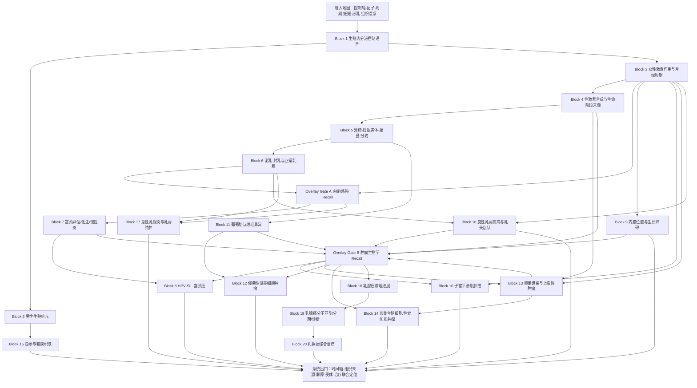

# 西综生殖—乳腺｜完整导学、认知依赖与学习顺序 v1
## 按《西综 System Guide 生成规则 v1》生成

> **文件层级**：System Guide  
> **用途**：回答“生殖—乳腺这一整套系统应该怎样学”，确定统一 Mental Model、认知依赖、Operational Blocks、跨系统路由、Memory Routing、原图门禁、范围归属与系统出口。  
> **不是**：第二份生殖生理、妇科病理或乳腺外科讲义；不提前展开 KP 正文、完整机制答案、巨大比较表、全部药物、数字、分期和手术路径。  
> **权威主干**：`生理学讲义_AI阅读版.md`、`01_生理学题纲_GPT_Project.md`、`病理学讲义_AI阅读版.md`、`02_病理学题纲_GPT_Project.md`、`27 外科跟课合集改.pdf`、`04_外科学题纲_GPT_Project.md`；必要调用《26生化.pdf》与已完成的泌尿、消化—物质代谢—内分泌、血液—免疫—感染、神经—感觉—运动—骨科 System Guide。  
> **重要来源边界**：当前资料可完整支持正常生殖生理、女性生殖系统病理、乳腺病理和乳腺外科；但**没有独立完整的妇产科学临床 Lecture / Outline，也没有完整男性生殖疾病与睾丸肿瘤 Lecture**。因此不静默扩写不孕症、异位妊娠、妊娠并发症、分娩处理、妇科肿瘤临床治疗、睾丸肿瘤或男性性功能障碍。  
> **前列腺边界**：BPH 与前列腺癌完整主体已归泌尿系统；本系统只 Recall 雄激素、DHT、5α还原酶、基底细胞缺失和激素依赖接口。  
> **生成日期**：2026-08-20  
> **状态**：v1｜source-bound System Guide；允许在 Block 深审、补充资料和实际学习反馈后修订。

---

# 0｜本文件如何使用

本系统不是三个目录的机械拼接：

```text
生殖生理
→ 女性生殖病理
→ 乳腺疾病
```

它真正围绕三套互相嵌套的运行逻辑展开。

## 0.1 生殖时间轴

```text
下丘脑—垂体给出时间化信号
→ 性腺生产配子和性激素
→ 靶组织形成周期性可受孕窗口
→ 精卵相遇、受精
→ 黄体—胎盘完成内分泌接力
→ 妊娠维持、分娩
→ 泌乳与射乳
```

## 0.2 激素敏感组织重塑轴

```text
雌激素：偏向增生、生长与受孕准备
孕激素：偏向分泌、蜕膜化、妊娠维持
雄激素：支持男性生殖、蛋白合成、骨和红系
        ↓
子宫内膜、宫颈、输卵管、阴道、乳腺等反复重塑
        ↓
刺激过强、时相错误或组织位置错误
        ↓
异常增生、异位出血、肌瘤或肿瘤风险
```

## 0.3 组织谱系—浸润—治疗轴

```text
宫颈鳞柱交界
子宫内膜与平滑肌
滋养层和绒毛
卵巢上皮 / 生殖细胞 / 性索间质
乳腺导管 / 小叶 / 肌上皮
        ↓
先辨组织来源
→ 再辨增生、原位或浸润
→ 再看扩散、受体与治疗靶点
```

实际推进：

```text
先在本 Guide 中定位当前 Block
→ 打开对应 Block Guide / 学习阅读版
→ 按 Study 连续小板块完成一次完整初见
→ 用 KP 闭卷恢复主链
→ 用 Outline 验漏
→ MI-D 在 MarginNote 3 框选成卡片
→ 原图门禁内容必须回 Study
→ 不让周期数字、核型、病理分型、TNM和药物名单阻塞机制主线
```

## 0.4 本系统采用 DAG，而不是一条假单线

```text
共同控制底座
内分泌轴—性激素—周期—妊娠—泌乳
        ↓
├─ 宫颈支路
│  ├─ 柱状上皮异位 / 鳞化 / 慢性炎
│  └─ HPV—SIL—宫颈癌
│
├─ 子宫支路
│  ├─ 内膜异位 / 腺肌病
│  ├─ 内膜增生 / 癌前门槛
│  └─ 平滑肌瘤 / 平滑肌肉瘤
│
├─ 妊娠组织支路
│  ├─ 葡萄胎
│  └─ 侵袭性葡萄胎 / 绒癌 / PSTT
│
├─ 卵巢支路
│  ├─ 上皮性肿瘤
│  ├─ 生殖细胞肿瘤
│  └─ 性索间质肿瘤
│
├─ 男性发育接口
│  └─ 隐睾 / 鞘膜积液
│
└─ 乳腺支路
   ├─ 良性肿块与乳头症状
   ├─ 哺乳期感染与脓肿
   ├─ 导管 / 小叶癌变
   └─ 分子亚型—分期—综合治疗
```

## 0.5 六条关键去重边界

### 第一，内分泌共同语言不第二次完整初见

“轴—反馈—受体—原发/继发定位”已在消化—代谢—内分泌 Block 6 完成。

本系统采用：

```text
内分泌总论：Recall
→ 生殖特异的GnRH脉冲、FSH/LH、抑制素、雌激素正反馈：Learn / Integrate
→ PRL与OT的泌乳—射乳反射：Learn / Apply
```

### 第二，前列腺完整主体继续归泌尿

本系统只调用：

- LH—睾酮；
- 睾酮—DHT；
- 5α还原酶；
- 雄激素依赖；
- 基底细胞缺失；
- 椎旁静脉骨转移接口。

不重复：

- BPH 完整诊疗；
- 前列腺癌完整诊疗；
- PSA / PAP、分期与治疗路径。

### 第三，STI、HIV、结核与免疫不重复

血液—免疫—感染已完成：

- HIV / AIDS；
- 梅毒、淋病、尖锐湿疣等病理主体；
- 结核共同机制；
- 感染严重度与源控制。

本系统只在宫颈、妊娠和乳腺场景 Apply。高危 HPV 的 E6 / E7—p53 / RB—SIL—宫颈癌链是本系统的新 Primary。

### 第四，Rh、APS、妊娠贫血和血栓只保留接口

血型、输血、APS、贫血、凝血与血栓主体已在前序系统完成。

本系统保留：

- 母胎同种免疫入口；
- 反复流产 / 血栓风险接口；
- 妊娠期贫血、出血和血栓的调用位置。

当前资料不支持完整产科管理，因此不扩写为妇产科诊疗模型。

### 第五，肿瘤共同语言不重复

基底膜、原位癌、浸润、转移、癌前病变、p53 / RB、BRCA、受体与靶向共同逻辑已在病理总论和生化分子层完成。

当前直接进入器官特异问题：

- 哪种细胞起源；
- 哪个组织层被取代；
- 是否突破基底膜 / 间质；
- 走哪条扩散路径；
- 哪个受体可成为治疗靶点。

### 第六，乳腺癌内分泌治疗只完整建立一次决策层

同一内容在三科出现，但职责分层：

```text
生理：绝经前后雌激素来源为何不同
病理：ER / HER2说明什么生物学身份
外科：何时采用内分泌、靶向、手术、放疗和化疗
```

不在三个位置分别完整重学。

---

# 1｜Scope Audit

## 1.1 当前 source-bound 客观范围

以下数字只用于排程和去重，不用于预测个人学习速度。

| 学科 / 范围 | Study 主范围 | Outline 范围 | 处置 |
|---|---|---:|---|
| 生理：内分泌共同语言与PRL / OT接口 | PDF 394–396，书页342–344 | U035相关子项；U040激素来源子项 | Recall + Integration |
| 生理：生殖 | PDF 427–438，书页371–381 | U041，共 **35题** | Primary |
| 病理：生殖系统疾病 | PDF 95–106，书页93–104 | U011，共58题；其中前列腺4题Recall | **54题 Primary / Integration** |
| 病理：乳腺疾病 | PDF 107–109，书页105–107 | U012，共 **13题** | Primary |
| 外科：乳腺癌与乳房疾病 | PDF 16–22，书页15–21 | U004–U005，共 **30题** | Primary |
| 外科：隐睾与鞘膜积液 | PDF 63–64，书页62–63 | U016中 **2题** | Primary，腹外疝其余仍归消化 |
| 生化：胆固醇—类固醇、芳香化、受体、DNA / 肿瘤 | 《26生化.pdf》相关范围 | 讲义内嵌真题 | Recall / Apply |
| 前序系统接口 | 泌尿、血液—免疫—感染、神经—骨科、病理总论 | 对应既有范围 | Recall / Apply |

### 当前体量概念

- Primary / Integration Outline：约 **134题**；
- 额外明确 Recall：前列腺4题、内分泌总论相关子项及母胎血液 / 免疫 / 感染接口；
- 主体 Study：约 **39个来源页**；
- 高密度视觉集中在月经周期、滋养细胞、卵巢肿瘤、乳腺癌病理和乳腺外科决策。

说明：

- 病理 U011 中“乳腺癌与硬化性腺病的肌上皮细胞鉴别”归乳腺支路 Primary；
- 前列腺其余4题归泌尿 Recall；
- 外科 U016 只把隐睾、鞘膜积液两个子项移入本系统，疝主体不移动；
- 泌乳—射乳 Study 有明确正文，但没有独立专门 Outline 单元，不因此删除。

## 1.2 生理学主体

### 男性生殖

- 曲细精管与间质；
- 生精细胞、支持细胞和间质细胞；
- 血—睾屏障；
- ABP、抑制素、液体、芳香化酶、5α还原酶；
- FSH 启动生精、LH 维持生精；
- 睾酮反馈和肝脏灭活；
- 精子成熟、获能与顶体反应接口。

### 女性生殖

- 雌激素与孕激素的靶器官作用；
- 卵泡期、排卵、黄体期；
- 月经期、增生期、分泌期；
- 优势卵泡；
- 高浓度雌激素正反馈；
- kisspeptin—GnRH—LH峰；
- 基础体温和排卵接口；
- 两细胞—两促性腺激素模型。

### 妊娠与泌乳

- 月经黄体—妊娠黄体—胎盘接力；
- hCG；
- hPL；
- 胎盘与胎儿共同合成 E3；
- 孕激素维持子宫静息；
- Study 口径下的分娩启动因素；
- PRL 产乳；
- OT 使肌上皮细胞收缩、促进乳汁排出；
- 吸吮引发的神经—内分泌反射。

## 1.3 病理学主体

### 宫颈

- 宫颈息肉；
- 柱状上皮异位；
- 鳞状上皮化生；
- 纳博特囊肿；
- LSIL / HSIL；
- CIN / SIL层级；
- HPV 16 / 18；
- E6 / E7；
- p16；
- 原位、微小浸润和浸润；
- 扩散与分期。

### 宫体

- 子宫内膜异位症；
- 子宫腺肌病；
- 巧克力囊肿；
- 子宫内膜增生症；
- 异型增生与子宫内膜癌的间质浸润门槛；
- 子宫平滑肌瘤；
- 玻璃样变与红色变性；
- 子宫平滑肌肉瘤。

### 滋养细胞

- 葡萄胎、侵袭性葡萄胎、绒毛膜癌；
- 完全性与部分性葡萄胎；
- 绒毛、间质血管、滋养层细胞和出血坏死；
- 肌层 / 血管侵犯；
- 血道转移；
- 染色体来源和 p57；
- 胎盘部位滋养细胞肿瘤；
- hCG / hPL 接口。

### 卵巢

- 上皮性、卵母细胞来源、性索间质三大谱系；
- 浆液性与黏液性肿瘤；
- 原发卵巢黏液癌与 Krukenberg 瘤接口；
- 畸胎瘤；
- 卵黄囊瘤；
- 粒层细胞瘤；
- 卵泡膜细胞瘤。

### 乳腺

- 普通型与异型导管增生；
- 肌上皮细胞；
- 导管原位癌、小叶原位癌；
- 浸润癌非特殊型；
- 浸润性小叶癌；
- 特殊型癌；
- 橘皮样变、酒窝征；
- 淋巴与椎旁静脉转移；
- ER / HER2。

## 1.4 外科学主体

### 乳腺癌

- 危险因素；
- 外科分类口径；
- TNM；
- 分子亚型；
- 肿块、皮肤、乳头和淋巴表现；
- 钼靶、超声、活检、ECT；
- 改良根治、全乳切除、保乳和前哨淋巴结；
- 化疗、放疗、内分泌和 HER2 靶向的角色边界。

### 其他乳房疾病

- 乳腺纤维腺瘤；
- 乳腺囊性增生病；
- 急性哺乳期乳腺炎；
- 乳房脓肿及切开引流；
- 乳管内乳头状瘤；
- 浆细胞乳腺炎；
- 乳头溢液和乳头凹陷的症状分流。

### 男性发育接口

- 隐睾；
- 睾丸、精索和交通性鞘膜积液；
- 胎儿睾丸下降与鞘突未闭接口。

## 1.5 当前没有的临床主体

### 没有完整妇产科学

不 source-bound 展开：

- 不孕症完整评估；
- 多囊卵巢综合征；
- 异位妊娠；
- 流产、早产、妊娠高血压和妊娠期糖尿病；
- 前置胎盘、胎盘早剥；
- 产程、助产和产后出血；
- 妇科炎症临床治疗；
- 宫颈、内膜、卵巢和滋养细胞肿瘤完整临床方案。

### 没有完整男性生殖临床

不展开：

- 男性不育；
- 性功能障碍；
- 前列腺炎；
- 睾丸扭转；
- 附睾炎；
- 睾丸肿瘤；
- 完整阴囊急症。

### 没有完整乳腺影像 / 病理专科

现有外科支持考研级检查和治疗决策，但不扩写：

- BI-RADS 全体系；
- 影像引导活检技术；
- 现代乳腺癌全分期方案；
- 复杂重建与整形路径。

---

# 2｜System Mission & Mental Model

## 2.1 系统真正维持什么

> **用时间化的神经—内分泌信号生产配子、建立可受孕窗口、维持妊娠并完成泌乳，同时让生殖道与乳腺的激素敏感组织在增生、分泌、退化与修复之间保持秩序。**

## 2.2 八个部件模型

### 1. 中央时钟｜Controller

```text
下丘脑 GnRH
→ 腺垂体 FSH / LH
→ 性腺
→ 性激素与抑制素反馈
```

另有：

- PRL：腺垂体，作用于乳腺腺泡细胞；
- OT：下丘脑合成、神经垂体释放，作用于乳腺肌上皮和子宫。

### 2. 性腺双单元工厂｜Gonadal Factory

男性：

```text
间质细胞：雄激素
支持细胞：支持生精、ABP、抑制素、芳香化酶等
生精细胞：形成精子
```

女性：

```text
内泡膜细胞：在LH作用下先形成雄激素前体
颗粒细胞：在FSH作用下经芳香化形成雌激素
卵母细胞：生殖细胞核心
```

### 3. 配子运输与相遇通路｜Route

- 精子成熟、暂时静止、获能、顶体反应；
- 宫颈黏液和输卵管运动；
- 输卵管壶腹部受精接口；
- 子宫内膜接受植入。

### 4. 周期性靶组织｜Cyclic Target

- 子宫内膜；
- 子宫肌；
- 宫颈；
- 输卵管；
- 阴道；
- 乳腺。

这些组织随 E / P 比例和时相发生增生、分泌、蜕膜化、退化与修复。

### 5. 妊娠内分泌接力器｜Placental Relay

```text
受精
→ hCG保住妊娠黄体
→ 早期黄体分泌E / P
→ 胎盘接替
→ 胎盘—胎儿共同形成E3
→ 妊娠维持与分娩准备
```

### 6. 乳腺功能单元｜Lactation Unit

```text
雌激素：导管发育
孕激素：腺泡发育
PRL：产乳
OT：肌上皮收缩与乳汁排出
导管通畅：保证乳汁排空
```

### 7. 组织谱系与屏障｜Lineage & Boundary

- 宫颈鳞状 / 柱状上皮及基底膜；
- 子宫内膜腺体 / 间质；
- 子宫平滑肌；
- 绒毛与滋养层；
- 卵巢上皮 / 生殖细胞 / 性索间质；
- 乳腺导管 / 小叶 / 肌上皮。

### 8. 激素—感染—克隆秩序｜Control of Growth

组织需要同时避免：

- 激素刺激过强；
- 慢性炎症和错误化生；
- HPV致抑癌基因失活；
- 异型增生突破基底膜；
- 滋养层异常侵袭；
- 受体驱动的乳腺克隆扩张。

## 2.3 四条运行回路

### 生殖轴回路

```text
GnRH脉冲
→ FSH / LH
→ 性腺细胞
→ 配子 + E / P / A + 抑制素
→ 正 / 负反馈
```

### 女性周期回路

```text
雌孕激素撤退
→ FSH募集卵泡
→ 雌激素上升
→ 优势卵泡
→ 高雌激素正反馈与LH峰
→ 排卵
→ 黄体与孕激素
→ 未受精则撤退并月经
```

### 妊娠—泌乳回路

```text
受精
→ hCG维持妊娠黄体
→ 胎盘接力
→ 妊娠维持与分娩准备
→ 吸吮
→ PRL产乳 + OT射乳
```

### 组织病变回路

```text
生理性增生 / 化生 / 分泌
→ 持续刺激、感染或遗传异常
→ 异型增生 / 克隆扩张
→ 基底膜或间质突破
→ 扩散
→ 受体与分期决定治疗目标
```

---

# 3｜Input / Output Contract

## 3.1 Input｜进入本系统前需要什么

### Hard prerequisite

- 内分泌共同语言：轴、反馈、脉冲、受体和激素分类；
- 胆固醇—类固醇激素与芳香化接口；
- 病理增生、化生、异型增生、原位癌、浸润和转移；
- p53、RB、DNA损伤、癌基因 / 抑癌基因；
- 炎症与源控制；
- 血型、凝血、血栓和母胎免疫最低接口；
- 基本神经—内分泌反射。

### 分 Block Hard prerequisite

- Block 2–5：Block 1；
- Block 3–5：雌激素 / 孕激素靶组织作用；
- Block 6：Block 5 + PRL / OT接口；
- Block 8、10–14、18–20：肿瘤共同语言 Recall Gate；
- Block 11–12：Block 5 的黄体—胎盘—hCG；
- Block 13–14：卵泡结构与两细胞模型；
- Block 16–20：Block 6 正常乳腺功能；
- Block 17：炎症与源控制；
- Block 20：Block 4 的绝经前后雌激素来源 + Block 18–19。

### Soft prerequisite

- 骨盆和腹股沟基本解剖；
- 乳房导管、腺泡、肌上皮和腋窝淋巴结构；
- 染色体与亲本印记最低概念；
- 妊娠生理的一般时间感；
- 影像与活检证据层。

## 3.2 Output｜学完以后输出什么

### 向剩余外科 / 围术期

- 乳腺手术与前哨淋巴结决策；
- 哺乳期感染和源控制；
- 激素状态对围术期用药与风险的接口；
- 妊娠 / 哺乳状态识别。

### 向中毒与药理接口

- ER、HER2、芳香化酶、5α还原酶等靶点身份；
- PRL / OT 的来源和效应；
- 类固醇激素受体和反馈。

### 向全西综整合

- 性激素来源—靶组织—反馈三层定位；
- 周期—妊娠—泌乳时间轴；
- 增生—原位—浸润的屏障判断；
- 滋养细胞和卵巢肿瘤的组织来源定位；
- 乳房肿块、溢液、红肿和皮肤改变的症状分流；
- 受体—分子亚型—治疗方式的匹配；
- 前列腺主体归属的最终去重。

---

# 4｜Core Variables & Failure Modes

## 4.1 最小变量语言

```text
GnRH pulse｜促性腺激素释放节律
FSH / LH｜促性腺激素
Inhibin｜FSH选择性反馈
A / T / DHT｜雄激素、睾酮、双氢睾酮
E1 / E2 / E3｜雌酮、雌二醇、雌三醇
P｜孕激素
PRL / OT｜产乳与射乳
hCG / hPL｜妊娠与滋养层接口
Follicular / ovulatory / luteal phase｜卵泡、排卵、黄体
Menstrual / proliferative / secretory phase｜月经、增生、分泌
Cervical mucus / basal temperature｜宫颈黏液与基础体温
Germ cell / Sertoli / Leydig｜男性细胞单元
Oocyte / granulosa / theca｜女性卵泡单元
Villus / trophoblast / myometrium｜绒毛、滋养层、肌层
Epithelial / germ-cell / sex-cord stromal｜卵巢谱系
Basement membrane / stromal invasion｜基底膜与间质浸润
Myoepithelial cell｜乳腺肌上皮
ER / PR / HER2 / Ki-67｜乳腺分子身份
T / N / M｜乳腺临床分期变量
Mass / pain / discharge / skin / node｜乳房症状入口
```

## 4.2 十二类 Failure Modes

### 1. 中央节律或反馈失衡

- GnRH脉冲和FSH / LH输出异常；
- 正负反馈时相错误；
- PRL / OT反射异常接口。

### 2. 配子生产或支持单元失败

- 生精细胞、支持细胞、间质细胞功能异常；
- 卵泡细胞与卵母细胞协同异常；
- 隐睾造成发育 / 生精风险接口。

### 3. 性激素合成、转换或作用异常

- 胆固醇底物、芳香化、5α还原；
- 激素灭活异常；
- 受体和靶组织反应异常。

### 4. 周期和排卵失配

- 卵泡募集失败；
- 无优势卵泡；
- LH峰或排卵异常；
- 黄体撤退或持续异常。

### 5. 配子运输、相遇或植入环境异常

- 获能 / 顶体反应接口；
- 宫颈黏液、输卵管和内膜状态不匹配；
- 鞘突和睾丸下降发育异常。

### 6. 内膜组织位置错误或刺激过强

- 子宫内膜异位与周期性出血；
- 雌激素持续刺激导致内膜增生和癌前改变。

### 7. 慢性炎症—化生—病毒性癌变

- 宫颈柱状上皮异位与鳞化；
- HPV挖空细胞、SIL和抑癌基因失活；
- 乳腺导管感染和无菌性炎症。

### 8. 间叶组织克隆性生长

- 子宫平滑肌瘤；
- 平滑肌肉瘤；
- 激素环境与肿瘤行为接口。

### 9. 绒毛与滋养层异常增殖

- 葡萄胎；
- 侵袭性葡萄胎；
- 绒毛膜癌；
- PSTT。

### 10. 卵巢组织谱系克隆异常

- 上皮性；
- 生殖细胞；
- 性索间质；
- 原发与转移性卵巢肿瘤。

### 11. 乳汁淤积与感染失控

- 排空不足；
- 细菌进入；
- 蜂窝织炎 / 脓肿；
- 需要切开引流。

### 12. 乳腺上皮克隆进展

```text
普通增生
→ 异型增生
→ 原位癌
→ 突破肌上皮 / 基底膜
→ 浸润和扩散
→ 受体与分期决定综合治疗
```

---

# 5｜Dependency Graph



## 5.1 为什么这样排

1. **先恢复生殖轴，再分别进入男性和女性。**  
   先知道控制层，后续才不会把 FSH、LH、E、P、hCG、PRL、OT 当成孤立名单。

2. **女性先学靶组织作用和周期，再学激素来源。**  
   先知道激素“做什么”，再理解两细胞模型和生命阶段来源更顺。

3. **妊娠必须建立在黄体和周期之上。**  
   hCG 的作用本质上是阻止原本应发生的黄体退化和激素撤退。

4. **泌乳紧接妊娠，但与胎盘激素分开。**  
   PRL产乳、OT射乳与 hPL、E、P 的身份不能混在一张表中。

5. **病理按组织入口分支。**  
   宫颈、内膜、平滑肌、滋养层、卵巢和乳腺拥有不同细胞来源，不制造假统一病因。

6. **同一组织先正常，再异常。**  
   宫颈病变调用雌激素和鳞化；滋养细胞病调用正常胎盘；乳腺癌调用正常导管 / 腺泡 / 肌上皮。

7. **乳腺癌采用病理→临床身份→治疗三层。**  
   先成立原位 / 浸润和组织类型，再进入 TNM、分子亚型和综合治疗。

8. **前列腺不进入本系统主 DAG。**  
   只在男性雄激素和系统整合中 Recall，完整模型继续留在泌尿。

---

# 6｜Operational Block Route

# Block 1｜生殖内分泌控制语言：轴、脉冲、反馈与反射

**中心问题**

> 生殖系统如何把下丘脑—垂体信号转换成配子、性激素、周期、妊娠和泌乳；哪些属于靶腺轴，哪些属于神经—内分泌反射？

**为什么现在学**

后续所有激素题的错误，常来自把“来源、靶细胞、反馈和最终效应”混成一层。

**前置**

- Hard：内分泌共同语言。
- Soft：膜受体、核受体和第二信使。

**Study 主范围**

- 生理 PDF 394–396：Recall；
- 生理 PDF 427–435 中控制轴相关部分：Integration。

**Outline 主范围**

- U035 相关子项；
- U041 中反馈和促性腺激素控制相关题。

**必要原图**

- 下丘脑—腺垂体—性腺轴；
- GnRH脉冲；
- FSH / LH靶细胞；
- 长反馈与抑制素；
- 高雌激素正反馈；
- PRL / OT来源与反射。

**动作配置**

- Learn / Integrate：生殖轴拓扑、脉冲、负反馈、排卵期正反馈、PRL / OT控制方式。
- Recall：激素分类、膜 / 核受体、长短反馈。
- Apply：Block 2–6。
- Defer：具体靶组织效应和周期曲线。

**知识形态**

- Mechanism Spine：中枢信号 → 促激素 → 性腺 / 乳腺 → 终末激素或效应 → 反馈。
- Discrimination Tree：靶腺轴 / 无靶腺激素；体液反馈 / 神经反射；负反馈 / 正反馈。
- MI-G：激素来源和靶细胞不能错位；OT不是腺垂体激素。
- MI-D：全部核团、脉冲细节和相似作用清单。

**客观负荷画像**

- 首轮主线负荷：重
- Memory Island 负担：高
- 视觉负担：高
- 跨科整合负担：很重
- 主要负荷来源：同一激素可同时涉及来源、受体、反馈和器官效应

**出口问题**

1. GnRH、FSH、LH、性激素和抑制素分别位于哪一层？
2. 为什么多数性激素是负反馈，而排卵前高雌激素是正反馈？
3. PRL与OT分别由哪里产生、作用于哪种细胞？
4. “产乳”和“乳汁排出”为什么是两条控制链？

**进入下一 Block 的最低标准**

能先报出激素所在层级，再谈作用和反馈。

---

# Block 2｜男性生殖单元：支持细胞、间质细胞与生精细胞怎样协作

**中心问题**

> 睾丸如何同时完成精子生产和雄激素分泌；FSH、LH、睾酮与抑制素怎样分别控制支持细胞和间质细胞？

**前置**

- Hard：Block 1。
- Soft：类固醇激素与血—组织屏障。

**Study 主范围**

- 生理 PDF 427–429，书页371–373。

**Outline 主范围**

- U041 男性生殖、雄激素与精子获能，共 **11题**。

**必要原图**

- 曲细精管与间质；
- 生精细胞—支持细胞关系；
- 血—睾屏障；
- FSH / LH—细胞对应；
- ABP、抑制素、芳香化酶、5α还原酶；
- 精子获能与顶体反应。

**动作配置**

- Learn：三类细胞；生精支持；雄激素作用与反馈；肝脏灭活；获能和顶体反应。
- Recall：胆固醇、DHT、EPO、肝脏生物转化。
- Apply：隐睾、肝硬化男性乳房发育、前列腺激素接口。
- Defer：男性不育、性功能障碍、睾丸肿瘤和前列腺完整诊疗。

**知识形态**

- Mechanism Spine：FSH→支持细胞→生精环境；LH→间质细胞→睾酮→维持生精与全身效应。
- Discrimination Tree：支持 / 间质 / 生精细胞；启动 / 维持生精；睾酮 / DHT。
- MI-G：血—睾屏障、FSH / LH靶细胞、抑制素选择性反馈。
- MI-D：全部分泌物、代谢效应和获能细节。

**客观负荷画像**

- 首轮主线负荷：很重
- Memory Island 负担：很高
- 视觉负担：很高
- 跨科整合负担：很重
- 主要负荷来源：细胞分工与激素方向容易交叉错位

**出口问题**

1. 支持细胞为什么既是结构细胞，也是内分泌调节细胞？
2. FSH为何被称为启动生精，LH为何维持生精？
3. 睾酮怎样同时反馈LH和FSH？
4. 精子在附睾成熟与在女性生殖道获能有何不同？
5. 5α还原酶接口为何属于Recall而不是重学前列腺？

**进入下一 Block 的最低标准**

能从任一激素反推细胞，再从细胞反推分泌物和功能。

---

# Block 3｜女性激素作用与月经周期：靶组织如何随时间重塑

**中心问题**

> 雌激素和孕激素分别怎样改变子宫内膜、宫颈、输卵管、阴道和乳腺；这些效应如何组成卵泡期—排卵—黄体期与月经—增生—分泌期？

**前置**

- Hard：Block 1。
- Soft：子宫内膜基本结构。

**Study 主范围**

- 生理 PDF 429–432，书页373–376。

**Outline 主范围**

- U041 女性激素和月经周期，共 **12题**。

**必要原图**

- 雌激素 vs 孕激素靶器官图；
- 卵巢周期；
- 子宫内膜周期；
- E / P / FSH / LH曲线；
- 优势卵泡；
- kisspeptin—GnRH—LH峰；
- 基础体温双相。

**动作配置**

- Learn：E / P作用；雌孕激素撤退；卵泡募集；优势卵泡；正反馈；排卵；黄体。
- Recall：反馈与类固醇受体。
- Apply：内膜异位、内膜增生、宫颈异位、乳腺增生和妊娠。
- Defer：无排卵和不孕症临床诊疗。

**知识形态**

- Mechanism Spine：激素撤退 → 卵泡期 → 高雌激素与LH峰 → 排卵 → 黄体与孕激素 → 再撤退或进入妊娠。
- Discrimination Tree：卵巢周期 / 内膜周期；雌激素作用 / 孕激素作用；第一次 / 第二次雌激素高峰。
- MI-G：排卵门槛、E / P靶组织方向、黄体撤退。
- MI-D：全部天数、峰值、基础体温和宫颈黏液细节。

**客观负荷画像**

- 首轮主线负荷：很重
- Memory Island 负担：很高
- 视觉负担：很高
- 跨科整合负担：很重
- 主要负荷来源：三条时间轴必须同步而不能混成一个名称表

**出口问题**

1. 月经、卵泡募集和FSH升高怎样由同一“激素撤退”启动？
2. 为什么优势卵泡形成时FSH反而下降？
3. 排卵前高雌激素为什么从负反馈切换为正反馈？
4. 雌激素和孕激素都可使内膜“变厚”，机制有何不同？
5. 为什么输卵管结扎不影响排卵和月经？

**进入下一 Block 的最低标准**

能闭卷画出卵巢、内膜和激素三条同步时间轴。

---

# Block 4｜性激素合成与生命阶段来源：同一种雌激素从哪里来

**中心问题**

> 卵泡为何需要内泡膜细胞和颗粒细胞协作；排卵后、妊娠期和绝经后，雌孕激素来源如何切换？

**前置**

- Hard：Block 3。
- Recall：胆固醇、类固醇合成、芳香化酶和核受体。

**Study 主范围**

- 生理 PDF 433–435，书页377–379 中卵巢、黄体和绝经后来源部分。

**Outline 主范围**

- U041“女性雌激素来源”中的两细胞模型、LH / FSH比较、绝经后来源和乳腺内分泌接口，约 **4题**。

**必要原图**

- 两细胞—两促性腺激素；
- 胆固醇→孕激素→雄激素→雌激素；
- 卵泡 vs 黄体；
- 绝经后肾上腺雄激素—脂肪芳香化；
- 绝经前后乳腺内分泌治疗接口。

**动作配置**

- Learn：内泡膜 / 颗粒细胞分工；排卵后黄体变化；绝经后来源。
- Recall：类固醇合成和芳香化。
- Apply：性索间质肿瘤、内膜 / 乳腺雌激素暴露、乳腺癌治疗。
- Defer：完整药理和绝经医学。

**知识形态**

- Mechanism Spine：胆固醇前体 → 细胞分工 → 芳香化 → 雌激素；生命阶段改变主要生产组织。
- Discrimination Tree：内泡膜 / 颗粒；卵泡 / 黄体；绝经前 / 后。
- MI-G：哪种细胞受LH或FSH；绝经后雌激素主要来源。
- MI-D：全部甾体中间产物和药物名称。

**客观负荷画像**

- 首轮主线负荷：重
- Memory Island 负担：高
- 视觉负担：很高
- 跨科整合负担：很重
- 主要负荷来源：同一代谢链被分配到不同细胞和生命阶段

**出口问题**

1. 颗粒细胞为什么依赖内泡膜细胞提供雄激素前体？
2. LH和FSH在卵巢与睾丸中的对应细胞是什么？
3. 排卵后颗粒细胞为何能更直接获得胆固醇？
4. 绝经后肥胖为什么与雌激素暴露和乳腺癌接口相关？

**进入下一 Block 的最低标准**

能按“细胞—酶—产物—生命阶段”定位性激素来源。

---

# Block 5｜受精、妊娠黄体、胎盘与分娩：内分泌接力如何阻止月经重启

**中心问题**

> 受精后为何不发生黄体退化和雌孕激素撤退；hCG、妊娠黄体、胎盘、胎儿和孕激素怎样完成妊娠内分泌接力？

**前置**

- Hard：Block 3–4。
- Soft：精子获能、输卵管壶腹部和植入概念。

**Study 主范围**

- 生理 PDF 434–435，书页378–379 中妊娠黄体、胎盘和分娩部分；
- PDF 429 的受精接口。

**Outline 主范围**

- U041“女性雌激素来源”中妊娠与胎盘相关，约 **8题**。

**必要原图**

- 精子获能—顶体反应—受精；
- 月经黄体→妊娠黄体；
- hCG时间曲线；
- 黄体→胎盘接力；
- 胎盘—胎儿共同合成E3；
- 胎盘激素；
- Study分娩启动链。

**动作配置**

- Learn：受精接口；hCG；妊娠黄体；胎盘接替；E3；hPL；孕激素和分娩准备。
- Recall：LH相似作用、性激素靶组织、母胎免疫最低接口。
- Apply：滋养细胞疾病、hCG / hPL标志、妊娠期乳腺发育。
- Defer：完整产科检查、胎儿监护、产程与妊娠并发症。

**知识形态**

- Mechanism Spine：受精 → 滋养层hCG → 黄体继续分泌E / P → 胎盘接力 → 妊娠维持 → 分娩准备。
- Discrimination Tree：月经黄体 / 妊娠黄体；hCG / hPL / E3 / P；黄体来源 / 胎盘来源。
- MI-G：hCG作用、黄体—胎盘接力、E3共同来源。
- MI-D：时间峰值、全部胎盘激素和相似作用配对。

**客观负荷画像**

- 首轮主线负荷：很重
- Memory Island 负担：很高
- 视觉负担：很高
- 跨科整合负担：很重
- 主要负荷来源：正常周期被妊娠信号重新接管

**出口问题**

1. hCG怎样阻止黄体退化和月经来潮？
2. 妊娠早期与后期E / P的主要来源为何不同？
3. E3为什么能反映胎盘—胎儿共同功能？
4. hPL与PRL为什么不能因名称相似而等同？
5. 当前资料对分娩机制掌握到什么边界？

**进入下一 Block 的最低标准**

能把月经周期终点改写为妊娠内分泌接力，而不是另背一套激素表。

---

# Block 6｜泌乳、射乳与正常乳腺：产奶、排奶和导管通畅是三件事

**中心问题**

> 雌孕激素怎样建立乳腺结构；PRL怎样使腺泡产乳，OT怎样使肌上皮收缩排乳，乳汁淤积又为何会成为感染入口？

**前置**

- Hard：Block 1、3、5。
- Soft：乳腺腺泡—导管—肌上皮结构。

**Study 主范围**

- 生理 PDF 394–395，书页342–343 中PRL / OT与射乳反射；
- 生理 PDF 429，书页373 中雌激素—导管、孕激素—腺泡；
- 病理 / 外科乳腺结构接口。

**Outline 主范围**

- U035神经内分泌和无靶腺激素相关子项：Recall / Integration；
- 当前无独立泌乳专门Outline单元。

**必要原图**

- 乳腺腺泡、导管和肌上皮；
- E / P发育部位；
- 婴儿吸吮→下丘脑→PRL / OT；
- 产乳 vs 射乳；
- 导管排空；
- 乳汁淤积—感染入口。

**动作配置**

- Learn：乳腺功能单元；产乳和射乳；神经—内分泌反射；导管排空。
- Recall：E / P、PRL / OT来源和受体层级。
- Apply：乳腺炎、乳瘘、肌上皮细胞丢失、乳腺癌。
- Defer：哺乳指导、乳汁成分和完整产后管理。

**知识形态**

- Mechanism Spine：乳腺发育 → PRL产乳 → OT射乳 → 导管排空 → 维持泌乳与降低淤积。
- Discrimination Tree：产乳 / 射乳；腺泡上皮 / 肌上皮；乳汁淤积 / 细菌感染。
- MI-G：PRL与OT身份；脓肿出现后源控制门槛。
- MI-D：全部反射调节因子和哺乳药物。

**客观负荷画像**

- 首轮主线负荷：重
- Memory Island 负担：中高
- 视觉负担：很高
- 跨科整合负担：很重
- 主要负荷来源：同一吸吮动作同时触发两条不同激素链

**出口问题**

1. E、P、PRL、OT分别作用于乳腺哪一层？
2. 为什么有乳汁不等于乳汁能顺利排出？
3. 肌上皮细胞为何既是正常射乳结构，也是乳腺病理鉴别标志？
4. 乳汁淤积怎样连接急性乳腺炎？

**进入下一 Block 的最低标准**

能用“结构发育—产乳—射乳—排空”解释正常哺乳和感染入口。

---

# Block 7｜宫颈柱状上皮异位、鳞化与慢性炎：位置变化不等于真正糜烂

**中心问题**

> 雌激素使宫颈柱状上皮下移后，为什么肉眼似糜烂却没有上皮缺损；酸性环境、慢性炎症和腺口阻塞怎样分别形成鳞化、息肉和纳博特囊肿？

**前置**

- Hard：Block 3 的雌激素和阴道酸性环境；炎症 / 化生 Recall。
- Soft：宫颈管和宫颈阴道部上皮分布。

**Study 主范围**

- 病理 PDF 95，书页93。

**Outline 主范围**

- U011 慢性宫颈炎，共 **5题**。

**必要原图**

- 宫颈管柱状上皮与阴道部鳞状上皮；
- 柱状上皮异位；
- 原始 / 新鳞柱交界；
- 鳞状上皮化生；
- 宫颈息肉；
- 纳博特囊肿。

**动作配置**

- Learn：异位、化生、息肉和潴留囊肿的结构链。
- Recall：增生性炎、化生、糜烂与溃疡定义。
- Apply：宫颈癌好发部位和HPV感染入口。
- Defer：妇科检查、筛查和宫颈炎治疗。

**知识形态**

- Mechanism Spine：雌激素→柱状上皮下移→酸性环境→鳞化；慢性刺激→增生；腺口阻塞→黏液潴留。
- Discrimination Tree：异位 / 化生；假性糜烂 / 真正糜烂；息肉 / 囊肿。
- MI-G：柱状上皮异位不是柱状上皮化生；鳞柱交界是后续癌变定位门槛。
- MI-D：全部肉眼描述和旧版 / 新版术语。

**客观负荷画像**

- 首轮主线负荷：中重
- Memory Island 负担：中
- 视觉负担：很高
- 跨科整合负担：高
- 主要负荷来源：相似术语实际对应不同病理过程

**出口问题**

1. 假性宫颈糜烂为什么不是上皮坏死脱落？
2. 柱状上皮异位与鳞状上皮化生先后关系是什么？
3. 新鳞柱交界怎样形成？
4. 纳博特囊肿为何属于腺口阻塞和潴留？

**进入下一 Block 的最低标准**

能明确区分“位置改变、细胞类型改变、组织缺损和腔内潴留”。

---

# Block 8｜高危HPV—SIL—宫颈癌：从病毒效应到突破基底膜

**中心问题**

> 高危HPV如何使宫颈鳞状上皮由挖空细胞和异型增生走向HSIL、原位癌与浸润癌；层次、基底膜和扩散范围怎样决定诊断身份？

**前置**

- Hard：Block 7；肿瘤生物学 Recall Gate。
- Recall：感染系统中的HPV / 挖空细胞接口。

**Study 主范围**

- 病理 PDF 96–97，书页94–95。

**Outline 主范围**

- U011 宫颈癌，共 **11题**。

**必要原图**

- 正常宫颈上皮层次；
- LSIL / HSIL / CIN；
- 挖空细胞；
- 异型细胞由基底向表层扩展；
- 腺体累及但基底膜未破；
- HPV E6 / E7；
- p16；
- 原位、微小浸润和浸润；
- 宫颈癌扩散与临床分期图。

**动作配置**

- Learn：SIL层级；高危HPV；E6 / E7—p53 / RB；p16；浸润门槛；扩散和Study分期。
- Recall：原位癌、基底膜、淋巴 / 直接蔓延。
- Apply：宫颈筛查和病理定位的最低接口。
- Defer：HPV疫苗、筛查程序和完整妇科肿瘤治疗。

**知识形态**

- Mechanism Spine：高危HPV持续感染 → 抑癌通路失活 → 异型细胞逐层扩展 → 基底膜突破 → 浸润与扩散。
- Discrimination Tree：LSIL / HSIL；CIN累及腺体 / 浸润；原位 / 微小浸润 / 浸润。
- MI-G：HSIL身份、基底膜是否突破、p16辅助意义。
- MI-D：全部分级数字、浸润深度和临床分期范围。

**客观负荷画像**

- 首轮主线负荷：很重
- Memory Island 负担：很高
- 视觉负担：很高
- 跨科整合负担：很重
- 主要负荷来源：细胞层次、病毒分子与临床分期同时出现

**出口问题**

1. 异型细胞累及全层为何仍可能只是原位癌？
2. CIN累及腺体为何不等于向间质浸润？
3. E6 / E7分别接到哪类抑癌通路？
4. p16阳性在当前Study中承担什么角色？
5. 原始与新鳞柱交界如何影响“癌与化生是否有关”的判断？

**进入下一 Block 的最低标准**

面对切片先判层次与屏障，再谈级别、分期和扩散。

---

# Block 9｜子宫内膜位置与生长障碍：同一组织可“长错地方”或“长得过多”

**中心问题**

> 对卵巢激素敏感的子宫内膜，为什么在异位时出现周期性出血，在宫腔内持续受雌激素刺激时又会发生增生和癌前改变？

**前置**

- Hard：Block 3 的内膜周期与雌激素 / 孕激素作用。
- Recall：出血、含铁血黄素、增生与异型增生。

**Study 主范围**

- 病理 PDF 98，书页96。

**Outline 主范围**

- U011 子宫内膜异位症3题；
- U011 子宫内膜增生症3题；
- 合计 **6题**。

**必要原图**

- 正常内膜腺体与间质；
- 子宫内膜异位部位；
- 子宫腺肌病；
- 卵巢巧克力囊肿；
- 内膜增生不伴不典型性；
- 异型增生；
- 背靠背腺体；
- 间质浸润门槛。

**动作配置**

- Learn：异位组织的周期反应；巧克力囊肿；雌激素驱动增生；异型增生与癌的边界。
- Recall：内膜周期、陈旧出血、癌前病变。
- Apply：卵巢病变和乳腺 / 内膜共同雌激素暴露网络。
- Defer：疼痛、不孕、影像和完整妇科治疗。

**知识形态**

- Mechanism Spine：
  - 异位：正常内膜组织出现在错误位置 → 周期性出血 → 囊肿 / 纤维化；
  - 增生：持续雌激素刺激 → 腺体拥挤与异型 → 癌前风险。
- Discrimination Tree：异位症 / 腺肌病；增生不伴不典型 / 异型增生 / 腺癌。
- MI-G：子宫内膜癌的关键边界是间质浸润。
- MI-D：好发部位、风险比例、距离和形态细节。

**客观负荷画像**

- 首轮主线负荷：重
- Memory Island 负担：高
- 视觉负担：很高
- 跨科整合负担：很重
- 主要负荷来源：同一组织需按“位置”和“生长性质”建立两条独立轴

**出口问题**

1. 子宫内膜异位症的定义为何不是“出现在子宫外”？
2. 巧克力囊肿中的内容物为何是陈旧血液？
3. 雌激素为什么同时连接正常增生期和病理性内膜增生？
4. 异型增生与内膜癌最关键的结构边界是什么？

**进入下一 Block 的最低标准**

能把“位置错误”和“增生失控”分开成立，再在雌激素接口汇合。

---

# Block 10｜子宫平滑肌瘤与平滑肌肉瘤：组织排列、坏死和核分裂决定身份

**中心问题**

> 来源同为子宫平滑肌时，良性肌瘤、肌瘤变性和平滑肌肉瘤怎样通过边界、细胞异型、核分裂和组织结构区分？

**前置**

- Hard：肿瘤总论 Recall Gate。
- Soft：Block 3–4 的雌激素环境。

**Study 主范围**

- 病理 PDF 98–99，书页96–97。

**Outline 主范围**

- U011 子宫平滑肌瘤，共 **4题**。

**必要原图**

- 黏膜下 / 肌壁间 / 浆膜下位置；
- 旋涡 / 编织 / 束状排列；
- 玻璃样变；
- 妊娠期红色变性；
- 平滑肌肉瘤异型和核分裂。

**动作配置**

- Learn：肌瘤位置和形态；常见变性；肉瘤病理边界。
- Recall：良恶性、间叶来源、坏死和血栓。
- Apply：妊娠期红色变性和雌激素相关组织。
- Defer：肌瘤临床分型、手术和妇科治疗。

**知识形态**

- Mechanism Spine：平滑肌克隆扩张 → 良性组织型增生或恶性细胞型进展 → 变性 / 坏死与临床表现。
- Discrimination Tree：肌瘤 / 肉瘤；玻璃样变 / 红色变性；位置分型。
- MI-G：肉瘤以显著异型和核分裂增多等恶性证据为核心。
- MI-D：全部位置、变性和手术相关细节。

**客观负荷画像**

- 首轮主线负荷：中重
- Memory Island 负担：高
- 视觉负担：很高
- 跨科整合负担：高
- 主要负荷来源：良性肿瘤的特殊边界和变性形态

**出口问题**

1. 子宫平滑肌瘤为何虽为良性却可无包膜？
2. 肌瘤变性为什么不等于恶变？
3. 妊娠期红色变性的上游病理是什么？
4. 平滑肌肉瘤的判断为何不能只看“肿块大”？

**进入下一 Block 的最低标准**

能用组织形态和细胞恶性证据，而不是用名称或大小判断良恶性。

---

# Block 11｜葡萄胎与绒毛异常：胎盘绒毛为什么变成“水泡”

**中心问题**

> 正常绒毛和滋养层发生怎样的水肿、血管和遗传改变才形成葡萄胎；完全性与部分性葡萄胎为何在胎儿组织、核型和p57上不同？

**前置**

- Hard：Block 5 的正常胎盘—hCG；肿瘤共同语言 Recall。
- Soft：染色体、亲本来源和印记最低接口。

**Study 主范围**

- 病理 PDF 99–101 中滋养细胞共同图和葡萄胎部分，书页97–99。

**Outline 主范围**

- U011 滋养细胞疾病总论2题；
- U011 葡萄胎3题；
- 合计 **5题**。

**必要原图**

- 正常绒毛；
- 水泡状绒毛；
- 绒毛间质水肿、血管和红细胞；
- 滋养层增生；
- 完全性 / 部分性葡萄胎；
- 胎儿组织；
- 核型和亲本来源；
- p57核染色。

**动作配置**

- Learn：共同来源；绒毛水肿；完全 / 部分性葡萄胎；遗传与p57。
- Recall：hCG、绒毛和胎盘结构。
- Apply：Block 12的侵袭和肿瘤比较。
- Defer：葡萄胎临床处理、随访和妇产科方案。

**知识形态**

- Mechanism Spine：异常受精 / 亲本遗传构成 → 绒毛发育异常 → 间质水肿、血管异常和滋养层增生。
- Discrimination Tree：完全 / 部分；良性葡萄胎 / 侵袭性疾病。
- MI-G：有无胎儿组织、亲本来源和p57方向。
- MI-D：全部核型、受精组合和比例。

**客观负荷画像**

- 首轮主线负荷：很重
- Memory Island 负担：很高
- 视觉负担：很高
- 跨科整合负担：很重
- 主要负荷来源：病理形态与遗传来源必须相互映射

**出口问题**

1. 葡萄状外观来自哪一层结构改变？
2. 绒毛血管异常如何帮助理解完全性 / 部分性差别？
3. 为什么p57能帮助判断亲本来源？
4. 葡萄胎“滋养层增生”与正常胎盘hCG之间是什么关系？

**进入下一 Block 的最低标准**

能从受精遗传构成推到绒毛、胎儿组织和p57，不只背核型。

---

# Block 12｜侵袭性葡萄胎、绒毛膜癌与PSTT：有无绒毛决定哪一种恶性行为

**中心问题**

> 滋养层病变进入肌层、血管或远处后，如何根据绒毛是否保留、细胞类型、出血坏死、转移和hCG / hPL判断侵袭性葡萄胎、绒癌或PSTT？

**前置**

- Hard：Block 11。
- Recall：血道转移、肿瘤间质与血管。

**Study 主范围**

- 病理 PDF 100–102，书页98–100 中侵袭性葡萄胎、绒癌和PSTT部分。

**Outline 主范围**

- U011 葡萄胎VS绒癌7题；
- U011 PSTT 3题；
- 合计 **10题**。

**必要原图**

- 良性葡萄胎 / 侵袭性葡萄胎 / 绒癌比较图；
- 两种滋养层细胞；
- 绒毛有无；
- 肌层和血管侵犯；
- 阴道蓝紫色结节；
- 肺转移；
- 绒癌出血坏死；
- PSTT中间型滋养细胞；
- hCG / hPL。

**动作配置**

- Learn：侵袭、转移、绒毛身份、细胞来源、PSTT和激素标志。
- Recall：Block 11形态、hCG和血流方向。
- Apply：阴道结节、咯血、化疗敏感性的Study接口。
- Defer：完整临床治疗和随访。

**知识形态**

- Mechanism Spine：
  - 侵袭性葡萄胎：水泡状绒毛侵入肌层 / 血管；
  - 绒癌：滋养层恶性增殖、无绒毛、出血坏死和血道转移；
  - PSTT：中间型滋养细胞肿瘤。
- Discrimination Tree：有绒毛 / 无绒毛；侵犯 / 转移；hCG主导 / hPL主导。
- MI-G：绒毛、肌层 / 血管侵犯和转移三项必须同时判断。
- MI-D：全部比较细节、转移部位和治疗方式。

**客观负荷画像**

- 首轮主线负荷：很重
- Memory Island 负担：很高
- 视觉负担：很高
- 跨科整合负担：很重
- 主要负荷来源：三个病变共享来源但生物学行为不同

**出口问题**

1. 侵袭性葡萄胎为什么可侵犯却几乎不发生真正转移？
2. 绒癌为何无绒毛、无自身间质血管却高度血道转移？
3. 两种阴道蓝紫色结节的形成机制为何不同？
4. PSTT为何更偏向hPL和中间型滋养细胞？
5. 有无绒毛如何成为最有用的第一层鉴别轴？

**进入下一 Block 的最低标准**

能先按“绒毛—细胞—侵犯—转移—激素”五轴定位。

---

# Block 13｜卵巢谱系地图与上皮性肿瘤：先判来源，再看单双侧和间质浸润

**中心问题**

> 卵巢肿瘤为什么必须先分上皮性、生殖细胞和性索间质；浆液性、黏液性与转移性黏液癌如何用囊液、乳头、单双侧和间质浸润定位？

**前置**

- Hard：Block 3–4的卵泡结构；肿瘤共同语言 Recall。
- Recall：Krukenberg瘤与胃肠肿瘤种植 / 转移接口。

**Study 主范围**

- 病理 PDF 102，书页100 中卵巢分类和上皮性肿瘤。

**Outline 主范围**

- U011 卵巢三大分类3题；
- U011 上皮性肿瘤3题；
- 合计 **6题**。

**必要原图**

- 卵母细胞、颗粒细胞和卵泡膜细胞；
- 卵巢肿瘤三大谱系；
- 浆液性 / 黏液性囊腔；
- 乳头与砂粒体；
- 单侧 / 双侧；
- 原发卵巢黏液癌 / Krukenberg瘤；
- 间质浸润。

**动作配置**

- Learn：谱系分类；上皮性肿瘤；原发 / 转移性黏液性病变。
- Recall：种植、血道 / 淋巴转移和胃印戒细胞癌。
- Apply：Block 14和系统出口。
- Defer：卵巢癌临床分期、影像、手术和化疗。

**知识形态**

- Mechanism Spine：组织来源 → 产生特定上皮结构 / 基质 → 良恶性和扩散。
- Discrimination Tree：上皮 / 生殖细胞 / 性索；浆液 / 黏液；原发 / Krukenberg。
- MI-G：间质浸润决定癌；双侧黏液性恶性肿瘤需警惕转移。
- MI-D：全部囊液、乳头、砂粒体和单双侧配对。

**客观负荷画像**

- 首轮主线负荷：很重
- Memory Island 负担：很高
- 视觉负担：很高
- 跨科整合负担：很重
- 主要负荷来源：谱系、形态和转移来源三层同时判断

**出口问题**

1. 卵泡的三类细胞怎样对应卵巢肿瘤谱系？
2. 为什么上皮性肿瘤是第一大类，而不是直接从畸胎瘤开始？
3. 浆液性与黏液性肿瘤应先比较哪些原图变量？
4. 双侧卵巢黏液性恶性病变为何要先寻找胃肠原发灶？
5. “有乳头”为什么不能单独等于癌？

**进入下一 Block 的最低标准**

能先报谱系，再用原图变量和浸润证据缩小候选。

---

# Block 14｜卵巢生殖细胞与性索间质肿瘤：年龄、胚层、标志物与激素效应

**中心问题**

> 卵母细胞来源的肿瘤和卵泡细胞来源的肿瘤，怎样通过成熟度、胚层、AFP、Schiller-Duval小体、Call-Exner小体和激素分泌区分？

**前置**

- Hard：Block 13。
- Recall：AFP的肿瘤标志物身份和雌激素靶组织效应。

**Study 主范围**

- 病理 PDF 103，书页101。

**Outline 主范围**

- U011 畸胎瘤VS卵黄囊瘤3题；
- U011 性索间质肿瘤3题；
- 合计 **6题**。

**必要原图**

- 成熟 / 未成熟畸胎瘤；
- 三胚层组织；
- 原始神经管和菊形团；
- 卵黄囊瘤疏网状结构；
- Schiller-Duval小体；
- 嗜酸性小体；
- 粒层细胞瘤核沟和Call-Exner小体；
- 卵泡膜细胞瘤脂质丰富细胞。

**动作配置**

- Learn：生殖细胞肿瘤成熟度；卵黄囊瘤；性索间质来源、形态和激素效应。
- Recall：胚层、AFP、雌激素和肿瘤分化。
- Apply：儿童 / 青年卵巢肿瘤和雌激素过多表现接口。
- Defer：完整年龄谱、临床分期和治疗。

**知识形态**

- Mechanism Spine：
  - 生殖细胞：分化成多胚层组织或胚胎 / 卵黄囊样结构；
  - 性索间质：复制卵泡支持和激素分泌细胞。
- Discrimination Tree：成熟 / 未成熟畸胎瘤；畸胎瘤 / 卵黄囊瘤；粒层 / 卵泡膜。
- MI-G：AFP、Schiller-Duval、Call-Exner和雌激素分泌身份。
- MI-D：全部年龄、胚层成分和稀有类型。

**客观负荷画像**

- 首轮主线负荷：很重
- Memory Island 负担：很高
- 视觉负担：很高
- 跨科整合负担：很重
- 主要负荷来源：病理原图和标志物均高度离散

**出口问题**

1. 畸胎瘤的良恶性为何取决于成熟度而不是“含多少种组织”？
2. 卵黄囊瘤为什么同时连接AFP和特征性原图？
3. 粒层细胞瘤与卵泡膜细胞瘤为何都可分泌雌激素？
4. 哪些信息属于谱系推理，哪些只能作为MI-D精确记忆？

**进入下一 Block 的最低标准**

能用“来源—成熟度—标志物—形态—激素”恢复两个独立肿瘤模型。

---

# Block 15｜隐睾与鞘膜积液：睾丸下降和鞘突闭合失败会留下什么

**中心问题**

> 胎儿睾丸下降时腹膜鞘突应如何闭合；下降失败或鞘膜腔液体潴留后，怎样用阴囊内容、睾丸触及、平卧变化和透光试验定位？

**前置**

- Hard：Block 2 的睾丸结构与生精。
- Soft：腹股沟管、阴囊和腹膜鞘突。

**Study 主范围**

- 外科 PDF 63–64，书页62–63 中隐睾与鞘膜积液；
- 腹股沟疝主体：Recall / Interface。

**Outline 主范围**

- U016“鉴别”中的隐睾、鞘膜积液，共 **2题**。

**必要原图**

- 胎儿睾丸下降；
- 鞘突开放 / 闭合；
- 隐睾位置；
- 睾丸鞘膜积液；
- 精索鞘膜积液；
- 交通性鞘膜积液；
- 与腹股沟斜疝的结构关系。

**动作配置**

- Learn：下降、鞘突、隐睾处理窗口和三类积液鉴别。
- Recall：腹股沟斜疝、睾丸生精与血供。
- Apply：阴囊空虚、阴囊包块和男性生殖风险。
- Defer：完整小儿泌尿 / 男科、睾丸扭转和睾丸肿瘤。

**知识形态**

- Mechanism Spine：睾丸下降 / 鞘突闭合异常 → 睾丸位置异常、液体交通或腹腔内容进入。
- Discrimination Tree：隐睾 / 斜疝 / 三类鞘膜积液。
- MI-G：隐睾的年龄—处理窗口；是否可触及睾丸、平卧是否变化。
- MI-D：全部手术方式和低频体征。

**客观负荷画像**

- 首轮主线负荷：中重
- Memory Island 负担：很高
- 视觉负担：很高
- 跨科整合负担：高
- 主要负荷来源：本质是一个发育—解剖模型，却被放在疝章节末尾

**出口问题**

1. 隐睾与鞘膜积液分别是“位置问题”还是“液体问题”？
2. 三类鞘膜积液怎样用睾丸触及和平卧变化区分？
3. 交通性鞘膜积液与斜疝共享什么胚胎结构？
4. 为什么隐睾的处理时机属于MI-G而不能完全后置？

**进入下一 Block 的最低标准**

能从鞘突和睾丸下降图解释包块，而不是只背三个名称。

---

# Block 16｜良性乳房疾病与乳头症状：疼痛、活动度和溢液颜色怎样定位

**中心问题**

> 面对乳房肿块、周期性胀痛、乳头溢液或凹陷，怎样先区分纤维腺瘤、囊性增生、乳管内乳头状瘤、浆细胞乳腺炎和恶性警报？

**前置**

- Hard：Block 3、6。
- Soft：乳腺导管、腺泡和纤维间质结构。

**Study 主范围**

- 外科 PDF 19–22，书页18–21 中良性乳房疾病、乳头溢液和凹陷；
- 急性乳腺炎部分后置Block 17。

**Outline 主范围**

- U005 乳房疾病鉴别、良性病治疗、血性溢液和乳头症状，共 **4题**。

**必要原图 / 表格**

- 乳腺癌 / 纤维腺瘤 / 囊性增生的症状坐标；
- 纤维腺瘤；
- 囊性增生与月经关系；
- 乳管内乳头状瘤；
- 浆细胞乳腺炎；
- 乳头溢液颜色图；
- 乳头凹陷原因图。

**动作配置**

- Learn：肿块年龄、疼痛、活动度、边界；周期性；血性溢液；无菌性炎症与纤维化。
- Recall：E / P周期、导管排空和炎症。
- Apply：乳腺癌鉴别和检查选择。
- Defer：完整乳腺影像分类和长期随访方案。

**知识形态**

- Mechanism Spine：
  - 纤维腺瘤：局限性良性肿块；
  - 囊性增生：激素与周期相关的增生 / 退变；
  - 乳头状瘤：导管内脆弱血管导致溢液；
  - 浆细胞乳腺炎：无菌炎症—纤维化—凹陷。
- Discrimination Tree：痛 / 不痛；周期性 / 非周期性；活动 / 固定；血性 / 多色 / 脓性溢液。
- MI-G：无痛硬固定肿块、血性溢液、进行性凹陷和腋窝结节需要排除癌。
- MI-D：年龄、结节大小、全部颜色配对和治疗细节。

**客观负荷画像**

- 首轮主线负荷：重
- Memory Island 负担：很高
- 视觉负担：高
- 跨科整合负担：很重
- 主要负荷来源：同一症状可由良性、炎症和恶性病变产生

**出口问题**

1. 周期性疼痛和多发颗粒样结节为什么偏向囊性增生？
2. 纤维腺瘤与乳腺癌在“无痛、质硬”之外最关键差别是什么？
3. 血性溢液为什么首先提示导管内病变但不能自动排除癌？
4. 浆细胞乳腺炎为何可同时出现肿块、粘连和乳头凹陷？

**进入下一 Block 的最低标准**

能以症状树形成候选，而不是见“乳头溢液”只认一个病名。

---

# Block 17｜急性哺乳期乳腺炎与乳房脓肿：排空、抗感染和引流必须并行

**中心问题**

> 哺乳期乳汁淤积和细菌入侵后，何时仍是弥漫性炎症，何时已形成必须切开引流的脓肿；哺乳处理和切口为何依病灶空间而变？

**前置**

- Hard：Block 6；炎症与源控制 Recall。
- Soft：乳房导管与乳房后间隙。

**Study 主范围**

- 外科 PDF 19–20，书页18–19 中急性乳腺炎和脓肿。

**Outline 主范围**

- U005 急性乳腺炎表现、哺乳 / 抗菌原则、脓肿切口，共 **3题**。

**必要原图**

- 乳汁淤积—细菌入侵；
- 红肿热痛与痛性淋巴结；
- 表浅、乳晕下、深部和乳房后脓肿；
- 放射状 / 弧形切口；
- 乳管方向；
- 脓腔分隔和对口引流。

**动作配置**

- Learn：危险人群、感染入口、乳汁排空、抗感染、脓肿确认和切开引流。
- Recall：金葡菌、脓肿、源控制、哺乳期药物接口。
- Apply：乳瘘、全身感染和炎性乳癌鉴别。
- Defer：完整抗菌方案、药物剂量和产后哺乳管理。

**知识形态**

- Mechanism Spine：淤积 → 细菌入侵 → 局部炎症 → 脓腔 → 排空 / 抗菌 / 引流。
- Discrimination Tree：乳腺炎 / 脓肿；感染 / 炎性乳癌；表浅 / 乳晕下 / 深部。
- MI-G：波动感或穿刺脓液后的引流；严重感染和乳瘘风险。
- MI-D：禁用药物名单、切口位置和哺乳细则。

**客观负荷画像**

- 首轮主线负荷：重
- Memory Island 负担：很高
- 视觉负担：很高
- 跨科整合负担：很重
- 主要负荷来源：感染学、泌乳生理和外科空间共同决定处理

**出口问题**

1. 为什么单纯停止排空可能加重乳汁淤积？
2. 何时抗生素不能替代切开引流？
3. 切口为什么要避开乳管并匹配脓肿深度？
4. 急性乳腺炎与炎性乳癌的全身炎症和肿块模式有何不同？

**进入下一 Block 的最低标准**

能先判断是否形成封闭感染空间，再决定排空、抗感染与源控制。

---

# Block 18｜乳腺上皮癌变：从导管增生、原位癌到浸润癌

**中心问题**

> 乳腺导管或小叶上皮怎样由普通增生、异型增生进入原位癌，并在肌上皮 / 基底膜屏障消失后成为浸润癌；不同组织学类型为何具有不同形态和扩散偏好？

**前置**

- Hard：Block 6；肿瘤共同语言 Recall Gate。
- Soft：Block 16的乳房症状入口。

**Study 主范围**

- 病理 PDF 107–109，书页105–107；
- 外科 PDF 16，书页15中的危险因素和外科分类口径。

**Outline 主范围**

- U012 乳腺疾病，共 **13题**；
- U011 乳腺肌上皮鉴别1题；
- U004 危险因素和分类3题；
- 合计 **17题**。

**必要原图**

- 正常导管 / 小叶 / 肌上皮；
- 普通型与异型导管增生；
- 导管原位癌、粉刺癌；
- 小叶原位癌；
- 浸润癌非特殊型；
- 浸润性小叶癌单行串珠 / 靶环；
- 特殊型癌；
- 髓样癌；
- 炎性乳癌；
- 橘皮样变与酒窝征；
- 淋巴和椎旁静脉扩散。

**动作配置**

- Learn：危险因素；癌前病变；屏障；病理分类；特征形态；扩散；ER / HER2病理身份。
- Recall：雌激素来源、BRCA、基底膜、肌上皮和转移。
- Apply：Block 19–20。
- Defer：TNM、影像和治疗到后续；病理与外科分类口径分开保留。

**知识形态**

- Mechanism Spine：激素 / 遗传风险 → 异型增生 → 原位癌 → 肌上皮 / 基底膜突破 → 浸润与扩散。
- Discrimination Tree：导管 / 小叶；原位 / 浸润；非特殊 / 特殊；ER+ / HER2+。
- MI-G：肌上皮是否保留、是否浸润、炎性乳癌和淋巴转移警报。
- MI-D：全部病理亚型、预后排序和形态配对。

**客观负荷画像**

- 首轮主线负荷：很重
- Memory Island 负担：很高
- 视觉负担：很高
- 跨科整合负担：很重
- 主要负荷来源：病理层级多，且外科分类与病理分类并非完全同一套

**出口问题**

1. 普通型与异型导管增生为什么不是同一风险层？
2. 原位癌与浸润癌的肌上皮 / 基底膜证据是什么？
3. 浸润性小叶癌为何以单行排列和异常转移部位为线索？
4. 橘皮样变和酒窝征分别来自哪种结构受累？
5. 病理学与外科学乳腺癌分类为何必须分层保存？

**进入下一 Block 的最低标准**

能从“来源—屏障—形态—扩散”恢复乳腺癌病理，而不是只记亚型名称。

---

# Block 19｜乳腺癌分子亚型、TNM与诊断证据：同一肿块如何获得临床身份

**中心问题**

> 怀疑乳腺癌后，怎样从肿块与皮肤表现进入影像和活检，再用T、N、M及ER / PR、HER2、Ki-67确定疾病范围和生物学身份？

**前置**

- Hard：Block 18。
- Soft：腋窝淋巴引流、影像问题匹配。

**Study 主范围**

- 外科 PDF 16–17，书页15–16 中分期、分子亚型、临床和检查。

**Outline 主范围**

- U004 TNM 3题；
- U004 分子亚型2题；
- U004 临床表现和检查6题；
- 合计 **11题**。

**必要原图 / 表格**

- 乳房象限与腋窝淋巴；
- T0 / Tis / T1–T4；
- N0–N3；
- 分子亚型表；
- ER / PR / HER2 / Ki-67；
- 典型肿块和皮肤改变；
- 钼靶、超声和活检；
- ECT骨转移；
- 椎弓根 / 椎体接口。

**动作配置**

- Learn：临床表现；检查层级；活检；TNM；分子亚型；远处转移评估。
- Recall：病理身份、受体和扩散。
- Apply：Block 20治疗选择。
- Defer：BI-RADS、复杂影像和现代完整分期方案。

**知识形态**

- Mechanism Spine：临床警报 → 影像定位 → 病理确诊 → TNM范围 → 分子身份。
- Discrimination Tree：筛查 / 确诊 / 分期；局部 / 区域淋巴 / 远处；管腔 / HER2 / 三阴性。
- MI-G：活检确诊、腋窝状态、T4身份、受体和远处转移。
- MI-D：全部尺寸、N分组、分期组合和标志物细节。

**客观负荷画像**

- 首轮主线负荷：很重
- Memory Island 负担：很高
- 视觉负担：很高
- 跨科整合负担：很重
- 主要负荷来源：解剖范围与分子生物学身份同时决定后续处理

**出口问题**

1. 钼靶 / 超声和活检分别解决什么问题？
2. T4为什么主要看侵犯部位而不只看大小？
3. ER / PR、HER2和Ki-67分别提供哪一类信息？
4. 为什么乳腺癌早期也可能发生血道转移？
5. ECT在什么问题上有价值？

**进入下一 Block 的最低标准**

能分别报出“是否癌、局部多大、淋巴多远、是否远处、分子身份”。

---

# Block 20｜乳腺癌综合治疗：手术、放疗、化疗、内分泌与靶向各解决什么

**中心问题**

> 乳腺癌治疗为何不是单纯切除肿块；局部分期、腋窝状态、保乳需求和ER / HER2身份怎样共同决定手术、放疗、化疗、内分泌及靶向治疗？

**前置**

- Hard：Block 4、18–19。
- Recall：绝经前后雌激素来源、受体与药物靶点。

**Study 主范围**

- 外科 PDF 18–19，书页17–18 中手术和综合治疗；
- 生理 PDF 435，书页379的绝经前后内分泌治疗来源逻辑：Recall。

**Outline 主范围**

- U004 手术与综合治疗5题；
- U005 后续化疗 / 放疗 / 内分泌 / HER2 4题；
- 合计 **9题**。

**必要原图 / 流程**

- 改良根治、全乳切除和保乳；
- 腋窝淋巴分组；
- 前哨淋巴结；
- 切缘；
- 放疗位置；
- 化疗角色；
- ER+内分泌治疗；
- HER2靶向治疗；
- 绝经前 / 后雌激素来源。

**动作配置**

- Learn：局部治疗、区域淋巴处理和全身治疗的角色；受体驱动选择。
- Recall：病理、TNM、分子亚型和绝经前后来源。
- Apply：陌生病例中的治疗目标。
- Defer：全部方案、剂量、现代药物组合和乳房重建。

**知识形态**

- Mechanism Spine：切除 / 控制局部病灶 + 处理区域淋巴 + 清除潜在全身微转移 + 阻断受体驱动。
- Discrimination Tree：保乳 / 全切 / 改良根治；前哨 / 清扫；放疗 / 化疗 / 内分泌 / HER2靶向。
- MI-G：保乳后放疗、腋窝状态、ER和HER2对应治疗方向。
- MI-D：全部术式适应证、化疗方案、药名和分期组合。

**客观负荷画像**

- 首轮主线负荷：很重
- Memory Island 负担：很高
- 视觉负担：很高
- 跨科整合负担：很重
- 主要负荷来源：治疗不是单轴选择，而是局部范围、淋巴和分子身份的组合决策

**出口问题**

1. 为什么乳腺癌被视为全身性疾病，手术仍然重要？
2. 保乳、全乳切除和改良根治分别在解决什么？
3. 前哨淋巴结怎样减少不必要的腋窝清扫？
4. ER+和HER2+为何需要完全不同的系统治疗？
5. 绝经前后内分泌治疗差异怎样由Block 4推导？

**进入系统出口的最低标准**

能从TNM和受体身份解释治疗目标，而不是只背药名或术式。

---

# 7｜Overlay & Cross-System Routing

| 内容 | 当前动作 | 在本系统中的用途 | 完整主体 |
|---|---|---|---|
| 内分泌轴、反馈、受体、原发 / 继发定位 | Recall | Block 1 | 消化—物质代谢—内分泌 |
| 胆固醇—类固醇激素合成 | Recall / Apply | Block 2、4、5 | 生化 / 内分泌 |
| 芳香化酶、5α还原酶 | Recall / Apply | 雌激素来源、DHT与治疗靶点 | 生化 / 本系统接口 |
| GnRH脉冲、FSH / LH、抑制素 | Learn / Integrate | 生殖特异控制语言 | 本系统 Block 1–4 |
| 月经周期与内膜周期 | Primary | 正常女性生殖底座 | 本系统 Block 3 |
| hCG、hPL、E3、孕激素 | Primary | 妊娠与滋养层病变 | 本系统 Block 5、11–12 |
| PRL与OT | Learn / Apply | 产乳、射乳与乳腺炎入口 | 本系统 Block 6 |
| ABO / Rh与输血 | Interface / Apply | 母胎同种免疫入口 | 血液—免疫—感染 |
| APS、血栓与反复流产接口 | Interface / Apply | 妊娠风险坐标 | 血液—免疫—感染 / 循环 |
| 妊娠期贫血与出血 | Interface / Apply | 病例整合 | 血液 |
| HIV / 梅毒 / 淋病 / 尖锐湿疣 | Recall | 生殖道感染背景 | 血液—免疫—感染 |
| HPV挖空细胞与高危型 | Recall + Learn | 一般感染Recall；E6 / E7—SIL—宫颈癌Primary | 感染 / 本系统 |
| 炎症、化生、脓肿与源控制 | Recall | 宫颈炎、乳腺炎与脓肿 | 病理总论 / 感染 |
| 增生、异型增生、原位、浸润 | Recall / Apply | 宫颈、内膜、卵巢和乳腺 | 病理总论 |
| p53、RB、BRCA、DNA损伤 | Recall / Apply | HPV与遗传性乳腺癌 | 生化 / 病理总论 |
| 肿瘤扩散与标志物 | Recall / Apply | hCG、AFP、CA125、CA15-3、PSA接口 | 病理总论 |
| BPH与前列腺癌 | Recall | 雄激素依赖和男性生殖接口 | 泌尿系统 |
| 排尿、性功能与骨盆神经 | Interface | 脊髓 / 马尾与生殖功能 | 神经—感觉—运动—骨科 |
| Ca²⁺、VitD、骨代谢 | Interface / Recall | 妊娠、绝经和性激素骨效应 | 内分泌 / 骨科 |
| 腹股沟疝 | Recall / Interface | 鞘突与交通性鞘膜积液 | 消化—外科 |
| 乳腺外科 | Primary | 肿块、感染、癌分期与治疗 | 本系统 |
| 完整妇产科学 | Source Gap / Deferred | 当前仅完成正常生理与系统病理 | 待补资料 |
| 完整男性生殖临床 | Source Gap / Deferred | 当前仅完成生理、隐睾与鞘膜积液 | 待补资料 |

---

# 8｜Knowledge Form & Memory Routing

## 8.1 Mechanism Spine｜第一轮必须真正掌握

### 生殖轴主干

```text
GnRH脉冲
→ FSH / LH
→ 支持细胞 / 间质细胞或颗粒细胞 / 内泡膜细胞
→ 配子 + 性激素 + 抑制素
→ 正负反馈
```

### 女性周期主干

```text
雌孕激素撤退
→ FSH募集卵泡
→ 优势卵泡与雌激素上升
→ 高雌激素正反馈
→ LH峰与排卵
→ 黄体与孕激素
→ 未受精则黄体退化、再次撤退
```

### 妊娠—泌乳主干

```text
受精
→ 滋养层hCG
→ 妊娠黄体维持E / P
→ 胎盘接替
→ 妊娠维持与分娩准备
→ 吸吮
→ PRL产乳 + OT射乳
```

### 宫颈癌变主干

```text
鳞柱交界与化生区
→ 高危HPV持续感染
→ E6 / E7干扰抑癌通路
→ LSIL / HSIL
→ 原位癌
→ 基底膜突破
→ 浸润和扩散
```

### 滋养细胞主干

```text
异常受精 / 绒毛发育
→ 葡萄胎
→ 绒毛是否保留
→ 肌层 / 血管侵犯
→ 滋养层恶性增殖
→ 血道转移与激素标志
```

### 卵巢肿瘤主干

```text
先判组织谱系
上皮 / 生殖细胞 / 性索间质
→ 再看年龄、单双侧、囊实性、乳头、标志物与激素
→ 最后判断间质浸润和转移
```

### 乳腺癌主干

```text
激素 / 遗传风险
→ 普通或异型增生
→ 原位癌
→ 肌上皮 / 基底膜消失
→ 浸润
→ TNM范围 + 分子亚型
→ 局部、区域和全身综合治疗
```

第一轮要求：

> 能闭卷恢复上述主链；能指出异常发生在“控制、时间、组织来源、屏障、扩散或受体”哪一层。第一轮不要求当场背熟全部周期天数、核型、肿瘤亚型、TNM组合和药物方案。

## 8.2 Discrimination Trees｜先建独立模型，再有限比较

### 生理

- GnRH / FSH / LH / E / P / A / 抑制素；
- 支持细胞 / 间质细胞 / 生精细胞；
- 颗粒细胞 / 内泡膜细胞 / 卵母细胞；
- 卵泡期 / 排卵期 / 黄体期；
- 月经期 / 增生期 / 分泌期；
- 第一次 / 第二次雌激素高峰；
- 月经黄体 / 妊娠黄体 / 胎盘；
- hCG / hPL / PRL / OT；
- 产乳 / 射乳；
- 绝经前 / 绝经后雌激素来源。

### 宫颈与子宫

- 柱状上皮异位 / 鳞状上皮化生 / 真正糜烂；
- 宫颈息肉 / 纳博特囊肿；
- LSIL / HSIL；
- 原位 / 微小浸润 / 浸润；
- 内膜异位症 / 腺肌病；
- 内膜增生不伴不典型 / 异型增生 / 内膜癌；
- 平滑肌瘤 / 平滑肌肉瘤；
- 玻璃样变 / 红色变性。

### 滋养细胞与卵巢

- 完全性 / 部分性葡萄胎；
- 葡萄胎 / 侵袭性葡萄胎 / 绒癌 / PSTT；
- 有绒毛 / 无绒毛；
- hCG / hPL；
- 卵巢上皮 / 生殖细胞 / 性索间质；
- 浆液 / 黏液；
- 原发卵巢黏液癌 / Krukenberg瘤；
- 成熟 / 未成熟畸胎瘤；
- 畸胎瘤 / 卵黄囊瘤；
- 粒层细胞瘤 / 卵泡膜细胞瘤。

### 男性发育与乳腺

- 隐睾 / 斜疝 / 鞘膜积液；
- 睾丸 / 精索 / 交通性鞘膜积液；
- 纤维腺瘤 / 囊性增生 / 乳腺癌；
- 乳管内乳头状瘤 / 浆细胞乳腺炎；
- 乳腺炎 / 脓肿 / 炎性乳癌；
- 导管 / 小叶；
- 普通增生 / 异型增生；
- 原位 / 浸润；
- ER / PR阳性 / HER2阳性 / 三阴性；
- 筛查 / 确诊 / 分期；
- 保乳 / 全切 / 改良根治；
- 前哨淋巴结 / 腋窝清扫；
- 放疗 / 化疗 / 内分泌 / HER2靶向。

## 8.3 MI-G｜第一轮不能后置

典型包括：

- 激素来源、靶细胞和反馈方向；
- FSH / LH在男性和女性中的靶细胞；
- 排卵前高雌激素正反馈与LH峰；
- hCG—妊娠黄体—胎盘接力；
- PRL产乳与OT射乳；
- 宫颈HSIL和基底膜突破；
- 子宫内膜异型增生与癌的间质浸润门槛；
- 完全性 / 部分性葡萄胎的亲本来源与p57方向；
- 滋养细胞病变的绒毛、侵犯与转移；
- 卵巢肿瘤三大组织谱系；
- AFP、Schiller-Duval和雌激素分泌等高价值标志；
- 隐睾的处理窗口；
- 乳房脓肿的源控制；
- 乳腺原位 / 浸润的肌上皮和基底膜证据；
- 乳腺癌活检确诊、TNM和ER / HER2身份；
- 炎性乳癌、T4、腋窝和远处转移警报；
- 保乳后放疗与受体对应治疗方向。

## 8.4 MI-D｜进入 MarginNote 3 的延迟记忆流

### 生理

- 月经周期全部具体天数；
- FSH、LH、E、P的峰值和低谷；
- hCG峰值与黄体 / 胎盘接力时间；
- 基础体温、宫颈黏液和排卵检测细节；
- 全部性激素代谢作用；
- 胎盘全部分泌物和相似作用配对。

### 病理

- SIL / CIN全部层级数字；
- 宫颈癌微小浸润深度与临床分期；
- 内膜增生风险比例；
- 葡萄胎全部核型、亲本组合和癌变概率；
- 滋养细胞肿瘤全部转移部位和治疗敏感性；
- 卵巢肿瘤全部年龄、单双侧、囊液、乳头和砂粒体；
- 全部肿瘤标志物和低频原图；
- 乳腺癌全部组织学亚型和预后排序。

### 外科

- 隐睾具体年龄和手术方式；
- 鞘膜积液全部试验细节；
- 乳头溢液全部颜色配对；
- 乳房脓肿全部切口方向；
- 乳腺癌T、N、M全部数字；
- 分期组合；
- 手术适应证；
- 化疗方案、药名、剂量和疗程；
- 内分泌和靶向药物的全部具体选择。

第一轮处理：

```text
知道它属于哪条主链
→ 看一次原图或原表
→ MarginNote 3框选
→ 生成卡片
→ 不因当前记不牢停止推进
→ 后续间隔复习和真题强化
```

---

# 9｜原图门禁

以下内容不能只靠文字或二次整理表：

## 9.1 正常生殖生理

1. 下丘脑—垂体—性腺轴；
2. GnRH脉冲和反馈；
3. 曲细精管、间质和三类细胞；
4. 血—睾屏障；
5. FSH / LH—支持 / 间质细胞；
6. 精子成熟、获能和顶体反应；
7. 雌激素与孕激素靶组织作用图；
8. 卵巢周期；
9. 子宫内膜周期；
10. FSH / LH / E / P四条曲线；
11. 优势卵泡；
12. kisspeptin—GnRH—LH峰；
13. 基础体温双相；
14. 两细胞—两促性腺激素模型；
15. 胆固醇—孕激素—雄激素—雌激素；
16. 月经黄体—妊娠黄体—胎盘接力；
17. hCG曲线；
18. 胎盘—胎儿共同合成E3；
19. PRL / OT来源与吸吮反射；
20. 乳腺腺泡、导管和肌上皮。

## 9.2 宫颈、子宫与滋养细胞

21. 宫颈鳞状 / 柱状上皮分布；
22. 柱状上皮异位与新鳞柱交界；
23. 宫颈息肉和纳博特囊肿；
24. 挖空细胞；
25. LSIL / HSIL分层；
26. CIN累及腺体但未浸润；
27. HPV E6 / E7—p53 / RB；
28. p16；
29. 宫颈原位、微小浸润和浸润；
30. 宫颈癌扩散图；
31. 正常子宫内膜腺体和间质；
32. 子宫内膜异位、腺肌病和巧克力囊肿；
33. 内膜增生、异型增生和腺癌；
34. 平滑肌瘤旋涡状结构；
35. 玻璃样变和红色变性；
36. 平滑肌肉瘤；
37. 正常绒毛；
38. 完全性 / 部分性葡萄胎；
39. p57；
40. 良性葡萄胎 / 侵袭性葡萄胎 / 绒癌比较；
41. 绒癌两类滋养层细胞、出血和坏死；
42. PSTT中间型滋养细胞。

## 9.3 卵巢、男性发育与乳腺

43. 卵泡的卵母细胞、颗粒细胞和卵泡膜细胞；
44. 卵巢肿瘤三大谱系；
45. 浆液性 / 黏液性肿瘤；
46. 砂粒体；
47. 原发卵巢黏液癌 / Krukenberg瘤；
48. 成熟 / 未成熟畸胎瘤；
49. 卵黄囊瘤和Schiller-Duval小体；
50. 粒层细胞瘤和Call-Exner小体；
51. 卵泡膜细胞瘤；
52. 睾丸下降和腹膜鞘突；
53. 三类鞘膜积液与斜疝；
54. 正常乳腺导管 / 小叶 / 肌上皮；
55. 普通型 / 异型导管增生；
56. 导管原位癌和粉刺癌；
57. 小叶原位癌；
58. 浸润癌非特殊型；
59. 浸润性小叶癌单行排列和靶环；
60. 髓样癌、炎性乳癌等特殊型；
61. 酒窝征和橘皮样变；
62. 乳房象限和腋窝淋巴引流；
63. 乳腺纤维腺瘤、囊性增生、乳管内乳头状瘤；
64. 乳头溢液颜色图；
65. 乳汁淤积—乳腺炎—脓肿；
66. 乳房脓肿空间和切口；
67. 乳腺癌TNM；
68. ER / PR / HER2 / Ki-67分子亚型；
69. 钼靶、超声和活检证据层；
70. 前哨淋巴结；
71. 保乳、全乳切除和改良根治；
72. 乳腺癌局部—区域—全身治疗流程。

> Mermaid只表示学习依赖，不能代替上述Study原图。

---

# 10｜System Integration & Exit

## 10.1 正向推导

面对生殖生理问题：

```text
先确定时间点与生命阶段
→ 找控制层：GnRH / FSH / LH
→ 找性腺细胞：支持 / 间质 / 颗粒 / 内泡膜
→ 找终末激素：A / E / P / 抑制素
→ 找靶组织和反馈
→ 判断是在正常周期、妊娠还是泌乳
```

面对生殖系统病理问题：

```text
先定器官与组织来源
→ 炎症 / 化生 / 异位 / 增生 / 克隆性肿瘤
→ 是否有异型
→ 是否有基底膜或间质浸润
→ 是否有侵犯、转移或激素标志
→ 当前资料支持到病理身份还是完整临床处理
```

面对乳房症状：

```text
主诉：肿块 / 疼痛 / 红肿 / 溢液 / 凹陷 / 皮肤改变
→ 年龄、周期和哺乳背景
→ 活动度、边界、质地与淋巴结
→ 炎症 / 良性 / 导管内 / 恶性分流
→ 超声 / 钼靶定位
→ 活检确诊
→ TNM + ER / HER2
→ 局部、区域和全身治疗
```

## 10.2 反向定位算法

### 激素与周期

1. 题目问的是来源、靶细胞、反馈还是最终效应？
2. 当前处于卵泡期、排卵期、黄体期、妊娠还是泌乳？
3. 哪个激素先变化，哪个是结果？
4. 是正常负反馈，还是排卵前正反馈？
5. 是否发生黄体—胎盘接力或PRL—OT反射？

### 女性生殖病理

1. 病变来自上皮、内膜、平滑肌、滋养层还是卵巢哪一谱系？
2. 是位置异常、慢性炎症、激素性增生还是克隆性肿瘤？
3. 是否存在异型、基底膜突破或间质浸润？
4. 绒毛是否存在，是否侵犯肌层 / 血管，是否真正转移？
5. 哪个标志物或原图最能把候选分开？

### 乳腺

1. 是感染、良性肿块、导管内病变还是癌？
2. 是否与月经或哺乳相关？
3. 是否有血性溢液、固定硬块、皮肤凹陷、橘皮样变或腋窝结节？
4. 影像在定位，还是病理在确诊？
5. 肌上皮和基底膜是否保留？
6. TNM范围和分子亚型是什么？
7. 当前治疗在控制局部、区域淋巴、全身微转移还是受体驱动？

## 10.3 最终九张纸

不看文件完成：

1. **GnRH—FSH / LH—性腺细胞—性激素—反馈**
2. **男性三细胞单元 + 生精 + 获能**
3. **卵巢周期—内膜周期—激素曲线**
4. **两细胞模型—黄体—胎盘—妊娠—泌乳**
5. **宫颈异位 / 化生—HPV—SIL—浸润**
6. **内膜异位 / 增生 + 子宫平滑肌肿瘤**
7. **葡萄胎—侵袭性葡萄胎—绒癌—PSTT**
8. **卵巢三大谱系 + 隐睾 / 鞘膜积液**
9. **良性乳房—乳腺炎—乳腺癌病理—TNM—分子—治疗**

## 10.4 代表性反向病例入口

- FSH / LH异常伴性激素和抑制素变化；
- 排卵前雌激素高峰和LH峰；
- 黄体期基础体温升高；
- 受精后停经与hCG阳性；
- 产后有乳但排乳不畅；
- 宫颈肉眼“糜烂”但上皮连续；
- HSIL累及全层但未突破基底膜；
- 子宫内膜异位伴周期性出血；
- 雌激素持续刺激下异型增生；
- 妊娠期肌瘤疼痛和红色变性；
- 水泡状胎盘组织、hCG升高；
- 肌层内水泡状绒毛；
- 无绒毛、广泛出血坏死和肺转移；
- 双侧卵巢黏液性恶性肿瘤；
- 青年女性卵巢肿瘤伴AFP升高；
- 阴囊空虚或透光性包块；
- 青年女性无痛、活动良好的乳房肿块；
- 周期性乳房胀痛和多发结节；
- 血性乳头溢液；
- 哺乳期红肿热痛后形成波动感；
- 无痛固定肿块伴酒窝征；
- 橘皮样变和腋窝淋巴结；
- ER阳性或HER2阳性的乳腺癌治疗选择。

## 10.5 系统退出标准

- 能按来源—靶细胞—反馈解释生殖激素；
- 能闭卷同步恢复卵巢周期、内膜周期和激素曲线；
- 能解释妊娠如何接管原本的黄体退化时间轴；
- 能区分PRL产乳和OT射乳；
- 能用组织来源和屏障判断宫颈、内膜、滋养层、卵巢和乳腺病变；
- 能保留前列腺、STI、Rh / APS等跨系统边界，不重复完整学习；
- 能从乳房症状进入影像、活检、TNM和分子亚型；
- 能识别必须立即引流、活检或处理的危险状态；
- 能明确当前资料没有覆盖哪些妇产科和男科临床模型。

---

# 11｜Coverage Ledger

| 范围 | 处置 | Primary / 完整位置 |
|---|---|---|
| 内分泌总论 | Recall | 消化—代谢—内分泌；Block 1调用 |
| PRL / OT正常控制 | Learn / Integration | Block 1、6 |
| 男性生殖生理 | Primary | Block 2 |
| 女性激素作用与周期 | Primary | Block 3 |
| 两细胞模型与性激素来源 | Primary | Block 4 |
| 受精、hCG、妊娠黄体和胎盘 | Primary | Block 5 |
| 泌乳与射乳 | Primary / Integration | Block 6 |
| 宫颈柱状上皮异位 / 慢性炎 | Primary | Block 7 |
| 高危HPV—SIL—宫颈癌 | Primary | Block 8 |
| 一般HPV / 尖锐湿疣病理 | Recall | 血液—免疫—感染 |
| 子宫内膜异位症 / 腺肌病 | Primary | Block 9 |
| 子宫内膜增生 / 癌前边界 | Primary | Block 9 |
| 子宫平滑肌瘤 / 肉瘤 | Primary | Block 10 |
| 葡萄胎 | Primary | Block 11 |
| 侵袭性葡萄胎 / 绒癌 / PSTT | Primary | Block 12 |
| 卵巢肿瘤谱系与上皮性肿瘤 | Primary | Block 13 |
| 畸胎瘤 / 卵黄囊瘤 / 性索间质 | Primary | Block 14 |
| 隐睾 / 鞘膜积液 | Primary | Block 15 |
| 腹股沟疝 | Recall / Interface | 消化—外科 |
| 普通型 / 异型导管增生 | Primary | Block 18 |
| 乳腺原位癌与浸润癌 | Primary | Block 18 |
| 乳腺纤维腺瘤 / 囊性增生 | Primary | Block 16 |
| 乳管内乳头状瘤 / 浆细胞乳腺炎 | Primary | Block 16 |
| 急性乳腺炎 / 乳房脓肿 | Primary | Block 17 |
| 乳腺癌TNM / 分子亚型 / 检查 | Primary | Block 19 |
| 乳腺癌手术与综合治疗 | Primary | Block 20 |
| 前列腺BPH / 癌完整模型 | Recall | 泌尿 |
| Rh母胎同种免疫 | Interface / Deferred | 血液主体；产科管理待补 |
| APS与反复流产 | Interface / Deferred | 血液主体；产科管理待补 |
| HIV / 梅毒 / 淋病等 | Recall | 血液—免疫—感染 |
| 肿瘤总论与分子生物学 | Recall | 病理总论 / 生化 |
| 完整妇产科学临床 | Source Gap / Deferred | 待补资料 |
| 完整男性生殖疾病与睾丸肿瘤 | Source Gap / Deferred | 待补资料 |
| 完整乳腺影像和现代系统治疗 | Deferred | 当前保留考研Study边界 |

```text
orphan_scope：
- 当前已上传的生理、生殖病理、乳腺病理、乳腺外科主体均有明确归属
- 外科U016仅隐睾和鞘膜积液两个子项移入本系统
- 完整妇产科和男性生殖临床为显式Source Gap

duplicate_primary：
- 内分泌共同语言不重复
- 前列腺完整主体不重复
- STI、HIV和一般尖锐湿疣病理不重复
- Rh、APS、贫血、凝血与血栓主体不重复
- 肿瘤总论、BRCA与DNA损伤不重复
- 胆固醇—类固醇生化不重复
- 乳腺癌内分泌治疗按生理来源、病理受体和外科决策分层
- 腹股沟疝主体不从消化系统搬走
```

---

# 12｜客观负荷画像与 Flexible Window

## 12.1 系统总体负荷

- 首轮主线理解负荷：**很重**
- Memory Island负担：**很高**
- 视觉负担：**很高**
- 时间轴负担：**很高**
- 跨科整合负担：**很重**
- 独立疾病模型数量：**中高**
- Primary / Integration Outline：约 **134题**
- 主体Study：约 **39个来源页**
- 后续复用价值：**很高**

主要难点不是页数，而是必须同时使用五套语言：

```text
激素来源—靶细胞—反馈
周期时间轴
组织谱系
基底膜 / 间质屏障
TNM—受体—治疗
```

## 12.2 各区域相对负荷

| 区域 | 首轮主线 | MI-D | 视觉 | 整合 |
|---|---|---|---|---|
| Block 1–6 生殖生理、妊娠与泌乳 | 很重 | 很高 | 很高 | 很重 |
| Block 7–10 宫颈、内膜与子宫 | 很重 | 很高 | 很高 | 很重 |
| Block 11–14 滋养细胞与卵巢 | 极重 | 极高 | 极高 | 很重 |
| Block 15 男性发育接口 | 中重 | 很高 | 很高 | 高 |
| Block 16–17 良性乳房与感染 | 重 | 很高 | 很高 | 很重 |
| Block 18–20 乳腺癌 | 极重 | 极高 | 极高 | 极高 |

## 12.3 暂定灵活窗口

### 若以下前置已经稳定

- 内分泌总论；
- 类固醇激素生化；
- 病理肿瘤总论；
- 炎症和源控制；
- HPV / STI最低接口；
- 前列腺与母胎血液接口；

则：

> **本系统第一轮结构化重建建议预留约4–7个主要学习日。**

### 若以下内容需要接近完整重建

- 月经周期三条同步曲线；
- 两细胞模型与妊娠接力；
- 葡萄胎遗传 / p57；
- 滋养细胞病变；
- 卵巢肿瘤原图；
- 乳腺癌病理、TNM、分子与治疗；

则：

> **建议预留约6–10个主要学习日。**

这只是容量窗口，不是完成时限。

## 12.4 超出窗口约30%时优先检查

1. 是否重新完整学习内分泌总论和类固醇生化；
2. 是否试图一次背完月经周期全部天数和峰值；
3. 是否把妊娠并发症和完整产科自行扩写；
4. 是否把前列腺完整搬回本系统；
5. 是否重复学习STI、HIV、APS和Rh主体；
6. 是否把全部葡萄胎核型和概率当场背熟；
7. 是否先做巨大卵巢肿瘤比较表，而未先判组织谱系；
8. 是否把病理和外科乳腺癌分类强行合成同一张表；
9. 是否把所有TNM、药物和手术适应证升级为第一轮门槛；
10. MI-D是否没有及时下沉MarginNote 3；
11. 是否跳过原图，只靠文字反复返工。

---

# 13｜Open Questions / Unresolved Boundary

1. **完整妇产科学来源缺口**  
   当前支持正常生理和系统病理，不支持完整临床诊断、分期、手术、化疗和妊娠并发症管理。后续若补妇产科资料，应新增临床支路，而不是改写现有正常生理Block。

2. **完整男性生殖临床来源缺口**  
   当前只有生理、隐睾、鞘膜积液和前列腺接口；不应静默生成睾丸肿瘤、男性不育和性功能障碍完整模型。

3. **泌乳Outline缺口**  
   生理Lecture有明确PRL / OT和射乳反射正文，但题纲没有独立专门单元。后续Coverage Ledger应以Study为准保留，不因题纲缺少而删除。

4. **前列腺归属**  
   当前冻结为泌尿Primary、生殖Recall。后续不得因“雄激素相关”重复完整学习。

5. **HPV边界**  
   感染系统保留一般HPV / 尖锐湿疣病理；本系统完整学习高危HPV—SIL—宫颈癌。

6. **滋养细胞Block拆分**  
   Block 11负责葡萄胎的绒毛与遗传；Block 12负责侵袭、转移和恶性滋养层。执行层不应重新压成一张巨大比较表。

7. **卵巢Block拆分**  
   Block 13完成谱系和上皮性肿瘤；Block 14完成生殖细胞与性索间质。若原图密度过高，Block Guide可继续按自然Study小节拆阅读单元。

8. **病理与外科乳腺癌分类**  
   两科服务的问题不同，不能静默“统一纠正”。后续Block Guide应显式注明当前使用的是病理组织学坐标还是外科决策坐标。

9. **母胎免疫与APS边界**  
   当前只保留接口；完整产科处理仍是Source Gap。

10. **分娩机制口径**  
    本版保留当前Study关于孕激素撤退、OT和分娩准备的组织方式，不用外部教材静默替换；后续若补最新版妇产科资料再做来源对照。

11. **隐睾与鞘膜积液的原章节位置**  
    这两个子项虽来自外科腹外疝单元，但认知上归男性发育更自然；腹股沟疝主体继续留消化—外科。

12. **乳腺癌现代治疗边界**  
    当前只覆盖Study和Outline支持的手术、化疗、放疗、内分泌及HER2靶向角色，不扩写最新版全部方案。

13. **生理Block 4–5连续性**  
    若实际阅读时两细胞模型、雌激素来源、妊娠黄体和胎盘在Study中高度连续，可在执行层合成一次阅读任务；System层仍保留两个中心问题。

14. **是否将正常生殖生理提前到内分泌之后**  
    全局排程时可考虑“生理Block 1–6”紧接内分泌学习，再在本系统阶段只Recall并完成病理 / 外科；但是否这样做应在Global Re-optimization中统一决定。

---

# 14｜对 Global Map 的修改建议

1. **大系统顺序暂时保留：**

```text
神经—感觉—运动—骨科
→ 生殖—乳腺
→ 剩余独立模块与总论收尾
```

本系统依赖的内分泌、免疫、感染、肿瘤、骨盆神经和前列腺接口均已在前序系统完成。

2. **允许正常生殖生理在全局复优化时前置。**

从纯认知依赖看：

```text
消化—物质代谢—内分泌
→ 生殖生理Block 1–6
```

最直接。若为保持大系统完整，也可留到本系统一次完成。最终应依据时间容量和滚动复习决定，而不是现在锁死。

3. **前列腺完整主体继续留泌尿。**

生殖系统只Recall雄激素依赖、DHT与组织学接口。

4. **PRL / OT的完整功能应用放在本系统。**

内分泌总论负责来源分类，本系统负责泌乳—射乳—乳汁淤积—乳腺炎连续链。

5. **隐睾与鞘膜积液正式归本系统。**

腹外疝主体仍留消化—外科，只保留鞘突共同结构Recall。

6. **Rh、APS和STI继续作为跨系统接口。**

不因妊娠或生殖器官背景重新完整学习。

7. **乳腺癌作为本系统终末综合模块。**

它同时调用：

- 生殖激素；
- 病理屏障；
- 肿瘤分子；
- 淋巴和骨转移；
- 影像 / 活检；
- 外科与系统治疗。

因此适合作为全系统整合出口。

8. **本系统之后进入剩余独立模块。**

可能包括：

- 外科营养；
- 围术期；
- 麻醉；
- 烧伤；
- 中毒；
- 生化分子技术；
- 其他无法自然归入前述系统的低连接度范围。

9. **若后续上传完整妇产科，重新评估是否拆分。**

当前“生殖—乳腺”体量适中；若加入完整妇产科学，可能需要拆为：

```text
正常生殖与妊娠
女性生殖疾病
乳腺
```

---

# 15｜一页式最终路线

```text
进入地图
控制轴—配子—周期—胎盘接力—泌乳—组织谱系—屏障—受体
        ↓
Block 1
GnRH—FSH/LH—反馈—PRL/OT
        ↓
┌──────────────────────────┬──────────────────────────┐
│                          │                          │
↓                          ↓                          ↓
Block 2                 Block 3                   Block 4
男性三细胞单元           女性周期与靶组织             性激素来源
│                          │                          │
└───────────────┬──────────┴──────────┬───────────────┘
                ↓                     ↓
             Block 5               Block 6
       受精—黄体—胎盘—分娩       泌乳—射乳—乳腺功能
                ↓                     ↓

女性生殖病理支路：
Block 7  宫颈异位 / 化生 / 慢性炎
        ↓
Block 8  HPV—SIL—宫颈癌

Block 9  内膜异位 / 腺肌病 / 内膜增生
Block 10 子宫平滑肌瘤 / 肉瘤

Block 11 葡萄胎与绒毛遗传
        ↓
Block 12 侵袭性葡萄胎 / 绒癌 / PSTT

Block 13 卵巢谱系与上皮性肿瘤
        ↓
Block 14 生殖细胞 / 性索间质肿瘤

男性发育接口：
Block 15 隐睾 / 鞘膜积液

乳腺支路：
Block 16 良性乳房与乳头症状
Block 17 哺乳期乳腺炎 / 脓肿
        ↓
Block 18 乳腺癌病理进展
        ↓
Block 19 TNM / 分子亚型 / 诊断证据
        ↓
Block 20 手术—放疗—化疗—内分泌—靶向
        ↓
系统出口
用“时间轴 + 组织来源 + 屏障 + 扩散 + 受体”
完成生殖与乳腺病例的联合定位
```

> **最终目标不是背完二十个目录，而是面对任何生殖或乳腺问题时，先判断它属于“控制轴、周期时相、配子 / 胎盘功能、组织位置、细胞谱系、屏障浸润、扩散范围还是受体驱动”；再调用对应模型。纯记忆细节持续进入MarginNote 3和间隔复习，妇产科与男性生殖临床的来源缺口则明确保留。**
