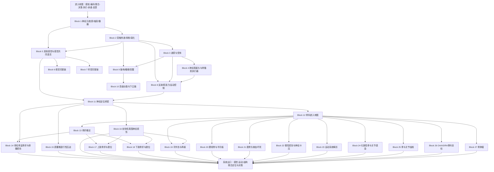

# 西综神经—感觉—运动—骨科｜完整导学、认知依赖与学习顺序 v1
## 按《西综 System Guide 生成规则 v1》生成

> **文件层级**：System Guide  
> **用途**：回答“神经—感觉—运动—骨科这一整套系统应该怎样学”，确定统一 Mental Model、认知依赖、Operational Blocks、跨系统路由、Memory Routing、原图门禁、范围归属与系统出口。  
> **不是**：第二份神经生理或骨科讲义；不提前展开完整 KP 正文、全部神经通路、全部骨折移位、所有影像征、术式、角度、分级和药物。  
> **权威主干**：`生理学讲义_AI阅读版.md`、`01_生理学题纲_GPT_Project.md`、`27 外科跟课合集改.pdf`、`04_外科学题纲_GPT_Project.md`；必要调用病理总论及已完成的循环、呼吸、泌尿、消化—物质代谢—内分泌、血液—免疫—感染 System Guide。  
> **重要来源边界**：当前资料能够完整支持**感觉器官与神经生理**以及**外科骨科**；但没有独立、完整的神经内科学 Lecture / Outline，也没有眼科学、耳鼻喉科学的临床疾病 Lecture。因此本版不静默补成脑血管病、癫痫、帕金森病、痴呆、眼病或耳科疾病教材。  
> **资料状态更新**：早期范围治理文件曾把外科骨科标为 `source_gap`；当前 Project 已补入 `27 外科跟课合集改.pdf`，故本版将其作为骨科 Study 主干。旧治理文件只保留范围与知识形态参考，不再代表当前资料缺失状态。  
> **生成日期**：2026-08-20  
> **状态**：v1｜source-bound System Guide；后续可依据 Block 深审、最新版资料与实际学习反馈修订。

---

# 0｜本文件如何使用

这套系统不是把四个目录硬串成一条线：

```text
视觉
→ 听觉
→ 神经
→ 骨科
```

真正的共同主线是：

```text
外界与身体状态
→ 感受器换能
→ 神经编码与传导
→ 突触整合
→ 中枢形成状态判断和运动方案
→ 运动神经输出
→ 神经—肌接头
→ 骨骼肌产生力
→ 骨、关节、肌腱和韧带传递与承受力
→ 产生姿势和动作
→ 感觉反馈再次校正
```

所以它是一套：

> **感知—编码—整合—决策—执行—承重—反馈闭环。**

当任一层失效时，可出现：

- 感觉缺失或异常；
- 视觉 / 听觉 / 平衡异常；
- 神经传导中断；
- 突触或受体异常；
- 反射和肌张力异常；
- 瘫痪、共济失调或不自主运动；
- 神经—肌肉执行失败；
- 骨折、脱位或关节不稳；
- 神经血管受压；
- 愈合失败；
- 退变、慢性劳损；
- 畸形；
- 感染；
- 肿瘤与病理骨折。

实际推进：

```text
先在本 Guide 中定位当前 Block
→ 打开对应 Block Guide / 学习阅读版
→ 按 Study 连续小板块完成一次完整初见
→ 用 KP 闭卷恢复主链
→ 用 Outline 验漏
→ MI-D 在 MarginNote 3 框选成卡片
→ 原图门禁内容必须回 Study
→ 不让通路名称、角度、分型、影像征和术式阻塞主线
```

## 0.1 本系统必须采用 DAG，而不是单线目录

```text
共同神经底座
神经元—轴突—突触—递质—肌肉执行器
        ↓
├─ 感觉支路
│  ├─ 感觉共同语言与痛觉
│  ├─ 视觉
│  ├─ 听觉
│  └─ 前庭、嗅觉、味觉
│
├─ 中枢整合与运动支路
│  ├─ 反射与肌张力
│  ├─ 基底节、小脑、皮层
│  ├─ 脑电与睡眠
│  ├─ 高级功能与下丘脑
│  └─ 神经定位桥梁
│
└─ 运动系统结构支路
   ├─ 骨折、脱位与脊髓损伤
   ├─ 周围神经与软组织损伤
   ├─ 颈腰椎压迫
   ├─ 慢性损伤与畸形
   ├─ 骨与关节感染
   ├─ 非化脓性关节病
   └─ 骨肿瘤
```

三条支路在以下病例入口重新汇合：

- 麻木、疼痛、无力；
- 肌张力与反射异常；
- 步态和共济异常；
- 视听或平衡问题；
- 外伤后畸形、功能障碍；
- 根性放射痛；
- 脊髓 / 马尾受压；
- 关节活动受限；
- 骨痛、肿块和病理骨折。

## 0.2 五条关键边界

### 第一，神经生理与骨科共享闭环，但不是同一疾病模型

它们共享：

```text
感觉反馈
→ 神经定位
→ 运动输出
→ 肌肉产生力
→ 骨关节承重
```

但不能因此把视觉、睡眠、脊柱骨折、膝损伤和骨肿瘤写成一条虚假因果链。

System 层统一导航；Block 层保持每个自然机制和疾病模型完整。

### 第二，骨折概论必须前置于区域骨折

当前外科 Lecture 把骨折概论放在骨科末段，适合跟课和复习定位；首次学习按认知依赖应改为：

```text
骨折定义与分类
→ 开放伤处理
→ 稳定性
→ 复位
→ 固定
→ 功能锻炼
→ 愈合
→ 并发症
→ 再进入脊柱、上肢和下肢具体骨折
```

这是本系统最明确的顺序调整。

### 第三，神经定位只建立当前资料支持的“最低可运行桥梁”

本系统可以 source-bound 建立：

- 上运动神经元 vs 下运动神经元；
- 硬瘫 vs 软瘫；
- 神经根 vs 周围神经；
- 脊髓 vs 圆锥 vs 马尾；
- 反射、肌张力、感觉和肌力组合；
- 颈腰椎与四肢神经损伤定位。

但不自行扩写完整神经内科疾病谱。

### 第四，钙磷—PTH—维生素 D—骨代谢不第二次完整初见

它们已在“消化—物质代谢—内分泌”中完成 Primary。

当前采用：

```text
钙磷与骨重塑：Recall
→ 骨折愈合、骨质状态、肿瘤和坏死：Apply
```

不重新展开完整激素轴。

### 第五，前序免疫、感染、肿瘤主体不重复

- RA 的免疫和内科主体：血液—免疫—感染；
- 结核共同机制：血液—免疫—感染；
- MM 克隆和 M 蛋白主体：血液—免疫—感染；
- 炎症、修复、肿瘤总论：病理总论；
- 局部循环、血栓、休克：循环。

本系统只完成它们在神经和运动结构中的表现、定位与骨科处理。

---

# 1｜Scope Audit

## 1.1 当前 source-bound 客观范围

以下数字用于排程和去重，不用于预测个人实际学习速度。

| 学科 / 范围 | Study 主范围 | Outline 范围 | 处置 |
|---|---|---:|---|
| 生理：骨骼肌收缩与舒张 | PDF 46–56 | U005，共 **27** 题 | Conditional Primary / Recall |
| 生理：视觉 | PDF 297–314 | U027，共 **48** 题 | Primary |
| 生理：听觉 | PDF 315–326 | U028，共 **13** 题 | Primary |
| 生理：其他感觉 | PDF 327–336 | U029，共 **13** 题 | Primary |
| 生理：神经元与胶质 | PDF 337–344 | U030，共 **30** 题 | Primary |
| 生理：突触、中枢抑制与易化 | PDF 345–355 | U031，共 **22** 题 | Primary |
| 生理：递质与受体 | PDF 356–365 | U032，共 **18** 题 | Primary |
| 生理：躯体运动调控 | PDF 366–384 | U034，共 **40** 题 | Primary |
| 生理：脑电、睡眠、高级功能、下丘脑 | PDF 385–390 | U033，共 **21** 题 | Primary |
| 外科：骨科 5.1–5.10 | `27 外科跟课合集改.pdf` 骨科全章 | U029–U045，共 **221** 题 | Primary |
| 生理：跨膜、信号、电活动 | 已在前序系统使用 | U002–U004，共 **165** 题 | Recall |
| 病理总论与前序疾病 | 损伤、循环、炎症、修复、肿瘤；RA、结核、MM 等 | 对应既有范围 | Recall / Apply |

### 体量概念

- 感觉与神经生理 Primary Outline：**205题**；
- 骨科 Primary Outline：**221题**；
- 骨骼肌 Conditional Primary：**27题**；
- 本系统最大 Primary / Integration Outline：约 **453题**；
- 细胞膜—信号—电活动 Recall Outline：约 **165题**；
- 神经、感觉与骨骼肌生理 Study：约 **105个 PDF 来源页**；
- 外科骨科 Study：完整 5.1–5.10，属于高视觉、高阈值、高决策密度范围。

## 1.2 生理学主体

### 神经元与胶质

- 神经元结构与功能区；
- 轴突始段与动作电位发生；
- 有髓 / 无髓神经纤维；
- 郎飞结与跳跃传导；
- 顺向 / 逆向轴浆运输；
- 神经营养作用；
- 星形胶质、少突胶质、施万细胞、小胶质等角色；
- 中枢与周围修复差异接口；
- 神经元联系方式。

### 突触与网络整合

- 化学突触与电突触；
- 递质合成、储存、释放和清除；
- EPSP / IPSP；
- 时间与空间总和；
- 兴奋性突触后电位与动作电位门槛；
- 突触前 / 后抑制；
- 侧支抑制、回返抑制；
- 易化、后发放、会聚、辐散和环路。

### 递质与受体

- ACh；
- NA / NE；
- 多巴胺；
- 5-HT；
- 谷氨酸；
- GABA；
- 甘氨酸；
- 神经肽与气体递质接口；
- 离子通道型 vs 代谢型受体；
- “递质—受体—效应”与“某条神经的综合效应”的边界；
- 自主神经和躯体运动接口。

### 骨骼肌执行器

- 神经—肌接头；
- 终板电位和动作电位；
- 兴奋—收缩耦联；
- 三联管；
- Ca²⁺—肌钙蛋白；
- 横桥周期；
- 舒张耗能；
- 长度—张力和张力—速度；
- 前负荷、后负荷与收缩性；
- 运动单位；
- 时间 / 空间总和。

### 感觉器官

- 视觉折光、调节、瞳孔、视网膜换能和视觉通路；
- 听觉传音、耳蜗换能与频率分析；
- 前庭器官与平衡；
- 嗅觉和味觉接口；
- 快痛 / 慢痛；
- 感受器一般特性、适应与编码；
- 特异性 / 非特异性投射；
- 侧向抑制与分辨能力。

### 躯体运动与脑状态

- 运动控制三级水平；
- α / γ 运动神经元；
- 肌梭和腱器官；
- 牵张 / 反牵张反射；
- 屈肌与对侧伸肌反射；
- 脊休克；
- 去大脑 / 去皮层僵直；
- 基底神经节；
- 小脑；
- 运动皮层与下行束；
- 硬瘫 / 软瘫；
- EEG；
- NREM / REM；
- 觉醒系统；
- 学习、记忆、语言和优势半球；
- 下丘脑在体温、摄食、饮水、内分泌和情绪中的接口。

## 1.3 外科学骨科主体

### 运动系统畸形

- 先天性肌性斜颈；
- 发育性髋关节脱位；
- 先天性马蹄内翻足；
- 脊柱侧凸等；
- 年龄、发育阶段、角度与矫治时机。

### 慢性损伤

- 肌腱、腱鞘、滑囊和附着点劳损；
- 肩周炎；
- 肱骨外上髁炎；
- 狭窄性腱鞘炎；
- 髌骨软骨软化；
- 儿童骨骺相关劳损；
- 神经卡压综合征。

### 复合损伤范围

- 手外伤和断肢 / 指再植；
- 股骨头无菌性坏死；
- 膝韧带和半月板损伤；
- 周围神经损伤。

### 骨与关节感染

- 急性 / 慢性化脓性骨髓炎；
- 化脓性关节炎；
- 骨与关节结核；
- 脊柱结核；
- 髋关节结核；
- 寒性脓肿、死骨、窦道和病灶清除。

### 非化脓性关节炎

- OA；
- AS；
- RA 的骨科表现与功能处理；
- 年龄、部位、炎症性质、影像和治疗方向比较。

### 骨肿瘤与肿瘤样病变

- 骨软骨瘤；
- 骨巨细胞瘤；
- 骨肉瘤；
- 尤文肉瘤；
- 软骨源性肿瘤；
- 脊索瘤；
- 骨囊肿等肿瘤样病变；
- 骨转移瘤；
- 年龄—部位—影像—病理—治疗映射。

### 创伤与退变

- 骨折概论；
- 开放性骨折；
- 复位、固定和功能锻炼；
- 骨折愈合与并发症；
- 脊柱、骨盆骨折和脊髓损伤；
- 颈椎病；
- 腰椎间盘突出；
- 腰椎管狭窄；
- 上肢骨折和肩 / 肘等脱位；
- 下肢骨折和髋关节脱位；
- 神经血管损伤和骨筋膜室综合征。

## 1.4 病理学在本系统中的角色

当前病理 Lecture / Outline 没有独立完整的神经系统分论。

可调用的 source-bound 内容是：

- 神经元胞体为永久细胞；
- 周围神经纤维的条件性再生；
- 创伤性神经纤维瘤不是肿瘤；
- 中枢损伤后胶质瘢痕；
- 骨折修复；
- 缺血、坏死、炎症和纤维化；
- 化脓性炎与肉芽肿；
- 肿瘤总论；
- 病理性钙化和淀粉样变接口。

不据此自行构造完整脑血管病、神经变性病或中枢肿瘤章节。

## 1.5 内科学在本系统中的角色

当前内科学资料没有独立神经内科章节。

只调用：

- 有机磷等中毒对 M / N 受体和神经—肌接头的应用；
- 各系统疾病造成的神经表现；
- 血液—免疫—感染对 CNS、周围神经、骨和关节的输出。

完整中毒模型仍归后续独立模块。

## 1.6 必要跨系统桥梁

### 从循环系统 Recall

- 脑、脊髓和骨组织灌注；
- 血栓、栓塞、梗死；
- 失血性休克；
- 骨筋膜室内缺血；
- 血管损伤与再灌注接口。

### 从呼吸系统 Recall / Apply

- 中枢与外周化学感受器；
- 延髓 / 脑桥呼吸调节；
- 高位脊髓损伤导致通气泵衰竭；
- 呼吸肌麻痹；
- 低氧和高碳酸血症对意识的影响。

### 从泌尿系统 Recall / Apply

- 脊髓损伤后尿潴留和尿路并发症；
- 神经源性排尿接口；
- 肾功能对药物、电解质和意识状态的影响。

### 从消化—物质代谢—内分泌 Recall

- ATP、磷酸肌酸和肌肉能量；
- Ca²⁺ / PTH / 维生素 D / 钙三醇；
- GH 和骨生长；
- 糖皮质激素与股骨头坏死 / 骨质状态；
- B12 与神经损害；
- 肝性脑病等已学器官模型；
- 肿瘤分子共同语言。

### 从血液—免疫—感染 Recall / Apply

- CNS 感染病理入口；
- B12 缺乏神经损害；
- 贫血和高黏滞神经表现；
- 血管炎性神经病；
- RA 的免疫主体；
- MM 骨病；
- 结核共同机制；
- 感染严重度和源控制。

---

# 2｜明确后置或保留为 Source Gap 的独立模型

## 2.1 完整神经内科学

当前不 source-bound 展开：

- 脑梗死 / 脑出血完整诊疗；
- TIA；
- 癫痫；
- 帕金森病；
- 阿尔茨海默病与其他痴呆；
- 多发性硬化；
- 神经肌肉病完整分类；
- 重症肌无力完整临床模型；
- 运动神经元病；
- 周围神经病谱；
- 头痛和眩晕全套诊疗；
- 中枢神经肿瘤。

生理 Study 中出现的帕金森、舞蹈病、硬瘫 / 软瘫等，只作为机制和定位例子，不自动升级为完整临床 Block。

## 2.2 眼科学和耳鼻喉科学

本系统完成：

- 正常视觉；
- 正常听觉；
- 前庭、嗅味觉接口。

不自行扩写：

- 白内障；
- 青光眼；
- 视网膜疾病；
- 视神经炎；
- 中耳炎；
- 梅尼埃病；
- 各型耳聋的完整临床处理。

## 2.3 完整康复医学与运动医学

本系统保留：

- 功能锻炼原则；
- 运动单位和肌力；
- 关节活动与稳定；
- 术后 / 固定后功能恢复入口。

但不扩写完整康复处方、假肢矫形和训练周期。

## 2.4 中毒

有机磷、镇静催眠药、吗啡等可调用递质—受体和中枢机制；完整中毒诊疗后置“剩余独立模块与总论收尾”。

---

# 3｜System Mission & Mental Model

## 3.1 系统真正维持什么

> **把外界和身体内部变化转换为可解释的神经信号，经过中枢整合形成恰当的行为与运动，再由神经—肌肉—骨关节系统稳定执行，并通过持续感觉反馈修正动作，同时维持结构完整、负荷适配与损伤修复。**

## 3.2 八个部件模型

### 1. 感受器｜Sensor

负责把：

- 光；
- 声；
- 加速度；
- 化学物质；
- 温度；
- 机械变形；
- 组织损伤；

转成受体电位和神经信号。

### 2. 传输线｜Wire

包括：

- 轴突；
- 髓鞘；
- 郎飞结；
- 神经根；
- 周围神经；
- 脊髓上、下行通路。

决定信号能否高速、保真地到达目标。

### 3. 突触与受体｜Gate

决定：

- 信号是兴奋还是抑制；
- 是否被放大、总和、筛选；
- 是否被药物、毒物或抗体改变。

### 4. 中枢整合器｜Controller

包括：

- 脊髓；
- 脑干；
- 丘脑和皮层；
- 基底神经节；
- 小脑；
- 下丘脑；
- 觉醒和高级功能网络。

决定“看见了什么、身体在哪、应该做什么”。

### 5. 运动输出｜Command

上位中枢通过：

- 皮层脑干束；
- 皮层脊髓束；
- 脑干下行系统；
- α / γ 运动神经元；

形成姿势、反射和随意运动。

### 6. 神经—肌肉执行器｜Actuator

```text
运动神经动作电位
→ ACh
→ N2 受体与终板电位
→ 肌膜动作电位
→ Ca²⁺
→ 横桥循环
→ 肌肉产生力
```

### 7. 承重与传力结构｜Plant

包括：

- 骨；
- 关节；
- 软骨；
- 肌腱；
- 韧带；
- 筋膜；
- 椎间盘。

它们决定力是否能转化为稳定、有效动作。

### 8. 反馈与修复｜Feedback & Repair

- 本体感觉不断修正动作；
- 痛觉限制继续损伤；
- 炎症清除坏死和病原；
- 骨痂、瘢痕和重塑恢复结构；
- 长期负荷又反过来改变骨、软骨、肌腱和神经。

## 3.3 三条闭环

### 感觉闭环

```text
刺激
→ 换能
→ 编码
→ 传导
→ 中枢投射
→ 感觉形成
→ 注意、行为或反射
```

### 运动闭环

```text
运动意图
→ 策划
→ 协调
→ 下行命令
→ α运动神经元
→ 肌肉收缩
→ 关节运动
→ 本体感觉反馈
→ 在线修正
```

### 结构损伤—修复闭环

```text
外力 / 过载 / 感染 / 退变 / 肿瘤
→ 结构受损或失稳
→ 疼痛、炎症、神经血管风险
→ 复位 / 减压 / 清创 / 固定 / 控制病因
→ 愈合和重塑
→ 功能锻炼
→ 重新承重
```

---

# 4｜Input / Output Contract

## 4.1 Input｜进入本系统前需要什么

### Hard prerequisite

- 跨膜转运、离子梯度、静息电位和动作电位；
- 细胞信号转导；
- 基本解剖方向、平面和轴；
- 循环灌注、血栓、梗死与休克；
- 炎症、坏死、修复和肿瘤总论；
- 感染和免疫共同语言；
- Ca²⁺、ATP 和肌肉能量接口。

### 分 Block Hard prerequisite

- Block 2–3：Block 1 的神经元—轴突—髓鞘语言；
- Block 4：Block 2–3 + 细胞电活动 Recall；
- Block 5–7：Block 1–3；
- Block 8：Block 2–4；
- Block 11：Block 5、8；
- Block 13：病理修复 Recall；
- Block 14、17、18：Block 11–13；
- Block 24–27：炎症、免疫、结核、肿瘤 Recall。

### Soft prerequisite

- 大体神经解剖；
- 四肢和脊柱基本解剖；
- 影像学方向；
- 常见肌群牵拉方向；
- 儿童骨骺和老年骨质变化。

## 4.2 Output｜学完以后向后续系统输出什么

### 向生殖—乳腺

- 下丘脑—垂体接口；
- 自主神经与行为接口；
- 骨盆和脊髓损伤的排尿 / 性功能接口；
- Ca²⁺和骨代谢在妊娠中的调用边界。

### 向剩余独立模块

- 递质—受体—中毒表现；
- 神经肌肉阻滞与麻醉接口；
- 体温调节；
- 疼痛和意识监测；
- 创伤、固定、围术期和康复入口。

### 向全系统病例推理

- 感觉—运动—反射定位；
- 上 / 下运动神经元定位；
- 神经根—周围神经—脊髓定位；
- 疼痛来源和受力结构定位；
- 骨折稳定性与神经血管检查；
- X线 / CT / MRI 的问题匹配；
- 复位—固定—功能锻炼主框架；
- 感染、退变、炎症和肿瘤的骨科分流。

---

# 5｜Core Variables & Failure Modes

## 5.1 最小变量语言

```text
Stimulus modality｜刺激性质
Receptor potential｜受体电位
Threshold / AP / conduction velocity｜阈值、动作电位、传导速度
Fiber diameter / myelin｜纤维直径与髓鞘
Synaptic delay / EPSP / IPSP｜突触延搁与突触后电位
Transmitter / receptor / effect｜递质—受体—效应
Receptive field / adaptation / lateral inhibition｜感受野、适应、侧向抑制
Visual acuity / refraction / accommodation｜视敏度、折光、调节
Sound frequency / intensity / cochlear place｜频率、强度、耳蜗部位
Vestibular acceleration / axis｜加速度与旋转轴
Motor unit / firing frequency｜运动单位与放电频率
Muscle length / tension / velocity｜肌长、张力、缩短速度
Reflex / tone / strength｜反射、肌张力、肌力
UMN / LMN / root / peripheral nerve / cord / cauda｜定位层级
Alignment / displacement / angulation / rotation｜对位、移位、成角、旋转
Stability / neurovascular status｜稳定性与神经血管状态
Perfusion / compartment pressure｜灌注与间室压力
Open vs closed injury｜开放与闭合
Union / nonunion / malunion｜愈合、不愈合、畸形愈合
Joint congruity / cartilage / joint space｜关节匹配、软骨与间隙
Infection / necrosis / tumor｜感染、坏死与肿瘤
Function / range of motion / weight bearing｜功能、活动度与负重
```

## 5.2 十二类 Failure Modes

### 1. 换能失败

刺激存在，但感受器不能正确转换。

代表：

- 视网膜 / 毛细胞换能接口；
- 感受器损伤；
- 局部结构使刺激不能到达感受器。

### 2. 传导失败

代表：

- 轴突损伤；
- 脱髓鞘接口；
- 神经根压迫；
- 周围神经断裂或卡压。

### 3. 突触—递质—受体失败

代表：

- 递质释放异常；
- 受体阻断；
- 毒物作用；
- 神经—肌接头异常接口。

### 4. 感觉编码或投射失真

代表：

- 适应、感受野或侧向抑制异常；
- 痛觉放大；
- 投射通路中断；
- 平衡输入不一致。

### 5. 中枢状态和高级整合异常

代表：

- 觉醒、睡眠、语言、记忆和下丘脑功能异常接口。

### 6. 运动控制层级失衡

代表：

- 上运动神经元损伤；
- 下运动神经元损伤；
- 基底神经节 / 小脑功能失衡；
- 反射和肌张力异常。

### 7. 神经—肌肉执行失败

代表：

- 神经—肌接头问题；
- Ca²⁺耦联异常；
- 肌肉本身产生力不足；
- 去神经性萎缩。

### 8. 结构失稳或急性创伤

代表：

- 骨折；
- 脱位；
- 韧带 / 半月板 / 肌腱断裂；
- 脊柱不稳定；
- 脊髓损伤。

### 9. 灌注中断、间室高压或缺血坏死

代表：

- 骨筋膜室综合征；
- 股骨头坏死；
- 神经血管受压；
- 骨折相关缺血。

### 10. 愈合和重塑失败

代表：

- 延迟愈合；
- 不愈合；
- 畸形愈合；
- 关节僵硬；
- 创伤性关节炎。

### 11. 慢性过载、退变或畸形

代表：

- 慢性劳损；
- OA；
- 颈腰椎退变；
- 发育性畸形；
- 长期力线异常。

### 12. 炎症、感染或肿瘤占位

代表：

- 化脓性骨髓炎；
- 骨关节结核；
- RA / AS；
- 原发骨肿瘤；
- 转移和病理骨折。

---

# 6｜Dependency Graph



## 6.1 为什么这样排

1. **先建立神经元—轴突—髓鞘，再学突触和递质。**  
   传导问题与突触问题必须先分层。

2. **骨骼肌不是孤立的肌肉章节，而是神经输出的执行器。**  
   放在递质—受体之后，运动控制之前。

3. **“其他感觉”中包含感受器、痛觉、投射和侧向抑制等共同语言。**  
   先学它，再进入视觉和听觉，避免两个特殊感觉各自重复一次编码逻辑。

4. **整个躯体运动调控一次学全。**  
   脊髓反射、肌张力、基底节、小脑和皮层保持连续，不被拆成碎片。

5. **脑电 / 睡眠与高级功能 / 下丘脑分为两个 Operational Blocks。**  
   它们在 Study 中相邻，但中心问题不同，不强造统一故事。

6. **神经定位桥梁必须先于脊柱、周围神经和区域骨折。**  
   否则只能背“某骨折伤某神经”，不能由体征反推损伤平面。

7. **骨折概论必须先于所有具体骨折。**  
   具体部位只是在共同框架上增加受力、肌牵拉、血供和局部并发症。

8. **手、膝、股骨头坏死是三个独立模型。**  
   原 Study 把它们放在同一大节只是编辑性合集，执行层不合并成一条链。

9. **感染、关节炎和骨肿瘤是并列病因支路。**  
   它们共用影像与功能入口，但不能互相压缩成同一疾病模型。

---

# 7｜Operational Block Route

# Block 1｜神经元、胶质、轴突与髓鞘：信号靠什么产生、运输和传导

**中心问题**

> 神经元的胞体、树突、轴突和轴突末梢分别负责什么；髓鞘、郎飞结、轴浆运输和胶质细胞怎样维持高速传导与神经存活？

**为什么现在学**

这是感觉、运动、周围神经损伤和中枢修复的共同结构语言。

**Study 主范围**

- 生理 Lecture PDF 337–344；
- 生理 Outline U030，共30题；
- 病理修复中神经元 / 神经纤维 / 胶质边界：Recall。

**必要原图**

- 神经元结构；
- 轴突始段；
- 有髓 / 无髓纤维；
- 郎飞结；
- CNS / PNS 髓鞘；
- 顺向 / 逆向运输；
- 胶质细胞分工；
- 周围神经再生与胶质瘢痕接口。

**动作配置**

- Learn：结构分区、动作电位起始、传导、轴浆运输、营养作用、胶质角色。
- Recall：静息电位、动作电位、膜通道。
- Apply：去神经萎缩、神经断裂、毒素逆向运输、脊髓损伤。
- Defer：完整神经病理。

**知识形态**

- Mechanism Spine：胞体合成 → 轴浆运输 → 轴突传导 → 末梢释放 → 靶组织反馈营养。
- Discrimination Tree：CNS / PNS；神经元胞体 / 神经纤维；有髓 / 无髓；少突 / 施万。
- MI-G：高位神经损伤、轴突中断、急性去神经功能丧失。
- MI-D：全部胶质细胞功能、纤维分类和传导速度数字。

**客观负荷画像**

- 首轮主线负荷：很重
- Memory Island：高
- 视觉负担：很高
- 跨科整合：很高

**出口问题**

1. 动作电位为什么通常先从轴突始段产生？
2. 髓鞘怎样提高传导速度？
3. 神经营养作用为什么不等于神经冲动？
4. 中枢与周围神经修复能力为什么不同？
5. 神经元胞体不可再生与周围轴突可条件性再生是否矛盾？

**进入下一 Block 的最低标准**

能把“产生—运输—传导—营养—修复”画成一条结构链。

---

# Block 2｜突触传递、中枢抑制与易化：神经信号怎样被筛选和组合

**中心问题**

> 动作电位到达末梢后，怎样变成递质释放和突触后电位；中枢怎样通过总和、抑制、易化、会聚和回路决定是否输出？

**Study 主范围**

- 生理 Lecture PDF 345–355；
- 生理 Outline U031，共22题。

**必要原图**

- 化学突触；
- Ca²⁺依赖递质释放；
- EPSP / IPSP；
- 时间 / 空间总和；
- 突触前抑制；
- 突触后抑制；
- 回返 / 侧支抑制；
- 会聚、辐散和环路。

**动作配置**

- Learn：突触全流程；突触后电位；总和；抑制与易化；网络连接。
- Recall：AP 和电压门控 Ca²⁺通道。
- Apply：感觉筛选、反射、肌张力和药物作用。
- Defer：全部递质—受体配对到 Block 3。

**知识形态**

- Mechanism Spine：AP → Ca²⁺内流 → 囊泡融合 → 递质 → 受体 → EPSP / IPSP → 轴突始段判定。
- Discrimination Tree：电 / 化学突触；突触前 / 后抑制；去极化 / 超极化不等于简单兴奋 / 抑制。
- MI-G：影响意识、呼吸、运动输出的广泛突触抑制。
- MI-D：囊泡类型、全部中枢连接形式和特殊离子方向。

**客观负荷画像**

- 首轮主线负荷：极重
- Memory Island：很高
- 视觉负担：极高
- 跨科整合：极高

**出口问题**

1. 突触后电位为什么可以总和，而动作电位不能按同样方式总和？
2. 递质释放量最直接受什么控制？
3. 突触前抑制到底减少谁释放的递质？
4. 回返抑制和后发放为什么可来自相似环路结构？
5. 侧向抑制怎样提高感觉分辨率？

**进入下一 Block 的最低标准**

能从“突触前—间隙—突触后—整合”逐层定位问题。

---

# Block 3｜递质与受体：同一种化学物质为什么可产生完全不同的效应

**中心问题**

> 递质本身、受体亚型、所在细胞和神经通路的综合效应之间是什么关系？

**Study 主范围**

- 生理 Lecture PDF 356–365；
- 生理 Outline U032，共18题；
- 既往自主神经调节：Recall。

**必要原图 / 表格**

- 递质分类；
- 离子通道型 / GPCR；
- ACh 的 M / N1 / N2；
- NA 的 α / β；
- 多巴胺、5-HT、谷氨酸、GABA、甘氨酸；
- 自主神经与躯体神经末梢；
- 神经兴奋综合效应。

**动作配置**

- Learn：递质定义、受体类型、部位和效应；递质—受体—神经通路三层。
- Recall：GPCR、第二信使、自主神经。
- Apply：神经—肌接头、中毒、基底节、抑制性中枢。
- Defer：所有阻断剂、激动剂和受体亚型细表进入 MI-D。

**知识形态**

- Mechanism Spine：神经元释放递质 → 特定受体 → 离子 / 第二信使 → 细胞效应 → 器官综合效应。
- Discrimination Tree：递质效应 / 神经效应；离子型 / 代谢型；中枢 / 外周。
- MI-G：呼吸抑制、神经肌肉阻滞、严重自主神经失衡。
- MI-D：全部受体、药物、部位和例外。

**客观负荷画像**

- 首轮主线负荷：很重
- Memory Island：极高
- 视觉负担：高
- 跨科整合：极高

**出口问题**

1. ACh 为什么既可使骨骼肌收缩，也可使心率下降？
2. “副交感神经释放ACh”为什么不等于所有ACh效应都属于副交感？
3. 离子通道型与 GPCR 受体在速度和放大方式上有何不同？
4. 中枢抑制性递质怎样与 Block 2 对接？
5. 递质、受体、神经和器官四个名词中，题目究竟问的是哪一层？

**进入下一 Block 的最低标准**

看到效应时先问受体和所在细胞，不直接用递质名称猜答案。

---

# Block 4｜神经—肌接头与骨骼肌：神经命令怎样真正变成力

**中心问题**

> 一个运动神经动作电位如何经过终板、肌膜、三联管、Ca²⁺和横桥循环，最终形成可调节的肌肉张力和动作？

**Study 主范围**

- 生理 Lecture PDF 46–56；
- 生理 Outline U005，共27题；
- 若该章此前已经完整学过，则本 Block 改为 Recall + Integration。

**必要原图**

- 神经—肌接头；
- 微终板 / 终板电位；
- 三联管；
- 肌节；
- 粗细肌丝；
- Ca²⁺—肌钙蛋白；
- 横桥周期；
- 长度—张力；
- 张力—速度；
- 运动单位和强直收缩。

**动作配置**

- Learn / Recall：NMJ、兴奋—收缩耦联、横桥、舒张、收缩影响因素、运动单位。
- Recall：AP、ATP、Ca²⁺、ACh—N2。
- Apply：肌无力接口、神经损伤、反射、固定后萎缩、呼吸肌。
- Defer：完整神经肌肉疾病和运动训练学。

**知识形态**

- Mechanism Spine：神经 AP → ACh → EPP → 肌膜 AP → SR 放 Ca²⁺ → 横桥 → 力 → Ca²⁺回收与舒张。
- Discrimination Tree：终板电位 / AP；电活动 / 机械收缩；空间 / 时间总和；前负荷 / 后负荷 / 收缩性。
- MI-G：神经肌肉阻滞、呼吸肌麻痹、骨筋膜室相关功能风险。
- MI-D：全部蛋白、通道和曲线细节。

**客观负荷画像**

- 首轮主线负荷：极重
- Memory Island：很高
- 视觉负担：极高
- 跨科整合：极高

**出口问题**

1. N2通道开放为什么先产生终板电位，而不是直接等同动作电位？
2. 兴奋—收缩耦联为什么包含舒张？
3. 骨骼肌动作电位为何不叠加，收缩却可叠加？
4. 运动单位大小怎样影响精细动作与大力量？
5. 后负荷增加时张力、缩短速度和收缩时相如何变化？

**进入下一 Block 的最低标准**

能从神经冲动一直推到肌肉产生、调节和终止力量。

---

# Block 5｜其他感觉与感觉共同语言：刺激怎样被编码为可定位、可分辨的体验

**中心问题**

> 感受器怎样区分刺激种类、强度、持续时间和位置；痛觉、前庭、嗅味觉和感觉投射分别使用什么特殊结构？

**为什么现在学**

这一 Study 小板块同时承载特殊感觉与所有感觉系统共用的编码语言，必须一次完整学习，不拆成零散卡片。

**Study 主范围**

- 生理 Lecture PDF 327–336；
- 生理 Outline U029，共13题。

**必要原图**

- 感受器与传入纤维；
- 快痛 / 慢痛；
- 感受器适应；
- 感受野和侧向抑制；
- 特异 / 非特异投射；
- 前庭毛细胞与半规管 / 耳石；
- 三个旋转轴和空间平面；
- 嗅味觉接口。

**动作配置**

- Learn：换能、适宜刺激、编码、适应、痛觉、投射、前庭、嗅味。
- Recall：AP、突触、侧向抑制。
- Apply：眩晕、平衡、姿势反射、疼痛和视觉 / 听觉。
- Defer：完整眩晕、嗅味障碍诊疗。

**知识形态**

- Mechanism Spine：刺激 → 受体电位 → 频率 / 招募编码 → 传入 → 投射 → 感觉。
- Discrimination Tree：快 / 慢适应；快 / 慢痛；特异 / 非特异投射；角加速度 / 直线加速度。
- MI-G：意识改变、严重疼痛、急性平衡障碍的定位入口。
- MI-D：全部感受器例子、纤维类型、投射核和空间轴配对。

**客观负荷画像**

- 首轮主线负荷：很重
- Memory Island：极高
- 视觉负担：极高
- 跨科整合：很高

**出口问题**

1. 受体电位怎样转换为动作电位频率？
2. 快适应与慢适应分别适合检测变化还是持续状态？
3. 快痛与慢痛的纤维、体验和定位为何不同？
4. 侧向抑制为什么有利于两点辨别？
5. 半规管与耳石器官分别主要感受什么？

**进入下一 Block 的最低标准**

能用“刺激性质—受体—编码—通路—体验”分析任一感觉。

---

# Block 6｜视觉完整链：光学成像如何变成视网膜神经信号

**中心问题**

> 光线怎样经过折光系统准确落在视网膜；看近、明暗适应、感光换能和视觉通路怎样共同形成清晰视觉？

**Study 主范围**

- 生理 Lecture PDF 297–314；
- 生理 Outline U027，共48题。

**必要原图**

- 眼球折光系统；
- 看远 / 看近调节；
- 瞳孔；
- 屈光不正；
- 视网膜层次；
- 视杆 / 视锥；
- 光换能；
- 中心—周边感受野；
- 视觉通路和视野缺损定位。

**动作配置**

- Learn：折光、调节、瞳孔、视敏度、视网膜换能、明暗适应、颜色、视觉通路。
- Recall：M / α1受体、局部电位、侧向抑制。
- Apply：视野与神经定位接口。
- Defer：眼科疾病和完整检查治疗。

**知识形态**

- Mechanism Spine：光 → 折光成像 → 感光细胞局部电位 → 视网膜网络 → 神经节细胞 AP → 视觉中枢。
- Discrimination Tree：看远 / 看近；近视 / 远视 / 老视；视杆 / 视锥；暗 / 明适应。
- MI-G：急性视路定位、瞳孔和神经系统危重接口。
- MI-D：全部光学数值、色觉、视野缺损组合和药物配对。

**客观负荷画像**

- 首轮主线负荷：极重
- Memory Island：极高
- 视觉负担：极高
- 跨科整合：极高

**出口问题**

1. 折光能力最强的界面为什么不是晶状体？
2. 看近时睫状肌、悬韧带、晶状体和瞳孔如何联动？
3. 光照为何使感光细胞出现与一般兴奋细胞不同的电变化？
4. 视锥系统怎样获得高视敏度？
5. 视野缺损为什么能反推视路损伤位置？

**进入下一 Block 的最低标准**

能把光学、换能和视路连成一条连续链，而不是分成三组孤立名词。

---

# Block 7｜听觉完整链：空气振动怎样被耳蜗分解成频率与强度

**中心问题**

> 声波怎样经外耳、中耳、内耳传递；基底膜、毛细胞和耳蜗电位怎样完成机械—电换能与音调分析？

**Study 主范围**

- 生理 Lecture PDF 315–326；
- 生理 Outline U028，共13题。

**必要原图**

- 外耳、中耳、听骨链；
- 鼓膜与卵圆窗；
- 耳蜗三阶；
- 内 / 外淋巴；
- 血管纹；
- 基底膜；
- Corti器和毛细胞；
- 高频 / 低频位置；
- 气导 / 骨导；
- 听觉通路。

**动作配置**

- Learn：传音、阻抗匹配、耳蜗液体、内淋巴高K⁺、毛细胞换能、频率与强度编码。
- Recall：局部电位、递质释放、神经 AP。
- Apply：传导性 / 感音性障碍接口和平衡系统。
- Defer：完整耳科疾病和听力学诊疗。

**知识形态**

- Mechanism Spine：声波 → 鼓膜 / 听骨 → 卵圆窗 → 基底膜 → 毛细胞受体电位 → 听神经 AP。
- Discrimination Tree：气导 / 骨导；内 / 外毛细胞；高 / 低频；传导 / 感音接口。
- MI-G：突发听力 / 前庭症状的定位入口。
- MI-D：全部电位名称、频率位置和听力试验细节。

**客观负荷画像**

- 首轮主线负荷：很重
- Memory Island：高
- 视觉负担：极高
- 跨科整合：很高

**出口问题**

1. 中耳怎样完成阻抗匹配？
2. 内淋巴高K⁺和耳蜗内电位为何有利于毛细胞换能？
3. 内毛细胞和外毛细胞分别更偏向传递还是放大？
4. 基底膜怎样完成频率分析？
5. 气导和骨导的通路差异是什么？

**进入下一 Block 的最低标准**

能从声波进入一直推到听神经动作电位和频率定位。

---

# Block 8｜反射、肌张力与躯体运动控制：中枢怎样把力量变成有目的的动作

**中心问题**

> 脊髓、脑干、基底神经节、小脑和大脑皮层分别在运动策划、协调和执行中做什么；损伤为何产生不同的反射、肌张力和运动模式？

**为什么现在学**

这是神经定位与全部脊柱、周围神经、肌力和步态问题的正常底座。整个 10.5 小板块保持连续，一次学全。

**Study 主范围**

- 生理 Lecture PDF 366–384；
- 生理 Outline U034，共40题。

**必要原图**

- 运动控制三级水平；
- 运动单位；
- α / γ 运动神经元；
- 肌梭和腱器官；
- 牵张 / 反牵张反射；
- 屈肌 / 对侧伸肌反射；
- 脊休克；
- 去大脑 / 去皮层僵直；
- 基底节环路；
- 小脑分区；
- 皮层运动区和下行束；
- 硬瘫 / 软瘫。

**动作配置**

- Learn：脊髓反射、肌张力、脑干姿势、基底节、小脑、皮层和病变表现。
- Recall：突触抑制、运动单位、骨骼肌收缩。
- Apply：脊髓损伤、颈椎病、周围神经损伤、步态和体征。
- Defer：帕金森、舞蹈病、小脑疾病等完整临床模型。

**知识形态**

- Mechanism Spine：运动策划 → 协调 → 下行命令 → α运动神经元 → 肌肉 → 本体反馈 → 修正。
- Discrimination Tree：UMN / LMN；小脑 / 基底节；肌梭 / 腱器官；牵张 / 反牵张；硬瘫 / 软瘫。
- MI-G：急性脊髓损伤、进行性肌无力、呼吸肌和括约肌受累。
- MI-D：全部核团、通路、僵直类型和疾病例子。

**客观负荷画像**

- 首轮主线负荷：极重
- Memory Island：极高
- 视觉负担：极高
- 跨科整合：极高

**出口问题**

1. α 与 γ 运动神经元分别支配什么，为什么需要 α—γ 协同？
2. 肌梭与腱器官分别感受长度还是张力？
3. 上运动神经元损伤为什么出现深反射亢进而浅反射减弱？
4. 基底神经节与小脑分别更偏向运动选择还是协调校正？
5. 脊休克恢复后反射和肌张力为何改变？

**进入下一 Block 的最低标准**

能由反射、肌张力、肌萎缩、病理征和麻痹范围反推运动系统损伤层级。

---

# Block 9｜脑电、睡眠与觉醒：大脑如何在不同全局状态间切换

**中心问题**

> 脑电活动怎样反映神经元群体同步性；NREM、REM、觉醒系统和睡眠周期为什么呈现不同脑电与躯体状态？

**Study 主范围**

- 生理 Lecture PDF 385–387 左右的脑电、睡眠与觉醒子板块；
- 生理 Outline U033 对应范围。

**必要原图 / 表格**

- α、β、θ、δ 波；
- 频率与振幅；
- NREM / REM；
- 睡眠周期；
- 网状上行激活系统；
- 脑电同步 / 去同步。

**动作配置**

- Learn：脑电来源、波形、睡眠分期、REM / NREM 和觉醒。
- Recall：突触网络、特异 / 非特异投射。
- Apply：意识状态、镇静和中毒接口。
- Defer：睡眠医学、昏迷量表和癫痫脑电。

**知识形态**

- Mechanism Spine：网状—丘脑—皮层网络状态 → 群体同步性 → EEG 与行为状态。
- Discrimination Tree：清醒 / 困倦 / 深睡；NREM / REM；同步 / 去同步。
- MI-G：意识下降、呼吸抑制和急性脑功能异常入口。
- MI-D：全部波形部位、频率、睡眠时相和递质。

**客观负荷画像**

- 首轮主线负荷：重
- Memory Island：很高
- 视觉负担：高
- 跨科整合：高

**出口问题**

1. EEG 记录的是单个神经元动作电位还是神经元群体活动？
2. 为什么高同步活动往往振幅更高、频率更低？
3. REM 睡眠为什么“脑活跃而骨骼肌低张力”？
4. 网状上行激活系统怎样维持觉醒？

**进入下一 Block 的最低标准**

能从网络同步性解释脑电与睡眠状态，而不是只背四种波。

---

# Block 10｜脑高级功能与下丘脑：行为、记忆、语言和稳态怎样接入神经网络

**中心问题**

> 学习记忆、语言、优势半球和情绪行为由哪些高级网络承担；下丘脑怎样把神经、内分泌、自主神经和行为调节接在一起？

**Study 主范围**

- 生理 Lecture PDF 388–390 左右的高级功能与下丘脑子板块；
- 生理 Outline U033 对应范围。

**必要原图 / 表格**

- 学习记忆类型；
- 条件反射；
- 语言中枢与优势半球；
- 下丘脑核团 / 区域；
- 体温、摄食、饮水、昼夜节律和情绪接口；
- 下丘脑—垂体连接。

**动作配置**

- Learn：高级功能的 Study 口径；下丘脑功能网络。
- Recall：睡眠觉醒、自主神经、内分泌和体温。
- Apply：失语、记忆、摄食饮水、体温和生殖接口。
- Defer：痴呆、精神疾病、失语症完整临床诊断。

**知识形态**

- Mechanism Spine：
  - 高级功能：感觉输入 → 联络区加工 → 学习 / 记忆 / 语言 / 行为；
  - 下丘脑：内环境信号 → 自主神经 + 内分泌 + 行为输出。
- Discrimination Tree：短期 / 长期记忆；优势 / 非优势半球；下丘脑前 / 后、内 / 外侧等 Study 坐标。
- MI-G：高热、严重意识 / 行为改变、低容量渴觉与内分泌危象接口。
- MI-D：全部核团、语言中枢、记忆类型和条件反射细节。

**客观负荷画像**

- 首轮主线负荷：很重
- Memory Island：极高
- 视觉负担：中高
- 跨科整合：极高

**出口问题**

1. 联络区、感觉皮层和运动皮层在行为中分别承担什么？
2. 条件反射与非条件反射的建立条件是什么？
3. 优势半球主要与哪些高级功能有关？
4. 下丘脑为什么既是神经中枢，又是内分泌和行为调节枢纽？
5. 体温、饮水、摄食和昼夜节律怎样在下丘脑汇合？

**进入下一 Block 的最低标准**

能把高级功能与下丘脑当成两个相邻但不同中心问题，不强行混成一张表。

---

# Block 11｜神经定位桥梁：无力、麻木与反射异常到底发生在哪一层

**中心问题**

> 面对运动或感觉障碍，怎样用分布、肌力、肌张力、反射、萎缩、病理征和括约肌功能，先区分皮层 / 脊髓、神经根、周围神经和肌肉？

**文件性质**

这是由生理神经定位和外科脊柱 / 周围神经内容共同形成的**Integration Bridge**，不是一套自行扩写的神经内科学。

**Study 主范围**

- 生理 U029、U034 相关定位；
- 外科 5.3 周围神经损伤；
- 外科 5.7 脊髓损伤；
- 外科 5.8 颈腰椎退行性病；
- 对应 Outline 在后续各 Block 归账，本 Block 不重复计题。

**必要原图**

- UMN / LMN；
- 皮节和主要周围神经分布；
- 神经根、脊髓和周围神经；
- 圆锥 / 马尾；
- 深浅反射；
- Babinski；
- 上下肢主要神经运动与感觉区；
- 脊髓横断最低坐标。

**动作配置**

- Learn：定位顺序和当前 Study 明确涉及的典型模式。
- Recall：感觉投射、运动控制、反射。
- Apply：颈椎病、腰突、脊柱骨折、手外伤和四肢骨折。
- Defer：完整脑血管和神经内科综合征。

**最小定位算法**

```text
症状分布
→ 中枢性还是外周性
→ UMN还是LMN
→ 神经根还是单根周围神经
→ 脊髓、圆锥还是马尾
→ 是否伴进行性压迫、括约肌或呼吸风险
```

**知识形态**

- Mechanism Spine：损伤平面 → 中断的通路 / 神经 → 运动、感觉、反射和自主功能组合。
- Discrimination Tree：UMN / LMN；root / nerve；cord / conus / cauda；脊髓型 / 神经根型。
- MI-G：进行性瘫痪、马尾综合征、高位颈髓、呼吸和二便功能障碍。
- MI-D：全部皮节、肌节、神经分支和特殊体征。

**客观负荷画像**

- 首轮主线负荷：极重
- Memory Island：极高
- 视觉负担：极高
- 跨科整合：极高

**出口问题**

1. 硬瘫与软瘫在肌张力、反射、萎缩和病理征上如何区分？
2. 神经根痛与单根周围神经损伤的分布为何不同？
3. 脊髓圆锥和马尾损伤在运动表现上为何不同？
4. 腰椎间盘突出为什么通常压神经根而不是腰段脊髓？
5. 哪些体征意味着不能继续只做保守观察？

**进入下一 Block 的最低标准**

面对病例能先报出“最可能层级”，再讨论具体骨科病名。

---

# Block 12｜骨科进入地图：先判断哪种结构、哪类力和哪项功能失效

**中心问题**

> 面对疼痛、畸形、活动受限或外伤，怎样先判断受损的是骨、关节、软骨、肌腱、韧带、神经还是血管，并选择合适影像？

**文件性质**

这是骨科全章的微型共同入口，不替代任何具体疾病 Study。

**Study 主范围**

- 外科骨科 5.1–5.10 的共同诊断与检查语言；
- 外科 Outline U029–U045 的共同题型。

**共同五问**

1. **结构**：骨、关节、软组织还是神经？
2. **机制**：外伤、过载、退变、感染、缺血、免疫还是肿瘤？
3. **稳定性**：能否维持对位、关节匹配与承重？
4. **危险结构**：神经、血管、皮肤、脊髓、间室是否受威胁？
5. **证据工具**：X线、CT、MRI、核素、肌电图或关节镜各回答什么？

**必要原图**

- 骨与关节基本结构；
- 三轴三面；
- X线 / CT / MRI 问题定位；
- 关节活动方向；
- 四肢血运和神经查体；
- 力线、角度和稳定性概念。

**动作配置**

- Learn：骨科主诉与结构语言；影像选择；神经血管检查优先级。
- Recall：解剖平面、神经定位、炎症和循环。
- Apply：后续全部骨科 Block。
- Defer：所有部位特异试验到对应疾病。

**知识形态**

- Mechanism Spine：症状 / 外力 → 结构定位 → 稳定性与危险结构 → 影像确认 → 功能目标。
- Discrimination Tree：骨 / 关节 / 软组织 / 神经；X线 / CT / MRI / 核素 / 肌电。
- MI-G：开放伤、无脉、进行性神经缺失、间室高压、脊髓 / 马尾受压。
- MI-D：全部特殊体征和角度。

**客观负荷画像**

- 首轮主线负荷：中重
- Memory Island：高
- 视觉负担：极高
- 跨科整合：极高

**出口问题**

1. X线、CT和MRI分别最擅长回答什么？
2. 为什么任何骨折复位前后都要重复记录神经血管状态？
3. 疼痛位置为何不一定等于原发病灶位置？
4. “稳定”与“没有移位”为什么不是完全同义？

**进入下一 Block 的最低标准**

看到骨科题先定位结构和危险层，不直接从口诀猜治疗。

---

# Block 13｜骨折概论：从损伤、稳定性到愈合与功能恢复

**中心问题**

> 骨折后应怎样依次判断生命风险、开放污染、神经血管、稳定性、复位需求、固定方式、愈合和功能锻炼？

**为什么现在学**

虽然 Study 把骨折概论放在骨科末尾，但它是所有具体骨折的硬前置。

**Study 主范围**

- 外科 Lecture 5.10《骨折概论》；
- 外科 Outline U044–U045，共24题。

**必要原图 / 流程**

- 骨折分类；
- 移位六方向；
- 开放性骨折；
- 清创；
- 解剖 / 功能复位；
- 外 / 内固定；
- 骨折愈合；
- 临床愈合；
- 早 / 晚并发症；
- 骨筋膜室综合征；
- 脂肪栓塞接口。

**动作配置**

- Learn：诊断、分类、急救、清创、复位、固定、愈合、并发症和锻炼。
- Recall：炎症、修复、灌注、凝血和感染。
- Apply：Block 14、17、18。
- Defer：区域性移位和具体术式。

**统一处理链**

```text
先救命
→ 保护搬运
→ 看皮肤与污染
→ 查神经血管
→ 影像确定类型与稳定性
→ 复位
→ 固定
→ 动态复查
→ 尽早合理功能锻炼
→ 监测愈合和并发症
```

**知识形态**

- Mechanism Spine：骨连续性中断 → 局部血肿炎症 → 骨痂 → 重塑；治疗维护对位、稳定、血供和功能。
- Discrimination Tree：开放 / 闭合；稳定 / 不稳定；解剖 / 功能复位；延迟 / 不愈合 / 畸形愈合。
- MI-G：开放伤、骨筋膜室、脂肪栓塞、神经血管损伤、休克。
- MI-D：清创时间、分型、复位标准、固定时长和临床愈合数字。

**客观负荷画像**

- 首轮主线负荷：极重
- Memory Island：极高
- 视觉负担：极高
- 跨科整合：极高

**出口问题**

1. 骨折特有体征缺失能否排除骨折？
2. 解剖复位与功能复位分别适用于什么目标？
3. 稳定固定与早期功能锻炼为何不矛盾？
4. 骨折愈合的生物学条件和机械条件分别是什么？
5. 骨筋膜室综合征为何必须优先于“等待影像更清楚”？

**进入下一 Block 的最低标准**

能对任一未知骨折先跑通共同流程，再补部位特异知识。

---

# Block 14｜脊柱、骨盆骨折与脊髓损伤：稳定性与神经功能必须同时判断

**中心问题**

> 轴性骨骼受伤后，怎样同时判断脊柱 / 骨盆稳定性、脊髓或马尾损伤、搬运风险、休克和减压固定需求？

**Study 主范围**

- 外科 Lecture 5.7《躯干骨骨折 & 脊髓损伤》；
- 外科 Outline U038，共19题；
- 神经定位：Recall Block 11。

**必要原图**

- 脊柱三柱 / 稳定性接口；
- 颈椎屈曲、伸展和爆裂损伤；
- 胸腰段；
- 骨盆环；
- 脊髓损伤平面；
- 圆锥 / 马尾；
- 搬运；
- CT / MRI；
- 神经并发症。

**动作配置**

- Learn：损伤机制、稳定性、搬运、影像、神经定位、并发症和手术方向。
- Recall：休克、呼吸泵、排尿、脊休克。
- Apply：高位颈髓、骨盆大出血、压疮和泌尿感染。
- Defer：完整神经康复与所有手术入路。

**知识形态**

- Mechanism Spine：高能外力 → 骨 / 韧带失稳 → 椎管或骨盆内容物风险 → 神经 / 出血后果。
- Discrimination Tree：稳定 / 不稳定；脊髓 / 圆锥 / 马尾；颈 / 胸腰 / 骨盆。
- MI-G：错误搬运、呼吸衰竭、进行性神经损伤、骨盆出血性休克、二便障碍。
- MI-D：全部分型、角度、牵引和手术指征数字。

**客观负荷画像**

- 首轮主线负荷：极重
- Memory Island：极高
- 视觉负担：极高
- 跨科整合：极高

**出口问题**

1. 为什么脊柱骨折急救必须先保护脊柱轴线？
2. 骨折稳定性与是否已有神经损伤是两个什么关系的判断？
3. 圆锥和马尾损伤怎样从运动、感觉和括约肌区分？
4. 高位颈髓损伤为什么首先威胁呼吸？
5. 骨盆骨折早期最危险的系统性后果是什么？

**进入下一 Block 的最低标准**

能同时回答“结构是否稳定”和“神经 / 循环是否危险”。

---

# Block 15｜颈腰椎退行性压迫：相同的椎间盘与骨赘，为何产生根、髓或马尾症状

**中心问题**

> 椎间盘、骨赘、韧带和椎管空间改变后，怎样根据压迫对象区分神经根型、脊髓型、腰椎间盘突出和椎管狭窄？

**Study 主范围**

- 外科 Lecture 5.8《颈腰椎退行性疾病》；
- 外科 Outline U039–U040，共30题；
- Block 11 定位：Hard prerequisite。

**必要原图**

- 颈椎管、神经根和脊髓；
- 椎间盘结构；
- 腰椎间盘突出方向；
- L4 / L5 / S1 根性体征；
- 直腿抬高；
- 椎管狭窄；
- 脊髓型颈椎病；
- MRI。

**动作配置**

- Learn：结构退变、压迫对象、体征定位、检查和保守 / 手术边界。
- Recall：UMN / LMN、root / nerve、脊髓 / 马尾。
- Apply：肩周炎、周围神经卡压和脊柱肿瘤 / 感染鉴别。
- Defer：所有术式和完整康复。

**知识形态**

- Mechanism Spine：退变 / 突出 / 增生 → 空间变小 → 根 / 髓 / 马尾受压 → 分布性症状。
- Discrimination Tree：神经根型 / 脊髓型；腰突 / 椎管狭窄；结构性 / 非结构性侧凸。
- MI-G：脊髓型进展、马尾综合征、进行性肌力下降和二便障碍。
- MI-D：全部节段、牵引参数、术式和特殊试验。

**客观负荷画像**

- 首轮主线负荷：极重
- Memory Island：极高
- 视觉负担：极高
- 跨科整合：极高

**出口问题**

1. 神经根型与脊髓型颈椎病在反射和分布上有何不同？
2. 腰椎间盘突出为何常有咳嗽、用力时放射痛加重？
3. 腰椎管狭窄最有区分力的临床模式是什么？
4. 腰突为何可出现神经根症状而一般不损伤腰段脊髓？
5. 哪些情况不能继续按摩、牵引或单纯保守治疗？

**进入下一 Block 的最低标准**

能由“压迫对象”而不是由“颈痛 / 腰痛”直接决定疾病类型。

---

# Block 16｜创伤性周围神经损伤：断在哪里，就丢失哪些运动和感觉

**中心问题**

> 周围神经损伤后，怎样根据损伤平面、分支、运动动作、畸形和感觉区反推是哪条神经、在哪一段受损？

**Study 主范围**

- 外科 Lecture 5.3 中周围神经损伤；
- 外科 Outline U031–U032 对应子范围；
- Block 1、4、11：Hard prerequisite。

**必要原图**

- 正中、尺、桡神经；
- 坐骨、胫、腓总神经；
- 主要分支；
- 手部畸形；
- 垂腕 / 垂指 / 足下垂；
- 感觉区；
- Tinel征；
- 神经修复与电生理。

**动作配置**

- Learn：损伤平面、运动 / 感觉组合、检查和修复时机的大方向。
- Recall：轴突运输、周围神经再生、肌肉去神经。
- Apply：肱骨、肘、前臂、腕、髋、膝和小腿损伤。
- Defer：完整显微神经修复技术。

**知识形态**

- Mechanism Spine：某平面神经中断 → 该平面以下分支失效 → 特定肌群 + 感觉区 + 畸形。
- Discrimination Tree：正中 / 尺 / 桡；胫 / 腓总 / 坐骨；高位 / 低位。
- MI-G：开放伤神经断裂、伴血管损伤、进行性间室高压。
- MI-D：全部肌肉、分支、体征和修复时间。

**客观负荷画像**

- 首轮主线负荷：极重
- Memory Island：极高
- 视觉负担：极高
- 跨科整合：极高

**出口问题**

1. 为什么同一神经高位损伤比低位损伤表现更多？
2. 正中、尺和桡神经的关键动作分别是什么？
3. 感觉区为什么要与运动体征一起使用？
4. 神经损伤与神经根损伤怎样区分？
5. 肌电图和临床查体分别在何时提供信息？

**进入下一 Block 的最低标准**

能从“动作丢失 + 畸形 + 感觉区 + 损伤平面”反推神经。

---

# Block 17｜上肢骨折与脱位：肌肉牵拉、神经血管和关节功能的联合推导

**中心问题**

> 上肢不同部位骨折为何出现特定移位和神经血管并发症；关节脱位与骨折如何从体征、影像和处理目标区分？

**Study 主范围**

- 外科 Lecture 5.9 上肢骨折和脱位子板块；
- 外科 Outline U041–U043 中上肢范围；
- U041–U043 在 Block 17–18 间按 Study 子标题去重分配。

**必要原图**

- 锁骨；
- 肩关节脱位；
- 肱骨近端 / 干 / 髁上；
- 肘后三角；
- Monteggia / Galeazzi；
- 前臂双骨折；
- Colles / Smith / Barton；
- 神经血管走行；
- 移位与固定体位。

**动作配置**

- Learn：受力、肌牵拉、移位、神经血管、复位固定和功能目标。
- Recall：骨折概论、周围神经定位。
- Apply：骨筋膜室、缺血挛缩和创伤性关节炎。
- Defer：全部手法步骤、固定时长和角度进入 MI-D。

**知识形态**

- Mechanism Spine：受力方向 + 肌肉牵拉 + 局部解剖 → 移位 → 神经血管风险 → 复位反方向。
- Discrimination Tree：骨折 / 脱位；儿童 / 老年；关节内 / 关节外；稳定 / 不稳定。
- MI-G：肱骨髁上血管神经、骨筋膜室、开放伤和肩 / 肘伴神经损伤。
- MI-D：全部命名骨折、移位方向、角度和治疗阈值。

**客观负荷画像**

- 首轮主线负荷：极重
- Memory Island：极高
- 视觉负担：极高
- 跨科整合：极高

**出口问题**

1. 为什么骨折移位必须结合近、远折端和肌肉牵拉解释？
2. 肩脱位与肱骨近端骨折怎样从体位和影像分开？
3. 儿童肱骨髁上骨折最危险的早期并发症是什么？
4. 前臂双骨折为什么对旋转功能要求更高的复位质量？
5. Colles、Smith和Barton应先按什么坐标区分？

**进入下一 Block 的最低标准**

能由解剖和受力推导，不完全依赖病名口诀。

---

# Block 18｜下肢骨折与脱位：承重、血供、年龄和早期活动共同决定方案

**中心问题**

> 下肢是承重系统，为什么同一骨折在儿童、青壮年和老年人中会因血供、稳定性、预期功能和卧床风险而选择不同治疗？

**Study 主范围**

- 外科 Lecture 5.9 下肢骨折和脱位子板块；
- 外科 Outline U041–U043 中下肢范围；
- Block 17–18 共同完成 U041–U043，不重复计题。

**必要原图**

- 髋关节前 / 后脱位体位；
- 股骨颈血供和分型；
- 转子间骨折；
- 股骨干；
- 髌骨；
- 胫骨平台；
- 胫腓骨；
- 踝部；
- Shenton线；
- 颈干角；
- 下肢力线与神经血管。

**动作配置**

- Learn：受力、体位、血供、移位、承重需求、年龄和治疗方向。
- Recall：骨折概论、休克、周围神经、股骨头血供。
- Apply：股骨头坏死、DVT、脂肪栓塞和老年卧床并发症。
- Defer：全部分型、置换选择细则和康复负重时间。

**知识形态**

- Mechanism Spine：外力 + 骨质 / 年龄 → 骨折或脱位 → 血供 / 稳定 / 承重后果 → 固定、内固定或置换。
- Discrimination Tree：股骨颈 / 转子间；髋后 / 前脱位；关节内 / 外；年轻 / 老年。
- MI-G：股骨干失血、开放胫骨、血管神经、骨筋膜室、髋脱位急复位。
- MI-D：全部角度、分型、手术阈值和负重时间。

**客观负荷画像**

- 首轮主线负荷：极重
- Memory Island：极高
- 视觉负担：极高
- 跨科整合：极高

**出口问题**

1. 股骨颈骨折为什么特别关注股骨头血供？
2. 股骨颈与转子间骨折在体征、年龄和治疗目标上怎样区分？
3. 髋关节后脱位为何呈屈曲、内收、内旋？
4. 老年髋部骨折为何不能只追求“骨头长上”而忽略早期活动？
5. 胫骨骨折为什么更容易出现开放伤和愈合问题？

**进入下一 Block 的最低标准**

能把承重、血供、年龄和功能目标同时纳入决策。

---

# Block 19｜手外伤与断肢 / 指再植：修复的不只是皮肤，而是完整功能单元

**中心问题**

> 手部开放伤后，怎样同时处理污染、血管、神经、肌腱、骨关节和皮肤覆盖，并从一开始保护精细功能？

**Study 主范围**

- 外科 Lecture 5.3 中《手外伤》；
- 外科 Outline U031–U032 对应子范围；
- U031–U032 由 Block 16、19、20、21 共同覆盖，不重复计题。

**必要原图**

- 手部功能位；
- 屈伸肌腱；
- 正中 / 尺 / 桡神经；
- 血管侧支；
- Allen试验；
- 皮片 / 皮瓣；
- 断指保存；
- 再植适应性入口。

**动作配置**

- Learn：清创、组织识别、一期 / 延期修复方向、覆盖、固定、再植和功能保护。
- Recall：开放性骨折、神经再生、肌腱传力和血运。
- Apply：切割、碾压、撕脱、血管神经联合损伤。
- Defer：显微外科技术和全部时间阈值。

**统一处理链**

```text
控制出血与评估灌注
→ 清创
→ 识别血管/神经/肌腱/骨关节
→ 恢复关键连续性
→ 选择缝合/皮片/皮瓣覆盖
→ 功能位固定
→ 防粘连与功能锻炼
```

**知识形态**

- Mechanism Spine：组织连续性中断 → 血供 / 感觉 / 动力 / 支架同时受损 → 分层修复 → 功能恢复。
- Discrimination Tree：皮肤裂伤 / 缺损 / 深部外露；切割 / 碾压 / 撕脱；一期 / 延期 / 二期修复。
- MI-G：缺血肢体、血管损伤、污染开放伤、间室高压。
- MI-D：再植时间、断端保存、皮瓣类型和修复顺序细则。

**客观负荷画像**

- 首轮主线负荷：很重
- Memory Island：极高
- 视觉负担：极高
- 跨科整合：极高

**出口问题**

1. 为什么手外伤不能只根据皮肤伤口大小判断严重度？
2. 皮片和皮瓣在组织条件上有何本质差别？
3. 为什么血管通常比神经、肌腱更强调立即恢复？
4. 手应固定在什么功能目标，而不是简单“完全伸直”？
5. 再植成功率为什么与损伤机制有关？

**进入下一 Block 的最低标准**

能把手看成“血供—感觉—动力—支架—覆盖”的完整功能单元。

---

# Block 20｜膝韧带与半月板损伤：受力机制怎样定位稳定结构

**中心问题**

> 膝关节在屈曲、旋转、内外翻或前后移位时，哪些韧带和半月板最受力；体征和影像怎样验证？

**Study 主范围**

- 外科 Lecture 5.3 中《膝关节韧带和半月板损伤》；
- 外科 Outline U031–U032 对应子范围。

**必要原图**

- ACL / PCL；
- 内 / 外侧副韧带；
- 内 / 外侧半月板；
- 抽屉试验；
- Lachman；
- 侧方应力试验；
- McMurray；
- MRI / 关节镜；
- 半月板血供分区。

**动作配置**

- Learn：损伤机制、稳定方向、查体、影像、保守 / 修复方向。
- Recall：关节稳定性、负荷和软组织影像。
- Apply：运动损伤、骨折合并韧带损伤和继发 OA。
- Defer：全部分级、手术重建和康复方案。

**知识形态**

- Mechanism Spine：受力方向 → 特定稳定结构被拉断 / 挤压 → 特定方向松弛或机械症状。
- Discrimination Tree：韧带 / 半月板；前 / 后交叉；内 / 外侧；血供区 / 无血供区。
- MI-G：膝关节脱位伴血管神经损伤、锁膝和严重不稳。
- MI-D：全部试验操作、角度、分级和手术选择。

**客观负荷画像**

- 首轮主线负荷：很重
- Memory Island：很高
- 视觉负担：极高
- 跨科整合：很高

**出口问题**

1. 为什么损伤机制比单纯“膝痛”更有定位价值？
2. 前抽屉、后抽屉和侧方应力分别测试什么？
3. 半月板内外侧血供差异怎样影响愈合？
4. MRI与关节镜分别承担何种证据角色？
5. 韧带不稳为何可长期走向软骨退变？

**进入下一 Block 的最低标准**

能由受力方向推到受损结构，再用体征和影像验证。

---

# Block 21｜股骨头无菌性坏死：骨没有感染，为何仍会塌陷和继发关节炎

**中心问题**

> 股骨头血供受损后，怎样从骨缺血、坏死、修复失败走到软骨下骨塌陷、关节不匹配和功能丧失？

**Study 主范围**

- 外科 Lecture 5.3 中《股骨头无菌性坏死》；
- 外科 Outline U031–U032 对应子范围；
- 循环与病理坏死：Recall。

**必要原图**

- 股骨头血供；
- 股骨颈骨折 / 髋脱位接口；
- MRI 双线征等 Study 影像；
- 新月征；
- 硬化、塌陷和继发 OA；
- 分期与处理方向。

**动作配置**

- Learn：病因、血供、分期、早期影像和保髋 / 置换大边界。
- Recall：缺血性坏死、糖皮质激素、酒精、减压病和血液病接口。
- Apply：髋痛、股骨颈骨折、髋脱位和继发 OA。
- Defer：全部分期阈值和具体术式。

**知识形态**

- Mechanism Spine：血供中断 → 骨坏死 → 修复与承重冲突 → 软骨下骨塌陷 → 关节退变。
- Discrimination Tree：感染性 / 无菌性；早期未塌陷 / 晚期塌陷；原发髋痛 / 膝部牵涉痛。
- MI-G：股骨颈骨折和髋脱位后的血供风险、进行性塌陷。
- MI-D：全部分期、影像征和手术选择。

**客观负荷画像**

- 首轮主线负荷：重
- Memory Island：很高
- 视觉负担：极高
- 跨科整合：极高

**出口问题**

1. 无菌性坏死为什么不需要病原也能发生组织死亡？
2. 为什么普通 X 线可在早期阴性，而 MRI 更敏感？
3. 股骨头坏死怎样继发骨关节炎？
4. 股骨颈骨折和髋脱位为何是重要病因？
5. 未塌陷与已塌陷阶段的治疗目标有何根本不同？

**进入下一 Block 的最低标准**

能从血供完整推导到分期影像和功能结局。

---

# Block 22｜运动系统慢性损伤与神经卡压：反复摩擦和狭窄空间如何积累成病

**中心问题**

> 结构没有突然断裂时，重复受力、局部摩擦、退变和狭窄空间怎样导致肌腱、腱鞘、滑囊、附着点和神经的慢性症状？

**Study 主范围**

- 外科 Lecture 5.2《运动系统慢性损伤》；
- 外科 Outline U030，共8题；
- 神经卡压与急性神经损伤保持分层。

**必要原图**

- 肩袖 / 肩峰下空间；
- 疼痛弧；
- 肱骨外上髁；
- 腱鞘；
- 腕管、肘管、旋后肌和梨状肌；
- 髌股关节；
- 儿童骨骺牵拉。

**动作配置**

- Learn：过载结构、诱因、定位体征、减少负荷和恢复功能原则。
- Recall：局部炎症、软组织愈合、周围神经定位。
- Apply：肩痛、肘痛、手麻、坐骨神经样痛和膝前痛。
- Defer：全部注射剂量、手术和康复处方。

**知识形态**

- Mechanism Spine：重复负荷 / 狭窄 → 微损伤、炎症或卡压 → 疼痛 / 功能下降 → 减负、恢复活动与必要减压。
- Discrimination Tree：肌腱 / 滑囊 / 腱鞘 / 神经；肩周炎 / 颈神经根；梨状肌 / 腰突。
- MI-G：进行性肌萎缩、固定性神经缺失、感染或肿瘤报警。
- MI-D：全部特殊试验、好发角度和治疗配对。

**客观负荷画像**

- 首轮主线负荷：中重
- Memory Island：很高
- 视觉负担：很高
- 跨科整合：很高

**出口问题**

1. 慢性劳损为什么可能没有单次明确外伤？
2. 疼痛弧怎样提示受力空间而不是单纯“肩关节炎”？
3. 神经卡压与神经根压迫的分布差异是什么？
4. 肩周炎为什么强调主动活动，而不是长期悬吊？
5. 儿童骨骺劳损为何必须结合发育阶段？

**进入下一 Block 的最低标准**

能从受力结构、诱因和定位体征判断慢性损伤，而非只背病名。

---

# Block 23｜运动系统畸形：发育阶段、力线和干预窗口共同决定结局

**中心问题**

> 先天或发育性结构异常为什么会随生长和负重不断放大；何时可以保守矫形，何时必须手术重建？

**Study 主范围**

- 外科 Lecture 5.1《运动系统畸形》；
- 外科 Outline U029，共9题。

**必要原图**

- 肌性斜颈；
- 发育性髋关节脱位；
- Ortolani / Barlow等 Study 体征接口；
- Shenton线；
- 马蹄内翻足；
- 脊柱侧凸；
- Cobb角；
- 年龄与矫治路径。

**动作配置**

- Learn：病因 / 结构、年龄、负重前后变化、筛查和治疗窗口。
- Recall：三轴三面、肌力平衡、骨骺和生长激素 / 骨代谢。
- Apply：继发 OA、神经功能和步态。
- Defer：完整儿科骨科和所有矫形术式。

**知识形态**

- Mechanism Spine：先天 / 发育异常 → 生长和负荷放大 → 力线、关节或软组织继发改变 → 年龄依赖矫治。
- Discrimination Tree：出生即有 / 发育后显现；柔性 / 固定；保守 / 手术窗口。
- MI-G：早期筛查失败导致不可逆结构改变、神经受压和严重功能障碍。
- MI-D：全部年龄、角度、分型和矫形时机。

**客观负荷画像**

- 首轮主线负荷：很重
- Memory Island：极高
- 视觉负担：极高
- 跨科整合：很高

**出口问题**

1. 为什么同一畸形的治疗随年龄变化？
2. 发育性髋脱位为何在站立负重后病理改变加速？
3. 马蹄内翻足应按哪些方向性畸形理解？
4. Cobb角回答什么问题，不能回答什么？
5. 柔性畸形与固定畸形对治疗选择有何影响？

**进入下一 Block 的最低标准**

能用“结构—生长—负重—时间窗口”组织畸形，而不是背年龄孤岛。

---

# Block 24｜化脓性骨与关节感染：封闭骨腔和关节腔为何必须尽早控制

**中心问题**

> 细菌进入骨髓腔或关节后，为什么可迅速造成压力升高、血供障碍、软骨破坏、死骨和慢性窦道？

**Study 主范围**

- 外科 Lecture 5.4 中急 / 慢性化脓性骨髓炎、化脓性关节炎；
- 外科 Outline U033–U034 对应化脓感染范围；
- U033–U034 由 Block 24–25 共同覆盖，共23题。

**必要原图**

- 儿童长骨血供；
- 急性骨髓炎扩散；
- 骨膜下脓肿；
- 死骨、包壳和窦道；
- 化脓性关节炎；
- X线、MRI和核素；
- 引流 / 清创与死腔处理。

**动作配置**

- Learn：感染途径、解剖传播、急慢性演变、影像、抗菌和源控制。
- Recall：化脓性炎、脓肿、脓毒症和骨供血。
- Apply：儿童发热骨痛、开放伤、假体 / 手术后感染。
- Defer：全部抗菌药方案和具体清创技术。

**知识形态**

- Mechanism Spine：病原进入 → 髓腔炎症与脓液 → 压力 / 血供障碍 → 坏死与死骨 → 慢性窦道。
- Discrimination Tree：急性 / 慢性；骨髓炎 / 化脓性关节炎；感染 / 骨肿瘤。
- MI-G：脓毒症、关节软骨快速破坏、深部脓肿和进行性神经血管风险。
- MI-D：全部病原、年龄部位、影像时相、抗菌疗程和术式。

**客观负荷画像**

- 首轮主线负荷：极重
- Memory Island：极高
- 视觉负担：极高
- 跨科整合：极高

**出口问题**

1. 急性骨髓炎为什么早期 X 线可不明显？
2. 髓腔压力怎样进一步破坏骨血供？
3. 死骨为什么使感染容易慢性化？
4. 化脓性关节炎为什么必须尽早引流和保护关节面？
5. 骨感染与骨肿瘤如何从病程、全身反应和影像方向初步区分？

**进入下一 Block 的最低标准**

能把“感染—脓腔—缺血坏死—死骨—慢性化”完整推导出来。

---

# Block 25｜骨与关节结核：慢性肉芽肿、干酪坏死和承重结构破坏

**中心问题**

> 结核在骨和关节中为什么表现为慢性、低热度但持续破坏；椎体、椎间盘、关节和寒性脓肿怎样决定症状与手术条件？

**Study 主范围**

- 外科 Lecture 5.4 中骨与关节结核、脊柱结核和髋结核；
- 外科 Outline U033–U034 对应结核范围；
- 血液—免疫—感染 Block 21 的结核共同机制：Recall。

**必要原图**

- 骨关节结核好发部位；
- 脊柱边缘型 / 中心型；
- 椎间隙；
- 寒性脓肿；
- 椎体破坏与后凸；
- 早 / 晚期截瘫原因；
- 髋结核；
- 4字试验、Thomas征；
- 病灶清除。

**动作配置**

- Learn：器官特异病理、部位、影像、并发症和骨科处理。
- Recall：干酪性肉芽肿、播散和抗结核共同原则。
- Apply：脊髓 / 马尾压迫、儿童膝部牵涉痛和关节强直。
- Defer：完整感染内科方案和全部术式细节。

**知识形态**

- Mechanism Spine：结核定植 → 肉芽肿 / 干酪坏死 → 骨与关节慢性破坏 → 脓肿、畸形、压迫或强直。
- Discrimination Tree：化脓 / 结核；腰椎 / 胸椎；活动期 / 静止期截瘫；滑膜 / 骨 / 全关节结核。
- MI-G：脊髓 / 马尾压迫、脊柱不稳定、巨大脓肿和窦道。
- MI-D：全部抗结核时程、手术指征、试验和术式。

**客观负荷画像**

- 首轮主线负荷：极重
- Memory Island：极高
- 视觉负担：极高
- 跨科整合：极高

**出口问题**

1. 寒性脓肿为什么名字有“脓肿”却缺乏典型急性红热？
2. 腰椎与胸椎结核的年龄、类型和截瘫风险为何不同？
3. 早期与迟发截瘫的压迫物和病理基础有何差别？
4. 髋结核为什么可先诉膝痛？
5. 哪些骨科内容在这里 Primary，哪些结核共同机制只 Recall？

**进入下一 Block 的最低标准**

能把结核共同免疫模型转换为骨、脊柱和关节的结构后果。

---

# Block 26｜OA、AS 与 RA 的骨科坐标：退变、附着点炎和滑膜免疫炎症不是一回事

**中心问题**

> 关节痛和僵硬应怎样按年龄、部位、炎症性质、结构起点、影像和功能结局区分 OA、AS 与 RA？

**Study 主范围**

- 外科 Lecture 5.5《非化脓性关节炎》；
- 外科 Outline U035，共11题；
- RA 免疫和内科主体：Recall 血液—免疫—感染。

**必要原图 / 表格**

- OA 软骨退变和骨赘；
- 关节间隙；
- AS 骶髂关节与脊柱；
- 竹节样改变；
- RA 滑膜和畸形接口；
- 年龄、关节分布和炎症特征。

**动作配置**

- Learn：骨科结构、影像、功能和外科处理坐标。
- Recall：RA 免疫、血管翳、炎症；钙磷和骨代谢。
- Apply：股骨头坏死、创伤性关节炎、脊柱退变和畸形。
- Defer：RA 系统性诊疗不重复；全部药物方案不在此展开。

**知识形态**

- Mechanism Spine：
  - OA：软骨退变 / 负荷失配 → 关节间隙和骨改变；
  - AS：附着点—骶髂—中轴炎症 → 强直；
  - RA：免疫性滑膜炎 → 血管翳 → 软骨骨破坏。
- Discrimination Tree：退变 / 炎症；中轴 / 外周；大关节 / 小关节；原发 / 继发 OA。
- MI-G：脊柱严重畸形、神经受压、关节快速破坏和感染鉴别。
- MI-D：全部影像分期、评分、药物与手术指征。

**客观负荷画像**

- 首轮主线负荷：很重
- Memory Island：极高
- 视觉负担：极高
- 跨科整合：极高

**出口问题**

1. OA 为什么以软骨退变和负荷失配为主，而不是系统性免疫病？
2. AS 为什么首先重视骶髂和中轴骨架？
3. RA 的完整免疫机制应从哪里 Recall？
4. 原发和继发 OA 的上游原因有何不同？
5. 哪些影像改变反映关节间隙、骨赘、侵蚀或强直？

**进入下一 Block 的最低标准**

能分别先成立三个疾病模型，再做有限比较。

---

# Block 27｜骨肿瘤：年龄、部位、影像、病理和治疗必须双向映射

**中心问题**

> 骨痛、肿块或病理骨折怎样先判断侵袭性；年龄、骨内部位、骨膜反应、肿瘤基质和病理如何共同锁定骨肿瘤类型？

**Study 主范围**

- 外科 Lecture 5.6《骨肿瘤》；
- 外科 Outline U036–U037，共16题；
- 病理肿瘤总论与 MM：Recall。

**必要原图**

- 长骨骨骺 / 干骺端 / 骨干部位；
- 骨软骨瘤；
- 骨巨细胞瘤；
- 骨肉瘤；
- 尤文肉瘤；
- 软骨源肿瘤；
- 骨膜反应；
- Codman三角、日光放射、葱皮样等 Study 图；
- 溶骨 / 成骨；
- 骨转移；
- 活检路径和手术边界。

**动作配置**

- Learn：良恶性入口；年龄—部位—影像—病理—治疗；代表肿瘤独立模型。
- Recall：肿瘤异型性、分级 / 分期、转移、MM和病理性骨折。
- Apply：骨髓炎、结核、转移瘤和骨坏死鉴别。
- Defer：全部罕见肿瘤、化疗方案和手术重建细节。

**知识形态**

- Mechanism Spine：异常克隆 → 产生特定基质 / 破骨或成骨 → 侵袭骨皮质和软组织 → 影像与病理证据。
- Discrimination Tree：良性 / 恶性；原发 / 转移；骨骺 / 干骺端 / 骨干；成骨 / 溶骨。
- MI-G：病理骨折、神经脊髓压迫、快速增长、软组织肿块和转移风险。
- MI-D：全部年龄、部位、影像征、细胞形态和方案。

**客观负荷画像**

- 首轮主线负荷：极重
- Memory Island：极高
- 视觉负担：极高
- 跨科整合：极高

**出口问题**

1. 骨肿瘤为什么必须先看年龄和骨内解剖部位？
2. 骨膜反应提示的是肿瘤名称，还是生长速度和侵袭性？
3. 骨肉瘤与尤文肉瘤怎样用年龄、部位、影像和治疗敏感性分开？
4. 骨巨细胞瘤为什么不能简单归为“普通良性瘤”？
5. 骨转移、MM和原发骨肿瘤应从哪些证据层区分？

**进入系统出口的最低标准**

能从病例和原图建立有限候选，再用病理和分期确认，而不是靠单个影像征猜病名。

---

# 8｜Overlay & Cross-System Routing

| 内容 | 当前动作 | 在本系统中的用途 | 完整主体 |
|---|---|---|---|
| 跨膜转运、静息电位、动作电位 | Recall | 神经传导、感觉换能、肌肉 AP | 前序细胞电活动 |
| GPCR、离子通道、第二信使 | Recall / Apply | 递质—受体 | 前序细胞信号 |
| 神经—肌接头、骨骼肌收缩 | Conditional Primary | 神经命令变成力 | 本系统 Block 4 |
| ATP、磷酸肌酸、肌肉能量 | Recall | 肌肉执行与疲劳 | 生化 |
| Ca²⁺ / PTH / VitD / 钙三醇 | Recall / Apply | 骨生长、骨折、骨质与肿瘤 | 消化—代谢—内分泌 |
| GH 与骨生长 | Recall / Apply | 儿童畸形与发育 | 消化—代谢—内分泌 |
| 糖皮质激素 | Recall / Apply | 股骨头坏死、骨质与炎症 | 消化—代谢—内分泌 |
| B12 | Recall / Apply | 神经损害接口 | 消化—血液 |
| 脑 / 脊髓 / 骨灌注 | Recall | 缺血、坏死、间室高压 | 循环 |
| 血栓、栓塞、梗死、休克 | Recall / Apply | 神经和创伤后果 | 循环 |
| 呼吸中枢、化学感受器 | Recall / Apply | 高位脊髓、意识和通气 | 呼吸 |
| 排尿反射与尿潴留 | Recall / Apply | 脊髓 / 马尾并发症 | 泌尿 |
| 损伤、坏死、修复 | Recall | 神经再生、骨折愈合 | 病理总论 |
| 炎症与脓肿 | Recall | 骨髓炎和化脓性关节炎 | 病理总论 / 血液—感染 |
| 结核共同机制 | Recall | 骨与关节结核 | 血液—免疫—感染 |
| RA 免疫与内科模型 | Recall | 关节破坏和骨科功能 | 血液—免疫—感染 |
| MM 克隆与 M 蛋白 | Recall | 骨病和病理骨折 | 血液—免疫—感染 |
| 肿瘤总论 / 分子语言 | Recall | 骨肿瘤 | 病理总论 / 生化 |
| CNS 感染病理 | Recall / Interface | 神经定位入口 | 血液—免疫—感染 |
| 完整神经内科 | Source Gap / Deferred | 不静默扩写 | 待补资料 |
| 眼科 / 耳科临床 | Source Gap / Deferred | 仅完成正常生理 | 待补资料 |
| 中毒 | Apply / Deferred | 递质与受体应用 | 剩余独立模块 |
| 麻醉与神经阻滞 | Interface / Deferred | 意识、递质、NMJ、痛觉 | 剩余外科总论 |
| 康复医学 | Interface / Deferred | 功能锻炼和负重 | 待补资料 |

---

# 9｜Knowledge Form & Memory Routing

## 9.1 Mechanism Spine｜第一轮必须真正掌握

### 神经传递主干

```text
神经元合成与运输
→ 轴突动作电位
→ 末梢Ca²⁺内流
→ 递质释放
→ 受体效应
→ 突触后整合
→ 新动作电位或抑制
```

### 感觉主干

```text
刺激
→ 感受器换能
→ 强度/时间/位置编码
→ 传入
→ 丘脑/皮层或反射中枢
→ 感觉与行为
```

### 运动主干

```text
策划
→ 协调
→ 下行控制
→ α运动神经元
→ NMJ
→ 肌肉产生力
→ 骨关节完成动作
→ 本体感觉反馈
```

### 骨科创伤主干

```text
外力
→ 结构损伤与失稳
→ 神经血管/皮肤/脊髓风险
→ 复位与固定
→ 生物学愈合
→ 功能锻炼和重塑
```

### 慢性骨科主干

```text
过载 / 退变 / 感染 / 免疫 / 肿瘤
→ 特定结构受损
→ 疼痛、畸形或功能下降
→ 影像/病理定位
→ 控制病因 + 保护结构 + 恢复功能
```

第一轮要求：

> 能闭卷重建主链、能指出故障层级、能从体征和影像反推结构，不要求当场背熟全部数字和名称。

## 9.2 Discrimination Trees｜先建独立模型，再有限比较

### 神经与感觉

- 神经元胞体 / 轴突 / 髓鞘 / 突触；
- CNS / PNS；
- 电突触 / 化学突触；
- 突触前 / 突触后抑制；
- 递质效应 / 神经综合效应；
- 离子通道型 / GPCR；
- 终板电位 / 动作电位；
- 快 / 慢适应；
- 快 / 慢痛；
- 特异 / 非特异投射；
- 视杆 / 视锥；
- 看远 / 看近；
- 气导 / 骨导；
- 内 / 外毛细胞；
- 半规管 / 耳石。

### 运动与定位

- α / γ运动神经元；
- 肌梭 / 腱器官；
- 牵张 / 反牵张；
- UMN / LMN；
- 硬瘫 / 软瘫；
- 基底节 / 小脑；
- 神经根 / 周围神经；
- 脊髓 / 圆锥 / 马尾；
- 脊髓型 / 神经根型颈椎病；
- 腰突 / 椎管狭窄。

### 骨科

- 骨折 / 脱位 / 软组织损伤；
- 开放 / 闭合；
- 稳定 / 不稳定；
- 解剖 / 功能复位；
- 延迟愈合 / 不愈合 / 畸形愈合；
- 上肢 / 下肢承重目标；
- 股骨颈 / 转子间；
- 髋前 / 后脱位；
- 韧带 / 半月板；
- 急性神经断裂 / 慢性卡压；
- 化脓 / 结核；
- OA / AS / RA；
- 良性 / 恶性；
- 原发 / 转移；
- 成骨 / 溶骨。

## 9.3 MI-G｜第一轮不能后置

典型包括：

- 意识下降和呼吸抑制；
- 高位颈髓损伤；
- 进行性脊髓 / 马尾压迫；
- 新发二便功能障碍；
- 进行性肌力下降；
- 开放性骨折；
- 肢体无脉、苍白、严重感觉运动缺失；
- 骨筋膜室综合征；
- 骨盆大出血；
- 髋关节脱位需及时复位；
- 手部血管联合损伤；
- 化脓性关节炎；
- 急性骨髓炎伴脓毒症；
- 脊柱结核失稳或神经受压；
- 快速增长的骨肿块；
- 病理骨折与脊髓压迫。

## 9.4 MI-D｜进入 MarginNote 3 的延迟记忆流

### 神经生理

- 神经纤维类别和速度；
- 全部胶质细胞功能；
- 全部突触联系形式；
- 囊泡类型；
- 递质—受体—药物配对；
- 自主神经全部例外；
- EEG 波形数字；
- 睡眠时相；
- 下丘脑核团；
- 学习记忆分类。

### 感觉

- 眼的全部光学数值；
- 屈光不正矫正；
- 视野缺损组合；
- 感光色素与暗适应细节；
- 听觉电位名称；
- 基底膜频率位置；
- 前庭轴向配对；
- 全部感受器和纤维类型。

### 骨科

- 所有角度、年龄和分型；
- 骨折命名及移位方向；
- 复位标准；
- 固定时长；
- 清创时限；
- 手术指征；
- 特殊体征和试验；
- 影像征；
- 感染病原、抗菌疗程；
- 抗结核时程；
- 肿瘤年龄—部位—影像—方案表；
- 康复和负重节点。

第一轮处理：

```text
先知道它属于哪个模型
→ 看一次原图或原表
→ MarginNote 3 框选
→ 生成卡片
→ 不因当前记不牢停止主线
→ 后续间隔复习与真题强化
```

---

# 10｜原图门禁

下列内容不能只靠文字或二次表格：

## 10.1 神经与感觉

1. 神经元结构和轴突始段；
2. 有髓 / 无髓纤维与郎飞结；
3. CNS / PNS 胶质；
4. 轴浆运输；
5. 周围神经再生；
6. 化学突触；
7. 递质释放与Ca²⁺；
8. EPSP / IPSP；
9. 时间 / 空间总和；
10. 突触前 / 后抑制；
11. 会聚、辐散、环路和侧向抑制；
12. 自主神经递质—受体分布；
13. 神经—肌接头；
14. 三联管；
15. 肌节和横桥；
16. 长度—张力与张力—速度曲线；
17. 感受器编码；
18. 特异 / 非特异投射；
19. 快痛 / 慢痛；
20. 前庭三个轴与平面；
21. 眼折光系统；
22. 看近调节；
23. 瞳孔反射接口；
24. 视网膜层次；
25. 视杆 / 视锥换能；
26. 中心—周边感受野；
27. 视觉通路和视野；
28. 外耳—中耳—耳蜗；
29. 内 / 外淋巴和血管纹；
30. 基底膜频率分析；
31. 内 / 外毛细胞；
32. 听觉通路；
33. 运动三级水平；
34. α / γ运动神经元；
35. 肌梭 / 腱器官；
36. 牵张 / 反牵张反射；
37. 屈肌 / 对侧伸肌反射；
38. 去大脑 / 去皮层僵直；
39. 基底节和小脑；
40. 皮层下行通路；
41. UMN / LMN；
42. EEG和睡眠周期；
43. 语言与优势半球；
44. 下丘脑图。

## 10.2 骨科

45. 三轴三面和关节活动；
46. 主要神经根与周围神经分布；
47. 骨折移位六方向；
48. 开放性骨折和清创；
49. 骨折愈合；
50. 骨筋膜室；
51. 脊柱稳定性；
52. 颈椎损伤类型；
53. 胸腰椎与骨盆；
54. 脊髓、圆锥和马尾；
55. 颈椎病压迫对象；
56. 椎间盘与腰神经根；
57. 上肢所有关键骨折 / 脱位图；
58. 下肢所有关键骨折 / 脱位图；
59. 股骨颈血供；
60. 髋关节脱位体位；
61. 正中 / 尺 / 桡神经；
62. 坐骨 / 胫 / 腓总神经；
63. 手部功能位和深部结构；
64. ACL / PCL / 侧副韧带 / 半月板；
65. 股骨头坏死分期影像；
66. 慢性损伤空间；
67. 斜颈、髋脱位、马蹄足和脊柱侧凸；
68. 急慢性骨髓炎；
69. 化脓性关节炎；
70. 脊柱 / 髋结核；
71. OA / AS / RA 影像；
72. 骨肿瘤年龄—部位图；
73. 骨膜反应；
74. 各代表骨肿瘤原图；
75. 病理骨折与转移。

> Mermaid 只表示学习依赖，不替代上述 Study 原图。

---

# 11｜System Integration & Exit

## 11.1 正向推导

面对任一神经—运动病例：

```text
刺激或运动目标
→ 感受器 / 神经元 / 突触 / 中枢 / 下行 / NMJ / 肌肉
哪个层级首先异常？
→ 运动、感觉、反射、肌张力和自主功能怎样改变？
→ 是否已威胁呼吸、意识、脊髓或括约肌？
```

面对任一骨科病例：

```text
病因：外伤 / 过载 / 退变 / 缺血 / 感染 / 免疫 / 肿瘤
→ 首发结构
→ 稳定性和力线
→ 神经血管 / 皮肤 / 脊髓风险
→ X线 / CT / MRI / 病理证据
→ 复位、固定、减压、清创、控制病因或切除
→ 愈合与功能恢复
```

## 11.2 反向定位算法

### 神经症状

1. 是感觉、运动、意识、平衡还是高级功能问题？
2. 分布是单神经、神经根、节段、偏侧还是双侧长束型？
3. 肌张力和深反射高还是低？
4. 是否有病理征、明显萎缩或肌束颤动接口？
5. 是否伴感觉平面、鞍区或括约肌问题？
6. 是否有颈腰痛和放射痛？
7. 哪种影像或电生理最能区分候选层级？
8. 是否存在立即减压或呼吸风险？

### 骨科症状

1. 结构是骨、关节、软组织还是神经？
2. 外伤机制和受力方向是什么？
3. 是否开放、失稳或关节内？
4. 神经血管状态是否完整？
5. 是急性外伤，还是慢性退变 / 感染 / 肿瘤？
6. X线是否足够，何时需 CT / MRI / 核素 / 病理？
7. 当前目标是复位、固定、减压、清创、保髋、置换还是切除？
8. 如何避免治疗本身造成僵硬、缺血或功能丧失？

## 11.3 最终十张纸

不看文件完成：

1. **神经元—轴突—髓鞘—胶质—修复**
2. **突触—递质—受体—抑制 / 易化**
3. **NMJ—骨骼肌—运动单位—曲线**
4. **感觉共同语言—痛觉—前庭**
5. **视觉完整链**
6. **听觉完整链**
7. **反射—肌张力—基底节—小脑—皮层—UMN / LMN**
8. **神经根—周围神经—脊髓—圆锥—马尾定位**
9. **骨折概论—神经血管—愈合—并发症**
10. **退变—感染—关节炎—肿瘤的骨科分流图**

区域骨折、畸形和特殊试验作为上述十张纸下的 Memory Islands，不再各自成为无上下文清单。

## 11.4 代表性反向病例入口

- 一侧肢体无力伴深反射亢进和病理征；
- 肌萎缩、肌张力低和反射减弱；
- 颈痛伴上肢根性放射痛；
- 双下肢踩棉花感和反射亢进；
- 腰痛、坐骨神经痛和直腿抬高阳性；
- 间歇性跛行且体征少；
- 鞍区感觉下降和二便异常；
- 手部切割伤后对掌 / 夹纸 / 伸腕异常；
- 外伤后肢体剧痛、被动牵拉痛和紧张肿胀；
- 肩部外伤后方肩畸形；
- 儿童肘部外伤伴血运风险；
- 老年跌倒后下肢短缩外旋；
- 髋关节屈曲内收内旋；
- 膝扭转伤后关节交锁；
- 长期激素或饮酒背景下髋痛；
- 儿童发热、干骺端痛；
- 慢性窦道和死骨；
- 低热、寒性脓肿和椎间隙改变；
- 对称小关节炎；
- 中轴痛和骶髂改变；
- 青少年长骨近膝疼痛、肿块和侵袭性骨膜反应；
- 骨痛、贫血、肾损害或多发溶骨病变。

## 11.5 系统退出标准

- 能从“刺激—神经—中枢—肌肉—结构—反馈”恢复总闭环；
- 能区分神经传导、突触、受体、肌肉与骨关节层级；
- 能用反射、肌张力、肌力和分布完成最低神经定位；
- 能把视觉和听觉分别从物理刺激推导到神经信号；
- 能在具体骨折前先跑通骨折概论；
- 能在任何外伤中优先检查生命、皮肤、神经、血管、脊髓和间室；
- 能把急性创伤、慢性劳损、退变、感染、免疫和肿瘤分流；
- 能识别必须立即减压、复位、清创、引流或处理的危险状态。

---

# 12｜Coverage Ledger

| 范围 | 处置 | Primary / 完整位置 |
|---|---|---|
| 跨膜转运、细胞信号、电活动 | Recall | 前序 O2；本系统 Block 1–4 调用 |
| 骨骼肌收缩与舒张 U005 | Conditional Primary | Block 4 |
| 视觉 U027 | Primary | Block 6 |
| 听觉 U028 | Primary | Block 7 |
| 其他感觉 U029 | Primary | Block 5 |
| 神经元与胶质 U030 | Primary | Block 1 |
| 突触与中枢抑制 U031 | Primary | Block 2 |
| 递质与受体 U032 | Primary | Block 3 |
| 脑电、睡眠、高级功能、下丘脑 U033 | Primary，分两中心问题 | Block 9–10 |
| 躯体运动 U034 | Primary | Block 8 |
| 最低神经定位 | Integration | Block 11 |
| 运动系统畸形 U029 | Primary | Block 23 |
| 运动系统慢性损伤 U030 | Primary | Block 22 |
| 手外伤 / AVN / 膝 / 神经损伤 U031–U032 | Primary，拆开执行 | Block 16、19–21 |
| 骨与关节感染 U033–U034 | Primary，化脓 / 结核分层 | Block 24–25 |
| 非化脓性关节炎 U035 | Primary | Block 26 |
| 骨肿瘤 U036–U037 | Primary | Block 27 |
| 躯干骨折与脊髓损伤 U038 | Primary | Block 14 |
| 颈腰椎退行性病 U039–U040 | Primary | Block 15 |
| 四肢骨折与脱位 U041–U043 | Primary，上 / 下肢分流 | Block 17–18 |
| 骨折概论 U044–U045 | Primary，顺序前移 | Block 13 |
| 神经元 / 神经纤维 / 胶质修复 | Recall / Apply | 病理总论；Block 1 |
| 骨折修复 | Learn + Recall | Block 13 + 病理修复 |
| Ca²⁺ / PTH / VitD / 骨代谢 | Recall / Apply | 消化—代谢—内分泌 |
| RA 免疫与内科 | Recall | 血液—免疫—感染 |
| RA 骨科结构和功能 | Primary / Apply | Block 26 |
| MM 克隆和肾 / 血液表现 | Recall | 血液—免疫—感染 |
| MM 骨病和病理骨折接口 | Apply | Block 27 / 系统整合 |
| 结核共同机制 | Recall | 血液—免疫—感染 |
| 骨与关节结核 | Primary | Block 25 |
| CNS 感染病理 | Recall / Interface | 血液—免疫—感染 |
| CNS 感染完整神经诊疗 | Source Gap / Deferred | 待补神经资料 |
| 完整临床神经内科 | Source Gap / Deferred | 待补资料 |
| 眼科 / 耳鼻喉临床 | Source Gap / Deferred | 待补资料 |
| 中毒 | Apply / Deferred | 剩余独立模块 |
| 麻醉与疼痛 | Interface / Deferred | 剩余外科总论 |
| 康复医学 | Interface / Deferred | 待补资料 |

```text
orphan_scope：
- 生理 U005、U027–U034 已有明确归属
- 外科骨科 U029–U045 已有明确归属
- 完整神经内科、眼科和耳科为显式 Source Gap，不伪装为已覆盖

duplicate_primary：
- 细胞电活动和信号转导不重复完整初见
- Ca/P/PTH/VitD不重复
- RA免疫主体不重复
- 结核共同机制不重复
- MM克隆主体不重复
- 肿瘤总论不重复
- 骨折概论只在Block 13完整一次，区域骨折只调用
- 周围神经急性损伤与慢性卡压分层，不重复同一正文
```

---

# 13｜客观负荷画像与 Flexible Window

## 13.1 系统总体负荷

- 首轮主线理解负荷：**极重**
- Memory Island 负担：**极高**
- 视觉负担：**极高**
- 空间定位负担：**极高**
- 跨科整合负担：**极高**
- Primary / Integration Outline：约 **426题**
- 加入骨骼肌 Conditional Primary 后：约 **453题**
- 额外细胞电活动 Recall Outline：约 **165题**
- 后续复用价值：**极高**

主要难点不是单纯病名多，而是必须同时使用五套语言：

```text
电活动与突触
感觉编码与投射
运动控制与定位
受力—稳定—血供
影像—病理—处理
```

## 13.2 各区域相对负荷

| 区域 | 首轮主线 | MI-D | 视觉 | 整合 |
|---|---|---|---|---|
| Block 1–4 神经底座与肌肉执行器 | 极重 | 极高 | 极高 | 极高 |
| Block 5–7 感觉、视觉、听觉 | 极重 | 极高 | 极高 | 很高 |
| Block 8–11 运动、脑状态与定位 | 极重 | 极高 | 极高 | 极高 |
| Block 12–18 骨科入口与创伤 | 极重 | 极高 | 极高 | 极高 |
| Block 19–23 软组织、坏死、慢损与畸形 | 很重 | 极高 | 极高 | 很高 |
| Block 24–27 感染、关节炎与肿瘤 | 极重 | 极高 | 极高 | 极高 |

## 13.3 暂定灵活窗口

### 若以下前置已稳定

- 细胞电活动与信号；
- 病理损伤—修复；
- 循环灌注和休克；
- 炎症、免疫、结核和肿瘤总论；
- Ca²⁺ / PTH / VitD；
- 骨骼肌 U005 已有基本掌握；

则：

> **本系统第一轮结构化重建建议预留约 7–12 个主要学习日。**

### 若以下内容需要接近完整重建

- 骨骼肌收缩；
- 神经定位；
- 视觉 / 听觉原图；
- 四肢骨折移位和神经血管；
- 脊柱与骨肿瘤影像；
- 全部骨科分型 / 阈值；

则：

> **建议预留约 11–17 个主要学习日。**

这只是容量窗口，不是完成时限。

## 13.4 超出窗口约30%时优先检查

1. 是否在视觉 / 听觉前重复完整细胞电活动；
2. 是否把全部递质—受体—药物当场背完；
3. 是否把 EEG、核团和通路全部升级为第一轮门槛；
4. 是否没有先学骨折概论就直接背区域骨折；
5. 是否为每个骨折重新抄一遍复位—固定—锻炼；
6. 是否试图当场背熟所有角度、年龄和术式；
7. 是否把 5.3 的手、膝、AVN、神经硬写成一条链；
8. 是否重复学习 RA、结核、MM 和肿瘤总论；
9. 是否跳过原图，只靠文字反复返工；
10. MI-D 是否未及时下沉 MarginNote 3。

---

# 14｜Open Questions / Unresolved Boundary

1. **完整神经内科来源缺口**  
   当前只完成正常生理、最低定位和骨科所需神经接口。未来若上传神经内科资料，应单独审查是否形成新增临床支路，而不是塞回现有生理 Block。

2. **眼科与耳科临床缺口**  
   视觉、听觉和前庭目前是正常生理 Primary；疾病诊疗仍未覆盖。

3. **骨科资料状态已更新**  
   旧治理文件中的 `source_gap` 已被 `27 外科跟课合集改.pdf` 解决。后续所有骨科 Block 应以当前 PDF 和 Outline 联合绑定。

4. **骨折概论顺序调整**  
   当前 System 明确把 5.10 前移到区域骨折之前。后续 Block Guide 不应重新按 Lecture 目录恢复旧顺序。

5. **神经定位桥梁的边界**  
   只建立当前生理与骨科可支持的定位，不扩写完整神经综合征百科。

6. **骨骼肌 U005 的学习身份**  
   若此前已在细胞基本功能中完整完成，Block 4 应执行 Recall + Integration；若只零散调用，则在此完成一次完整初见。

7. **U033 的拆分**  
   脑电 / 睡眠与高级功能 / 下丘脑中心问题不同，System 层拆为 Block 9–10；Block Guide 仍需保持 Study 子标题连续。

8. **U031–U032 外科复合范围**  
   手外伤、AVN、膝损伤和神经损伤必须分别生产，不因共同题纲单元而合并。

9. **急性神经损伤与慢性卡压**  
   当前分别归 Block 16 和 Block 22；共同解剖可简短 Recall，但处理逻辑不得混写。

10. **RA 边界**  
    免疫机制、抗体和系统治疗归血液—免疫；骨科只处理结构、影像、功能和外科接口。

11. **结核边界**  
    共同免疫、肉芽肿和播散归血液—感染；骨关节器官模型和压迫 / 清除归本系统。

12. **MM 与骨肿瘤边界**  
    MM不是普通原发骨肿瘤；在骨科中只作为多发骨病和病理骨折的鉴别接口。

13. **骨代谢边界**  
    当前没有另开正常骨代谢 Block；若后续骨质疏松资料进入 Project，再评估是否增设独立模块。

14. **康复范围**  
    现有 Study 支持功能锻炼原则，但不支持完整康复医学。

15. **中枢感染的最终归属**  
    病理主体已在血液—感染；未来若补神经内科资料，应在当前系统新增临床应用 Block，而非重复病理。

---

# 15｜对 Global Map 的修改建议

1. **保留本系统位于“血液—免疫—感染”之后。**

理由：

- CNS 感染病理入口已完成；
- RA 免疫主体已完成；
- MM 骨病上游已完成；
- 结核共同机制已完成；
- 肿瘤和炎症语言已完成。

因此骨科感染、关节炎和肿瘤可直接进入器官结构层。

2. **细胞电活动继续作为全局 Overlay，不在此重学。**

本系统只在神经、感觉和肌肉中调用其差异化应用。

3. **骨骼肌收缩的正式归属设为本系统 Conditional Primary。**

若此前未完整学习，这里是最自然的完整初见位置，因为它连接运动神经和骨科力学。

4. **感觉生理先完成共同编码语言，再学视觉和听觉。**

Lecture 目录可保留，但首次学习顺序以认知依赖为准。

5. **骨折概论从外科章节末尾前移至骨科创伤入口。**

这是 Global / System 层正式顺序调整。

6. **临床神经内科保持显式资料缺口。**

不得因为有神经生理和骨科定位，就假定脑血管病、癫痫和神经变性已经覆盖。

7. **前序系统输出在此完成闭环。**

- RA → 关节结构和功能；
- MM → 骨病和病理骨折；
- 结核 → 骨与关节；
- 循环 → 缺血、间室和创伤灌注；
- 呼吸 → 高位脊髓和通气泵；
- 泌尿 → 脊髓后排尿；
- 内分泌 → 骨生长、钙磷和股骨头坏死。

8. **下一大系统建议进入“生殖—乳腺”。**

当前系统已输出：

- 下丘脑—垂体接口；
- 自主神经和行为调节；
- 骨盆 / 脊髓与排尿性功能接口；
- 骨代谢调用边界。

9. **剩余独立模块继续保留中毒、麻醉、围术期、烧伤等。**

有机磷等可调用当前递质—受体模型，但完整诊疗不挤入神经系统。

---

# 16｜一页式最终路线

```text
进入地图
感知—编码—整合—决策—执行—承重—反馈
        ↓
Block 1–3
神经元/胶质 → 突触 → 递质与受体
        ↓
Block 4
神经肌接头 → 骨骼肌产生力
        ↓
┌──────────────────────────┬────────────────────────────┐
│                          │                            │
↓                          ↓                            ↓
Block 5                 Block 8                     Block 9–10
感觉共同语言             躯体运动调控                脑状态/高级功能
↓                          │                            │
├─ Block 6 视觉             └──────────┬─────────────────┘
└─ Block 7 听觉                        ↓
                                  Block 11
                                 神经定位桥梁
                                      ↓
                                  Block 12
                                 骨科进入地图
                                      ↓
                                  Block 13
                                 骨折概论前置
                                      ↓
        ┌─────────────────────┬─────────────────────┐
        ↓                     ↓                     ↓
Block 14 脊柱/脊髓       Block 17 上肢          Block 18 下肢
        │                     │                     │
        ├─ Block 15 退变压迫   └──────┬──────────────┘
        └─ Block 16 周围神经          ↓
                                  创伤整合出口

骨科并列支路：
Block 19 手外伤
Block 20 膝损伤
Block 21 股骨头坏死
Block 22 慢性损伤/卡压
Block 23 畸形
Block 24 化脓感染
Block 25 骨关节结核
Block 26 OA/AS/RA
Block 27 骨肿瘤
        ↓
系统出口
由感觉、运动、反射、神经分布、受力、稳定性、
血供、影像和功能目标完成联合定位与决策
```

> **最终目标不是背完二十七个目录，而是面对任何神经—运动病例时，先判断故障位于“感受器、传导、突触、中枢、运动输出、肌肉还是承重结构”；面对任何骨科病例时，先判断“哪种结构、何种力、是否失稳、神经血管是否危险、怎样恢复功能”。纯记忆细节持续通过 MarginNote 3 与间隔复习补齐，临床神经和感觉疾病的来源缺口则明确保留。**
