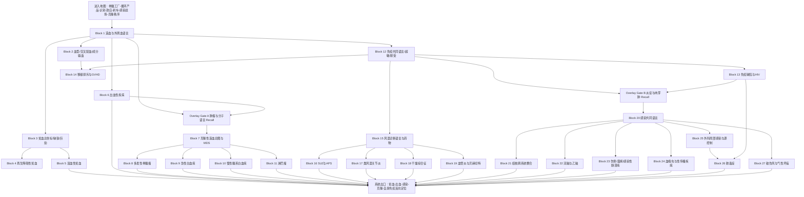

# 西综血液—免疫—感染｜完整导学、认知依赖与学习顺序 v1
## 按《西综 System Guide 生成规则 v1》生成

> **文件层级**：System Guide  
> **用途**：回答“血液—免疫—感染这一整套系统应该怎样学”，确定统一 Mental Model、认知依赖、Operational Blocks、跨系统路由、Memory Routing、范围归属与系统出口。  
> **不是**：第二份血液 / 风湿 / 传染讲义，不展开 KP 正文、完整机制答案、巨型疾病比较表、全部免疫表型 / 染色体 / 抗体 / 药物 / 阈值。  
> **权威主干**：本 Project 中的生理学、病理学、内科学、外科学 Study Lecture 与对应 Outline；必要调用《26生化.pdf》以及已完成的循环、呼吸、泌尿、消化—物质代谢—内分泌 System Guide。  
> **重要来源边界**：当前资料有完整的内科学血液和风湿、病理免疫与传染、外科输血与外科感染，但**没有独立的正常免疫学 Study Lecture，也没有完整的内科学传染病 Lecture**。因此本版只建立当前资料真实支持的“最低可运行免疫语言”和感染病理—外科模型，不静默补成一套完整免疫学或感染病学教材。  
> **生成日期**：2026-08-20  
> **状态**：v1｜source-bound System Guide；允许后续补充最新版资料、Block 深审和实际学习反馈后修订。

---

# 0｜本文件如何使用

本系统不是三门课程的机械拼接：

```text
血液病
→ 风湿免疫
→ 传染病
```

它真正围绕同一套“细胞群体与威胁管理”展开：

```text
骨髓持续生产和更新血细胞
        ↓
血液把细胞、蛋白和底物分配到全身
        ↓
免疫系统识别自身、异物和异常细胞
        ↓
效应细胞与体液成分清除威胁
        ↓
感染在具体组织中形成病理反应
        ↓
反应应被限制、终止并完成修复
```

若某一环失控，就出现：

- 血细胞生产不足；
- 成熟无效；
- 外周破坏或丢失；
- 出血或血栓；
- 克隆性增殖；
- 自身免疫；
- 免疫缺陷；
- 感染播散；
- 脓毒症和器官损害。

实际推进：

```text
在本 Guide 中定位当前 Block
→ 打开对应 Block Guide / 学习阅读版
→ 按 Study 连续小板块完成首次学习
→ 用 KP 闭卷恢复
→ 用 Outline 检查遗漏
→ MI-D 在 MarginNote 3 框选成卡片
→ 不让孤立数字、免疫表型、染色体、抗体谱和药物阻塞主线
```

## 0.1 本系统必须采用 DAG

共同底座完成后，系统分为三条支路：

```text
共同底座
造血—外周血—血型—止血—诊断语言
        ↓
├─ 血细胞数量 / 质量异常
│  ├─ 贫血
│  ├─ 骨髓衰竭
│  ├─ 溶血
│  └─ 出血性疾病
│
├─ 克隆性造血异常
│  ├─ MDS
│  ├─ 骨髓瘤
│  ├─ 白血病
│  └─ 淋巴瘤
│
└─ 免疫—感染
   ├─ 超敏 / 自身免疫
   ├─ 免疫缺陷 / HIV
   ├─ 移植排斥 / GVHD
   ├─ 风湿免疫病
   └─ 感染定位、播散、源控制与脓毒症
```

它们在以下出口重新汇合：

- 贫血；
- 出血；
- 反复感染；
- 发热；
- 淋巴结和肝脾肿大；
- 骨痛与器官浸润；
- 多系统自身免疫；
- 血栓；
- 休克；
- 多器官功能障碍。

## 0.2 四条关键去重边界

### 第一，正常止血不在这里第二次完整初见

正常血小板—凝血—纤溶及血栓—栓塞—梗死已在循环系统完成 Primary。

本系统采用：

```text
正常止血：Recall
→ 出血表现与筛查试验：Learn
→ ITP / 凝血因子病 / DIC：Learn
```

### 第二，生化桥梁不重复完整学习

以下已在“消化—物质代谢—内分泌 v2”完整学习：

- 成熟红细胞糖酵解、2,3-DPG、PPP / GSH / G6PD；
- 铁、B12、叶酸与一碳单位接口；
- 血红素—胆红素；
- 核苷酸代谢与抗代谢物；
- DNA、RNA、基因调控、DNA 损伤修复、原癌基因和抑癌基因。

本系统只 Recall / Apply，不重新抄写完整代谢通路。

### 第三，器官感染不重复完整诊疗模型

已经归属的主体继续保留：

- 肺结核、肺炎、肺脓肿：呼吸系统；
- 尿路感染、肾结核：泌尿系统；
- 肠结核、结核性腹膜炎、肝脓肿、胆道感染：消化系统；
- 感染性心内膜炎：循环系统。

感染支路学习：

> 共同病原—组织反应模式、传播和播散、病理鉴别，以及外科源控制和脓毒症。

### 第四，当前没有完整正常免疫学与临床感染病学来源

因此：

- 不自行扩写完整补体级联；
- 不自行扩写全部细胞因子网络；
- 不自行扩写疫苗、抗菌药和抗病毒药全章；
- 不自行扩写完整 HIV 抗病毒方案；
- 不假装已覆盖所有传染病。

---

# 1｜Scope Audit

## 1.1 当前 source-bound 客观范围

以下数字只用于客观规划，不用于预测个人学习速度。

| 学科 / 范围 | Study 范围 | Outline 范围 | 处置 |
|---|---|---:|---|
| 生理：血型、血液特性 | P83–98 | 单元 006–007，共 **60** 题 | Primary |
| 生理：生理性止血 | P99–110 | 单元 008，共 **48** 题 | Recall |
| 内科：血液系统 | P180–230 | 单元 071–090，共 **170** 题 | Primary |
| 病理：免疫性疾病 | P87–94 | 单元 010，共 **30** 题 | Primary |
| 内科：风湿免疫 | P270–286 | 单元 101–106，共 **73** 题 | Primary |
| 病理：结核 | P110–117 | 单元 013，共 **31** 题 | Common Primary + Organ Recall |
| 病理：其他传染病 | P118–124 | 单元 014，共 **31** 题 | Primary |
| 病理：炎症 | P161–173 | 单元 018，共 **34** 题 | Recall / Conditional Learn |
| 外科：输血 | 书页 P189–190 | 单元 046，共 **16** 题 | Primary |
| 外科：外科感染 | 书页 P204–209 | 单元 052–053，共 **24** 题 | Primary |
| 生化相关 | 《26生化.pdf》红细胞、氨基酸 / 一碳单位、胆色素、核苷酸与基因相关 | 讲义内嵌真题 | Recall / Apply |

### 当前体量概念

- Primary / Integration Outline：约 **435 题**；
- 前序系统 Recall Outline：约 **82 题**；
- 主体 / 整合 Study：约 **115 个来源页**；
- 另有约 **25 页**正常止血与炎症 Recall 范围。

说明：

- 不同讲义页的信息密度差异很大；
- 题纲中存在跨学科重复；
- 最终由 Coverage Ledger 去重；
- 血液肿瘤的视觉与 Memory Island 负担远高于普通页数所显示的体量。

## 1.2 生理学主体

### 血型

- ABO 抗原和抗体；
- Rh / D 抗原；
- 天然抗体与免疫性抗体；
- 凝集与溶血；
- 交叉配血；
- 新生儿溶血接口；
- 输血原则。

### 血液特性

- 血浆与血细胞；
- Hct；
- 晶体 / 胶体渗透压与 pH 接口；
- 红细胞形态、变形性、渗透脆性和血沉；
- 红细胞生成、成熟和破坏；
- EPO；
- 白细胞分类与分布；
- 血小板来源和功能；
- 正常造血基本语言。

### 生理性止血

- 血管收缩；
- 血小板黏附、释放与聚集；
- 凝血；
- 抗凝；
- 纤溶。

> 本系统只做诊断性 Recall，正常机制的完整初见仍归循环系统。

## 1.3 内科学血液主体

- 贫血概述；
- 缺铁性贫血；
- 巨幼细胞性贫血接口；
- 再生障碍性贫血；
- 溶血性贫血；
- 出血性疾病概述；
- 原发免疫性血小板减少症 ITP；
- 多发性骨髓瘤；
- MDS；
- 急性白血病；
- 慢性髓系白血病；
- 淋巴瘤；
- 外周血、骨髓、细胞化学、免疫表型和遗传学证据。

## 1.4 病理免疫主体

- SLE 病理；
- 类风湿关节炎病理；
- HIV / AIDS；
- 原发性免疫缺陷；
- 移植排斥；
- GVHD；
- Ⅰ–Ⅳ型超敏反应；
- 免疫复合物、抗体和 T 细胞介导损伤的考试口径。

## 1.5 内科学风湿主体

- 风湿系统分类与总论；
- 自身抗体与检查定位；
- NSAIDs、糖皮质激素、DMARDs 和生物制剂的角色边界；
- SLE；
- APS 接口；
- RA；
- 原发性干燥综合征；
- 系统性血管炎；
- 贝赫切特病；
- 系统性硬化症、炎症性肌病和痛风的总论级接口。

## 1.6 病理感染主体

### 结核

- 共同致病和免疫基础；
- 干酪性肉芽肿；
- 原发、继发与播散；
- 器官外结核的病理定位。

### 其他传染病

- 流脑与乙脑；
- 伤寒；
- 细菌性痢疾；
- 血吸虫病；
- 梅毒；
- 尖锐湿疣；
- 淋病；
- 常考溃疡形态网络。

## 1.7 外科学主体

### 输血

- 血液成分选择；
- 输血指征接口；
- 发热、过敏、溶血、循环超负荷等输血反应；
- 大量输血并发症；
- 自体输血；
- 去白、洗涤、辐照等成分血接口；
- 输血相关 GVHD 的临床入口。

### 外科感染

- 外科感染分类；
- 混合感染、继发感染和条件性感染；
- 抗菌药使用原则；
- 脓肿、蜂窝织炎、丹毒等局部感染；
- 手部感染；
- 源控制；
- 脓毒症；
- 破伤风；
- 气性坏疽。

## 1.8 必要跨系统桥梁

### 从循环系统 Recall

- 正常止血；
- 血栓、栓塞和 DIC 微循环后果；
- 休克；
- 感染性心内膜炎；
- 高排量心衰；
- 失血性休克。

### 从呼吸系统 Recall

- Hb、SaO₂、CaO₂ 和组织氧供；
- 肺结核；
- 肺部机会性感染；
- 低氧与贫血的边界。

### 从泌尿系统 Recall / Apply

- EPO 与肾性贫血；
- CKD 出血倾向；
- 多发性骨髓瘤肾损害；
- SLE / 血管炎肾损害；
- 肾病综合征血栓。

### 从消化—物质代谢—内分泌 Recall

- 铁、B12、叶酸吸收；
- 红细胞代谢；
- 一碳单位；
- 血红素—胆红素；
- 核苷酸和抗代谢物；
- 肝脏凝血因子合成；
- 肿瘤分子共同语言；
- 脾功能亢进；
- 慢性失血。

### 向神经—骨科后续输出

- 贫血和高黏滞的神经表现；
- B12 缺乏神经损害；
- CNS 感染；
- MM 骨病；
- RA 关节破坏；
- 血管炎神经病；
- 感染性骨关节病接口。

---

# 2｜明确后置的独立模型

## 2.1 后置到神经系统

- 乙脑和流脑的完整神经定位、并发症和临床治疗；
- CNS 白血病的完整神经处理；
- 周围神经病和脊髓病的完整定位。

本系统完成：

> 病原—主要部位—病理变化—关键鉴别。

## 2.2 后置到骨科

- RA 关节畸形的功能评估和骨科处理；
- MM 骨折与脊柱压迫的骨科路径；
- 骨与关节结核完整模型；
- 骨感染与骨肿瘤。

本系统完成：

> 免疫 / 克隆性病因怎样产生骨与关节表现。

## 2.3 后置到生殖—乳腺

- Rh 不合妊娠管理；
- 妊娠免疫和母胎耐受；
- 习惯性流产的产科处理；
- 生殖系统感染的完整器官模型。

本系统只保留血型、APS 和 STI 的共同接口。

## 2.4 后置到完整感染病学

当前没有完整内科感染 Lecture，因此不展开：

- 所有传染病的临床分期和治疗；
- 全部抗菌药物体系；
- 全部抗病毒和抗真菌方案；
- 疫苗和暴露后预防总论；
- 完整 HIV 抗病毒治疗。

## 2.5 后置到完整正常免疫学

当前资料不足以 source-bound 完成：

- 淋巴细胞发育全程；
- 抗原递呈细节；
- 补体完整级联；
- 细胞因子网络；
- 免疫球蛋白转换和亲和力成熟全章。

本系统只建立当前病理和内科疾病所需的最低可运行语言。

---

# 3｜System Mission & Mental Model

## 3.1 系统真正维持什么

这套系统共同完成的任务是：

> **持续生产和更新血细胞，保证氧运输、止血与防御；识别病原和异常细胞，动员适当效应反应；在威胁解除后终止反应，同时维持自身耐受和造血克隆秩序。**

## 3.2 八个部件模型

### 1. 骨髓工厂

决定：

- 造什么细胞；
- 造多少；
- 是否正常成熟；
- 是否释放入外周血。

### 2. 循环产品

包括：

- 红细胞：运输 O₂ / CO₂；
- 白细胞：防御与免疫；
- 血小板：止血和血管完整；
- 血浆蛋白：运输、胶体渗透、凝血、抗体和补体接口。

### 3. 分配与迁移系统

细胞必须：

- 在血液中循环；
- 识别黏附和趋化信号；
- 进入组织；
- 在脾、淋巴结、肝和骨髓等器官间更新。

### 4. 识别器

识别：

- 自身；
- 非自身病原；
- 损伤细胞；
- 异常克隆；
- 移植物。

### 5. 效应器

包括：

- 吞噬；
- 抗体；
- 补体接口；
- 细胞毒性；
- 炎症；
- 凝血与屏障反应。

### 6. 刹车与耐受

必须避免：

- 攻击自身；
- 反应持续放大；
- 出血与血栓失衡；
- 慢性炎症和纤维化；
- 移植方向错误。

### 7. 感染战场与源控制

感染能否被控制取决于：

- 病原量和毒力；
- 进入部位；
- 宿主免疫；
- 局部解剖；
- 是否存在坏死、脓腔、异物或梗阻；
- 是否及时清除感染源。

### 8. 克隆秩序

造血细胞必须：

- 保持正常分化；
- 受凋亡和生长信号约束；
- 不被单一异常克隆占据骨髓、血液和淋巴器官。

## 3.3 三条运行回路

### 生产—更新回路

```text
干 / 祖细胞
→ 分化与成熟
→ 外周血
→ 执行功能
→ 衰老 / 清除
→ 反馈调节新生
```

### 威胁—应答回路

```text
病原 / 异物 / 异常细胞
→ 识别
→ 先天效应
→ 适应性效应
→ 清除
→ 记忆 / 终止
```

### 损伤—限制回路

```text
炎症与凝血保护宿主
→ 过强时造成组织损伤
→ 抗炎、抗凝和耐受机制限制反应
→ 修复或慢性化
```

---

# 4｜Input / Output Contract

## 4.1 Input｜进入本系统前需要什么

### Hard prerequisite

- 循环系统的正常止血、血栓和灌注；
- 呼吸系统的氧运输与低氧；
- 泌尿系统的 EPO、肾功能和电解质；
- 消化—生化系统的铁、B12、叶酸、红细胞代谢、胆红素、核苷酸与肿瘤分子；
- 病理炎症、坏死、修复和肉芽肿；
- 基本细胞信号转导。

### 分 Block Hard prerequisite

- Block 3–6：Block 1 的 CBC、Ret、骨髓和外周血语言；
- Block 7–11：肿瘤 / 分子语言 Recall Gate；
- Block 12–19：炎症、B / T 细胞和抗体的最低接口；
- Block 20–27：炎症 / 肉芽肿 Recall Gate；
- Block 26：循环休克；
- Block 14：Block 2 的血型与输血方向性。

### Soft prerequisite

- 脾、淋巴结和胸腺的基本结构；
- 遗传学与染色体；
- 抗菌药基本概念；
- 器官系统感染模型。

## 4.2 Output｜学完以后向后续系统输出什么

### 向神经系统

- CNS 感染的病理入口；
- B12 缺乏神经病；
- 高黏滞、贫血和血管炎神经表现；
- CNS 白血病接口。

### 向骨科

- RA 的滑膜—血管翳—关节破坏；
- MM 的骨溶解和病理骨折；
- 感染与免疫导致骨关节损害的共同机制。

### 向生殖—乳腺

- ABO / Rh；
- APS 与流产；
- HIV / STI；
- 妊娠期贫血和血栓接口；
- 输血与母胎同种免疫。

### 向所有系统

- CBC / Ret / 骨髓判读；
- 贫血、出血与感染三大入口；
- 自身免疫和免疫缺陷坐标；
- 克隆性疾病证据层；
- 感染严重度、源控制和脓毒症判断。

---

# 5｜Core Variables & Failure Modes

## 5.1 最小变量语言

```text
Hb / RBC / Hct｜红细胞数量与携氧
MCV / MCH / MCHC｜红细胞大小与血红蛋白化
Ret｜骨髓红系反应
WBC differential / ANC｜白细胞与中性粒细胞
Plt｜血小板
Bone marrow cellularity｜骨髓增生程度
Lineage / maturation / blast｜系别、成熟和原始细胞
Iron panel｜SI、SF、TIBC、TS、sTfR
Hemolysis evidence｜胆红素、LDH、结合珠蛋白、尿 Hb 等
PT / APTT / TT / Fbg / FDP / D-dimer｜凝血和纤溶
M protein / immunoglobulin｜单克隆蛋白
Morphology / cytochemistry / immunophenotype / genetics｜克隆性证据
ANA / dsDNA / Sm / SSA / SSB / ANCA / RF / anti-CCP｜自身免疫证据
Complement / ESR / CRP｜活动与炎症接口
CD4 / CD8｜细胞免疫接口
Pathogen / source / culture｜感染证据
Local infection / bacteremia / sepsis / organ dysfunction｜感染严重度
```

## 5.2 十类 Failure Modes

### 1. 生产不足

骨髓不能产生足够血细胞。

代表：

- 再障；
- 肾性贫血；
- 造血原料缺乏；
- 骨髓被肿瘤占据。

### 2. 无效成熟

细胞被造出，但成熟和功能异常，甚至在骨髓内死亡。

代表：

- 巨幼贫；
- MDS；
- 部分铁利用障碍。

### 3. 外周丢失或破坏过多

代表：

- 失血；
- 溶血；
- 免疫性血小板破坏；
- 脾亢。

### 4. 细胞本身质量异常

代表：

- 红细胞膜、酶和珠蛋白异常；
- 白细胞功能缺陷；
- 血小板功能异常。

### 5. 止血失衡

- 止血不足 → 出血；
- 凝血过强或失控 → 血栓；
- 凝血和纤溶同时失控 → DIC。

### 6. 克隆性扩张或分化停滞

代表：

- MDS；
- 白血病；
- 淋巴瘤；
- 多发性骨髓瘤。

### 7. 自身耐受丢失

代表：

- SLE；
- RA；
- 干燥综合征；
- 血管炎；
- ITP；
- 自身免疫性溶血。

### 8. 免疫防御不足

代表：

- 原发免疫缺陷；
- HIV / AIDS；
- 化疗和骨髓衰竭；
- 中性粒细胞减少。

### 9. 感染无法局限

原因可包括：

- 病原毒力强；
- 宿主免疫弱；
- 局部坏死、梗阻、脓腔、异物；
- 未完成源控制。

### 10. 同种免疫方向错误

代表：

- 输血不相容；
- 移植排斥；
- GVHD；
- 母胎 Rh 免疫接口。

---

# 6｜Dependency Graph



## 6.1 这条路线为什么这样排

1. **先会读 CBC、Ret、骨髓和涂片，再学疾病。**  
   否则贫血、白血病和骨髓衰竭只是病名列表。

2. **贫血先建立“生成不足—丢失—破坏”的总坐标。**  
   再障和溶血才能被放入正确分支。

3. **正常止血只 Recall，出血性疾病在此正式学习。**  
   避免重复机制，同时保留诊断连续性。

4. **克隆性疾病前先 Recall 肿瘤和分子共同语言。**  
   之后形态、免疫、遗传才有统一证据层。

5. **MDS 放在克隆性造血入口。**  
   它不是简单“另一种贫血”，而是无效造血与向 AML 转化的桥梁。

6. **免疫共同语言先于风湿和感染。**  
   但只学习当前资料支持的最低必要层。

7. **免疫缺陷先于感染支路。**  
   同一病原在免疫完整与免疫缺陷宿主中可产生不同反应。

8. **结核只完整整合共同病理和播散。**  
   肺、肾、肠等器官诊疗模型直接调用前序系统。

9. **外科感染先局部和源控制，再进入脓毒症。**  
   脓毒症不是孤立病名，而是感染没有被局限后的系统失控。

---

# 7｜Operational Block Route

# Block 1｜血液总地图、造血与外周血诊断语言

**中心问题**

> 骨髓如何产生红细胞、白细胞和血小板；CBC、Ret、外周涂片和骨髓检查分别在观察哪一层？

**为什么现在学**

这是所有贫血、骨髓衰竭、白血病和感染病例的共同语言。

**前置**

- Hard：氧运输、细胞分化、EPO 接口。
- Soft：红细胞代谢和脾清除。

**Study 主范围**

- 生理 P88–98；
- 内科 P180–186 中贫血概述和诊断语言。

**Outline 主范围**

- 生理单元 007；
- 内科单元 071–073 中总论部分。

**必要原图**

- 造血干细胞和各系分化；
- 红细胞成熟；
- 巨核细胞—血小板；
- CBC；
- Ret；
- 外周血涂片；
- 骨髓穿刺 / 活检；
- ESR 与渗透脆性。

**动作配置**

- Learn：三系来源、成熟、寿命、反馈；CBC、Ret、骨髓增生和外周形态。
- Recall：EPO、成熟红细胞代谢、Hb 携氧。
- Apply：贫血、全血细胞减少、感染和肿瘤浸润。
- Defer：具体疾病诊断。

**知识形态**

- Mechanism Spine：骨髓生产 → 成熟 → 外周释放 → 功能 → 清除 → 反馈。
- Discrimination Tree：数量少 / 功能差 / 分布异常；外周问题 / 骨髓问题。
- MI-G：Ret 反映红系反应；骨髓穿刺与活检回答的问题不同。
- MI-D：全部正常值、细胞比例和低频形态。

**客观负荷画像**

- 首轮主线负荷：很重
- Memory Island 负担：高
- 视觉负担：很高
- 跨科整合负担：很高
- 主要负荷来源：细胞谱系、检查层级和形态语言

**出口问题**

1. Hb 低时，第一步为什么不能直接猜病因？
2. Ret 高和低分别把病因推向哪一侧？
3. 外周血、骨髓穿刺和活检各回答什么？
4. 全血细胞减少可来自生产、破坏和分布哪些路径？
5. 红细胞、白细胞和血小板的数量异常为什么不等于功能异常？

**进入下一 Block 的最低标准**

能从 CBC + Ret + 涂片 + 骨髓四层定位问题，而不是只认病名。

---

# Block 2｜血型、交叉配血与成分输血

**中心问题**

> 输入的细胞和蛋白为什么可能被受者识别为异物；怎样通过血型、交叉配血和成分选择降低风险？

**为什么现在学**

它连接正常血型、溶血、免疫反应、急救输血和后续移植排斥。

**前置**

- Hard：Block 1；
- Soft：抗原—抗体、容量与电解质。

**Study 主范围**

- 生理 P83–87；
- 外科书页 P189–190。

**Outline 主范围**

- 生理单元 006；
- 外科单元 046。

**必要原图**

- ABO 抗原 / 抗体；
- Rh；
- 主 / 次侧交叉配血；
- 成分血；
- 输血反应流程；
- 大量输血并发症。

**动作配置**

- Learn：ABO、Rh、交叉配血、成分输血、急 / 延迟反应、大量输血、自体输血。
- Recall：溶血、容量负荷、高钾、低钙和酸碱。
- Apply：再障、白血病、地贫、失血。
- Defer：移植排斥与 GVHD 完整机制到 Block 14。

**知识形态**

- Mechanism Spine：供者成分进入 → 受者识别 → 凝集 / 溶血 / 过敏 / 容量和代谢后果。
- Discrimination Tree：ABO / Rh；溶血 / 发热 / 过敏 / 超负荷；红细胞 / 血小板 / 血浆。
- MI-G：急性溶血反应和循环超负荷的立即识别；何时选何种成分。
- MI-D：全部输血阈值、特殊血制品和反应时间。

**客观负荷画像**

- 首轮主线负荷：重
- Memory Island 负担：很高
- 视觉负担：高
- 跨科整合负担：很高
- 主要负荷来源：方向性、成分选择和并发症门槛

**出口问题**

1. ABO 与 Rh 抗体性质为什么不同？
2. 主侧和次侧交叉配血分别在防什么？
3. 为什么贫血不等于必须输全血？
4. 大量输血为什么可同时造成 K⁺、Ca²⁺、体温和凝血异常？
5. 输血相关 GVHD 与普通输血溶血的攻击方向有何不同？

**进入下一 Block 的最低标准**

能先判断缺的是什么成分，再判断输什么、主要风险是什么。

---

# Block 3｜贫血总坐标、缺铁性贫血与巨幼细胞性贫血

**中心问题**

> Hb 下降后，如何用 MCV 与 Ret 把贫血定位到造血原料、成熟障碍、丢失或破坏；铁与 B12 / 叶酸为何产生相反形态？

**为什么现在学**

这是血液系统最重要的分类入口。

**前置**

- Hard：Block 1；
- Recall：铁吸收、一碳单位、DNA 合成、胆红素。

**Study 主范围**

- 内科 P180–186；
- 消化—生化 Guide 中铁 / B12 / 叶酸、M3、M8、M10：Recall。

**Outline 主范围**

- 内科单元 071–073。

**必要原图**

- MCV—Ret 坐标；
- 铁代谢；
- IDA 三阶段；
- 外周血形态；
- 巨幼变；
- 骨髓和神经接口。

**动作配置**

- Learn：贫血总论；缺铁；巨幼；慢性病贫血和铁利用障碍的鉴别入口。
- Recall：铁、B12、叶酸吸收；一碳单位；Hb 合成。
- Apply：慢性失血、胃肠疾病、妊娠、肾病和炎症。
- Defer：再障和溶血到后续 Block。

**知识形态**

- Mechanism Spine：造血原料 / DNA / Hb 合成异常 → 细胞形态 → Ret 反应 → 全身缺氧。
- Discrimination Tree：大 / 正 / 小细胞；Ret 高 / 低；缺铁 / 慢性病 / 铁粒幼 / 地贫。
- MI-G：MCV + Ret 的第一层定位；铁储存与运输指标；B12 神经损害。
- MI-D：所有数值、补充方案和铁代谢特殊。

**客观负荷画像**

- 首轮主线负荷：很重
- Memory Island 负担：很高
- 视觉负担：很高
- 跨科整合负担：极高
- 主要负荷来源：指标多且需与生化、消化和病因双向绑定

**出口问题**

1. 为什么贫血首先看 Hb，而病因分类要看 MCV 和 Ret？
2. 缺铁为何先耗尽储存铁，最后才出现 Hb 下降？
3. 慢性病贫血为什么血清铁低而储存铁不低？
4. B12 / 叶酸缺乏为什么“核幼浆老”？
5. 哪些病因属于造不出，哪些属于丢太多或坏太快？

**进入下一 Block 的最低标准**

能用“大小 + Ret + 铁 / B12 / 叶酸证据”完成第一轮定位。

---

# Block 4｜再生障碍性贫血：真正的骨髓造血衰竭

**中心问题**

> 当骨髓工厂整体停摆时，为什么出现全血细胞减少，却通常没有肿瘤性浸润和明显肝脾肿大？

**前置**

- Hard：Block 1、3。
- Soft：T 细胞介导抑制造血。

**Study 主范围**

- 内科 P187–189。

**Outline 主范围**

- 内科单元 074–075。

**必要原图**

- 低增生骨髓；
- 脂肪化；
- 骨髓穿刺与活检；
- 重型分层；
- AA / MDS / PNH 鉴别。

**动作配置**

- Learn：病因；干祖细胞、微环境和免疫机制；临床；骨髓；重型判断；移植 / 免疫抑制大边界。
- Recall：三系寿命、Ret、输血。
- Apply：感染和出血风险。
- Defer：MDS 与克隆性疾病到 Block 7。

**知识形态**

- Mechanism Spine：种子 / 土壤 / 免疫抑制 → 骨髓低增生 → 三系减少。
- Discrimination Tree：AA / MDS / 白血病 / PNH / 脾亢。
- MI-G：重型与极重型门槛；感染和出血的立即风险。
- MI-D：全部数值、药物、供者条件和支持治疗细节。

**客观负荷画像**

- 首轮主线负荷：重
- Memory Island 负担：高
- 视觉负担：高
- 跨科整合负担：高
- 主要负荷来源：阴性体征、骨髓证据和治疗分层

**出口问题**

1. AA 的全血细胞减少为什么属于生产不足？
2. Ret、骨髓增生和巨核细胞如何共同支持诊断？
3. 为什么多无肝脾肿大？
4. AA 与 MDS 的本质差别是什么？
5. 为什么严重中性粒细胞减少和血小板减少决定近期危险？

**进入下一 Block 的最低标准**

能从“低增生骨髓 + Ret 低 + 三系减少”识别真正骨髓衰竭。

---

# Block 5｜溶血性贫血：红细胞在哪里、为什么被破坏

**中心问题**

> 红细胞寿命缩短后，怎样证明溶血，并进一步判断是血管内、血管外、红细胞内因还是外因？

**前置**

- Hard：Block 1、3；
- Recall：红细胞膜、酶、Hb、胆红素和脾。

**Study 主范围**

- 内科 P190–196；
- 生化红细胞代谢和胆红素：Recall。

**Outline 主范围**

- 内科单元 076–078。

**必要原图**

- 血管内 / 外溶血；
- Ret 与骨髓代偿；
- 球形、靶形、镰形等涂片；
- Coombs；
- PNH；
- G6PD；
- 自免溶血。

**动作配置**

- Learn：溶血证据；部位；遗传 / 获得；免疫 / 非免疫；代表疾病。
- Recall：PPP / GSH / G6PD、Hb、胆红素、脾清除。
- Apply：黄疸、胆石、肾损伤和高排量心衰。
- Defer：完整遗传学和全部罕见酶病。

**知识形态**

- Mechanism Spine：红细胞缺陷或外界攻击 → 寿命缩短 → 破坏产物 + 骨髓代偿。
- Discrimination Tree：血管内 / 外；内在 / 外在；免疫 / 非免疫。
- MI-G：证明溶血的组合证据；血红蛋白尿和脾大方向；急性危重溶血。
- MI-D：全部涂片形态、膜蛋白、酶和抗体温度特殊。

**客观负荷画像**

- 首轮主线负荷：很重
- Memory Island 负担：很高
- 视觉负担：极高
- 跨科整合负担：极高
- 主要负荷来源：多轴分类和生化—形态—临床三向映射

**出口问题**

1. 为什么 Ret 高只能证明骨髓在代偿，不能单独证明溶血？
2. 血管内和血管外溶血的产物去向有何不同？
3. 遗传球与温抗体自免溶为什么都可见球形红细胞？
4. G6PD 缺乏怎样从 NADPH / GSH 走到溶血？
5. PNH 为什么连接溶血、血栓和骨髓衰竭？

**进入下一 Block 的最低标准**

能先证明溶血，再沿“部位—病因—机制”继续分类。

---

# Block 6｜出血性疾病：血管、血小板、凝血与纤溶

**中心问题**

> 面对出血，如何先从出血部位和筛查试验判断是血管壁、血小板、凝血因子还是消耗性失控？

**前置**

- Hard：Block 1；
- Recall：循环系统正常止血和 DIC 微循环。

**Study 主范围**

- 生理 P99–110：Recall；
- 内科 P197–202。

**Outline 主范围**

- 生理单元 008：Recall；
- 内科单元 079–080。

**必要原图**

- 止血三阶段；
- PT / APTT / TT / Fbg / FDP / D-dimer；
- 皮肤黏膜 vs 深部出血；
- ITP；
- 血友病 / vWD 接口；
- DIC。

**动作配置**

- Learn：出血模式；筛查试验；ITP；凝血因子病入口；DIC 临床证据和处理目标。
- Recall：血小板黏附聚集、凝血、抗凝和纤溶。
- Apply：肝病、肾病、感染、肿瘤、输血。
- Defer：DIC 休克和微循环电影已归循环。

**知识形态**

- Mechanism Spine：止血层级受损 → 特定出血模式 → 特定筛查异常。
- Discrimination Tree：血小板 / 凝血；数量 / 功能；ITP / DIC / 血友病 / vWD。
- MI-G：危及生命出血；PT / APTT 组合；DIC 的消耗 + 继发纤溶。
- MI-D：全部凝血因子、阈值、药物和输注细则。

**客观负荷画像**

- 首轮主线负荷：很重
- Memory Island 负担：极高
- 视觉负担：高
- 跨科整合负担：极高
- 主要负荷来源：正常机制已学，但疾病筛查和治疗门槛密集

**出口问题**

1. 皮肤黏膜出血和关节肌肉出血分别首先提示什么？
2. 血小板数量低与功能差如何区分？
3. PT、APTT、TT、Fbg 和 D-dimer 各证明哪一层？
4. ITP 为什么既有破坏增加，也可能有生成减少？
5. DIC 为什么可同时出血、血栓和器官缺血？

**进入下一 Block 的最低标准**

能从出血模式 + Plt + PT / APTT 完成第一轮定位。

---

## Overlay Gate A｜肿瘤与分子共同语言

进入 Block 7–11 前，Recall 已学内容：

```text
克隆性增殖
→ 分化与成熟异常
→ 原癌基因 / 抑癌基因 / DNA 修复
→ 染色体与融合基因
→ 形态 / 免疫 / 遗传证据
→ 靶向与抗代谢治疗接口
```

首次完整位置：

- 病理肿瘤总论；
- 《26生化.pdf》核苷酸、DNA / RNA、基因调控和 DNA 损伤；
- 消化—物质代谢—内分泌 v2 的 M9、G1–G5。

当前不重复中心法则和全部抗代谢物。

# Block 7｜克隆性造血总地图与 MDS

**中心问题**

> 造血细胞异常是“数量少”，还是某个异常克隆占据骨髓并发生无效成熟；MDS 为什么处在骨髓衰竭与 AML 之间？

**前置**

- Hard：Block 1、Overlay Gate A。
- Soft：Block 4。

**Study 主范围**

- 内科 P206–208；
- 白血病开篇的克隆分类语言：必要接口。

**Outline 主范围**

- 内科单元 082；
- 单元 083 的总论接口。

**必要原图**

- 病态造血；
- 外周血和骨髓发育异常；
- 原始细胞；
- MDS 分型 / 风险；
- AA / MDS / AML 鉴别。

**动作配置**

- Learn：克隆性造血证据层；无效造血；MDS；向 AML 转化。
- Recall：骨髓、Ret、DNA 损伤和克隆。
- Apply：全血细胞减少、贫血、感染和出血。
- Defer：急性白血病完整模型到 Block 9。

**知识形态**

- Mechanism Spine：异常干细胞克隆 → 病态 / 无效成熟 → 细胞减少 → 克隆进展。
- Discrimination Tree：AA / MDS / AML；反应性异常 / 克隆性异常。
- MI-G：病态造血与原始细胞升高的门槛意义。
- MI-D：全部分型、风险评分、染色体和治疗。

**客观负荷画像**

- 首轮主线负荷：重
- Memory Island 负担：很高
- 视觉负担：极高
- 跨科整合负担：极高
- 主要负荷来源：形态与克隆证据、与 AA / AML 的边界

**出口问题**

1. MDS 为什么既可表现为贫血，又不是普通营养性贫血？
2. “骨髓增生”与“有效外周血细胞生成”为什么不是同一件事？
3. MDS 与 AA 最关键的差别是什么？
4. MDS 如何成为 AML 的前驱状态？
5. 哪些证据支持克隆性而非反应性改变？

**进入下一 Block 的最低标准**

能把“无效造血”与“低增生”和“原始细胞肿瘤”区分开。

---

# Block 8｜多发性骨髓瘤：浆细胞克隆如何同时伤骨、肾、血液和钙

**中心问题**

> 单克隆浆细胞和 M 蛋白怎样形成骨破坏、肾损伤、贫血、高钙与感染易感？

**前置**

- Hard：Block 7；
- Recall：免疫球蛋白、蛋白尿、骨和肾接口。

**Study 主范围**

- 内科 P203–205。

**Outline 主范围**

- 内科单元 081。

**必要原图**

- 浆细胞；
- M 蛋白；
- 缗钱状红细胞；
- 溶骨性病变；
- 骨髓；
- 尿蛋白；
- MM / MGUS 等入口。

**动作配置**

- Learn：克隆浆细胞；M 蛋白；CRAB 类器官损伤；检查；分期和治疗目标。
- Recall：免疫球蛋白、溢出性蛋白尿、Ca²⁺、骨吸收。
- Apply：肾衰、感染、贫血和高黏滞。
- Defer：完整骨科处理和全部方案。

**知识形态**

- Mechanism Spine：浆细胞克隆 → 单克隆蛋白 + 骨髓占据 + 骨重塑失衡 → 多器官表现。
- Discrimination Tree：MM / 转移癌 / 骨质疏松；M 蛋白相关状态。
- MI-G：器官损害证据和需要治疗的边界。
- MI-D：免疫球蛋白类型、分期、药物和移植细节。

**客观负荷画像**

- 首轮主线负荷：重
- Memory Island 负担：高
- 视觉负担：很高
- 跨科整合负担：极高
- 主要负荷来源：一个克隆产生多系统表现

**出口问题**

1. MM 为什么可同时贫血、肾衰、高钙和骨痛？
2. M 蛋白怎样造成 ESR、缗钱状和高黏滞改变？
3. 溢出性蛋白尿与肾小球蛋白尿有何不同？
4. 溶骨性病变为何不是普通骨质疏松？
5. 何种证据说明这不是“只有 M 蛋白”而已？

**进入下一 Block 的最低标准**

能从“浆细胞克隆 + M 蛋白 + 器官损害”重建完整主链。

---

# Block 9｜急性白血病：成熟被截断后，原始细胞如何占据骨髓与器官

**中心问题**

> 为什么急性白血病既可白细胞高，也可低；形态、细胞化学、免疫表型和遗传学分别在完成哪一步分类？

**前置**

- Hard：Block 7；
- Recall：DNA / 染色体和抗代谢物。

**Study 主范围**

- 内科 P210–217 左右；
- 急性白血病相关病理串联。

**Outline 主范围**

- 内科单元 083–086 中急性白血病范围。

**必要原图**

- 骨髓原始细胞；
- Auer 小体；
- MPO / PAS 等细胞化学；
- AML / ALL 免疫表型；
- APL；
- 典型染色体和融合基因；
- CNS / 睾丸浸润接口。

**动作配置**

- Learn：急性髓系 / 淋系总坐标；骨髓衰竭；浸润；证据层；APL 特殊；治疗目标。
- Recall：克隆性、分化阻滞、DIC、核苷酸抗代谢。
- Apply：感染、出血、贫血、器官浸润。
- Defer：全部方案、剂量和每个亚型详细表。

**知识形态**

- Mechanism Spine：原始细胞克隆 + 成熟阻滞 → 骨髓占据 → 正常造血抑制 + 器官浸润。
- Discrimination Tree：AML / ALL；APL / 其他 AML；形态 / 免疫 / 遗传证据。
- MI-G：APL 与 DIC；高白细胞和肿瘤溶解等急症。
- MI-D：全部 CD、染色体、化疗方案和预后分层。

**客观负荷画像**

- 首轮主线负荷：极重
- Memory Island 负担：极高
- 视觉负担：极高
- 跨科整合负担：极高
- 主要负荷来源：多层分类和大量门槛记忆

**出口问题**

1. 白血病为何可出现白细胞增高、正常或降低？
2. 为什么外周白细胞多不等于免疫防御强？
3. 形态、细胞化学、免疫表型和遗传学各解决什么问题？
4. APL 为什么必须特别关注 DIC？
5. 急性白血病的贫血、感染和出血来自什么共同上游？

**进入下一 Block 的最低标准**

能先确认“急性克隆性原始细胞病”，再按系别和特殊亚型分类。

---

# Block 10｜慢性髓系白血病：成熟细胞很多，为什么仍是肿瘤

**中心问题**

> CML 为什么以较成熟粒细胞扩增为主；慢性期、加速期和急变期怎样沿同一克隆进展？

**前置**

- Hard：Block 7、9。
- Recall：染色体和融合基因。

**Study 主范围**

- 内科 P218–219 左右。

**Outline 主范围**

- 内科单元 085–086 中 CML 范围。

**必要原图**

- 外周粒细胞谱；
- NAP；
- Philadelphia 染色体 / BCR-ABL；
- 三阶段；
- 脾大；
- 类白血病反应鉴别。

**动作配置**

- Learn：CML 克隆；血象；脾大；分期；靶向治疗目标；急变。
- Recall：造血成熟、酪氨酸激酶、急性白血病。
- Apply：高白细胞、脾亢和高尿酸接口。
- Defer：全部药物、突变和移植细节。

**知识形态**

- Mechanism Spine：融合基因驱动 → 成熟粒细胞持续扩增 → 克隆进展 → 急变。
- Discrimination Tree：CML / 类白血病反应；慢性 / 加速 / 急变。
- MI-G：分子标志和急变判断。
- MI-D：全部血象比例、分期数字和 TKI 细节。

**客观负荷画像**

- 首轮主线负荷：重
- Memory Island 负担：高
- 视觉负担：高
- 跨科整合负担：高
- 主要负荷来源：反应性和克隆性的鉴别

**出口问题**

1. CML 与急性白血病的成熟程度有何不同？
2. 为什么 CML 的白细胞很多却不能视为正常抗感染能力增强？
3. NAP 怎样帮助鉴别类白血病反应？
4. BCR-ABL 在诊断与治疗中分别扮演什么角色？
5. 急变为什么意味着疾病生物学改变？

**进入下一 Block 的最低标准**

能用“成熟谱 + 分子标志 + 克隆进展”解释 CML。

---

# Block 11｜淋巴瘤：异常克隆在淋巴结构中如何定位和分类

**中心问题**

> 淋巴结肿大为什么必须同时判断细胞来源、结构、部位和生物学行为；HL 与 NHL 怎样分别成立？

**前置**

- Hard：Block 7、12 的最低免疫表型接口可并行补充。
- Soft：EBV 和 HIV。

**Study 主范围**

- 内科 P220–230；
- 其中包含病理形态和免疫表型串联。

**Outline 主范围**

- 内科单元 087–090。

**必要原图**

- 正常淋巴结结构；
- RS 细胞；
- HL / NHL；
- B / T / NK 免疫表型；
- Burkitt 满天星；
- 滤泡 / 弥漫；
- 特征染色体；
- Ann Arbor 等分期接口。

**动作配置**

- Learn：HL / NHL；来源；结构；侵袭性；部位；检查；分期和治疗目标。
- Recall：B / T 细胞、EBV、HIV、肿瘤分子。
- Apply：淋巴结肿大、肝脾大、骨髓浸润和 B 症状。
- Defer：全部亚型、CD、染色体和方案进入 MI-D。

**知识形态**

- Mechanism Spine：淋巴细胞克隆 → 淋巴结构破坏 / 器官浸润 → 分期和生物学行为。
- Discrimination Tree：HL / NHL；B / T / NK；惰性 / 侵袭；感染性 / 肿瘤性淋巴结。
- MI-G：需要活检的淋巴结警报；结构和免疫表型的诊断意义。
- MI-D：全部 CD、染色体、分期和治疗方案。

**客观负荷画像**

- 首轮主线负荷：极重
- Memory Island 负担：极高
- 视觉负担：极高
- 跨科整合负担：极高
- 主要负荷来源：亚型多、形态和免疫表型高度密集

**出口问题**

1. 为什么淋巴瘤诊断不能只看“淋巴细胞多”？
2. HL 与 NHL 应先分别建立哪些坐标？
3. 结构消失、细胞单一性和免疫表型怎样支持克隆性？
4. HIV / EBV 为什么是淋巴瘤的重要接口？
5. 分期与组织类型为什么都影响治疗？

**进入下一 Block 的最低标准**

能从“部位—结构—细胞来源—生物学行为”建立淋巴瘤判断框架。

---

# Block 12｜免疫共同语言、超敏反应与自身耐受

**中心问题**

> 宿主如何区分自身和威胁；同一免疫工具为什么既能清除病原，也能通过四类超敏反应损伤组织？

**为什么现在学**

SLE、RA、免疫缺陷、移植和感染都依赖这套最低语言。

**前置**

- Hard：炎症；
- Soft：蛋白质、受体和淋巴器官。

**Study 主范围**

- 病理 P91–94 中超敏反应与免疫疾病串联；
- 内科 P270–272 中风湿总论接口。

**Outline 主范围**

- 病理单元 010；
- 内科单元 101 的总论部分。

**必要原图**

- B / T / CD4 / CD8；
- 抗体和免疫复合物；
- Ⅰ–Ⅳ型超敏；
- 自身抗体；
- 免疫损伤与组织反应。

**动作配置**

- Learn：当前 Study 支持的 B / T、抗体、免疫复合物、T 细胞介导损伤、四型超敏和耐受失效最低语言。
- Recall：炎症和补体接口。
- Apply：后续全部免疫病与感染。
- Defer：完整正常免疫学级联。

**知识形态**

- Mechanism Spine：识别 → 效应 → 组织损伤 → 调节 / 耐受。
- Discrimination Tree：抗体 / 免疫复合物 / T 细胞；Ⅰ–Ⅳ型。
- MI-G：四型超敏的主效应器与代表性损伤模式。
- MI-D：所有细胞因子、表面分子和疾病例子列表。

**客观负荷画像**

- 首轮主线负荷：很重
- Memory Island 负担：很高
- 视觉负担：高
- 跨科整合负担：极高
- 主要负荷来源：来源不完整但后续复用率极高

**出口问题**

1. 抗体介导损伤与 T 细胞介导损伤的基本差别是什么？
2. 免疫复合物为什么容易在血管和滤过结构中致病？
3. 同一疾病为什么可同时涉及多个超敏类型？
4. 自身免疫与免疫缺陷为什么都可造成组织损伤？
5. 当前哪些正常免疫细节仍属于来源缺口？

**进入下一 Block 的最低标准**

能先判断主要效应器和损伤模式，不依赖完整免疫学百科。

---

# Block 13｜免疫缺陷与 HIV / AIDS

**中心问题**

> 免疫系统缺的是 T、B、吞噬功能还是多条通路；HIV 为什么使机会性感染和肿瘤同时增加？

**前置**

- Hard：Block 12。
- Soft：淋巴结结构和病毒基本概念。

**Study 主范围**

- 病理 P89–90、P93–94。

**Outline 主范围**

- 病理单元 010 中免疫缺陷与 HIV。

**必要原图**

- DiGeorge / Bruton / SCID / CGD；
- HIV 入侵细胞；
- 淋巴结早晚期变化；
- CD4 下降；
- 机会性感染；
- Kaposi 肉瘤。

**动作配置**

- Learn：原发 / 获得；T / B / 联合 / 粒细胞功能缺陷；HIV 靶细胞、传播、病理和后果。
- Recall：超敏、吞噬、淋巴瘤。
- Apply：感染支路和肿瘤。
- Defer：完整 ART、暴露后预防和机会感染治疗方案。

**知识形态**

- Mechanism Spine：免疫环节缺失 → 特定病原 / 肿瘤易感 → 组织反应改变。
- Discrimination Tree：T / B / 联合 / 吞噬；原发 / 获得。
- MI-G：HIV 主要细胞和免疫崩溃方向；重度机会感染风险。
- MI-D：全部病原、CD 数值、药物和诊断流程。

**客观负荷画像**

- 首轮主线负荷：重
- Memory Island 负担：很高
- 视觉负担：高
- 跨科整合负担：极高
- 主要负荷来源：缺陷类型与感染谱映射

**出口问题**

1. 为什么 B 细胞缺陷更直接表现为抗体问题？
2. CGD 为什么是“粒细胞存在但杀菌功能差”？
3. HIV 为什么主要攻击 CD4 T 细胞却也储存在巨噬细胞和树突状细胞？
4. AIDS 晚期为什么肉芽肿反而可不典型？
5. 机会感染和淋巴瘤为什么可同时增加？

**进入下一 Block 的最低标准**

能从感染谱和病理反应反推主要免疫缺陷层级。

---

# Block 14｜移植排斥与 GVHD：到底是谁攻击谁

**中心问题**

> 移植后损伤来自受者攻击移植物，还是移植物免疫细胞攻击宿主；时间和病理形态怎样定位？

**前置**

- Hard：Block 2、12。
- Soft：血管损伤和纤维化。

**Study 主范围**

- 病理 P90–91；
- 输血相关 GVHD：Recall Block 2。

**Outline 主范围**

- 病理单元 010 对应范围。

**必要原图**

- 超急性 / 急性 / 慢性排斥；
- 血管型 / 细胞型；
- GVHD 攻击方向；
- HLA；
- 血管内膜和纤维化。

**动作配置**

- Learn：排斥方向；超急 / 急 / 慢；HLA；GVHD 条件与组织损伤。
- Recall：ABO、抗体、T 细胞、纤维素样坏死。
- Apply：器官移植、骨髓移植和输血。
- Defer：完整免疫抑制方案。

**知识形态**

- Mechanism Spine：同种抗原差异 → 受者 / 供者免疫攻击 → 血管、间质或全身损伤。
- Discrimination Tree：排斥 / GVHD；超急 / 急 / 慢。
- MI-G：攻击方向和时间—形态关系。
- MI-D：全部药物、HLA 细节和组织特异表现。

**客观负荷画像**

- 首轮主线负荷：重
- Memory Island 负担：高
- 视觉负担：高
- 跨科整合负担：高
- 主要负荷来源：方向性和时相

**出口问题**

1. 排斥和 GVHD 的攻击主体分别是谁？
2. 为什么超急性排斥以血管和血栓为主？
3. 急性细胞型与血管型怎样区分？
4. 慢性排斥为什么突出血管内膜纤维化？
5. 输血相关 GVHD 与骨髓移植 GVHD 有何共同方向？

**进入下一 Block 的最低标准**

面对移植损伤先判攻击方向，再判时间和病理层级。

---

# Block 15｜风湿免疫诊断语言与治疗角色

**中心问题**

> 多系统症状怎样判断为风湿免疫病；自身抗体、补体、炎症指标和不同药物分别证明或改变哪一层？

**前置**

- Hard：Block 12。
- Soft：肾、肺、关节和血管接口。

**Study 主范围**

- 内科 P270–272。

**Outline 主范围**

- 内科单元 101。

**必要原图 / 表格**

- 风湿疾病分类；
- 自身抗体地图；
- ESR / CRP / 补体；
- NSAIDs / GC / DMARDs / 生物制剂角色；
- SSc、皮肌炎、痛风的入口图。

**动作配置**

- Learn：风湿分类；多器官识别；检查层级；药物角色；SSc / 炎症性肌病 / 痛风的 Study 级概览。
- Recall：超敏和自身耐受。
- Apply：SLE、RA、干燥和血管炎。
- Defer：当前资料未支持的完整独立疾病模型。

**知识形态**

- Mechanism Spine：自身免疫异常 → 多器官炎症 / 血管 / 结缔组织损伤 → 证据和治疗层级。
- Discrimination Tree：炎症性 / 退行性；弥漫性结缔组织病 / 脊柱关节病；症状药 / 改善病情药。
- MI-G：自身抗体不能脱离临床语境；DMARDs 与单纯止痛药角色不同。
- MI-D：全部抗体和药物名单。

**客观负荷画像**

- 首轮主线负荷：重
- Memory Island 负担：极高
- 视觉负担：高
- 跨科整合负担：极高
- 主要负荷来源：多器官和抗体—疾病配对

**出口问题**

1. 为什么 RF 阳性不能单独诊断 RA？
2. ANA、特异性抗体、补体和 ESR / CRP 各解决什么问题？
3. NSAIDs、GC、DMARDs 和生物制剂为何不能互相替代？
4. 哪些表现提示系统性而非单一关节病？
5. SSc、皮肌炎和痛风在当前资料中掌握到什么边界？

**进入下一 Block 的最低标准**

能先用临床综合征定位，再用抗体和活动指标校正，而不是“见抗体认病”。

---

# Block 16｜SLE 与抗磷脂综合征：免疫复合物为什么造成多器官病

**中心问题**

> 针对核抗原等自身成分的免疫反应，怎样产生皮肤、关节、血液、肾、神经和血栓表现？

**前置**

- Hard：Block 12、15；
- Recall：肾小球双坐标、止血与血栓。

**Study 主范围**

- 病理 P87；
- 内科 P273–276。

**Outline 主范围**

- 病理单元 010 对应 SLE；
- 内科单元 102。

**必要原图**

- 狼疮小体 / 细胞；
- 白金耳；
- 狼疮带；
- Libman-Sacks；
- 抗核抗体谱；
- 补体；
- APS；
- 器官受累。

**动作配置**

- Learn：病理；抗体谱；活动性；器官损害；APS；治疗目标。
- Recall：Ⅲ型超敏、血栓、肾炎和血细胞破坏。
- Apply：狼疮肾、神经、血液和妊娠。
- Defer：完整肾脏治疗方案已在泌尿接口，产科处理后置生殖。

**知识形态**

- Mechanism Spine：自身抗体 / 免疫复合物 → 血管和器官沉积 / 细胞攻击 → 多系统损害。
- Discrimination Tree：筛查 / 标记 / 活动抗体；SLE / APS；感染 / 活动。
- MI-G：肾、神经、血液和血栓等重症器官受累。
- MI-D：全部抗体配对、评分和用药方案。

**客观负荷画像**

- 首轮主线负荷：极重
- Memory Island 负担：极高
- 视觉负担：很高
- 跨科整合负担：极高
- 主要负荷来源：同一疾病横跨几乎所有系统

**出口问题**

1. ANA、dsDNA 和 Sm 分别适合筛查、活动判断还是特异性确认？
2. SLE 的组织损伤为什么以免疫复合物为主？
3. 全血细胞减少为何可体现细胞毒性抗体接口？
4. APS 为什么表现为血栓、流产和血小板减少？
5. 感染与 SLE 活动为什么必须区分？

**进入下一 Block 的最低标准**

能从免疫机制出发解释至少四个器官表现，并选择对应证据。

---

# Block 17｜类风湿关节炎：滑膜炎如何通过血管翳破坏关节

**中心问题**

> 慢性免疫性滑膜炎怎样形成血管翳，并最终导致软骨、骨和关节结构不可逆破坏？

**前置**

- Hard：Block 12、15；
- Recall：炎症、修复和纤维化。

**Study 主范围**

- 病理 P88；
- 内科 P277–280。

**Outline 主范围**

- 病理单元 010 对应 RA；
- 内科单元 103。

**必要原图**

- 滑膜增生；
- 血管翳；
- 类风湿结节；
- 手部畸形；
- RF / anti-CCP；
- 影像与分期接口。

**动作配置**

- Learn：滑膜病理；临床；抗体；关节外表现；治疗角色。
- Recall：Ⅲ型超敏、DMARDs。
- Apply：肺、心血管、血液、神经和骨科。
- Defer：完整骨科畸形处理后置。

**知识形态**

- Mechanism Spine：滑膜免疫炎症 → 增生 / 新生血管 → 血管翳 → 软骨骨破坏 → 畸形。
- Discrimination Tree：RA / 风湿性关节炎 / 骨关节炎 / 痛风。
- MI-G：早期改善病情治疗和重症关节外受累。
- MI-D：全部关节、评分、药物和影像分期。

**客观负荷画像**

- 首轮主线负荷：很重
- Memory Island 负担：很高
- 视觉负担：很高
- 跨科整合负担：极高
- 主要负荷来源：病理—关节分布—药物三层

**出口问题**

1. RA 为什么始于滑膜而不是先从软骨退变开始？
2. 血管翳怎样造成不可逆关节破坏？
3. RF 与 anti-CCP 的诊断角色有何差别？
4. RA 与风湿性关节炎为何关节结局不同？
5. 为什么不能只用 NSAIDs 控制疾病进展？

**进入下一 Block 的最低标准**

能从滑膜炎一直推到血管翳、关节破坏和治疗目标。

---

# Block 18｜原发性干燥综合征：外分泌腺免疫损伤如何变成全身病

**中心问题**

> 口眼干为什么不只是局部缺水；淋巴细胞对外分泌腺的攻击怎样连接肺、肾、血液和淋巴瘤风险？

**前置**

- Hard：Block 12、15。
- Soft：泪腺、唾液腺和肾小管接口。

**Study 主范围**

- 内科 P281–282。

**Outline 主范围**

- 内科单元 104。

**必要原图 / 表格**

- 唾液腺淋巴细胞浸润；
- 口眼干检查；
- SSA / SSB；
- 腺外表现；
- 淋巴瘤风险接口。

**动作配置**

- Learn：腺体损伤；症状；抗体；检查；腺外受累和治疗目标。
- Recall：自身免疫和淋巴细胞克隆。
- Apply：间质性肺病、肾小管酸中毒、血液异常。
- Defer：眼科 / 口腔完整治疗。

**知识形态**

- Mechanism Spine：外分泌腺免疫浸润 → 分泌下降 → 局部干燥 + 系统受累。
- Discrimination Tree：原发 / 继发；干燥综合征 / 药物 / 脱水。
- MI-G：器官外受累和淋巴瘤警报。
- MI-D：全部检查阈值和药物。

**客观负荷画像**

- 首轮主线负荷：中重
- Memory Island 负担：高
- 视觉负担：中
- 跨科整合负担：高
- 主要负荷来源：局部表现与系统病边界

**出口问题**

1. 干燥综合征为什么不等于“喝水少”？
2. SSA / SSB 在原发和继发干燥中如何应用？
3. 为什么可出现 RTA 和间质性肺病？
4. 持续腺体肿大为什么需要警惕淋巴瘤？

**进入下一 Block 的最低标准**

能从腺体免疫损伤推到局部和系统表现。

---

# Block 19｜系统性血管炎与贝赫切特病：血管口径和器官组合决定表现

**中心问题**

> 血管炎为什么必须先判断受累血管口径、免疫机制和器官组合，而不能只背病名？

**前置**

- Hard：Block 12、15；
- Recall：血栓、缺血、出血和肾小球。

**Study 主范围**

- 内科 P283–286。

**Outline 主范围**

- 内科单元 105–106。

**必要原图 / 表格**

- 大 / 中 / 小血管分类；
- ANCA；
- 血管壁炎症；
- 肾—肺综合征；
- 贝赫切特口眼生殖器表现；
- 影像和活检入口。

**动作配置**

- Learn：血管口径分类；代表性血管炎；ANCA；贝赫切特；检查和治疗目标。
- Recall：免疫复合物、缺血和血栓。
- Apply：肾、肺、神经、皮肤和眼。
- Defer：全部罕见血管炎和方案细节。

**知识形态**

- Mechanism Spine：血管壁免疫损伤 → 狭窄 / 闭塞 / 瘤样扩张 / 出血 → 器官缺血。
- Discrimination Tree：大 / 中 / 小血管；ANCA 相关 / 免疫复合物；贝赫切特。
- MI-G：肺肾综合征、神经和眼等器官威胁。
- MI-D：全部抗体、分类标准和药物。

**客观负荷画像**

- 首轮主线负荷：很重
- Memory Island 负担：极高
- 视觉负担：高
- 跨科整合负担：极高
- 主要负荷来源：病名多，但真正关键是口径和器官组合

**出口问题**

1. 血管口径为什么比病名顺序更适合作为第一坐标？
2. 血管炎如何同时造成缺血、出血和血栓？
3. ANCA 解决的是哪一类定位问题？
4. 肺肾综合征为什么属于危重门槛？
5. 贝赫切特病怎样通过器官组合识别？

**进入下一 Block 的最低标准**

能先判血管口径和器官组合，再进入具体病名。

---

## Overlay Gate B｜炎症与肉芽肿

进入感染支路前检查病理炎症是否已完成。

### 若此前已完整学习

只 Recall：

```text
病原 / 损伤
→ 血管反应
→ 白细胞募集
→ 杀伤
→ 终止
→ 消退 / 修复 / 肉芽肿
```

### 若尚未完成

在此完成病理炎症 Primary，尤其：

- 化脓性炎；
- 假膜性炎；
- 变质性炎；
- 增生性炎；
- 肉芽肿；
- 炎症介质；
- 白细胞与病原的对应；
- 消退和纤维化。

---

# Block 20｜感染共同语言：病原进入、组织反应、定位与源控制

**中心问题**

> 面对感染，应先判断病原名称，还是先判断进入途径、主要组织空间、宿主状态和是否存在需要清除的感染源？

**为什么现在学**

它是病理传染病、器官感染、外科感染和脓毒症的共同上位框架。

**前置**

- Hard：Block 12、Overlay Gate B。
- Recall：器官系统已学感染。

**Study 主范围**

- 外科 P204–209 中感染总论；
- 病理 P118–124 的共同组织反应；
- 已有器官感染：Recall。

**Outline 主范围**

- 外科单元 052–053；
- 病理单元 014。

**必要原图 / 流程**

- 病原进入与传播；
- 化脓 / 变质 / 肉芽肿；
- 局部感染、菌血症和脓毒症；
- 培养与标本；
- 抗菌药和源控制决策。

**动作配置**

- Learn：感染定位、宿主、标本、经验治疗原则、混合感染和源控制。
- Recall：炎症和各器官感染。
- Apply：后续传染病与外科感染。
- Defer：完整微生物学、抗菌药物学和感染内科。

**知识形态**

- Mechanism Spine：病原进入 → 局部定植 / 侵袭 → 组织反应 → 局限或播散。
- Discrimination Tree：局部 / 系统；化脓 / 变质 / 肉芽肿；普通 / 免疫缺陷宿主。
- MI-G：需立即引流 / 清创 / 解除梗阻的感染；器官功能障碍。
- MI-D：全部病原—药物配对和疗程。

**客观负荷画像**

- 首轮主线负荷：很重
- Memory Island 负担：很高
- 视觉负担：中高
- 跨科整合负担：极高
- 主要负荷来源：跨器官整合和来源边界控制

**出口问题**

1. 为什么“有感染”不等于只需抗生素？
2. 脓腔、坏死组织、异物和梗阻为什么必须源控制？
3. 同一病原在正常与免疫缺陷宿主中的病理反应为何不同？
4. 标本采集为什么必须与感染空间匹配？
5. 何时感染已不再只是局部问题？

**进入下一 Block 的最低标准**

能用“病原—部位—宿主—组织反应—源控制”五问分析感染。

---

# Block 21｜结核跨系统整合：共同肉芽肿机制与播散地图

**中心问题**

> 结核杆菌如何通过细胞免疫形成控制与组织破坏并存的干酪性肉芽肿；原发、继发和播散怎样连接多器官结核？

**前置**

- Hard：Overlay Gate B、Block 20。
- Recall：肺、肾、肠结核。

**Study 主范围**

- 病理 P110–117；
- 呼吸、泌尿、消化 System Guide 的结核主体：Recall。

**Outline 主范围**

- 病理单元 013。

**必要原图**

- 结核结节；
- Langhans 巨细胞；
- 干酪样坏死；
- 原发综合征；
- 继发性结核；
- 淋巴 / 血行播散；
- 器官结核地图。

**动作配置**

- Learn：共同致病、免疫、肉芽肿、原发 / 继发 / 播散和器官病理地图。
- Recall：肺结核、肾结核、肠结核的完整临床模型。
- Apply：骨、脑膜、生殖和淋巴结接口。
- Defer：未上传的完整感染内科治疗细节。

**知识形态**

- Mechanism Spine：感染 → 细胞免疫 → 肉芽肿 / 干酪坏死 → 控制、空洞或播散。
- Discrimination Tree：原发 / 继发；结核肉芽肿 / 其他肉芽肿；活动 / 陈旧。
- MI-G：活动性和播散风险；脑膜、粟粒等严重形式接口。
- MI-D：所有器官好发部位、形态和方案细节。

**客观负荷画像**

- 首轮主线负荷：很重
- Memory Island 负担：很高
- 视觉负担：极高
- 跨科整合负担：极高
- 主要负荷来源：器官范围广且必须去重

**出口问题**

1. 结核肉芽肿为什么既是防御，也是损伤来源？
2. 干酪坏死、空洞和传染性之间有何联系？
3. 原发和继发结核的免疫背景与播散方向如何不同？
4. 肺、肾和肠结核的临床主体应从哪里 Recall？
5. 结核与血吸虫、梅毒肉芽肿怎样用细胞和坏死区分？

**进入下一 Block 的最低标准**

能画出共同结核机制和播散地图，而不重复三套器官诊疗。

---

# Block 22｜流脑与乙脑：脑膜化脓和脑实质变质是两套模型

**中心问题**

> 中枢感染主要累及脑膜还是脑实质；化脓性渗出与神经元损伤为什么产生不同体征和病理？

**前置**

- Hard：Block 20。
- Soft：神经解剖最小接口。

**Study 主范围**

- 病理 P118。

**Outline 主范围**

- 病理单元 014 中 CNS 感染。

**必要原图**

- 脑膜层次；
- 蛛网膜下腔脓性渗出；
- 筛状软化灶；
- 血管淋巴套；
- 噬神经细胞；
- 卫星现象。

**动作配置**

- Learn：病原、传播、季节、主要部位、炎症类型和病理。
- Recall：化脓性炎、液化性坏死、胶质细胞。
- Apply：脑膜刺激征、颅压和暴发性循环衰竭。
- Defer：完整神经临床治疗。

**知识形态**

- Mechanism Spine：病原进入 CNS → 脑膜或脑实质为主 → 不同病理与症状。
- Discrimination Tree：流脑 / 乙脑 / 结核性脑膜炎接口。
- MI-G：暴发性流脑和颅内压危险。
- MI-D：全部季节、传播和细胞形态。

**客观负荷画像**

- 首轮主线负荷：重
- Memory Island 负担：高
- 视觉负担：极高
- 跨科整合负担：高
- 主要负荷来源：神经形态和部位

**出口问题**

1. 流脑和乙脑分别主要累及哪一层？
2. 为什么一个以中性粒细胞渗出为主，另一个以神经元变质为主？
3. 噬神经现象和卫星现象分别由什么细胞参与？
4. 暴发性流脑为何局部脑膜病变可轻而全身病变重？

**进入下一 Block 的最低标准**

能先判脑膜 / 脑实质，再调用对应病理图。

---

# Block 23｜伤寒、细菌性痢疾与感染性肠道溃疡

**中心问题**

> 同样出现发热和肠道病变，伤寒的单核—巨噬细胞增生与菌痢的假膜性炎为何形成不同部位、溃疡和并发症？

**前置**

- Hard：Block 20；
- Recall：肠结核、IBD 和消化性溃疡。

**Study 主范围**

- 病理 P119、P123–124。

**Outline 主范围**

- 病理单元 014 中伤寒、菌痢和常考溃疡。

**必要原图**

- 伤寒小结；
- 回肠淋巴小结；
- 伤寒溃疡；
- 菌痢假膜；
- 地图状溃疡；
- 常考肠道溃疡总图。

**动作配置**

- Learn：伤寒；菌痢；中毒性痢疾；感染性溃疡形态。
- Recall：肠结核、UC、CD 和阿米巴接口。
- Apply：出血、穿孔、梗阻和全身毒血症。
- Defer：完整感染治疗。

**知识形态**

- Mechanism Spine：病原偏好组织 → 特定炎症类型 → 特定溃疡与并发症。
- Discrimination Tree：伤寒 / 菌痢 / 肠结核 / 阿米巴 / IBD。
- MI-G：中毒性痢疾、肠出血和穿孔。
- MI-D：所有好发部位、溃疡形态和阶段。

**客观负荷画像**

- 首轮主线负荷：重
- Memory Island 负担：极高
- 视觉负担：极高
- 跨科整合负担：很高
- 主要负荷来源：形态比较密集

**出口问题**

1. 伤寒为何是急性增生性炎？
2. 伤寒与肠结核溃疡长轴为什么方向相反？
3. 菌痢为什么形成假膜和浅地图状溃疡？
4. 中毒性痢疾为何全身重而局部轻？
5. 如何用部位—炎症—溃疡三轴鉴别常见肠道病？

**进入下一 Block 的最低标准**

能从组织结构推导溃疡形态，而不是只背口诀。

---

# Block 24｜血吸虫病与性传播疾病

**中心问题**

> 寄生虫虫卵的免疫反应和性传播病原的黏膜 / 血管损伤，为什么属于完全不同的感染模型？

**前置**

- Hard：Block 20、Overlay Gate B。
- Soft：肝门静脉和生殖黏膜。

**Study 主范围**

- 病理 P120–122。

**Outline 主范围**

- 病理单元 014 中血吸虫和性传播疾病。

**必要原图**

- 急 / 慢性虫卵结节；
- Hoeppli 物质；
- 嗜酸性脓肿；
- 结核结节对比；
- 梅毒三期；
- 树胶样肿；
- 挖空细胞；
- 淋病化脓性炎。

**动作配置**

- Learn：血吸虫病；梅毒；尖锐湿疣；淋病的病理主干。
- Recall：肉芽肿、嗜酸性粒细胞、HPV 和血管炎。
- Apply：门脉高压、生殖和肿瘤接口。
- Defer：完整寄生虫学、性病临床和治疗。

**知识形态**

- Mechanism Spine：
  - 血吸虫：虫卵沉积 → 嗜酸性反应 / 肉芽肿 → 纤维化；
  - 梅毒：血管炎 + 分期性病变；
  - HPV / 淋病：黏膜上皮或化脓性炎。
- Discrimination Tree：虫卵结节 / 结核；三期梅毒；HPV / 淋病。
- MI-G：严重器官纤维化和传染性阶段接口。
- MI-D：传播条件、分期细节、病毒型别和特殊形态。

**客观负荷画像**

- 首轮主线负荷：重
- Memory Island 负担：极高
- 视觉负担：极高
- 跨科整合负担：高
- 主要负荷来源：多种独立病原模型

**出口问题**

1. 血吸虫病最主要损害为什么来自虫卵？
2. 急性和慢性虫卵结节怎样演变？
3. 慢性虫卵结节与结核结节如何比较？
4. 梅毒为何以闭塞性动脉内膜炎和浆细胞为重要线索？
5. 尖锐湿疣和淋病的病理主角分别是什么？

**进入下一 Block 的最低标准**

能分别成立寄生虫肉芽肿、梅毒血管炎和黏膜感染模型。

> **执行层边界**：后续 Block Guide 应将“血吸虫”和“性传播疾病”拆成两个连续单元；System 层只共用“病原—组织反应”坐标。

---

# Block 25｜外科局部感染与源控制

**中心问题**

> 局部红肿痛是可自行局限的浅表感染，还是已形成脓腔、深间隙感染、坏死组织或需立即切开减压的状态？

**前置**

- Hard：Block 20；
- Soft：手部和筋膜间隙解剖。

**Study 主范围**

- 外科 P204–209 中局部感染、手部感染和处理原则。

**Outline 主范围**

- 外科单元 052–053。

**必要原图**

- 疖 / 痈；
- 蜂窝织炎 / 丹毒；
- 脓肿；
- 手部间隙；
- 甲沟炎、脓性指头炎、腱鞘感染；
- 切开引流时机。

**动作配置**

- Learn：局部感染类型；抗菌药边界；切开 / 清创 / 引流；手部感染。
- Recall：化脓性炎和微循环。
- Apply：糖尿病、免疫缺陷和脓毒症。
- Defer：全部切口和术式细节。

**知识形态**

- Mechanism Spine：局部细菌感染 → 炎症 / 化脓 → 压力、坏死和间隙扩散 → 源控制。
- Discrimination Tree：疖 / 痈 / 蜂窝织炎 / 丹毒 / 脓肿；浅表 / 深部。
- MI-G：深间隙、手部高压和坏死性感染的立即处理。
- MI-D：全部病原、切口和抗菌药。

**客观负荷画像**

- 首轮主线负荷：重
- Memory Island 负担：很高
- 视觉负担：极高
- 跨科整合负担：很高
- 主要负荷来源：外科解剖和处理时机

**出口问题**

1. 为什么有些局部感染不应等到明显波动感才处理？
2. 脓肿为什么需要引流而不只用抗菌药？
3. 蜂窝织炎和脓肿的组织空间有何不同？
4. 手部感染为何容易造成严重功能损害？
5. 免疫缺陷或糖尿病如何改变处理阈值？

**进入下一 Block 的最低标准**

能判断是否存在必须源控制的封闭感染空间。

---

# Block 26｜脓毒症：局部感染如何变成全身失控

**中心问题**

> 感染何时从局部炎症升级为器官功能障碍；为什么治疗必须同时覆盖病原、感染源和循环灌注？

**前置**

- Hard：Block 20、25；
- Recall：循环系统休克、DIC 和呼吸衰竭。

**Study 主范围**

- 外科 P204–209 中脓毒症；
- 循环休克：Recall。

**Outline 主范围**

- 外科单元 052–053 对应脓毒症。

**必要原图 / 流程**

- 局部感染 → 全身反应；
- 器官功能障碍；
- 乳酸 / 灌注接口；
- 培养、抗菌和源控制；
- 感染性休克；
- DIC。

**动作配置**

- Learn：脓毒症的感染学来源、识别、病原控制和源控制。
- Recall：休克血流动力学、ARDS、AKI、DIC。
- Apply：腹腔、胆道、泌尿、肺和软组织感染。
- Defer：完整指南剂量和复苏参数。

**知识形态**

- Mechanism Spine：感染未局限 → 全身炎症 / 免疫失调 → 内皮和微循环 → 器官功能障碍。
- Discrimination Tree：局部感染 / 脓毒症 / 感染性休克；感染性 / 非感染性休克。
- MI-G：器官功能恶化、低灌注和立即源控制。
- MI-D：全部评分、液体、升压药和抗菌时限数字。

**客观负荷画像**

- 首轮主线负荷：极重
- Memory Island 负担：很高
- 视觉负担：高
- 跨科整合负担：极高
- 主要负荷来源：多个系统共同崩溃

**出口问题**

1. 为什么发热和白细胞增高不等于脓毒症？
2. 脓毒症的核心门槛为什么是器官功能障碍？
3. 为什么抗菌药不能替代源控制？
4. 感染性休克与单纯低容量休克怎样调用循环模型区分？
5. DIC、ARDS 和 AKI 如何成为同一全身失控链的后果？

**进入下一 Block 的最低标准**

能把感染学控制和循环复苏分成两条同时推进的任务线。

---

# Block 27｜破伤风与气性坏疽：毒素性神经失控与产气坏死感染

**中心问题**

> 同属厌氧相关外科特异性感染，破伤风为什么以神经毒素和肌痉挛为主，而气性坏疽以肌坏死、产气和全身中毒为主？

**前置**

- Hard：Block 20、25。
- Soft：神经递质和肌肉接口。

**Study 主范围**

- 外科 P204–209 中破伤风和气性坏疽。

**Outline 主范围**

- 外科单元 053。

**必要原图**

- 破伤风毒素作用；
- 强直与痉挛；
- 创口处理；
- 主动 / 被动免疫；
- 气性坏疽肌坏死和产气；
- 清创范围。

**动作配置**

- Learn：病原；发病机制；临床识别；伤口处理；免疫预防；气性坏疽紧急清创。
- Recall：抑制性递质、坏死和脓毒症。
- Apply：污染伤、缺血组织和外伤。
- Defer：全部剂量、免疫程序和外科操作细节。

**知识形态**

- Mechanism Spine：
  - 破伤风：创口产毒 → 神经抑制失控 → 肌痉挛；
  - 气性坏疽：厌氧繁殖 → 毒素 / 酶 → 肌坏死、产气和全身中毒。
- Discrimination Tree：破伤风 / 气性坏疽 / 普通化脓感染。
- MI-G：立即清创、气道和被动免疫等救命门槛。
- MI-D：全部免疫制剂、剂量、潜伏期和操作。

**客观负荷画像**

- 首轮主线负荷：重
- Memory Island 负担：极高
- 视觉负担：很高
- 跨科整合负担：很高
- 主要负荷来源：两个独立急症模型

**出口问题**

1. 破伤风为何伤口可不重而全身痉挛严重？
2. 破伤风主动免疫与被动免疫分别提供什么？
3. 气性坏疽为什么必须早期广泛清创？
4. 肌肉内产气和坏死为何提示比普通脓肿更危险？
5. 两者如何分别走向呼吸衰竭或脓毒症？

**进入系统出口的最低标准**

能把两种特异感染分别完整成立，并识别立即处理门槛。

---

# 8｜Overlay & Cross-System Routing

| 内容 | 动作 | 在本系统中的用途 | 完整主体 |
|---|---|---|---|
| 正常止血 / 凝血 / 纤溶 | Recall | Block 6 | 循环 |
| 血栓 / 栓塞 / DIC 微循环 | Recall / Apply | 出血病、APS、脓毒症 | 循环 |
| Hb / SaO₂ / CaO₂ | Recall / Apply | 贫血和氧供 | 呼吸 / 循环 |
| EPO / CKD 贫血 | Recall / Apply | 贫血鉴别 | 泌尿 |
| 铁、B12、叶酸吸收 | Recall | Block 3 | 消化 |
| 红细胞糖酵解 / 2,3-DPG / PPP | Recall | Block 1、5 | 生化 M3 |
| 血红素—胆红素 | Recall | 溶血 | 生化 M10 |
| 一碳单位 / 核苷酸 | Recall | 巨幼贫、白血病 | 生化 M8–M9 |
| 肿瘤分子 / DNA 修复 | Recall | Block 7–11 | 消化—生化 v2 G1–G5 |
| 炎症 / 肉芽肿 | Recall 或 Conditional Learn | 感染与风湿 | 病理总论 |
| 肺结核 | Recall | Block 21 | 呼吸 |
| 肾结核 / UTI | Recall | Block 20–21 | 泌尿 |
| 肠结核 / 腹膜结核 / 肝脓肿 | Recall | Block 21、23、26 | 消化 |
| IE | Recall | 感染 / 血栓接口 | 循环 |
| 休克 | Recall / Apply | 脓毒症、输血、出血 | 循环 |
| RA 关节破坏 | Learn + Output | 后续骨科应用 | 本系统 / 骨科 |
| Rh 母胎接口 | Interface / Deferred | 生殖 | 生殖—乳腺 |
| 输血 | Learn | 全系统支持治疗 | 本系统 Primary |
| 完整正常免疫学 | Interface / Source Gap | 最低工作语言 | 待补资料 |
| 完整感染内科 | Deferred / Source Gap | 病理与外科主体已覆盖 | 待补资料 |

---

# 9｜Knowledge Form & Memory Routing

## 9.1 Mechanism Spine｜第一轮必须真正掌握

### 血细胞主干

```text
骨髓生产
→ 分化成熟
→ 外周释放
→ 执行功能
→ 衰老 / 破坏 / 丢失
→ 反馈代偿
```

### 克隆性主干

```text
异常克隆出现
→ 分化 / 成熟失控
→ 骨髓或淋巴结构被占据
→ 正常造血和器官功能受损
→ 形态 / 免疫 / 遗传确认
```

### 免疫—感染主干

```text
病原 / 自身抗原 / 移植物
→ 识别
→ 抗体、免疫复合物、T细胞或吞噬效应
→ 清除或组织损伤
→ 局限 / 播散
→ 终止、修复或慢性化
```

第一轮要求：

> 能解释、能闭卷重建、能从检查反推故障层级。

## 9.2 Discrimination Trees｜模型建立后再比较

- MCV × Ret 贫血坐标；
- IDA / 慢性病贫血 / 铁粒幼 / 地贫；
- AA / MDS / AML；
- 血管内 / 外溶血；
- 红细胞内 / 外因；
- 血小板 / 凝血因子 / DIC；
- MM / 骨转移 / 其他 M 蛋白状态；
- AML / ALL / APL；
- CML / 类白血病；
- HL / NHL；
- 四型超敏；
- T / B / 联合 / 吞噬缺陷；
- 排斥 / GVHD；
- SLE / RA / 干燥 / 血管炎；
- 感染 / 自身免疫活动；
- 结核 / 血吸虫 / 梅毒肉芽肿；
- 流脑 / 乙脑；
- 伤寒 / 菌痢 / 肠结核 / IBD；
- 局部感染 / 脓毒症；
- 破伤风 / 气性坏疽。

## 9.3 MI-G｜第一轮不能后置

典型包括：

- CBC、Ret、骨髓的基本定位；
- 急性输血反应；
- 重型骨髓衰竭；
- 严重中性粒细胞减少和出血；
- 证明溶血的组合证据；
- PT / APTT 与危重出血；
- APL—DIC；
- 高白细胞 / 肿瘤溶解等血液急症；
- 脊髓压迫、高钙和肾损害等 MM 器官威胁；
- SLE 肾 / 神经 / 血液重症；
- 血管炎肺肾综合征；
- HIV 重度免疫缺陷；
- 需要立即源控制的感染；
- 脓毒症器官功能障碍；
- 破伤风气道风险和气性坏疽紧急清创。

## 9.4 MI-D｜进入 MarginNote 3 的延迟记忆流

- 所有正常值与分级数字；
- 铁代谢全部阈值；
- 溶血疾病的全部膜蛋白、酶和形态；
- 凝血因子编号、药物和输注细则；
- 血型亚型和特殊抗体；
- MDS 分型和评分；
- 白血病全部 CD、细胞化学和染色体；
- 淋巴瘤全部亚型、免疫表型和分期；
- 自身抗体—疾病配对；
- 风湿药物名单和剂量；
- 感染病原—药物—疗程；
- 传染病季节、传播、分期和形态；
- 外科切口、免疫制剂和剂量。

第一轮处理：

```text
知道它属于哪个模型
→ 阅读一次
→ 在 MarginNote 3 框选
→ 生成卡片
→ 不因当前记不牢阻塞主线
→ 后续间隔重复
```

---

# 10｜原图门禁

以下内容不能只靠文字：

1. 造血谱系和成熟顺序；
2. 红细胞、白细胞和巨核细胞形态；
3. Ret；
4. ESR 和渗透脆性；
5. ABO / Rh / 交叉配血；
6. 成分血与输血反应流程；
7. 铁代谢和 IDA 三阶段；
8. 巨幼变；
9. 骨髓穿刺 / 活检；
10. AA 脂肪化骨髓；
11. 血管内 / 外溶血；
12. 球形、靶形、镰形、泪滴形、缗钱状等涂片；
13. Coombs 和 PNH；
14. 止血、凝血和筛查试验；
15. ITP 与 DIC；
16. MDS 病态造血；
17. MM 浆细胞、M 蛋白和骨病；
18. 急性白血病原始细胞、Auer 小体、细胞化学；
19. 白血病免疫表型和染色体；
20. CML 粒细胞谱和 Philadelphia 染色体；
21. 淋巴结结构；
22. RS 细胞和 Burkitt 满天星；
23. Ⅰ–Ⅳ型超敏；
24. SLE 狼疮小体、白金耳和狼疮带；
25. RA 滑膜、血管翳和类风湿结节；
26. HIV 淋巴结早晚期；
27. 移植排斥血管变化；
28. 风湿自身抗体地图；
29. 血管炎按血管口径分类；
30. 结核肉芽肿和播散；
31. 流脑脑膜与乙脑脑实质图；
32. 伤寒小结、菌痢假膜和肠道溃疡；
33. 血吸虫虫卵结节；
34. 梅毒树胶样肿；
35. HPV 挖空细胞；
36. 手部间隙和切开引流；
37. 脓毒症和源控制流程；
38. 破伤风与气性坏疽。

---

# 11｜System Integration & Exit

## 11.1 正向推导

面对任一疾病：

```text
先判断问题属于：
生产 / 成熟 / 破坏 / 丢失 / 止血 / 克隆 / 自身免疫 / 免疫缺陷 / 感染
        ↓
哪个细胞或体液成分首先异常？
        ↓
外周血、骨髓、免疫、病理或病原证据出现什么？
        ↓
是否已造成器官威胁？
        ↓
治疗目标是补原料、恢复造血、抑制破坏、止血、
清除克隆、抑制免疫、控制病原还是源控制？
```

## 11.2 反向定位

面对病例，依次问：

1. 主诉是乏力苍白、出血、发热感染、淋巴结、骨痛还是多系统症状？
2. CBC 是单系、双系还是三系异常？
3. Ret 高还是低？
4. 外周血和骨髓是否支持克隆性？
5. 出血属于血小板型还是凝血型？
6. 是否存在溶血证据？
7. 免疫损伤主要由抗体、免疫复合物还是 T 细胞介导？
8. 感染是否需要源控制，是否已有器官功能障碍？
9. 哪一项检查最能把候选机制分开？
10. 哪个表现要求立即处理？

## 11.3 最终八张纸

不看文件完成：

1. **造血谱系 + CBC / Ret / 骨髓**
2. **贫血：MCV × Ret + 铁 / B12 / 溶血**
3. **止血—出血—DIC + 血型—输血**
4. **MDS—MM—白血病—淋巴瘤克隆总图**
5. **四型超敏—免疫缺陷—HIV—移植**
6. **SLE—RA—干燥—血管炎的器官 / 抗体地图**
7. **结核—中枢感染—肠道感染—血吸虫—STI 病理图**
8. **局部感染—源控制—脓毒症—破伤风 / 气性坏疽**

## 11.4 代表性反向病例入口

- 小细胞低色素性贫血伴慢性失血；
- 大细胞贫血伴神经症状；
- 全血细胞减少且骨髓低增生；
- 黄疸、脾大、Ret 高；
- 皮肤瘀点但 PT / APTT 正常；
- 出血、血栓、Fbg 下降和 D-dimer 上升；
- 骨痛、贫血、肾功能异常和高钙；
- 发热、出血、感染伴原始细胞；
- 巨脾、白细胞极高和 BCR-ABL；
- 无痛进行性淋巴结肿大；
- 多系统症状、ANA 阳性、补体下降；
- 对称小关节炎和晨僵；
- 口眼干伴腺体肿大；
- 咯血 + 肾损害 + 血管炎证据；
- HIV 患者机会感染；
- 输血后突发寒战、发热、腰痛或呼吸困难；
- 低热盗汗伴多器官结核线索；
- 高热、脑膜刺激征或脑实质症状；
- 发热伴回肠溃疡 / 黏液脓血便；
- 局部软组织感染后低血压和器官功能恶化；
- 污染伤后张口困难；
- 肌肉剧痛、肿胀、产气和全身中毒。

## 11.5 系统退出标准

- 能从 CBC / Ret / 骨髓定位血液问题；
- 能从出血模式和筛查试验定位止血层级；
- 能用形态—免疫—遗传三层判断克隆性疾病；
- 能用效应器判断免疫损伤；
- 能把感染病原、部位、宿主、组织反应和源控制连成一条线；
- 能识别需要立即处理的出血、感染、血液肿瘤和免疫危重状态。

---

# 12｜Coverage Ledger

| 范围 | 处置 | Primary / 完整位置 |
|---|---|---|
| 血液特性、正常造血 | Primary | Block 1 |
| 血型 | Primary | Block 2 |
| 成分输血 | Primary | Block 2 |
| 正常止血 | Recall | 循环；Block 6 调用 |
| 贫血概述 / IDA / 巨幼接口 | Primary | Block 3 |
| 再障 | Primary | Block 4 |
| 溶血性贫血 | Primary | Block 5 |
| 出血性疾病 / ITP | Primary | Block 6 |
| DIC 临床证据 | Primary + Recall | Block 6；循环完成微循环与休克 |
| MDS | Primary | Block 7 |
| MM | Primary | Block 8 |
| 急性白血病 | Primary | Block 9 |
| CML | Primary | Block 10 |
| 淋巴瘤 | Primary | Block 11 |
| 肿瘤分子共同语言 | Recall | 消化—生化 v2 |
| 超敏反应最低语言 | Primary | Block 12 |
| 完整正常免疫学 | Source Gap / Deferred | 待补资料 |
| 原发免疫缺陷 / HIV | Primary | Block 13 |
| 移植排斥 / GVHD | Primary | Block 14 |
| 风湿总论与药物角色 | Primary | Block 15 |
| SLE / APS | Primary | Block 16 |
| RA | Primary | Block 17 |
| 干燥综合征 | Primary | Block 18 |
| 系统性血管炎 / 贝赫切特 | Primary | Block 19 |
| SSc / 炎症性肌病 / 痛风 | Interface / Study-level Overview | Block 15 |
| 炎症总论 | Recall / Conditional Learn | Overlay Gate B |
| 感染共同语言 | Primary | Block 20 |
| 结核共同病理 / 播散 | Primary | Block 21 |
| 肺结核 | Recall | 呼吸 |
| 肾结核 | Recall | 泌尿 |
| 肠 / 腹膜结核 | Recall | 消化 |
| 流脑 / 乙脑病理 | Primary | Block 22 |
| 伤寒 / 菌痢 | Primary | Block 23 |
| 血吸虫 / STI 病理 | Primary | Block 24 |
| 外科局部感染 | Primary | Block 25 |
| 脓毒症感染学和源控制 | Primary | Block 26 |
| 感染性休克血流动力学 | Recall | 循环 |
| 破伤风 / 气性坏疽 | Primary | Block 27 |
| 完整感染内科治疗 | Source Gap / Deferred | 待补资料 |
| 红细胞代谢、一碳、胆红素、核苷酸 | Recall | 消化—生化 v2 |
| EPO / 肾性贫血 | Recall / Apply | 泌尿 |
| RA 结构畸形的骨科处理 | Deferred | 神经—运动—骨科 |
| Rh 母胎管理 | Deferred | 生殖—乳腺 |

```text
orphan_scope：
- 当前已上传四科主体未发现明确孤儿范围
- 完整正常免疫学和临床感染病学为显式 Source Gap

duplicate_primary：
- 正常止血不重复
- 红细胞代谢 / 一碳 / 胆红素 / 肿瘤分子不重复
- 肺、肾、肠结核诊疗不重复
- DIC 的血液证据与循环后果分层处理
- RA 的免疫模型与后续骨科结构处理分层处理
```

---

# 13｜客观负荷画像与 Flexible Window

## 13.1 系统总体负荷

- 首轮主线理解负荷：**极重**
- Memory Island 负担：**极高**
- 视觉负担：**极高**
- 跨科整合负担：**极高**
- 独立疾病模型数量：**极多**
- Primary / Integration Outline：约 **435 题**
- 额外 Recall Outline：约 **82 题**
- 后续复用价值：**极高**

主要难点不是单纯知识量，而是同时存在四套证据语言：

```text
数量与功能
外周血与骨髓
形态—免疫—遗传
病原—宿主—组织反应
```

## 13.2 各支路相对负荷

| 区域 | 首轮主线 | MI-D | 视觉 | 整合 |
|---|---|---|---|---|
| Block 1–6 正常血液 / 贫血 / 出血 | 极重 | 极高 | 极高 | 极高 |
| Block 7–11 克隆性血液病 | 极重 | 极高 | 极高 | 极高 |
| Block 12–14 免疫 / 缺陷 / 移植 | 很重 | 很高 | 很高 | 极高 |
| Block 15–19 风湿免疫 | 极重 | 极高 | 很高 | 极高 |
| Block 20–24 病理感染 | 很重 | 极高 | 极高 | 极高 |
| Block 25–27 外科感染 | 很重 | 极高 | 极高 | 极高 |

## 13.3 暂定灵活窗口

### 若以下前置已经稳定

- 正常止血；
- 炎症和肉芽肿；
- 红细胞代谢、铁、B12、叶酸；
- 肿瘤分子共同语言；

则：

> **本系统第一轮结构化重建建议预留约 6–10 个主要学习日。**

### 若以下部分需要接近完整重建

- 白血病和淋巴瘤免疫表型 / 染色体；
- 肾病以外的风湿抗体—器官地图；
- 传染病病理形态；
- 输血和外科感染门槛；

则：

> **建议预留约 9–14 个主要学习日。**

这只是阶段排程窗口，不是完成时限。

## 13.4 超出窗口约 30% 时优先检查

1. 是否把全部 CD、染色体和抗体配对当场背熟；
2. 是否重复学习正常止血、炎症和生化通路；
3. 是否在每种血液肿瘤前重复肿瘤总论；
4. 是否把所有传染病药物方案自行扩写；
5. 是否把器官结核重新完整学习；
6. 是否制作了巨型横向表而未先建立独立模型；
7. Block 9、11、16、19、24–27 是否应在执行层继续拆分；
8. MI-D 是否没有及时回流 MarginNote。

---

# 14｜Open Questions / Unresolved Boundary

1. **正常免疫学来源缺口**  
   当前只能建立最低工作语言。后续若上传免疫学或更完整讲义，需要审查是否新增独立基础 Block。

2. **完整感染内科来源缺口**  
   当前感染支路以病理和外科为主。未来若补内科传染病资料，需重新评估诊断、治疗和预防的主体位置。

3. **结核边界**  
   本系统完成共同病理与播散，器官模型 Recall。Block Guide 必须防止再次完整学习肺 / 肾 / 肠结核。

4. **DIC 双重身份**  
   血液系统负责出血、凝血和实验室证据；循环系统负责微循环、休克和器官灌注。后续必须保持分层。

5. **输血正式归属**  
   现将外科输血从“剩余外科总论”移入本系统。后续全局不再单独完整学习。

6. **MDS 位置**  
   当前放在克隆性造血入口，而不是与再障合并。执行反馈后再确认是否需要独立更大 Block。

7. **RA 与骨科边界**  
   RA 的免疫、内科和病理主体在本系统；畸形功能重建和骨科处理后置。

8. **SSc、炎症性肌病与痛风**  
   当前 Study 只支持总论级重点，不应自行生成三个完整临床 Block。

9. **HIV 边界**  
   当前支持病理、传播、细胞和机会感染 / 肿瘤接口，不支持完整 ART。

10. **Block 24 体量**  
    血吸虫和 STI 是独立模型，Block Guide 应拆开。

11. **外科感染体量**  
    手部感染、脓毒症、破伤风和气性坏疽必须独立，不压进一份超长阅读版。

12. **感染是否未来单独成 System**  
    以当前资料体量仍适合放入血液—免疫—感染；若未来加入完整感染内科和微生物学，可能需要拆成独立系统。

---

# 15｜对 Global Map 的修改建议

1. **保留本系统位于“消化—物质代谢—内分泌”之后。**

理由：

- 铁、B12、叶酸吸收已完成；
- 红细胞代谢和胆红素已完成；
- 核苷酸和抗代谢物已完成；
- 肿瘤分子共同语言已完成。

这样血液系统可以直接进入疾病，而不反复补生化。

2. **正常止血继续归循环系统，出血性疾病归本系统。**

3. **输血正式移入本系统，不留给剩余外科总论。**

4. **免疫—感染 Overlay 在本系统形成完整临床应用枢纽。**
   - 前序系统只学器官特异免疫 / 感染；
   - 本系统负责共同识别、损伤和播散语言。

5. **病理肿瘤总论和分子生化不在此重复。**
   - 血液肿瘤直接 Recall 并进入形态—免疫—遗传证据。

6. **RA 主体归本系统。**
   - 后续神经—运动—骨科只 Apply 关节破坏和功能障碍。

7. **结核采用“共同机制在本系统，器官模型在各系统”的双层路由。**

8. **下一大系统仍建议进入神经—感觉—运动—骨科。**

理由：

- 当前已输出 CNS 感染；
- B12 缺乏神经损害；
- 血管炎神经病；
- RA 关节破坏；
- MM 骨病；
- 感染性骨关节病接口。

9. **若后续感染资料大幅增加，再在 Global Re-optimization 中决定是否拆分感染系统。**

---

# 16｜一页式最终路线

```text
进入地图
骨髓工厂—循环产品—识别—效应—刹车—感染战场—克隆秩序
        ↓
Block 1
造血 / CBC / Ret / 骨髓 / 涂片
        ↓
Block 2
血型 / 交叉配血 / 成分输血
        ↓
┌─────────────────────────────┬──────────────────────────────┐
│                             │                              │
↓                             ↓                              ↓
Block 3                    Block 6                       Block 12
贫血总坐标                  出血性疾病                    免疫共同语言
↓                             │                              │
├─ Block 4 再障               │                       ┌──────┼──────┐
└─ Block 5 溶血               │                       ↓      ↓      ↓
                              │                    B13免疫缺陷 B14移植 B15风湿总论
                              │                                      ↓
                              │                           B16 SLE / B17 RA
                              │                           B18 干燥 / B19 血管炎
                              │
                              ↓
                    Overlay A 肿瘤分子 Recall
                              ↓
                         Block 7
                    克隆性造血 + MDS
                              ↓
             ┌────────────────┼────────────────┐
             ↓                ↓                ↓
          Block 8          Block 9/10       Block 11
             MM            急性白血病/CML      淋巴瘤

免疫支路 + 炎症 Recall
        ↓
Block 20 感染共同语言
        ↓
┌───────────────┬───────────────┬────────────────┐
↓               ↓               ↓                ↓
B21 结核整合    B22 中枢感染     B23 肠道感染      B24 血吸虫/STI
        \        |               |                /
         └───────┴───────────────┴───────────────┘
                             ↓
                       Block 25
                  局部感染与源控制
                             ↓
                 Block 26 脓毒症
                 Block 27 破伤风 / 气性坏疽
                             ↓
系统出口
贫血—出血—感染—克隆—自身免疫的双向定位与危重决策
```

> **最终目标不是背下二十七个目录，而是面对任何血液、免疫或感染病例时，先判断“生产、成熟、破坏、止血、克隆、耐受、免疫缺陷或感染控制”中的故障位置，再调用对应疾病模型；纯记忆细节持续通过 MarginNote 3 和间隔复习补齐，来源缺口则显式保留。**
