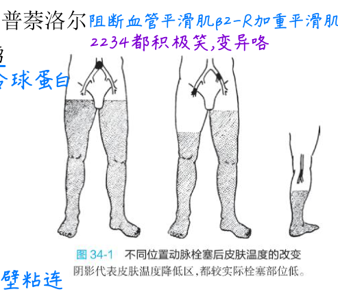
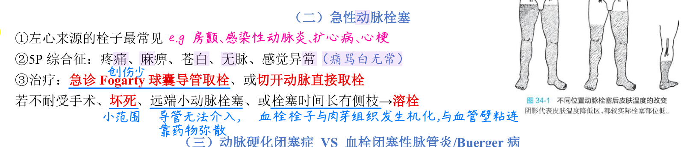
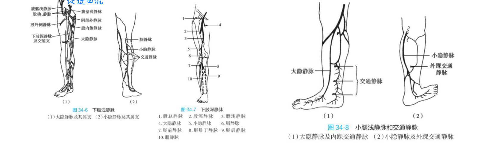
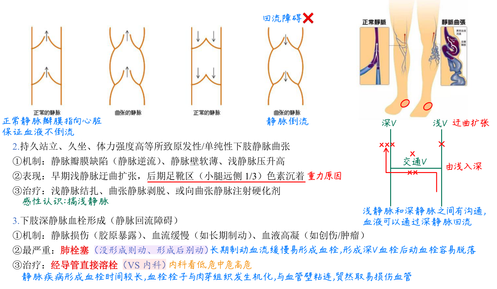
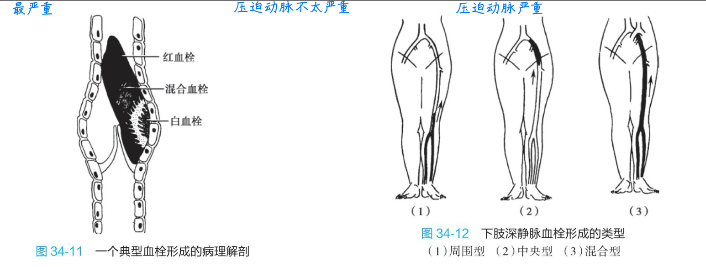
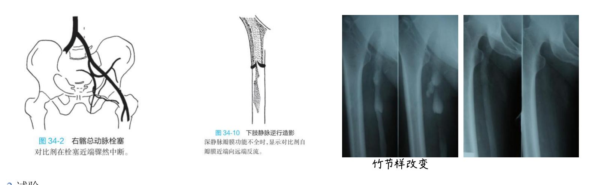
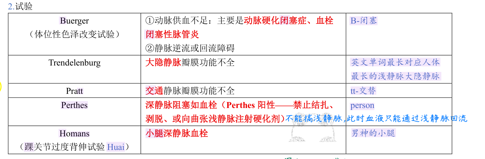

# 周围血管原图与来源限定

这些是《27外科精编版【带导图】》物理123–125的必要原图裁取，接回B9同一“流入下游缺血／回流上游淤血”模型，不建立另一套课程。下述页码均为当前精编PDF物理页，不是旧跟课页码；来源图的原有争议与历史用语保留，解释按B9当前Core的条件使用。

## 急性动脉定位与再通边界

[皮温与栓塞位置原图](p123-temperature-figure.png)（物理123，图34-1）：阴影是皮温降低区，位于栓塞的远端。皮温反映下游组织后果，不能用皮肤冷的边界直接定出栓塞精确位置。血管影像另用于校准位置。

[急性栓塞治疗原文](p123-acute-treatment-source.png)（物理123）同时列Fogarty／切开取栓和“坏死→溶栓”等原句。后者没有完整可救性与适用条件，不作为直接治疗规则；这里只学习抢时、先判断肢体可逆性和定性再通接口，完整可救性分级／溶栓指征仍未闭合。

## 深浅交通和瓣膜方向

[浅静脉、深静脉与交通连接](p124-vein-anatomy.png)（物理124，图34-6/7/8）：大隐、小隐与深通路由交通静脉相接，正常回流由浅入深、向心。图中列出的低频属支留作空间查阅，不另加必背清单。

[瓣膜与回流原图](p124-valves-return-flow.png)（物理124）：正常瓣膜抵抗倒流，曲张支的瓣膜闭合不全形成返流；手画深、浅、交通通路帮助理解为什么处理浅静脉前要先确认深静脉通畅。图下历史“形成后别动”“经导管直接溶栓”不当统一临床规则，仍按B9现Core的抗凝、稳定、活动评估和选择性干预条件使用。

## DVT位置和血栓层次

[DVT分型原图与血栓病理解剖](p125-dvt-diagrams.png)（物理125，图34-11/12）：周围型图示远端、中央型图示近端、混合型近远相连，需与B9的完整痛肿范围表一起读；示意黑影与症状都不替代影像诊断。白／混合／红血栓属于B4病理层次，不能与股白／股青肿作颜色配对。股青肿的冷、无脉是严重回流故障可能反过来伤害动脉灌注。

## 动脉截断与静脉返流证据

[动静脉造影原图](p125-imaging.png)（物理125，图34-2/10）：右髂总动脉栓塞在近端显示对比剂骤然中断；深静脉瓣功能不全则显示对比剂自瓣近端向远端返流。二者回答不同血管问题。旁边两张照片只标“竹节样改变”，没有完整病名、成像条件及阳性标准，不生成疾病识别配对。

## 五试验原表和真实缺口

[五试验原表](p125-test-table.png)（物理125）：保留Buerger动脉供血、Trendelenburg大隐瓣、Pratt交通瓣、Perthes深通畅、Homans小腿DVT的课程接口。Perthes阳性时不能贸然结扎、剥脱或硬化浅静脉。

原Buerger行还并列“静脉逆流或回流障碍”，用途边界有Source语义歧义，当前不新增该用途。表只列用途、Homans踝过度背伸名称及Perthes处理禁忌，没有给齐五试验标准操作与阳性判读；不能以已看图宣布M23完整。Homans不能单独确诊。此处没有把试验变成普通复习必答门槛。

## 来源身份

原文件：27外科精编版【带导图】.pdf，285页。SHA256：523cc9111b69f7eb77b928234d2e86f7e2ba9949e962eac2c5a240219b5cd9a0。Library原身份：libfile_ce6752705770819183b6bb98e57404b2。裁图未重画、未改变医学标注，均从该PDF页面直接渲染。物理123/124/125对应印刷100/101/102；物理126题页及127导图已另作来源读核，未把读过题和答案记成学习者新鲜答题。
