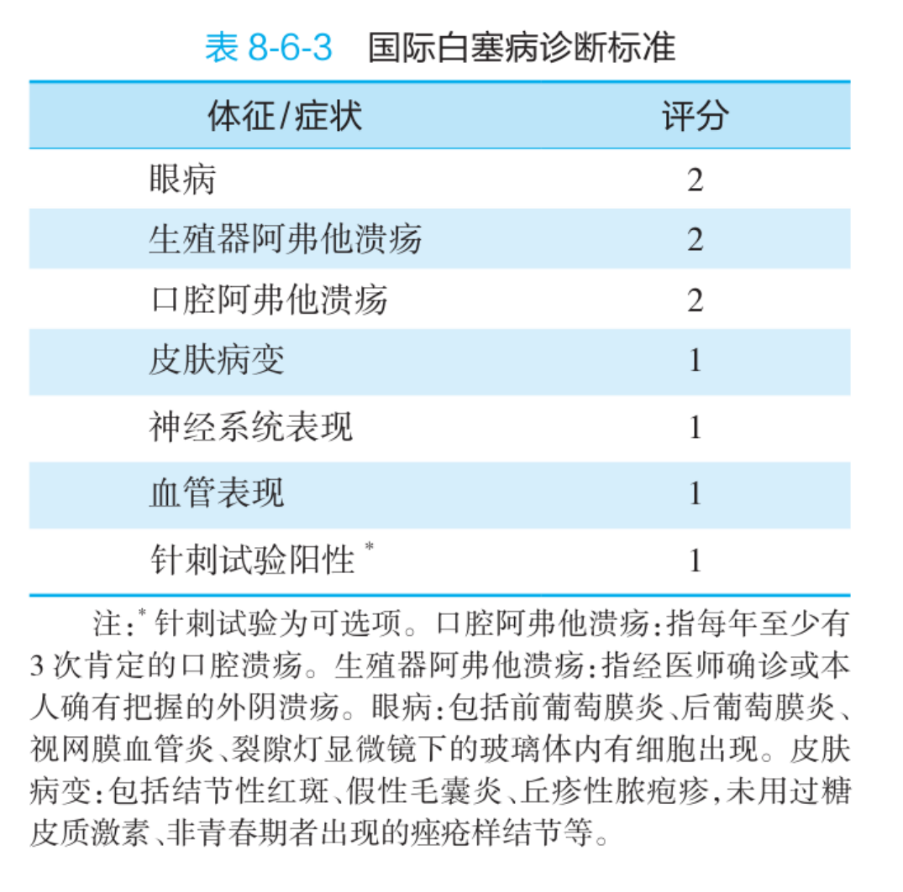

# H19｜系统性血管炎与贝赫切特病
## 先判血管口径和器官组合，再用ANCA、活检与造影定位

> **中心问题**：血管壁炎症为什么可同时造成缺血、出血、动脉瘤与血栓；面对肾—肺—皮肤—神经等多器官组合，怎样先按受累血管口径定位，再用ANCA、病理活检和血管造影校正；贝赫切特又为何能同时累及大小血管、动静脉和口眼生殖器？
>
> **Primary Study**：内科Lecture旧顺序P283–286；现有UnifiedSource_v2定位为印刷P282–285 / 原PDF物理P345–348，视觉补页P349另核。
>
> **Primary Outline**：内科 U105血管炎子集 **8题** + U106贝赫切特 **7题** = **15 / 15**。
>
> **前序调用**：H12最低免疫损伤；H15诊断与药物角色；泌尿ANCA / RPGN器官接口；循环血栓—缺血—出血。

---

# 0｜Block Contract

## Learn

- 血管炎定义、血管口径分类与共同病理后果；
- ANCA的IIF / ELISA两种检测语言及疾病配对；
- AECA、病理活检与血管造影角色；
- 显微镜下多血管炎的肾—肺—皮肤—神经模型；
- 贝赫切特的全口径 / 动静脉血管炎、口生眼皮与治疗。

## Source Boundary / Reading Boundary

- 当前 Source只详细展开ANCA相关血管炎中的MPA和贝赫切特；其它大/中/小血管炎只保留分类与识别入口；
- “继发Ⅲ型急进性肾炎”是RPGN分型（pauci-immune/ANCA），**不是Ⅲ型超敏反应**；登记 `H19-CF01`；
- 贝赫切特国际评分表原像已核七行及脚注，见KP16；原页未给总分诊断阈值，不外补；
- 当前无完整现代诱导/维持方案、各型血管炎诊断标准和影像路径；
- 白塞评分表原像已链接KP16；其余血管分类及ANCA图仍未形成可核验本地视觉入口，登记 `VISUAL_SOURCE_GAP`。

---

# 1｜普通 Chat 初学与同模型复习

普通 Chat 先定位 System 与本 Block 的同一模型，再在自然节点展开正式标题、完整 Prompt 和所需 Core；讲清后压回同一模型复习，答案可见。精确数字、条件、名单与比较按需调用原有 Memory/Precision，不因本次阅读新增准入或学习记录。只有明确要求自测时才隐藏答案。

原来源按下列范围校准；真正影响当前理解的原图、精确条件和认知先修仍在依赖处核对或补讲。Source 接触须以实际阅读为据，不能由 Chat 讲解代替。Outline 只按需查漏；讲义对应练习按原定位在接触相应 Source 后使用，不阻塞每次建模或普通复习。

对应范围与模型接口：

- 实际所需前序模型：H12 / H15 + 泌尿ANCA肾炎
- 内科P283–286连续学习
- 同模型压缩线索：血管口径—器官组合—证据—紧急损害

---

# 2｜总 Framework

<!-- kianos:framework id="hematology-h19-framework-main" -->

```text
血管壁炎症
→ 炎细胞浸润 / 纤维素样坏死 / 肉芽肿
→ 管壁增厚、狭窄、闭塞
→ 血栓 / 缺血 / 梗死
或管壁破坏
→ 出血 / 动脉瘤
        ↓
先按口径
大血管：大动脉炎、巨细胞动脉炎
中血管：PAN、川崎
小血管：ANCA相关 / 免疫复合物相关
口径可变：贝赫切特等
        ↓
再按证据
ANCA：小血管炎方向
病理活检：确诊金标准
造影：大中血管范围
        ↓
器官组合
肾 + 肺 + 皮肤 + 周围神经
→ MPA / ANCA相关方向

反复痛性口腔溃疡
+ 生殖器溃疡 + 眼炎 + 皮肤 / 针刺
→ 贝赫切特
```

### 一句话恢复

> **血管炎先问“多大的血管、动脉还是静脉、落在哪些器官”，再问ANCA、活检和造影；不要从一个抗体直接跳到病名。**

---

# 2A｜同一血管口径—器官—证据模型〔完整 Prompt〕

血管炎共同后果、口径分类与证据角色构成原主轴；MPA和贝赫切特是其不同分支，不互相变成进展阶段。取材和造影按所问问题选择，不要求串行完成所有检查。

```text
血管壁炎症 → 腔狭窄/闭塞与血栓缺血；壁破坏与出血/动脉瘤
  血管炎共同本质：血管壁发炎，后果是狭窄/闭塞或壁破裂〔壁变化3｜腔后果3｜壁破后果2｜器官后果｜系统性定义〕
  ↓
定位口径与动静脉：大、中、小、可变；其它分类轴按原表取回
  按血管口径分类：大、中、小、可变四层〔大2｜中2｜小2组｜可变2例｜谁大小都可〕
  ↓
结合器官组合选择证据，抗体不单独定病
  ├─ANCA：IIF位置与ELISA靶抗原两种语言
  │ ANCA两种检测语言：IIF看荧光位置，ELISA看靶抗原〔方法2｜c/p位置｜靶抗原2｜谁更具体｜不能单独定病〕
  │ → PR3/c-GPA、MPO/p-MPA/EGPA的课程关联
  │ ANCA疾病配对：PR3/c偏GPA，MPO/p偏MPA与EGPA〔c/PR3 1病｜p/MPO 2病｜GPA 2表现｜AAV 3类〕
  ├─AECA支持但非特异
  │ AECA：可见于多种血管炎，但特异性不足〔抗体对象1｜大动脉/川崎/白塞3｜非血管炎也可｜角色1〕
  ├─活检看组织改变，节段性导致阴性不能排除
  │ 病理活检：确诊金标准，但节段性使阴性不能排除〔金标准｜形态5｜特征坏死｜节段性｜阴性意义〕
  └─造影看大中血管范围；不替代小血管器官/病理证据
    血管造影：看大中血管病变范围，小血管通常看不见〔最佳回答1｜适用口径2｜显示3变｜小血管边界｜活检分工〕
原来源详述的两个临床分支
  ├─MPA：小血管炎的肾/肺/皮黏膜/周围神经组合
  │ MPA多器官组合：肾 + 肺出血 + 皮黏膜 + 周围神经〔肾1组｜肺1表现｜皮肤/黏膜｜神经1｜病例组合〕
  │ 肾血尿蛋白尿肾衰 + 少免疫沉积 → Ⅲ型RPGN接口
  │ MPA肾损害：血尿蛋白尿肾衰，几乎无免疫复合物〔肾3表现｜沉积方向｜RPGN第几型｜ANCA｜尿证据〕
  │ 概念校正：RPGN分型与超敏分型不同轴，不能同号代换
  │ “Ⅲ型RPGN”不等于“Ⅲ型超敏反应”〔两个III分别指什么｜免疫沉积方向｜ANCA｜常见误推｜回H12〕
  │ 治疗角色回原课程GC/免疫抑制及利妥昔单抗接口
  │ MPA治疗：GC + 免疫抑制剂，利妥昔单抗为当前一线接口〔组合2类｜代表1｜生物1｜诱导维持边界｜感染警报〕
  └─贝赫切特：口径可变、动静脉皆可
    贝赫切特血管身份：口径可变，动静脉都可受累〔口径4层｜动/静｜壁病变｜血栓/瘤｜与其它血管炎差异〕
    ├─反复痛性口腔/生殖器溃疡，保留课程识别口径
    │ 贝赫切特黏膜双轴：反复痛性口腔 + 外阴溃疡〔口腔5身份｜痛否｜外阴反复｜SLE比较｜主诉优先〕
    ├─眼炎/视力后果与皮肤三类并行
    │ 眼与皮肤：葡萄膜/视网膜 + 结节红斑/痤疮/浅静脉炎〔眼病变及视力后果｜皮3｜视力风险｜结节性不是环形｜血管接口〕
    └─肠、关节与针刺反应接口
      肠、关节与针刺：右下腹、膝痛、48小时阳性反应〔肠部位1｜关节1｜针刺时间｜针刺表现｜非特异边界〕
    临床组合 → 原评分三项2分、四项1分及脚注；总分阈值原页未给
      国际评分：三项2分、四项1分与原条件〔2分3项｜1分4项及脚注｜评分不是单一症状｜总分阈值边界〕
    按内脏眼炎、口腔、复发黏膜皮肤选择课程治疗角色
      贝赫切特治疗分流：内脏/眼、口腔、复发黏膜皮肤三路〔内脏眼2类｜口腔1药/禁忌｜复发首选1｜靶表现3〕
侧向器官比较：SLE/MPA肾小球、干燥肾小管，非疾病转化链
  风湿病肾受累比较：SLE肾小球，干燥肾小管，MPA肾小球〔肾多3类｜肾少2类｜SLE部位｜干燥部位｜MPA〕
```

---

# 3｜正式内容与完整 Prompt
<a id="hematology-h19-kp01"></a>
<!-- kianos:kp id="hematology-h19-kp01" -->
    ## KP01｜血管炎共同本质：血管壁发炎，后果是狭窄/闭塞或壁破裂

    > **主提示：壁变化3｜腔后果3｜壁破后果2｜器官后果｜系统性定义**

    ### 快速核对

血管炎：以血管壁炎症为特征；系统性血管炎累及多个脏器。

共同病理后果（以下是可见改变及其后果，不要求每种血管炎同时具备坏死和肉芽肿）：

```text
炎细胞浸润 / 纤维素样坏死 / 肉芽肿
→ 管壁增厚、管腔狭窄或闭塞
→ 血栓、缺血、梗死

管壁破坏
→ 出血、动脉瘤
```

临床表现取决于血管口径、器官和动 / 静脉身份。

    **Routing**：CORE｜CONNECTION｜MI-G

    ---
<a id="hematology-h19-kp02"></a>
<!-- kianos:kp id="hematology-h19-kp02" -->
    ## KP02｜按血管口径分类：大、中、小、可变四层

    > **主提示：大2｜中2｜小2组｜可变2例｜谁大小都可**

    ### 快速核对

| 口径 | 当前 Study代表 |
|---|---|
| 大血管 | 大动脉炎、巨细胞动脉炎 |
| 中血管 | 结节性多动脉炎、川崎病 |
| 小血管 | ANCA相关；免疫复合物相关等 |
| 口径可变 | 贝赫切特、Cogan综合征 |

（特殊：贝赫切特可累及大、中、小及微血管，且动静脉均可受累。）

### 原MI分类表取回：本课程所载2012 Chapel Hill表

上述按口径的四层不等于全表只有四类。原内科印刷P282 / 物理P345文本还给：

- ANCA相关小血管炎：MPA、GPA、EGPA；免疫复合物性小血管炎栏：抗肾小球基底膜病、冷球蛋白性血管炎、IgA性血管炎、低补体血症性荨麻疹性血管炎。
- 单器官血管炎：皮肤白细胞破碎性血管炎、皮肤动脉炎、原发性中枢神经系统血管炎、孤立性主动脉炎。
- 与系统性疾病相关：红斑狼疮、类风湿关节炎、结节病相关血管炎。
- 与可能病因相关：丙肝病毒相关冷球蛋白血症性血管炎、乙肝病毒相关血管炎、梅毒相关主动脉炎、血清病相关免疫复合物性血管炎、药物相关性免疫复合物性血管炎、药物相关ANCA相关血管炎、肿瘤相关血管炎。

这是原表已列分类与成员的取回，供既有MI按需使用；不等于展开每病诊疗，也不声称重审全部现代Chapel Hill命名。

    **Routing**：CORE｜RECOGNITION｜MI-G

    ---
<a id="hematology-h19-kp03"></a>
<!-- kianos:kp id="hematology-h19-kp03" -->
    ## KP03｜ANCA两种检测语言：IIF看荧光位置，ELISA看靶抗原

    > **主提示：方法2｜c/p位置｜靶抗原2｜谁更具体｜不能单独定病**

    ### 快速核对

- 间接免疫荧光 IIF：
  - c-ANCA：胞质荧光；
  - p-ANCA：核周荧光。
- ELISA：检测具体靶抗原：
  - PR3-ANCA；
  - MPO-ANCA。

ANCA为小血管炎的重要方向证据，但仍需临床器官组合与病理。

原MI中的“其它靶抗原”：本课程印刷P282 / 物理P345除主要的PR3、MPO外还列**弹性蛋白酶、乳铁蛋白**等；这里恢复源已给的两项，不把“等”补成全部抗原清单。

    **Routing**：CORE｜CONFUSABLE｜MI-G

    ---
<a id="hematology-h19-kp04"></a>
<!-- kianos:kp id="hematology-h19-kp04" -->
    ## KP04｜ANCA疾病配对：PR3/c偏GPA，MPO/p偏MPA与EGPA

    > **主提示：c/PR3 1病｜p/MPO 2病｜GPA 2表现｜AAV 3类**

    ### 快速核对

- c-ANCA / PR3-ANCA → 肉芽肿性多血管炎 GPA / Wegener；
- p-ANCA / MPO-ANCA → 显微镜下多血管炎 MPA、嗜酸性肉芽肿性多血管炎 EGPA；
- GPA当前识别入口：鞍鼻、咯血。

三者合称ANCA相关血管炎。

    **Routing**：CORE｜RECOGNITION｜MI-G

    ---
<a id="hematology-h19-kp05"></a>
<!-- kianos:kp id="hematology-h19-kp05" -->
    ## KP05｜AECA：可见于多种血管炎，但特异性不足

    > **主提示：抗体对象1｜大动脉/川崎/白塞3｜非血管炎也可｜角色1**

    ### 快速核对

抗内皮细胞抗体 AECA可见于：

- 大动脉炎；
- 川崎病；
- 贝赫切特病；
- 也可见于非血管炎状态。

所以AECA是支持性方向证据，不是特异诊断身份证。

    **Routing**：RECOGNITION｜CONFUSABLE｜MI-G

    ---
<a id="hematology-h19-kp06"></a>
<!-- kianos:kp id="hematology-h19-kp06" -->
    ## KP06｜病理活检：确诊金标准，但节段性使阴性不能排除

    > **主提示：金标准｜形态5｜特征坏死｜节段性｜阴性意义**

    ### 快速核对

支持血管炎的病理：

- 血管壁炎细胞浸润；
- 纤维素样坏死；
- 肉芽肿；
- 管腔狭窄 / 闭塞；
- 血栓形成。

**病理活检是金标准**。但病变可呈节段性，取材未命中时活检阴性不能完全排除。

    **Routing**：CORE｜VISUAL_ONLY｜CONFUSABLE｜MI-G

    ---
<a id="hematology-h19-kp07"></a>
<!-- kianos:kp id="hematology-h19-kp07" -->
    ## KP07｜血管造影：看大中血管病变范围，小血管通常看不见

    > **主提示：最佳回答1｜适用口径2｜显示3变｜小血管边界｜活检分工**

    ### 快速核对

血管造影最适合了解**大、中血管炎的病变范围**，可见狭窄、闭塞、动脉瘤等。

小血管炎往往无法由造影直接显示，其证据更多依赖器官表现、ANCA与病理活检。

```text
活检：回答“是不是血管炎、是什么组织改变”
造影：回答“大中血管累及到哪里、范围多大”
```

    **Routing**：CORE｜CONFUSABLE｜MI-G

    ---
<a id="hematology-h19-kp08"></a>
<!-- kianos:kp id="hematology-h19-kp08" -->
    ## KP08｜MPA肾损害：血尿蛋白尿肾衰，几乎无免疫复合物

    > **主提示：肾3表现｜沉积方向｜RPGN第几型｜ANCA｜尿证据**

    ### 快速核对

MPA肾受累：

- 血尿；
- 蛋白尿；
- 肾功能不全；
- 几乎无免疫复合物沉积；
- 当前 Study归入Ⅲ型急进性肾炎 / pauci-immune ANCA方向。

完整LM / IF / EM与治疗调用泌尿K9–K10。

    **Routing**：CORE｜CONNECTION｜MI-G

    ---
<a id="hematology-h19-kp09"></a>
<!-- kianos:kp id="hematology-h19-kp09" -->
    ## KP09｜MPA多器官组合：肾 + 肺出血 + 皮黏膜 + 周围神经

    > **主提示：肾1组｜肺1表现｜皮肤/黏膜｜神经1｜病例组合**

    ### 快速核对

```text
肾小球损害
+ 肺受累 / 咯血
+ 皮肤黏膜表现（含口腔溃疡）
+ 周围神经受累
→ MPA / 小血管炎方向
```

（易混：咯血 + RPGN不只见抗GBM病；ANCA相关Ⅲ型RPGN同样可有肺出血。）

    **Routing**：CORE｜CONFUSABLE｜CONNECTION｜MI-G

    ---
<a id="hematology-h19-kp10"></a>
<!-- kianos:kp id="hematology-h19-kp10" -->
    ## KP10｜MPA治疗：GC + 免疫抑制剂，利妥昔单抗为当前一线接口

    > **主提示：组合2类｜代表1｜生物1｜诱导维持边界｜感染警报**

    ### 快速核对

当前 Study治疗：

- 糖皮质激素 + 免疫抑制剂；
- 代表：环磷酰胺；
- CD20单抗利妥昔单抗为当前一线接口。

（边界：这里“一线”为原课程角色记录；不扩现代诱导 / 维持、剂量、预防和肾肺危重流程。原Prompt“感染警报”没有在本块给出完整筛查/预防答案，按H13/H20宿主与感染接口定位，不能拿药物名单冒充风险管理方案。）

    **Routing**：CORE｜BOUNDARY｜MI-G

    ---
<a id="hematology-h19-kp11"></a>
<!-- kianos:kp id="hematology-h19-kp11" -->
    ## KP11｜“Ⅲ型RPGN”不等于“Ⅲ型超敏反应”

    > **主提示：两个III分别指什么｜免疫沉积方向｜ANCA｜常见误推｜回H12**

    ### 快速核对

```text
Ⅲ型RPGN
= 急进性肾炎的病理免疫分型
= pauci-immune / 几乎无免疫复合物
= 常与ANCA相关

Ⅲ型超敏反应
= 免疫复合物介导损伤
```

二者数字相同，但属于不同分类轴；本例少免疫沉积与免疫复合物介导的区别不能因“Ⅲ”同号而抹掉，更不能用一个分型替代另一个。

`H19-CF01`：这是本Block最高频概念陷阱之一。

    **Routing**：CORE｜CONFUSABLE｜MI-G

    ---
<a id="hematology-h19-kp12"></a>
<!-- kianos:kp id="hematology-h19-kp12" -->
    ## KP12｜贝赫切特血管身份：口径可变，动静脉都可受累

    > **主提示：口径4层｜动/静｜壁病变｜血栓/瘤｜与其它血管炎差异**

    ### 快速核对

贝赫切特病：

- 可累及大、中、小及微血管；
- 动脉、静脉均可；
- 血管壁炎细胞浸润、增厚、狭窄；
- 严重时坏死、动脉瘤、继发血栓。

所以不能只按“某一种小血管炎”理解。

    **Routing**：CORE｜RECOGNITION｜MI-G

    ---
<a id="hematology-h19-kp13"></a>
<!-- kianos:kp id="hematology-h19-kp13" -->
    ## KP13｜贝赫切特黏膜双轴：反复痛性口腔 + 外阴溃疡

    > **主提示：口腔5身份｜痛否｜外阴反复｜SLE比较｜主诉优先**

    ### 快速核对

- **课程原描述**：反复口腔溃疡最主要、常首发，称其为“诊断最基本和必需”；通常疼痛。本句保留该课临床识别口径，不据此替代KP16的评分规则或推出所有诊断体系都必须有这一项；
- 反复外阴 / 生殖器溃疡；
- 口腔溃疡必须主动写入主诉和复发史。

（易混：SLE口腔 / 鼻咽溃疡通常不痛；贝赫切特口腔溃疡疼痛且反复。）

    **Routing**：CORE｜CONFUSABLE｜MI-G

    ---
<a id="hematology-h19-kp14"></a>
<!-- kianos:kp id="hematology-h19-kp14" -->
    ## KP14｜眼与皮肤：葡萄膜/视网膜 + 结节红斑/痤疮/浅静脉炎

    > **主提示：眼病变及视力后果｜皮3｜视力风险｜结节性不是环形｜血管接口**

    ### 快速核对

眼：

- 葡萄膜炎 / 虹膜睫状体炎；
- 视网膜血管炎；
- 可导致视力下降甚至失明。

皮肤：

- 结节性红斑；
- 痤疮样皮疹；
- 浅表栓塞性静脉炎。

（易混：贝赫切特皮损是结节性红斑入口，不是风湿热的环形红斑。）

    **Routing**：CORE｜RECOGNITION｜CONFUSABLE｜MI-G

    ---
<a id="hematology-h19-kp15"></a>
<!-- kianos:kp id="hematology-h19-kp15" -->
    ## KP15｜肠、关节与针刺：右下腹、膝痛、48小时阳性反应

    > **主提示：肠部位1｜关节1｜针刺时间｜针刺表现｜非特异边界**

    ### 快速核对

- 肠白塞：右下腹痛多见，可有多发肠溃疡接口；
- 关节：膝关节痛等；
- 针刺反应：针刺后约48小时局部出现红肿 / 脓疱样反应。

针刺反应具有识别价值，但仍需反复口腔、生殖器、眼和皮肤等组合。

    **Routing**：CORE｜RECOGNITION｜MI-G

    ---
<a id="hematology-h19-kp16"></a>
<!-- kianos:kp id="hematology-h19-kp16" -->
    ## KP16｜国际评分：三项2分、四项1分与原条件

    > **主提示：2分3项｜1分4项及脚注｜评分不是单一症状｜总分阈值边界**

    ### 快速核对

原物理P346／印刷P283表8-6-3“国际白塞病诊断标准”原像支持以下完整成员：

| 体征 / 症状 | 评分 |
|---|---|
| 眼病 | 2 |
| 生殖器阿弗他溃疡 | 2 |
| 口腔阿弗他溃疡 | 2 |
| 皮肤病变 | 1 |
| 神经系统表现 | 1 |
| 血管表现 | 1 |
| 针刺试验阳性 | 1 |

原表脚注：
- 针刺试验为可选项。
- 口腔阿弗他溃疡：每年至少有3次肯定的口腔溃疡。
- 生殖器阿弗他溃疡：经医师确诊或本人确有把握的外阴溃疡。
- 眼病：前葡萄膜炎、后葡萄膜炎、视网膜血管炎、裂隙灯显微镜下的玻璃体内有细胞出现。
- 皮肤病变：结节性红斑、假性毛囊炎、丘疹性脓疱疹；痤疮样结节保留原表“未用过糖皮质激素、非青春期者”条件。

`H19-SR01`：七行与脚注的视觉 / OCR门禁在此已解除；原页未写诊断总分阈值，不凭模型记忆补入，也不由单一症状推出诊断。



    **Routing**：RECOGNITION｜SOURCE_READING_BOUNDARY｜MI-G｜MI-D

    ---
<a id="hematology-h19-kp17"></a>
<!-- kianos:kp id="hematology-h19-kp17" -->
    ## KP17｜风湿病肾受累比较：SLE肾小球，干燥肾小管，MPA肾小球

    > **主提示：肾多3类｜肾少2类｜SLE部位｜干燥部位｜MPA**

    ### 快速核对

- 肾常受累：SLE（肾小球）、MPA（肾小球）；干燥可受累肾小管；
- 肾少见：RA、贝赫切特；
- 干燥的低钾 / 碱性尿提示肾小管；
- SLE / MPA的蛋白尿、血尿和管型提示肾小球。

这张比较表用于器官定位，不替代泌尿完整肾病模型。

    **Routing**：CORE｜CONFUSABLE｜CONNECTION｜MI-G

    ---
<a id="hematology-h19-kp18"></a>
<!-- kianos:kp id="hematology-h19-kp18" -->
    ## KP18｜贝赫切特治疗分流：内脏/眼、口腔、复发黏膜皮肤三路

    > **主提示：内脏眼2类｜口腔1药/禁忌｜复发首选1｜靶表现3**

    ### 快速核对

- 内脏受累或眼炎：糖皮质激素 + 免疫抑制剂；
- 口腔溃疡：沙利度胺；孕妇禁用，可致严重胎儿畸形；
- 秋水仙碱：预防结节性红斑、生殖器和口腔溃疡复发的首选。

（边界：不扩现代抗TNF、血管介入或完整器官分层方案。）

    **Routing**：CORE｜RECOGNITION｜BOUNDARY｜MI-G

    ---
# 4｜Framework Reconstruction

```text
① 写血管壁炎症→狭窄/闭塞/血栓/缺血与破裂/动脉瘤两路。
② 写大、中、小、口径可变分类。
③ 写IIF与ELISA两种ANCA语言。
④ 配对PR3/c-GPA与MPO/p-MPA/EGPA。
⑤ 写AECA角色。
⑥ 写活检金标准及节段性阴性陷阱。
⑦ 写造影与活检分工。
⑧ 重建MPA肾—肺—皮肤—神经组合。
⑨ 区分Ⅲ型RPGN与Ⅲ型超敏反应。
⑩ 写贝赫切特口径、动静脉、血管后果。
⑪ 写口生眼皮 + 肠/关节/针刺。
⑫ 写3个2分项目与H19-SR01。
⑬ 写风湿病肾受累比较。
⑭ 写贝赫切特三路治疗。
```

---

# 5｜Memory Routing

## MI-G

1. 血管口径 + 器官组合是第一定位；
2. PR3/c-GPA，MPO/p-MPA/EGPA；
3. 活检金标准但阴性不排除；造影看大中血管范围；
4. MPA肾肺组合与pauci-immune；
5. Ⅲ型RPGN ≠ Ⅲ型超敏；
6. 贝赫切特可累及全口径及动静脉；
7. 反复痛性口腔溃疡为本课程强调的基本入口；“必需”原描述与评分规则分开，见KP13/KP16；
8. 生殖器、眼、结节性红斑 / 针刺；
9. 肾受累比较；
10. 贝赫切特治疗三路。

## MI-D

- Chapel Hill完整分类；
- ANCA其它靶抗原；
- 血管炎全部病理形态；
- MPA完整诱导 / 维持治疗；
- 贝赫切特评分表其余项目；
- 罕见器官受累；
- 现代生物治疗与介入路径；
- 各型血管炎完整诊断标准。

---

# 5A｜既有精记取回与局部未备范围

以下直接展开同文件原Core答案和条件；没有新增精记任务或准入。

- 原分类与ANCA：[按血管口径分类：大、中、小、可变四层](#hematology-h19-kp02)、[ANCA两种检测语言：IIF看荧光位置，ELISA看靶抗原](#hematology-h19-kp03)、[ANCA疾病配对：PR3/c偏GPA，MPO/p偏MPA与EGPA](#hematology-h19-kp04)、[AECA：可见于多种血管炎，但特异性不足](#hematology-h19-kp05)。原表七类及已列成员、其它抗原弹性蛋白酶/乳铁蛋白可读，不补全部靶抗原。
- 病理/造影及MPA：[病理活检：确诊金标准，但节段性使阴性不能排除](#hematology-h19-kp06)、[血管造影：看大中血管病变范围，小血管通常看不见](#hematology-h19-kp07)、[MPA肾损害：血尿蛋白尿肾衰，几乎无免疫复合物](#hematology-h19-kp08)、[MPA多器官组合：肾 + 肺出血 + 皮黏膜 + 周围神经](#hematology-h19-kp09)、[MPA治疗：GC + 免疫抑制剂，利妥昔单抗为当前一线接口](#hematology-h19-kp10)、[“Ⅲ型RPGN”不等于“Ⅲ型超敏反应”](#hematology-h19-kp11)。五类形态、节段性限定、肾肺组合和两个Ⅲ分类轴完整。
- 白塞表现/评分/治疗：[贝赫切特血管身份：口径可变，动静脉都可受累](#hematology-h19-kp12)、[贝赫切特黏膜双轴：反复痛性口腔 + 外阴溃疡](#hematology-h19-kp13)、[眼与皮肤：葡萄膜/视网膜 + 结节红斑/痤疮/浅静脉炎](#hematology-h19-kp14)、[肠、关节与针刺：右下腹、膝痛、48小时阳性反应](#hematology-h19-kp15)、[国际评分：三项2分、四项1分与原条件](#hematology-h19-kp16)、[风湿病肾受累比较：SLE肾小球，干燥肾小管，MPA肾小球](#hematology-h19-kp17)、[贝赫切特治疗分流：内脏/眼、口腔、复发黏膜皮肤三路](#hematology-h19-kp18)。原表现、48h针刺、评分七行及脚注、沙利度胺孕妇禁用及秋水仙碱三目标可读；原页未给评分总分诊断阈值。

原MI全部病理形态、完整诱导维持、罕见器官受累、现代生物/介入及各型完整诊断标准未备；评分七行与脚注已在KP16回原像补齐；总分诊断阈值仍无本页依据，不遮其它完整答案。

---

# 6｜Study 原图门禁与 Source Registry

| ID | 类型 | 内容 | 当前处置 |
|---|---|---|---|
| H19-CF01 | Confusable | “Ⅲ型RPGN”与“Ⅲ型超敏反应”同号不同义 | 正文显式分开；pauci-immune不等于免疫复合物型 |
| H19-SR01 | Source Reading Boundary | 原像已核七行与脚注，原页未给诊断总分阈值 | 保留三项2分、四项1分与原条件，不外补总分阈值 |
| H19-SG01 | Source Gap | 当前无完整各型血管炎标准、现代诱导维持和影像路径 | 保持MPA/白塞当前Source范围 |
| H19-SB01 | Ownership Boundary | RPGN、肺出血、血栓完整模型在泌尿/呼吸/循环 | H19只完成血管炎器官组合 |
| H19-VG01 | Visual Gap | 评分表原像已链接KP16；血管口径分类、ANCA图仍无本地可核验原图 | 其余图回原Lecture / MarginNote |

```text
formal_source_gap_count = 1
formal_source_conflict_count = 0
formal_source_reading_boundary_count = 1
formal_source_boundary_count = 1
formal_confusable_count = 1
visual_source_gap_count = 1
silent_source_correction = 0
```

---

# 7｜Outline Coverage Safety Net

```text
INT-U105-VASCULITIS_total = 8
INT-U106_total = 7
Outline_total = 15
mapped = 15
unmapped = 0
missing = 0
duplicate_primary = 0
```

| Outline范围 | 题数 | Primary KP |
|---|---:|---|
| 口径可变血管炎 | 1 | KP02、KP12 |
| p/MPO与c/PR3配对 | 2 | KP03–KP04 |
| AECA | 1 | KP05 |
| 活检金标准 | 1 | KP06 |
| 造影范围 | 1 | KP07 |
| MPA肾肺与RPGN | 1 | KP08–KP11 |
| MPA治疗 | 1 | KP10 |
| 贝赫切特血管身份 | 1 | KP12 |
| 贝赫切特临床表现 | 1 | KP13–KP15 |
| 评分3个2分项目 | 1 | KP16 |
| 肾受累比较 | 1 | KP17 |
| 内脏 / 眼治疗 | 1 | KP18 |
| 沙利度胺 | 1 | KP18 |
| 秋水仙碱 | 1 | KP18 |
| **合计** | **15** | **15 / 15** |

---

# 8｜Lecture Knowledge Routing Audit

| Lecture范围 | 路由 | 边界 |
|---|---|---|
| 分类和共同病理 | KP01–KP02 | 不扩全部疾病 |
| ANCA / AECA / 活检 / 造影 | KP03–KP07 | 抗体不单独定病 |
| MPA | KP08–KP11 | 肾完整模型Recall前序 |
| 贝赫切特 | KP12–KP18 | 评分原图边界显式 |
| 题旁糖皮质激素串联 | Memory Routing | 不复制跨全科药物总表 |

```text
unrouted_lecture_knowledge = 0
external_medical_expansion = 0
silent_source_correction = 0
```

---

# 9｜First-pass Question Probe

```text
来源：TTSX Lecture-attached Questions
选择方式：LectureQuestionBinding 自动提供
绑定范围：内科P283–286的source-position relation
状态：待绑定
```

---

# 10｜Block Production Gate

```text
Study_continuity = PASS
natural_mechanism_split = 0
repeated_first_exposure = 0
Framework_is_map = PASS
KP_natural_units = 18
prompt_leakage = PASS
Outline_total = 15
Outline_mapped = 15
unmapped = 0
missing = 0
duplicate_primary = 0
unrouted_lecture_knowledge = 0
external_medical_expansion = 0
silent_source_correction = 0
First_pass_question_probe = READY_PENDING_BINDING
Source_gap = SOURCE_READING_BOUNDARY_AND_CONFUSABLE_EXPLICIT
Visual_gate = VISUAL_SOURCE_GAP
System_final_gate = NOT_RUN_NON_FINAL_BATCH
```

---

# 11｜本块内容核对与来源边界

以下保留本块具体内容、来源与图像边界，供定位和按需查漏；不是逐项打卡或自动完成公式。普通复习沿同一模型及完整 Prompt 展开，答案可见；明确要求自测时才闭卷。必要 Source/Visual 条件只约束其真实依赖，原来源接触、理解、记住和完成均须真实证据，不能由文件存在或合成输出推断。

- 内科P283–286原来源连续范围
- 能按血管口径和器官组合定位
- 能使用ANCA/活检/造影三层证据
- 能重建MPA肾肺模型
- 能明确Ⅲ型RPGN与Ⅲ型超敏不同
- 能识别贝赫切特口生眼皮与血管身份
- 能完成肾受累比较与治疗分流

讲义对应练习仍按原定位在接触相应 Source 后使用；它与普通 Chat 初学、复习和真实学习记录分别处理。

**最低出口**：面对疑似血管炎，第一步不是背ANCA；先说受累血管口径、动静脉、器官组合和危险后果，再选择抗体、活检或造影。
